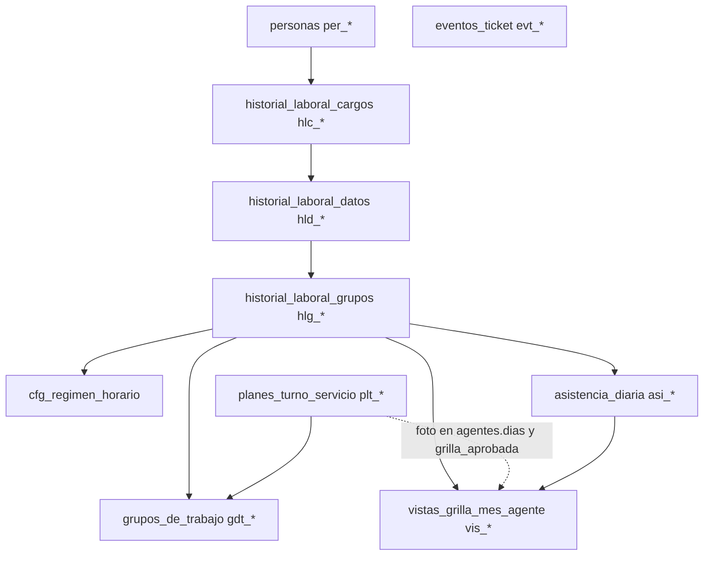
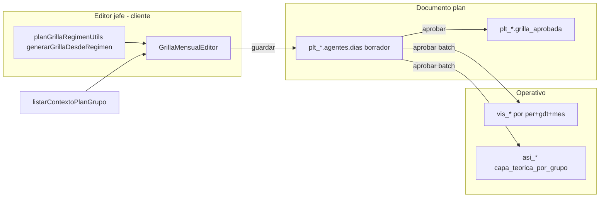
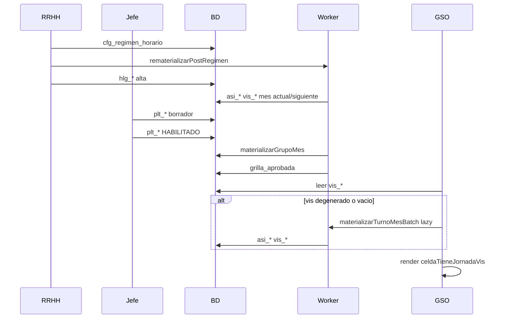

# Análisis integral: HLG → turnos → materialización → grilla operativa

**Estado:** pausado — continuar análisis §20 (licencias largas + horizonte 45d)  
**Fecha:** 2026-05-29 (noche)  
**Plan Cursor (SSoT):** `.cursor/plans/análisis_flujo_hlg-grilla_55e1f7c3.plan.md` (§1–22)  
**Repo:** [`MANUAL_CAPAS_ORQUESTACION_BORRADOR.md`](MANUAL_CAPAS_ORQUESTACION_BORRADOR.md), [`PLAN_SECCIONES_17-22_ORQUESTACION.md`](PLAN_SECCIONES_17-22_ORQUESTACION.md), [`HANDOFF_SESION_2026-05-29_ANALISIS_ORQUESTACION.md`](HANDOFF_SESION_2026-05-29_ANALISIS_ORQUESTACION.md)  
**Ya desplegado:** capa 1 `visSnapshotDegenerado` (functions)

---
# Análisis integral: HLG → turnos → materialización → grilla operativa

## 1. Modelo de datos (ancla del sistema)

Cadena canónica documentada en [`docs/v2/MODULO_DATOS_LABORALES_V2.md`](docs/v2/MODULO_DATOS_LABORALES_V2.md) y [`docs/v2/PLAN_GRILLA_MULTI_HLG_V2.md`](docs/v2/PLAN_GRILLA_MULTI_HLG_V2.md):



| Colección | ID | Quién escribe | Para qué sirve |
|-----------|-----|---------------|----------------|
| `historial_laboral_cargos` | `hlc_*` | `guardarRegistroLaboralTemporal` | Cargo, carga horaria, rol, efector |
| `historial_laboral_datos` | `hld_*` | mismo callable (UI casi siempre embebido) | Puente cargo → detalle (función real, jerarquía) |
| `historial_laboral_grupos` | `hlg_*` | mismo callable | **Burbuja operativa**: persona + grupo + **`regimen_horario_id`** |
| `cfg_regimen_horario` | `CFG_REG_HOR_*` | `guardarRegimenHorario` | Patrón fijo / rotativo / planificado |
| `planes_turno_servicio` | `plt_*` | flujo planes jefe/RRHH | Gobernanza mensual; `grilla_aprobada` al aprobar |
| `asistencia_diaria` | `asi_{per}_{YYYYMMDD}` | worker + overrides + MDC | Capa teórica por día, **mapa** `capa_teorica_por_grupo.{gdt}` |
| `vistas_grilla_mes_agente` | `vis_{YYYY}_{MM}_per_{ulid}_gdt_{ulid}` | worker + `mdcFanOutVis` | Read model UI (turno + `eventos[]` licencias) |
| `eventos_ticket` | `evt_*` | casi todo guardado laboral/plan | Auditoría / bandeja RRHH |

**No hay triggers Firestore** sobre HLG/HLD/HLc ni régimen: todo es **callable onCall** ([`functions/index.js`](functions/index.js)).

---

## 2. Fase A — Alta y edición de datos laborales (HLG)

### 2.1 Secuencia típica (UI)

[`web/src/pages/DatosLaborales.jsx`](web/src/pages/DatosLaborales.jsx) → [`payloadBuilders.js`](web/src/pages/payloadBuilders.js) → [`datosLaboralesService.js`](web/src/services/datosLaboralesService.js) → callable **`guardarRegistroLaboralTemporal`** ([`functions/modules/catalogosLaborales.js`](functions/modules/catalogosLaborales.js)).

Orden habitual al **crear asignación a grupo**:

1. Guardar **HLD** (si no existe) con `cargo_id` del HLC vigente.
2. Guardar **HLG** con `dato_laboral_id`, `grupo_de_trabajo_id`, **`regimen_horario_id` obligatorio**, `fecha_inicio`/`fecha_fin`, `regimen_fecha_ancla` (rotativos).

### 2.2 Qué registra en BD (por entidad)

| Paso | Escritura | Efectos colaterales |
|------|-----------|---------------------|
| HLC | merge en `historial_laboral_cargos` | `eventos_ticket` + `refreshClaimsLaboralPersona` |
| HLD | merge en `historial_laboral_datos` | idem |
| HLG activo con régimen | merge en `historial_laboral_grupos` | idem + **`materializarTurnoMesBatch`** mes **actual y siguiente** (persona + `grupo_de_trabajo_id`) |

Fragmento materialización post-HLG ([`catalogosLaborales.js`](functions/modules/catalogosLaborales.js) ~L600):

- Solo si `regimen_horario_id` y `activo`.
- Errores en batch se loguean; **no bloquean** el guardado del HLG.

### 2.3 Validaciones backend (HLG)

| Código | Regla |
|--------|--------|
| VAL-HLG-016 | `regimen_horario_id` obligatorio |
| VAL-HLG-017 | régimen debe existir y estar activo en `cfg_regimen_horario` |
| VAL-HLG-018 | **en edición no se puede cambiar** `regimen_horario_id` (cerrar HLg y crear nueva) |
| VAL-HLG-014 | sin solape misma persona + mismo grupo |
| VAL-HLG-007/010/005/006 | integridad persona/HLD/cargo/fechas |
| VAL-HLG-W003 | warning si carga semanal del régimen ≠ `hlc.carga_horaria_total` (no bloquea) |

### 2.4 Deshabilitación

- **`rrhhDeshabilitarHlg`**: cierra fechas, `activo: false` → rematerializa **solo mes actual** (recalcula sin esa asignación en ese `gdt`).
- **`rrhhDeshabilitarHlc`**: cascada HLC → HLD → HLG; **no** rematerializa explícitamente en el flujo revisado.

### 2.5 Qué NO hace el alta de HLG

- No crea `plt_*`.
- No toca otros meses salvo actual/siguiente en materialización post-alta.
- No actualiza agentes con régimen distinto si solo se editó HLC/HLD.

---

## 3. Fase B — Régimen horario (catálogo RRHH)

### 3.1 Flujo

[`web/src/pages/rrhh/RegimenesHorariosPage.jsx`](web/src/pages/rrhh/RegimenesHorariosPage.jsx) → **`guardarRegimenHorario`** ([`functions/modules/catalogosRegimenHorario.js`](functions/modules/catalogosRegimenHorario.js)) → **`cfg_regimen_horario`**.

Campos clave: `tipo_patron` (`fijo` | `rotativo` | `planificado`), `dias[]` / `ciclo[]` / `turnos_disponibles[]`, `carga_horaria_semanal_teorica`, `impacta_calendario_institucional`.

### 3.2 Impacto al actualizar régimen

| Acción | Efecto en `asi_*` / `vis_*` |
|--------|------------------------------|
| Guardar/editar `cfg_regimen_horario` | **Ninguno automático** |
| Callable **`rematerializarPostRegimen`** | Busca HLGs activos con ese `regimen_horario_id` → por cada `gdt` único → `materializarGrupoMes` (mes actual + siguiente) |
| Nuevo guardado de HLG (misma persona/grupo, régimen nuevo vía **nuevo** HLg) | Batch persona mes actual/siguiente |

**Deuda producto:** `callRematerializarPostRegimen` existe en [`web/src/services/callables.js`](web/src/services/callables.js) pero **no se invoca** desde la página de regímenes. Tras editar un patrón fijo, agentes ya asignados quedan con `vis_*`/`asi_*` viejos hasta rematerialización manual, lazy load (si snapshot inválido), o nuevo HLg / aprobación de plan.

---

## 4. Fase C — Turnos mensuales (planes)

### 4.1 Máquina de estados

[`functions/modules/asistencia/planesTurnoServicio.js`](functions/modules/asistencia/planesTurnoServicio.js):

```
BORRADOR → ENVIADO → HABILITADO → (CERRADO perpetuo)
         ↘ rechazar → BORRADOR
         revertir → EN_REVISION
```

### 4.2 Qué escribe cada acción (sin materializar salvo excepciones)

| Callable | Colección | Contenido principal |
|----------|-----------|---------------------|
| `guardarPlanTurnoServicio` | `plt_*` | `agentes[].dias` (mensual/planificado); enriquecimiento vía [`planEnriquecimientoDias.js`](functions/modules/asistencia/planEnriquecimientoDias.js) + **`resolverDiaConPreCarga`** (mismo motor que worker) |
| `enviarPlanTurnoServicio` | `plt_*` | `ENVIADO`, historial aprobación |
| `rechazarPlanTurnoServicio` | `plt_*` | vuelve a `BORRADOR`; **no** des-materializa |
| `revertirPlanTurnoServicio` | `plt_*` | `EN_REVISION`; capa operativa **permanece** |
| `aprobarPlanTurnoServicio` | `plt_*` + **batch** | Pre-aprobar: `materializarGrupoMes`; luego `grilla_aprobada`, `HABILITADO` |
| `eliminarPlanTurnoServicio` / `cerrarPlanPerpetuo` | `plt_*` + batch | Re-cálculo grupo sin plan habilitado |

### 4.3 Tres fuentes de verdad para “cómo se ve el mes”



| Pantalla | Fuente | ¿Materializa? |
|----------|--------|---------------|
| Editor / “Ver turnos del equipo” | `listarContextoPlanGrupo` + cálculo **cliente** [`planGrillaRegimenUtils.js`](web/src/pages/jefe/planes/planGrillaRegimenUtils.js) | **No** lee `vis_*` |
| VER plan aprobado | `plt_*.grilla_aprobada` | No |
| Calendario licencias GSO | `vis_*` vía callables grilla | Lazy si hace falta |

**Divergencia conocida (backend vs editor):** en [`resolverTurnoDia.js`](functions/modules/asistencia/resolverTurnoDia.js) `resolverFijo` sin match de `dia_semana` → `no_laborable`; en cliente sin match → **`franco`**. Puede generar meses “todo NL” en `vis_*` si el match falla (p. ej. `dia_semana` string vs number) — caso Portería mayo MOSTO.

---

## 5. Fase D — Motor de materialización

**Núcleo:** [`functions/modules/asistencia/rdaTurnoTeoricoWorker.js`](functions/modules/asistencia/rdaTurnoTeoricoWorker.js)

| Función | Alcance | Salida |
|---------|---------|--------|
| `materializarTurnoMesBatch` | 1 `per` × 1 mes × 1 `gdt` | ~31 writes `asi_*` + 1 merge `vis_*` |
| `materializarGrupoMes` | Todos HLg del `gdt` en el mes | Chunks de 5 × batch |
| `materializarTurnoTeoricoDia` | 1 día | Overrides / batch asistencia |

### 5.1 Lecturas por día (batch)

- HLGs de la persona filtrados por `gdt` (vigencia: **solo** `hlg.fecha_inicio` / `hlg.fecha_fin`, sin fallback HLD).
- `cfg_regimen_horario` por `regimen_horario_id`.
- Plan `HABILITADO` si régimen `planificado` o si viene `planCache` (aprobación).
- Calendario institucional (TTL 5 min).
- `asistencia_diaria` existente (overrides `reemplazo` por `gdt`).
- `grupos_de_trabajo` (etiqueta corta).

### 5.2 Prioridad de resolución (Opción A — plan > HLG por `gdt`)

Documentado en [`docs/v2/HANDOFF_SESION_2026-05-29_MATERIALIZACION_PLAN_VS_HLG.md`](docs/v2/HANDOFF_SESION_2026-05-29_MATERIALIZACION_PLAN_VS_HLG.md):

1. **`resolucionDesdeFotoPlan`** — si plan HABILITADO trae foto en `agentes[].dias[fecha]` → gana directo.
2. Si no hay foto: iterar HLGs vigentes en el `gdt`; elegir resolución “más laboral” entre HLGs del mismo grupo.
3. **`aplicarFotoPlanDia`** — si origen ≠ `plan_mensual`, la foto puede **forzar** NL/franco (Plan > HLG).
4. Overrides activos en `asi_*` pisan turno final.
5. Feriado institucional: lógica en `resolverDiaConPreCarga` (puede anular laborable) + reglas al escribir `vis_*` (`jornadaDesdePlanFoto` conserva turno si hay foto con horario).

### 5.3 Qué queda escrito

**`asi_{per}_{YYYYMMDD}`:**

- `capa_teorica_por_grupo.{gdt}`: segmentos, `tipo_dia`, `origen`, `hlg_id`, `regimen_horario_id`, `plan_id`, feriado, `materializado_en`.
- `overrides_turno[]` (persisten al rechazar plan).

**`vis_{YYYY}_{MM}_per_*_gdt_*`:**

- `dias["01"…"31"]`: `tipo_dia`, `rda_*`, `es_franco`, `es_feriado`, `grupo_de_trabajo_id`, `etiqueta_grupo_corta`.
- `dias[].eventos[]` — **no** del worker teórico; lo alimenta **MDC** ([`mdcFanOutVis.js`](functions/modules/shared/mdcFanOutVis.js)).

### 5.4 Cuándo se dispara materialización

| Disparador | Tipo | Alcance temporal típico |
|------------|------|-------------------------|
| Aprobar plan mensual | Batch pre-transacción | Mes del plan, todo el `gdt` |
| Alta/edición HLG activo | Batch | Mes actual + siguiente |
| Deshabilitar HLG | Batch | Mes actual |
| `rematerializarPostRegimen` / `PostCalendario` | Batch RRHH | Mes actual + siguiente (todos o por régimen) |
| `obtenerVistaGrillaMesAgente` / `listarVistaGrillaMesPorGrupo` | **Lazy** | 1 persona × mes × `gdt` |
| Override turno | Día | `materializarTurnoTeoricoDia` |
| Licencias MDC | Fan-out | Solo `eventos[]` en `vis_*` (+ worker asistencia licencias) |

**Lazy gate:** [`grillaMesAgenteCore.js`](functions/modules/shared/grillaMesAgenteCore.js) — `visRequiereMaterializacion` (vacío, sin señal de turno, o snapshot **degenerado** ≥20 días sin horario/franco o todo `no_laborable`). **Desplegado** en functions.

**No materializa:** guardar/enviar/rechazar/revertir plan; lectura pura de contexto plan.

---

## 6. Fase E — Grilla operativa (GSO)

### 6.1 UI

[`web/src/pages/GrillaOperativa.jsx`](web/src/pages/GrillaOperativa.jsx) — pestaña **Calendario licencias** → [`useGrillaMesVista.js`](web/src/features/grilla/useGrillaMesVista.js).

| Modo | Callable | Backend |
|------|----------|---------|
| Titular | N × `obtenerVistaGrillaMesAgente` | `ensureMaterializacionVisMes` por persona |
| Equipo / sector | `listarVistaGrillaMesPorGrupo` | HLg vigentes al **último día del mes** (máx. 60) + lazy por fila |

Presentación: [`GrillaMesEquipoTabla.jsx`](web/src/features/grilla/GrillaMesEquipoTabla.jsx), [`grillaMesEquipoDisplay.js`](web/src/features/grilla/grillaMesEquipoDisplay.js), estilos [`grillaTurnosVisual.js`](web/src/features/grilla/grillaTurnosVisual.js).

**El cliente no lee Firestore** de `vis_*`; solo interpreta payload del callable.

### 6.2 Pestaña “Vista laboral”

`listarReadModelLaboralOperativoTemporal` — read-model HLc/HLd/HLg; **independiente** de `vis_*` (no es grilla de turnos teóricos).

---

## 7. Matriz de desactualización (índice rápido)

| # | Punto | Síntoma | Causa técnica |
|---|--------|---------|----------------|
| D1 | Editar régimen sin rematerializar | Turno mensual ≠ calendario | `cfg_*` nuevo; `vis_*`/`asi_*` viejos |
| D2 | `resolverFijo` vs editor cliente | Mes entero NL en `vis_*` | Sin match `dia_semana` → NL backend vs F cliente |
| D3 | Snapshot `vis_*` degenerado | Todo NL con `tipo_dia` set | Materialización histórica fallida; capa 1 mitiga lazy |
| D4 | Vigencia HLg inconsistente | En tabla equipo pero celda vacía | Listado usa fechas HLD; worker no |
| D5 | Plan rechazado / revertido | VER plan ≠ operativo | Rechazar no des-materializa |
| D6 | Overrides post-aprobación | Histórico plan ≠ operativo | Overrides solo en `asi_*`/`vis_*` |
| D7 | Feriado + turno nocturno | FER tapa turno o solo NL | Feriado anula laborable; UI no prioriza horario |
| D8 | Multi-HLG multicargo | “¿Cuál es mi turno?” | Un `vis_*` por `gdt`, no por persona |
| D9 | Calendario institucional | Feriado nuevo no aparece | Falta `rematerializarPostCalendario` |
| D10 | `materializado_lazy` invisible | Usuario no sabe si hubo sync | Flag backend sin UI |

**Detalle con escenarios hospitalarios:** sección 13.

---

## 13. Problemas y soluciones concretas (escenarios hospitalarios)

Cada caso sigue el mismo esquema: **situación real** → **qué ve cada rol** → **estado en BD** → **impacto clínico/administrativo** → **solución concreta** → **criterio de cierre**.

Actores del piloto (referencia):

| Agente | `persona_id` | Grupos típicos |
|--------|----------------|-----------------|
| MOSTO | `per_01KQN9WXFXF69Z9DCT5YNJ3TFZ` | Portería, Oficina, Sala |
| CHAPARRO | `per_01KR3HD24AMJ6YX3N7B3GPAZJ4` | Sala Internación |
| LOKITO | `per_01KQQJA5Q1VKBTJ74RHQ0HSHSB` | Sala (planificado) |

Grupos: Sala `gdt_01KQA6QCA8TDQK9YBTHKYA4R2V`, Portería `gdt_01KQA9FVEW53JSNTPGX32NWQ5B`, Oficina `gdt_01KR3H81ENQK84ZK21EQWEQQXG`.

---

### D1 — RRHH corrige un régimen fijo y nadie rematerializa

**Situación hospitalaria**

RRHH detecta que el régimen “Administrativo Portería 08–14” tenía mal cargados los jueves (deberían ser NL, no laborables). Edita `cfg_regimen_horario` en **Regímenes horarios** y guarda. Enfermería jefe ya había armado el plan de junio; los agentes de Portería siguen viendo el patrón viejo en **Calendario licencias**.

**Qué ve cada rol**

| Rol | Pantalla | Resultado |
|-----|----------|-----------|
| Jefe Portería | Turnos mensuales / editor | Patrón **nuevo** (calculado en cliente desde régimen actualizado) |
| Agente / jefe | Calendario licencias GSO | Patrón **viejo** (lee `vis_*` materializado antes del cambio) |
| RRHH | Bandeja licencias | Puede validar LAO contra turno teórico **incorrecto** |

**Estado en BD**

- `cfg_regimen_horario`: días actualizados ✅
- `hlg_*`: sin cambio (mismo `regimen_horario_id`) ✅
- `vis_*` / `asi_*`: timestamps de materialización **anteriores** al cambio de régimen ❌
- `plt_*` junio: si existe borrador, foto puede mezclar régimen nuevo (cliente) con operativo viejo

**Impacto**

- Solicitud de licencia en día que el sistema marca laborable pero RRHH considera NL → rechazo o consumo de bolsa erróneo.
- Jefe planifica dotación con una grilla; GSO muestra otra → desconfianza en el portal.

**Solución concreta**

1. **Producto (P0):** tras guardar régimen en [`RegimenesHorariosPage.jsx`](web/src/pages/rrhh/RegimenesHorariosPage.jsx), modal: *“Este cambio afecta N agentes en M grupos. ¿Rematerializar mes actual y siguiente?”* → `callRematerializarPostRegimen({ regimen_horario_id })`.
2. **Operativa (hoy, sin código):** RRHH ejecuta callable o script `materializar-grupo-mes.mjs --gdt=... --periodo=2026-06` por grupo afectado.
3. **Proceso:** instructivo RRHH: *“Editar régimen ≠ actualizar calendarios automáticamente”* hasta deploy P0.

**Criterio de cierre**

Para un agente Portería con ese régimen: `listarContextoPlanGrupo` (cliente) = `vis_*` = `asi_*` en al menos 5 días laborables, NL y francos del mes en curso.

---

### D2 — Mes entero “NL” en calendario pero turno mensual correcto (Portería mayo MOSTO)

**Situación hospitalaria**

MOSTO tiene HLg en Portería con régimen fijo L–M–X 08:00–14:00, J–V NL, S–D franco. El jefe abre **Ver turnos del equipo** (mayo): ve el patrón correcto. Abre **Calendario licencias** (mayo, filtro Portería): las 31 celdas muestran **NL**.

**Qué ve cada rol**

| Fuente | Mayo 2026 MOSTO + Portería |
|--------|----------------------------|
| Turno mensual | L–M–X verde 08–14, J–V NL, S–D F |
| `vis_*` mes 5 | 31× `tipo_dia: no_laborable`, sin `rda_ingreso` |
| `vis_*` mes 4 | Patrón correcto (materialización posterior OK) |

**Estado en BD**

- Snapshot **degenerado**: tiene `tipo_dia` en todas las celdas → antes el lazy load **no** rematerializaba.
- Causa probable de generación: `resolverFijo` sin match de `dia_semana` (tipo string vs number) → 31× NL al materializar el 30/05.

**Impacto**

- Jefe no puede cruzar licencia con turno teórico en mayo.
- Si MDC usa `vis_*` para preview de días hábiles, subestima jornadas laborables.

**Solución concreta**

| Capa | Acción | Archivo |
|------|--------|---------|
| **1 (desplegada)** | Lazy detecta degenerado y rematerializa al cargar calendario | [`grillaMesAgenteCore.js`](functions/modules/shared/grillaMesAgenteCore.js) |
| **2 (pendiente)** | Sin match día → `franco`; `Number(dia_semana)` | [`resolverTurnoDia.js`](functions/modules/asistencia/resolverTurnoDia.js) |
| **Inmediata** | Script rematerializar Portería mayo MOSTO | `materializar-grupo-mes.mjs` o reabrir calendario post-deploy |

**Criterio de cierre**

Mayo MOSTO Portería = mismo patrón que abril (`laborable` + horarios en L–M–X, `franco` en S–D).

---

### D3 — Snapshot “completo” pero inválido (falso positivo de materialización)

**Situación hospitalaria**

Un mes se materializó en un deploy intermedio o con régimen mal referenciado. Firestore tiene 31 días con datos, así que el sistema asumía “ya está listo”. RRHH confía en que el calendario está sincronizado porque **no está vacío**.

**Síntoma técnico**

- `vis_*.dias` tiene 31 keys.
- 0 celdas con `rda_ingreso`, 0 con `es_franco`, 100% `no_laborable`.
- `metadata.ultima_sync_teorica` existe → parece “sano”.

**Solución concreta (capa 1)**

Función `visSnapshotDegenerado`: si ≥20 días y (sin horario y sin franco) OR (todos NL) → tratar como no materializado.

**Escenario de regresión a evitar**

Enfermera de guardia 24h en régimen rotativo: muchos días NL explícitos en plan **pero** con horarios en foto del plan → no debe marcarse degenerado si hay `rda_ingreso` en al menos un día.

**Criterio de cierre**

Test [`grillaMesAgenteCore.test.js`](functions/test/grillaMesAgenteCore.test.js): degenerado = true para 31× NL; false para patrón fijo válido.

---

### D4 — Agente aparece en grilla del equipo pero sin turno materializado

**Situación hospitalaria**

RRHH da de alta a un auxiliar de limpieza en **Sala Internación** el día 15. Las fechas de vigencia están en **HLD** (`fecha_inicio: 2026-06-15`) pero el **HLG** quedó con `fecha_inicio` vacío o distinto por carga manual incompleta.

**Qué pasa**

| Componente | Comportamiento |
|------------|----------------|
| `listarVistaGrillaMesPorGrupo` | Usa fallback HLD → agente **aparece** en filas de junio |
| `materializarTurnoMesBatch` | Solo mira `hlg.fecha_inicio` → días 1–14 **no** materializa; puede omitir todo el mes |
| Titular (vista propia) | Puede no listar el grupo si el resolver de contexto usa otra regla |

**Impacto**

- Jefe ve nombre en grilla con celdas grises/vacías → no sabe si falta turno o falta dato.
- Dotación de junio incompleta en reportes.

**Solución concreta**

1. **P0:** función única `vigenteEnCorte(hlg, hld, fechaCorte)` en [`grillaMesAgenteCore.js`](functions/modules/shared/grillaMesAgenteCore.js) y [`rdaTurnoTeoricoWorker.js`](functions/modules/asistencia/rdaTurnoTeoricoWorker.js).
2. **Validación alta:** al guardar HLG, si `fecha_inicio` vacía, copiar desde HLD (o error VAL-HLG-010 explícito).
3. **UI Datos laborales:** mostrar warning si HLG.fecha_inicio ≠ HLD.fecha_inicio.

**Criterio de cierre**

Agente alta 15/jun: aparece en grilla **desde día 15** con turno teórico; días 1–14 sin fila o sin materialización (según regla producto acordada).

---

### D5 — Plan revertido por RRHH; operativo sigue con versión anterior

**Situación hospitalaria**

Jefe de Sala envía plan de junio con francos extra en feriado. RRHH **revierte** el plan (`EN_REVISION`) para corregir. El jefe abre **VER plan**: ve borrador nuevo. Los agentes en **Calendario licencias** siguen viendo la versión **aprobada anteriormente** (o la materializada en la última aprobación).

**Estado en BD**

- `plt_*`: `EN_REVISION`; `grilla_aprobada` puede seguir existiendo del ciclo anterior según implementación de revertir.
- `vis_*` / `asi_*`: **no se tocan** en revertir/rechazar.

**Impacto**

- Comunicación interna: “el plan fue revertido” pero enfermería ve turnos viejos en GSO.
- Riesgo bajo si revertir es previo a nueva aprobación; riesgo alto si se confunde con “plan vigente”.

**Solución concreta**

| Opción | Descripción | Esfuerzo |
|--------|-------------|----------|
| **A — Banner (P3)** | En GSO, si existe plan `EN_REVISION` para ese `gdt`/mes: banner amarillo *“Plan en revisión; calendario operativo puede no coincidir con borrador del jefe”* | Bajo |
| **B — Rematerializar al revertir** | `revertirPlanTurnoServicio` llama `materializarGrupoMes` sin foto de plan | Medio; puede borrar intención operativa |
| **C — Política explícita** | Documentar: operativo = última materialización exitosa; plan aprobado = histórico legal | Bajo |

**Recomendación:** A + C (no rematerializar automático en revertir salvo pedido RRHH).

---

### D6 — Cambio de turno por guardia (override) no figura en plan aprobado

**Situación hospitalaria**

Plan de junio aprobado: LOKITO noche 22:00–06:00 el 10/06. El 08/06 hay baja imprevista; jefe registra **override** vía `registrarCambioTurno` → LOKITO cubre guardia diurna 07:00–14:00 el 10/06.

**Qué ve cada rol**

| Pantalla | 10/06 LOKITO |
|----------|--------------|
| VER plan aprobado | 22:00–06:00 (snapshot `grilla_aprobada`) |
| Calendario licencias | 07:00–14:00 (override en `asi_*` → `vis_*`) |
| Fichada futura (cuando exista) | Debe usar operativo |

**Impacto**

- **Correcto por diseño** para operación diaria.
- Problema si auditoría legal exige que “plan aprobado” refleje realidad → hoy no lo hace.

**Solución concreta**

1. **Producto:** definir que `grilla_aprobada` = intención del jefe al aprobar; operativo = fuente para licencias y asistencia.
2. **UI:** en modal celda GSO, badge *“Cambio operativo”* si hay override activo en `asi_*`.
3. **No hacer (salvo requisito legal):** regenerar `grilla_aprobada` en cada override.

---

### D7 — Feriado 25 de Mayo con guardia nocturna (LOKITO)

**Situación hospitalaria**

25/05 es feriado. El plan de Sala asigna a LOKITO guardia nocturna 22:00–06:00 (servicio esencial). En **Calendario licencias**: columna ámbar (feriado) pero celda mostraba **FER** tapando el horario, o solo **NL** con modal contradictorio (`tipo_dia: no_laborable` + horario 22–06).

**Causa en cadena**

1. `resolverDiaConPreCarga`: feriado institucional anula `laborable` → `no_laborable` sin turno.
2. Worker al escribir `vis_*`: regla `jornadaDesdePlanFoto` **restaura** turno si hay foto del plan con horario.
3. UI antigua: priorizaba texto FER / `tipo_dia` sobre `rda_ingreso`.

**Solución concreta**

| Capa | Acción |
|------|--------|
| Backend (parcial) | Mantener `jornadaDesdePlanFoto` en worker |
| **Capa 3 UI** | `celdaTieneJornadaVis`: si hay `rda_ingreso`/`rda_egreso`, mostrar chip horario aunque `tipo_dia` sea NL; feriado solo en **fondo de columna**, sin texto FER en celda |
| Deploy | Hosting web (functions ya desplegadas) |

**Criterio de cierre**

25/05 LOKITO: columna feriado ámbar + chip **22:00–06:00** visible; modal coherente.

---

### D8 — Agente multicargo: MOSTO en Portería y Oficina

**Situación hospitalaria**

MOSTO tiene dos HLg vigentes: Portería (régimen fijo 08–14 L–M–X) y Oficina (similar). RRHH abre **Calendario licencias** sin filtrar grupo y espera “un solo calendario del agente”.

**Realidad del modelo**

- Un documento `vis_*` **por par** (persona + mes + **`gdt`**).
- Titular en GSO: N calendarios (uno por grupo laboral).
- No hay fusión global de turnos en un solo renglón.

**Impacto**

- Agente puede solicitar licencia en contexto de un grupo; preview LAO debe usar el `gdt` correcto.
- Confusión: “¿Por qué tengo dos grillas?” → respuesta de producto: multicargo = múltiples burbujas operativas.

**Solución concreta**

1. **UX:** etiqueta clara por calendario: *“Portería”* / *“Oficina”* (`etiqueta_grupo_corta` ya en `vis_*`).
2. **Wizard solicitud:** obligar selección de contexto laboral (`resolverContextoLaboralSolicitud`) antes de preview.
3. **No recomendado:** volver a fusión global multi-HLG (eliminada 29/05; rompe Opción A).

**Ejemplo junio**

- `vis_2026_06_per_..._gdt_porteria`: L–M–X 08–14.
- `vis_2026_06_per_..._gdt_oficina`: patrón Oficina.
- Independientes; licencia en Portería no borra turno Oficina.

---

### D9 — Nuevo feriado provincial cargado en calendario institucional

**Situación hospitalaria**

Gobierno declara asueto el 17/06. RRHH carga evento en **Calendario institucional**. Agentes de régimen fijo que tenían laborable ese día siguen viendo 08–14 en GSO hasta rematerializar.

**Solución concreta**

1. Tras guardar evento institucional: botón **“Actualizar grillas afectadas”** → `rematerializarPostCalendario` (callable existente).
2. Lazy: al abrir junio post-cambio, si snapshot previo no tiene `es_feriado` en 17/06 pero calendario sí → considerar “desactualizado por calendario” (mejora futura P2: versión `calendario_version` en metadata `vis_*`).

**Criterio de cierre**

17/06: columna feriado + tipo_dia coherente con régimen (NL si no hay guardia en plan).

---

### D10 — Usuario no sabe si el calendario se actualizó al abrir

**Situación hospitalaria**

Jefe de servicio abre Calendario licencias después del deploy de capa 1. El backend rematerializa 40 agentes (lazy). No hay feedback; jefe cree que sigue roto y recarga 5 veces.

**Solución concreta**

- Consumir `materializado_lazy: true` del callable en [`useGrillaMesVista.js`](web/src/features/grilla/useGrillaMesVista.js).
- Toast: *“Calendario actualizado con turnos teóricos recientes”* (una vez por carga).
- Opcional: indicador en header del mes si `metadata.ultima_sync_teorica` < 24h.

---

### D11 — CHAPARRO: plan dice NL pero operativo dice laborable (junio Sala)

**Situación hospitalaria (incidente documentado en handoff 29/05)**

CHAPARRO, régimen **fijo**, plan junio Sala: jefe marcó lun–mié como **NL** en la foto del plan (excepción administrativa). Tras aprobar, **VER plan** muestra NL. **Calendario licencias** muestra **laborable 08–14** esos días.

**Causa**

Antes de Opción A, worker **fusionaba** HLGs y el régimen fijo “ganaba” sobre foto del plan en algunos días. Post-fix: `resolucionDesdeFotoPlan` + `aplicarFotoPlanDia` (Plan > HLG).

**Solución concreta**

1. Verificar deploy motor Opción A en producción.
2. Re-aprobar plan o `materializarGrupoMes` junio Sala.
3. Audit script: 13 días discrepantes → 0.

**Criterio de cierre**

Para cada día del mes: `plt.agentes[CHAPARRO].dias[fecha].tipo_dia` = `vis_*`.dias[dd].tipo_dia` = `asi_*`.capa_teorica_por_grupo[Sala].tipo_dia`.

---

### D12 — Alta HLG solo materializa mes actual y siguiente

**Situación hospitalaria**

RRHH asigna enfermera a Sala el 20/05 con régimen rotativo. Materialización post-alta corre para **mayo y junio** solamente. Jefe abre **Calendario licencias marzo** (histórico): vacío o degenerado → lazy rematerializa si capa 1 activa; si no, queda inconsistente.

**Solución concreta**

| Corto plazo | Lazy + capa 1 al abrir cualquier mes |
| Mediano | Al alta HLG, materializar también mes de `fecha_inicio` si ≠ actual |
| Largo | Job batch nocturno mes+1 para todos los HLg activos |

---

### D13 — Plan planificado sin HABILITADO (LOKITO fuera de ventana de aprobación)

**Situación hospitalaria**

LOKITO tiene régimen **planificado**. Jefe armó borrador de julio pero RRHH aún no aprobó. Calendario julio: worker no encuentra plan HABILITADO → días NL o vacíos según fallback.

**Comportamiento esperado**

- Sin plan HABILITADO: no hay foto; régimen planificado sin plan → **no laborable** (o franco según capa 2).
- Tras aprobar: `materializarGrupoMes` llena `vis_*`.

**Solución producto**

- En GSO julio pre-aprobación: banner *“Plan julio pendiente de aprobación RRHH”*.
- Turno mensual borrador ≠ operativo hasta aprobación (comunicar en capacitación).

---

## 14. Tabla resumen: problema → solución → responsable

| ID | Problema (1 línea) | Solución concreta | Quién dispara | Prioridad |
|----|-------------------|-------------------|---------------|-----------|
| D1 | Régimen editado, calendario viejo | Wire `rematerializarPostRegimen` en UI RRHH | RRHH al guardar régimen | P0 |
| D2 | Mes todo NL (Portería mayo) | Capa 2 + lazy capa 1 + script mayo | Deploy + usuario abre calendario | P0 |
| D3 | Snapshot falso completo | `visSnapshotDegenerado` | Automático lazy | Hecho |
| D4 | Fechas HLG vs HLD | `vigenteEnCorte` unificado | Dev backend | P0 |
| D5 | Plan revertido ≠ GSO | Banner EN_REVISION | Dev frontend | P3 |
| D6 | Override ≠ plan aprobado | Badge “cambio operativo”; política documentada | Producto + UI | P2 |
| D7 | Feriado tapa turno | Capa 3 UI + worker foto plan | Deploy hosting | P1 |
| D8 | Multicargo confuso | Etiquetas por `gdt`; contexto en solicitud | UX | P1 |
| D9 | Feriado nuevo | `rematerializarPostCalendario` post-guardar | RRHH | P0 |
| D10 | Sin feedback lazy | Toast `materializado_lazy` | Dev frontend | P1 |
| D11 | Plan NL ≠ operativo laborable | Motor Opción A + re-materializar | Dev + jefe re-aprobar | P0 |
| D12 | Histórico sin materializar | Lazy al abrir mes; opcional batch fecha_inicio | Automático / RRHH | P2 |
| D13 | Planificado sin aprobar | Banner pendiente aprobación | Dev frontend | P2 |

---

## 8. Validaciones transversales (resumen)

| Dominio | Dónde | Qué valida |
|---------|-------|------------|
| HLG | `catalogosLaborales.js`, `hlgValidacionesCore.js` | Solape, régimen, fechas, no cambiar régimen en edición |
| Régimen | `catalogosRegimenHorario.js` | Patrón, turnos, carga |
| Plan | `planesTurnoServicio.js` | Estados, tokens, permisos jefe/RRHH, agentes en grupo |
| Grilla callable | `grillaMesAgenteCore.js` | Params `per_*`, `gdt_*`, mes 1–12 |
| Materialización | worker | HLg con régimen; plan planificado sin HABILITADO → NL |
| GSO listado equipo | `listarVistaGrillaMesPorGrupo` | Sesión + `persona_id`; **no** valida jefe del `gdt` (deuda §PLAN_GRILLA_MULTI_HLG) |

---

## 9. Código obsoleto, duplicado o residual

| Item | Ubicación | Estado propuesto |
|------|-----------|------------------|
| `GrillaMesGrupoPanel.jsx` | deprecated, sin imports | **Eliminar** o mantener solo si docs lo referencian |
| `titularDias` export | `useGrillaMesVista.js` | **Eliminar** export muerto |
| Alias `obtenerVistaGrillaEquipo` | docs OLEADA_C2 | **Implementar** o borrar de docs |
| Schema `visDocumentId` sin `_gdt_` | `web/src/schemas/articulo.tripleLayer.schema.js` | **Actualizar** a `buildVisDocumentId` 3 args |
| `obtenerPlanHabilitado` duplicado | `grillaMesAgenteCore` vs `rdaTurnoTeoricoWorker` | **Unificar** módulo shared |
| 5+ `normalizarTipoDia*` | web + functions | **Un solo módulo shared** (sync script ya existe para parte) |
| `callRematerializarPostRegimen` sin UI | `callables.js` | **Wire** post-guardar régimen o job RRHH |
| Campo legacy `capa_teorica` raíz en `asi_*` | limpiado 29/05 según handoff | Verificar con `audit-vis-junio-2026.mjs`; no reintroducir lecturas |
| Fusión global multi-HLG | eliminada en worker | Docs viejos que hablen de “un turno por persona” → **archivar** |
| `resolverDiaConPreCarga` feriado anula laborable | worker L501–512 vs escritura `vis_*` L689+ | **Unificar** regla feriado en un solo lugar |

---

## 10. Propuestas (roadmap — enlazado a sección 13)

Cada ítem referencia el ID de problema (D1–D13) de la sección 13.

### P0 — Coherencia operativa (datos correctos)

1. **D2 — Capa 2:** alinear `resolverFijo`/`resolverRotativo` con cliente (`franco` sin match + `Number(dia_semana)`).
2. **D1/D9 — Post-guardar catálogo:** invocar `rematerializarPostRegimen` / `rematerializarPostCalendario` desde UI RRHH (confirmación + progreso).
3. **D4 — Vigencia HLg:** función `vigenteEnCorte(hlg, hld?, ymd)` en listado equipo, titular, worker.
4. **D11 — QA automatizado:** extender audit script — `plt foto` = `vis_*` = `asi_*` (CHAPARRO junio, MOSTO multicargo).

### P1 — Contrato y observabilidad

5. **D10 —** consumir `materializado_lazy` en UI (toast).
6. **D7 —** deploy hosting capa 3 (feriado + horario en celda).
7. **D8 —** etiquetas claras por `gdt` en titular multicargo.
8. Schema Zod `vis_*` con `_gdt_` en ID.

### P2 — Deuda estructural

9. Una sola fuente de resolución de día (eliminar divergencia D2 a largo plazo).
10. Permisos jefe en `listarVistaGrillaMesPorGrupo`.
11. **D12 —** materializar mes de `fecha_inicio` al alta HLG.
12. **D6 —** badge override en modal GSO.

### P3 — Producto / arquitectura

13. **D5 —** banner plan `EN_REVISION` en GSO.
14. **D13 —** banner plan pendiente aprobación (régimen planificado).
15. Política escrita: `grilla_aprobada` vs operativo vs overrides (D6).

---

## 11. Diagrama de sincronización recomendado (estado objetivo)



---

## 12. Verificación manual post-deploy (Portería mayo)

1. Calendario licencias · `gdt_01KQA9FVEW53JSNTPGX32NWQ5B` · 2026-05 · MOSTO.
2. Comparar con turno mensual y con `vis_*` abril (mismo patrón L–M–X laborable, J–V NL, S–D franco).
3. Si persiste NL: ejecutar rematerialización explícita (`rematerializarPostRegimen` o script grupo-mes) y evaluar capa 2.

**Referencias:** [`docs/v2/PLAN_CAPA_TEORICA_ASISTENCIA_V2.md`](docs/v2/PLAN_CAPA_TEORICA_ASISTENCIA_V2.md), [`RFC_GRILLA_APROBADA_PLAN_TURNO_V2.md`](docs/v2/RFC_GRILLA_APROBADA_PLAN_TURNO_V2.md), tests [`functions/test/grillaMesAgenteCore.test.js`](functions/test/grillaMesAgenteCore.test.js).

