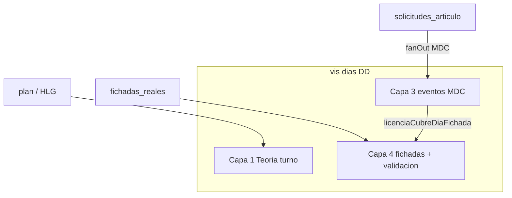

# Análisis — Impacto Decreto 1919/89 en grilla operativa actual

**Propósito:** describir **cómo el portal justifica ausencias hoy** en `vistas_grilla_mes_agente` (GSO / calendario licencias) y qué implica cada familia normativa del plan 1919 según **días**, **turno teórico** y **horas/franjas**.

**Estado:** borrador analítico · **P0 doc** (jun-2026) — alineado con `[PLAN_LINEAMIENTOS_DECRETO_1919_MOTOR_SOLICITUDES_V2.md](./PLAN_LINEAMIENTOS_DECRETO_1919_MOTOR_SOLICITUDES_V2.md)` § grilla pasiva y oleada 63.c–k.  
**Plan épica:** `[PLAN_LINEAMIENTOS_DECRETO_1919_MOTOR_SOLICITUDES_V2.md](./PLAN_LINEAMIENTOS_DECRETO_1919_MOTOR_SOLICITUDES_V2.md)`  
**Fichas por artículo:** `[LINEAMIENTOS_DECRETO_1919_89_POR_ARTICULO_V2.md](./LINEAMIENTOS_DECRETO_1919_89_POR_ARTICULO_V2.md)` (columna «Grilla operativa»)

---

## 1. Modelo de capas en la celda día

La grilla operativa **no** es un solo campo: cada `vis_*.dias[DD]` combina capas que la UI superpone (criterios GSO: `[CRITERIOS_ACEPTACION_GSO_CONFLICTOS_CAPAS_V2.md](./CRITERIOS_ACEPTACION_GSO_CONFLICTOS_CAPAS_V2.md)`).

| Capa                | Origen (materialización)                                                            | Qué ve el usuario                                      | Rol frente a «ausencia»                                            |
| ------------------- | ----------------------------------------------------------------------------------- | ------------------------------------------------------ | ------------------------------------------------------------------ |
| **1 — Teoría**      | Plan / HLG / override → `rda_`*, `capa_teorica`, `presentacion_compuesto`           | Turno (M/T/N), F, NL, horario                          | Define **qué se esperaba** (jornada, `fichadas_esperadas`)         |
| **3 — Eventos MDC** | Solicitud aprobada/pendiente → `dias[DD].eventos[]`                                 | `codigo_grilla` (64-A, LAO, 68-B…), color azul/naranja | **Justifica** no cumplir teoría de asistencia a nivel **celda**    |
| **4 — Realidad**    | Reloj / ABM → `fichadas_reales`, `analitica_cumplimiento`, `validacion_fichada_dia` | RRHH: fichadas por tramo; Jefe: semáforo V/A/R         | Comprueba **marcas** vs teoría si no hay licencia que cubra el día |

**Regla transversal (escenario T):** si hay `eventos[].codigo_grilla`, la celda **siempre** muestra la licencia; no se oculta por falta de turno en capa 1.

---

## 2. Parámetros del artículo que gobiernan la grilla

Configuración en **versión publicada** (`cfg_articulos/{id}/versiones/{ver}`):

| Parámetro                                          | Bloque    | Efecto en grilla / asistencia                                                                                  |
| -------------------------------------------------- | --------- | -------------------------------------------------------------------------------------------------------------- |
| `visualizacion.codigo_grilla`                      | Identidad | Texto pintado en celda (`etiquetaCelda` → primer evento)                                                       |
| `nivel_ocupacion_dia_id`                           | 7         | `cfg_nod_exclusivo` · `cfg_nod_parcial` · `cfg_nod_informativo` — convivencia **intradía** y `tiene_conflicto` |
| `depende_rda`                                      | 4         | Gate **alta** solicitud: plan rotativo autorizado (`validarGrillaHorariaParaSolicitud`)                        |
| `regla_computo_dias_id` / `regla_computo_horas_id` | 4         | Motor **saldo** (días vs horas); **no** parte la celda visual por sí solo                                      |
| `cfg_unidad_medida_articulo`                       | 4         | DÍAS vs HORAS en consumo (68-B = horas)                                                                        |
| `articulos_incompatibles_ids`                      | 7         | Normativa entre artículos; no sustituye `nivel_ocupacion`                                                      |

Catálogo ocupación (`[SEED_CATALOGOS_ARTICULOS_V2.json](./SEED_CATALOGOS_ARTICULOS_V2.json)`):

| `cfg_nod_`*     | Significado producto           | Comportamiento actual                                                |
| --------------- | ------------------------------ | -------------------------------------------------------------------- |
| **exclusivo**   | Día completo en grilla         | Varios eventos + al menos uno exclusivo → `tiene_conflicto`          |
| **parcial**     | Franja horaria (norma 65, 66…) | **Persistido** en evento; **UI aún no** pinta sub-franja en la celda |
| **informativo** | No reserva dura                | Varios informativos → sin conflicto                                  |

Implementación conflicto: `[mdcVisConflictoDia.js](../../functions/modules/shared/mdcVisConflictoDia.js)`.

---

## 3. Pipeline: de la solicitud a la celda

1. **Alta / cambio estado** solicitud → worker MDC (`[mdcWorkerCore.js](../../functions/modules/shared/mdcWorkerCore.js)`) con payload enriquecido desde versión (`codigo_grilla`, `nivel_ocupacion_dia_id`).
2. **Fan-out** por `gdt_`* involucrado → `[mdcFanOutVis.js](../../functions/modules/shared/mdcFanOutVis.js)`: un ítem en `eventos[]` por solicitud y día.
3. **Rematerialización** asistencia (turno teórico, fichadas) sigue en el mismo documento `vis_`*; la licencia **no borra** `rda_`* — desalineación teórica post-licencia → badge ⚠ (US-3).
4. **Validación fichada** (Fase F): si `[licenciaCubreDiaFichada](../../shared/utils/licenciaCubreDiaFichada.js)` → **no** se persiste `validacion_fichada_dia`; el jefe ve capa licencia, no ROJO por ausencia de marcas.

**Implicación:** hoy «justificar ausencia» en fichadas = licencia **aprobada** con `codigo_grilla` + reglas §5 RFC F (día laborable con expectativa de fichada, o franco con licencia). **No** distingue aún exclusivo vs parcial en esa función.

---

## 4. Tres ejes de impacto normativo (decreto → grilla)

| Eje                           | Pregunta                           | Soporte actual                                             | Brecha 1919                                                               |
| ----------------------------- | ---------------------------------- | ---------------------------------------------------------- | ------------------------------------------------------------------------- |
| **A — Unidad de consumo**     | ¿Descuenta días o horas del saldo? | Patrón A/B días; Patrón C horas (68-B)                     | Franquicias 65–70 bis necesitan C/B en **minutos/horas** masivo           |
| **B — Granularidad visual**   | ¿Ocupa celda entera o franja?      | Siempre **una celda por día**; un código (ej. `68-B`)      | Arts. 65, 66, 69 ter, 70 bis requieren **parcial** visible o segunda pila |
| **C — Justificación fichada** | ¿Exime control reloj?              | Licencia aprobada cubre **día** si hay expectativa fichada | **Parcial** debería eximir solo tramos; hoy puede cubrir día entero       |
| **D — Coherencia turno**      | ¿Debe haber turno planificado?     | `depende_rda` en B/C al **crear** solicitud                | LAO suele `depende_rda: false`; 64 piloto según versión                   |
| **E — Multievento**           | ¿Varias licencias mismo día?       | `eventos[]` + `tiene_conflicto`                            | Art. 63 cortos + 64 mismo mes: RRHH debe parametrizar `nivel_ocupacion`   |

---

## 5. Matriz familia Decreto 1919 → grilla (estado jun-2026)

Leyenda **visual:** `CELDA` = código en celda día · **FICH** = impacto validación fichada · **TURNO** = relación con capa teórica.

| Familia (arts.)                 | Unidad negocio             | `nivel_ocupacion` esperado             | Visual grilla hoy            | Justifica fichada (hoy)            | Notas plan                                                      |
| ------------------------------- | -------------------------- | -------------------------------------- | ---------------------------- | ---------------------------------- | --------------------------------------------------------------- |
| **1–13** Procedimental          | —                          | —                                      | No aplica solicitud estándar | —                                  | Alertas RRHH, no MDC                                            |
| **14–33** Médicas               | Días (tramos %)            | Exclusivo (por tramo = varios `art_`*) | ⬛ CELDA si workflow MDC      | **FICH** día entero si aprobada    | % haberes no en motor; RFC #1                                   |
| **34–39** Maternidad/guarda     | Días por evento            | Exclusivo                              | CELDA                        | FICH día                           | Varios `art_`* por subtipo                                      |
| **40–47** LAO                   | Días (bolsas A)            | Exclusivo (piloto)                     | CELDA `LAO`                  | FICH día                           | Teoría visible bajo chip; Art. 44 devolución bolsa ≠ grilla aún |
| **48–62** Extraordinarias       | Días (B)                   | Exclusivo                              | CELDA (futuro)               | FICH día                           | 52, 54 backlog; 54 puede necesitar contador «período examen»    |
| **63** Justificaciones          | Días (B), a veces 1 evento | Exclusivo                              | CELDA (futuro)               | FICH día                           | Mismo motor 64; distintos topes por inciso                      |
| **64 a/b** Asuntos particulares | 1 día/evento, 6/año        | Exclusivo ✅                            | CELDA `64-A`/`64-B`          | FICH día                           | `tope_frecuencia_mensual=1`                                     |
| **65** Lactancia                | **Horas/franjas**          | **Parcial**                            | CELDA no muestra franja      | **FICH** puede cubrir día entero ⚠ | RFC plan #4; RDA                                                |
| **66–67** Tardanzas             | Minutos/mes                | Parcial                                | Idem                         | Idem                               | Patrón B mensual en minutos — no implementado                   |
| **68 a** Compensación jornadas  | Días/ventana               | Exclusivo o parcial                    | Pendiente                    | Parcial según política             | Origen saldo externo RDA                                        |
| **68 b** Compensatorio          | Horas (C)                  | Exclusivo (piloto)                     | CELDA `68-B`                 | FICH día                           | `depende_rda` + gate plan; consumo horas no pinta «6h» en celda |
| **69 / bis / ter**              | Horas                      | Parcial                                | Pendiente                    | Brecha C                           | Matriculados, discapacidad                                      |
| **70 / 70 bis**                 | Horas/semana o mes         | Parcial                                | Pendiente                    | Brecha C                           | Arrastre `meses_arrastre`                                       |

### 5.1 Artículos operativos (referencia)

| Artículo    | `codigo_grilla` | Patrón | Grilla                                       | Fichada                                      |
| ----------- | --------------- | ------ | -------------------------------------------- | -------------------------------------------- |
| LAO         | LAO (config)    | A      | Licencia prioritaria; turno en tooltip/modal | Cubre día laborable con `f_n>0`              |
| 64-A / 64-B | 64-A / 64-B     | B      | Igual                                        | Igual                                        |
| 68-B        | 68-B            | C      | Igual; gate plan si `depende_rda`            | Igual; saldo en **horas** invisible en celda |

Detalle IDs: `[ARTICULOS_BASICOS_OPERATIVOS_V2.md](./ARTICULOS_BASICOS_OPERATIVOS_V2.md)`.

---

## 6. Interacción licencia × turno compuesto (M/T/N)

Cuando **no** hay licencia, la celda RRHH puede mostrar **pisos** por tramo con fichadas (`[GrillaPresentacionCompuestoFilas](../../web/src/features/grilla/GrillaPresentacionCompuestoFilas.jsx)`).

Cuando **hay** licencia (`tieneLicencia`):

- La UI prioriza **código MDC** (capa 3) sobre chip de turno/fichada en modos estándar (`[GrillaDiaCelda.jsx](../../web/src/features/grilla/GrillaDiaCelda.jsx)` — `usaPresentacionPisos` vs licencia).
- El **modal** sigue mostrando auditoría turno + eventos + marcas crudas.

**Para 1919:** licencias de **día entero** (64, LAO, 63, médicas largas) son coherentes con ocultar detalle fichada en celda. Licencias **horarias** (65) **no** son coherentes con ocultar turno sin mostrar franja liberada.

---

## 7. Conclusiones para el plan y las fichas

1. **Hoy la grilla justifica ausencias principalmente a nivel «día + código»**, no a nivel «tramo horario». El decreto en franquicias **65–70 bis** exige evolucionar **eje B y C** (visual + `licenciaCubreDiaFichada` por segmento).
2. `**nivel_ocupacion_dia_id` ya viaja a Firestore** pero la UI y la validación fichada tratan casi todo como **exclusivo de facto** si hay licencia aprobada.
3. `**depende_rda`** acopla artículos de **día** al plan rotativo autorizado; no sustituye la proyección visual (eso es MDC fan-out).
4. Cada ficha en `LINEAMIENTOS_…md` debe completar explícitamente:

| Campo ficha     | Contenido mínimo grilla                                           |
| --------------- | ----------------------------------------------------------------- |
| Granularidad    | `EXCLUSIVO` / `PARCIAL` / `INFORMATIVO`                           |
| Unidad consumo  | DÍAS / HORAS / MINUTOS                                            |
| `codigo_grilla` | Texto celda                                                       |
| `depende_rda`   | sí/no                                                             |
| Capa teórica    | ¿Se muestra bajo licencia? ¿⚠ desalineación?                      |
| Fichada         | ¿Cubre día entero o solo tramos? (estado **objetivo** vs **hoy**) |
| Multievento     | Combinaciones permitidas / `tiene_conflicto`                      |

1. **Fase 2 plan** (proyección grilla): cerrar proyección LAO interrupción (44) y asegurar rematerialización `vis_`* tras aprobación para todos los Patrón B de oleada 63.
2. **Fase 5 plan:** única vía normativa para **horas visibles** alineadas a RDA y `cfg_nod_parcial`.

---

## 8. Trabajo derivado (backlog técnico documental)

| ID       | Tarea                                                           | Épica plan      |
| -------- | --------------------------------------------------------------- | --------------- |
| G-1919-1 | Especificar `licenciaCubreSegmento` (parcial) en RFC Fase F bis | Fase 5 / RFC #4 |
| G-1919-2 | UI: celda con licencia parcial + turno/fichada en pilas         | Fase 5          |
| G-1919-3 | Completar columna grilla en fichas 63, 52, 54 (oleada 1)        | Fase 0          |
| G-1919-4 | Escenarios MATRIZ #2 (franquicia horas) enlazados a arts. 65+   | cross-links     |

---

## Changelog

| Fecha      | Cambio                                                   |
| ---------- | -------------------------------------------------------- |
| 2026-06-24 | Análisis inicial impacto grilla vs familias Decreto 1919 |

