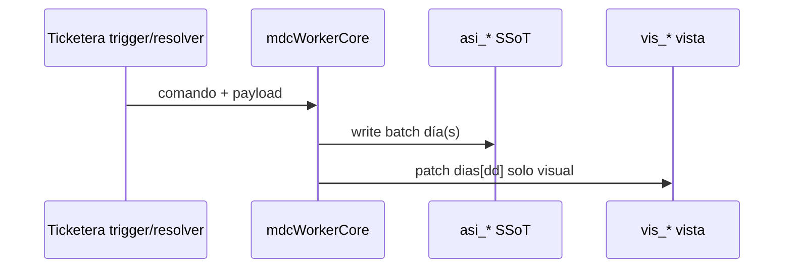

# Anexo — Alineación RDA Gemini V6 → estructura física V2

**Estado:** mandato arquitectónico · **2026-05-20**  
**RFC ticketera:** [`RFC_TICKETERA_AUTORIZACION_TOMA_CONOCIMIENTO_V2.md`](./RFC_TICKETERA_AUTORIZACION_TOMA_CONOCIMIENTO_V2.md) §7.4  
**Biblia:** [`ARQUITECTURA_MAESTRA_SIGAL_V2_MODULO_OPERATIVO_ASISTENCIA.md`](./ARQUITECTURA_MAESTRA_SIGAL_V2_MODULO_OPERATIVO_ASISTENCIA.md)

---

## 1. Mandato (cerrado)

| Capa | Decisión |
|------|----------|
| SSoT transaccional | **`asistencia_diaria`** / id `asi_<per>_<YYYYMMDD>` |
| Vista grilla | **`vistas_grilla_mes_agente`** / id `vis_<YYYY>_<MM>_per_<ULID>` |
| Descartado | Documento físico mensual único `personaId_AAAA_MM` (modelo lógico V6, no colección maestra) |
| Reglas V6 | Bloqueo grilla, soberanía RRHH, pases, permutas, retroactividad → vigentes sobre **`asi_*`** + fan-out **`vis_*`** |

---

## 2. Mapa de campos (orientativo)

| Gemini V6 (día) | V2 físico en `asi_*` | Vista `vis_*` |
|-----------------|----------------------|---------------|
| `capa_teorica` | `capa_teorica.{tipo_id, ingreso_teorico, egreso_teorico, evento_calendario_id}` | `dias[dd].es_franco` |
| `capa_solicitudes[]` | `aportes_normativos.{sol_id}` | `dias[dd].eventos[]` |
| `capa_realidad` | `fichadas[]` | — |
| `estado_calculado` | `estado_consolidado` + `prioridad_actual` | color vía `eventos[].color_ui` |

---

## 3. Fan-out (implementación Oleada B)

Código: `functions/modules/shared/mdc*.js`.

---

## 4. Épicas fuera de Oleada B

| Epic | Contenido V6 |
|------|----------------|
| P | `planificacion_mensual_rotativa` + trigger AUTORIZADO → `capa_teorica` |
| L | Pases, standby HLg, corte quirúrgico |
| T | `solicitud_permuta_turno` |
| B | Biométrico + dobras sin auto-saldo |
| M | Carpetas médicas + retroactividad |

---

## 5. Referencias

- Zod vista: [`web/src/schemas/articulo.tripleLayer.schema.js`](../../web/src/schemas/articulo.tripleLayer.schema.js)
- Plan implementación: [`PLAN_IMPLEMENTACION_RFC_AUTORIZACION_TICKETERA_V2.md`](./PLAN_IMPLEMENTACION_RFC_AUTORIZACION_TICKETERA_V2.md)
