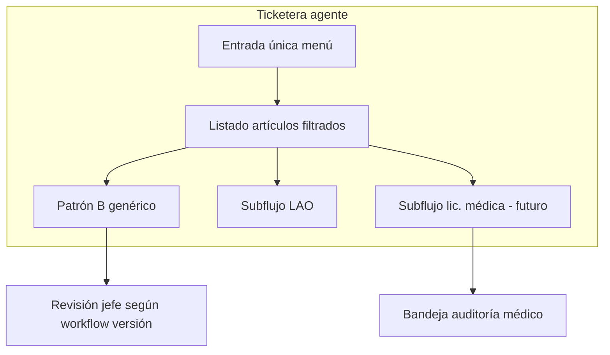

# Concepto — Ticketera / bandeja de solicitudes (herramienta dinámica)

**Estado:** **Visión de producto** acordada 2026-05-19 — **incorporada al plan maestro** [`PLAN_TICKETERA_V2.md`](./PLAN_TICKETERA_V2.md) (§2 y roadmap Fase 2).  
**Base técnica actual:** filtrado por elegibilidad + circuito en `listarArticulosIngresoAgente` · slices **64-A / 64-B** (Patrón B) · **LAO** en ruta aparte.

**Plan maestro (estado vs fases):** [`PLAN_TICKETERA_V2.md`](./PLAN_TICKETERA_V2.md)

**Relacionados:** [`RFC_TICKETERA_SLICE_64A_MVP_V2.md`](./RFC_TICKETERA_SLICE_64A_MVP_V2.md) · [`RFC_ACCESO_ROLES_HLC_MENUS_V2.md`](./RFC_ACCESO_ROLES_HLC_MENUS_V2.md) · [`PLAN_TICKETERA_SLICE_64B_V2.md`](./PLAN_TICKETERA_SLICE_64B_V2.md) · [`BACKLOG_MODULOS_PARALELOS_ARTICULOS_V2.md`](./BACKLOG_MODULOS_PARALELOS_ARTICULOS_V2.md)

---

## 1. Qué es la ticketera

Una **herramienta dinámica** de ingreso de solicitudes: el comportamiento (campos, días, validaciones, patrón de saldo, preview) se **deriva de la versión publicada** del artículo elegido, no de pantallas fijas por código de grilla.

La **lógica de filtrado** (quién ve qué artículo) ya está planteada:

- Menú / ruta: solo artículos que pasan `listarArticulosIngresoAgente` a la **fecha_desde** (elegibilidad HLC + filtros de versión + circuito `rol_id`).
- Motor al enviar: revalida todo + saldos (Patrón A/B/C según artículo).

---

## 2. Flujo estándar agente (objetivo)

Orden de pantallas / pasos:

| Paso | Acción usuario | Sistema |
|------|----------------|---------|
| 1 | Entra a **Ticketera** (una entrada de menú, no un ítem por artículo) | Resuelve `persona_id`, sesión, claims |
| 2 | Elige **fecha desde** (o primero artículo según UX acordada) | Dispara listado elegible **acotado** a esa fecha |
| 3 | Ve **listado de artículos** (solo los que cumple hoy) | Callable optimizado; ver §5 rendimiento |
| 4 | Elige **artículo** | Carga metadata de versión: patrón saldo, días por evento, unidad, topes |
| 5 | **Fecha hasta** | **No se edita:** se **impone** desde reglas del artículo (p. ej. 1 día → `fecha_hasta = fecha_desde`; N días hábiles → cálculo; solo lectura en UI) |
| 6 | **Previsualizar** | Callable preview: elegibilidad + saldo + mensajes estables (`ELEG_*`, `SALDO_*`) sin persistir |
| 7 | **Enviar** | Alta `sol_*` + triggers/motores por patrón |
| 8 | Confirmación | Estado registrado (p. ej. en revisión jefe) + feedback claro |

**Hoy (MVP):** pantalla “Asuntos particulares” acorta pasos 5–6 para Patrón B 1 día; no hay preview dedicado ni `fecha_hasta` visible; listado atado a whitelist y **carga lenta** con pocos artículos (§5).

---

## 3. Regla: días y fechas impuestas

Al seleccionar artículo, la versión publicada define:

- **Cantidad de días** del evento (`tope_dias_por_evento`, fraccionamiento, unidad días/horas).
- **`fecha_hasta`:** calculada en servidor (y mostrada **solo lectura**); el agente no “elige” un rango libre salvo que el artículo lo permita en una fase posterior (fuera del MVP 1 día).

Ejemplos:

| Artículo | Comportamiento UI |
|----------|-------------------|
| 64-A / 64-B | 1 día → `fecha_hasta` = `fecha_desde` (solo lectura) |
| Futuro multi-día | `fecha_desde` + N días hábiles desde versión → `fecha_hasta` calculada |

---

## 4. Subflujos dentro de la ticketera (no un solo formulario)

La ticketera es un **contenedor** con rutas o “modos” según familia de artículo:

### 4.1 Flujo genérico Patrón B (y otros patrones configurables)

Listado dinámico → fechas impuestas → preview → enviar.  
**64-A / 64-B** son el primer corte de este carril.

### 4.2 LAO — flujo especial

- **No** comparte el mismo wizard que asuntos particulares.
- Mantiene motor **Patrón A**, bolsas por año, FIFO, preview LAO existente (`simularLaoPreview`, etc.).
- En menú: entrada dedicada (hoy `/portal/solicitudes/lao`) **dentro del concepto ticketera** aunque la UI sea distinta.

### 4.3 Licencias médicas (futuro)

- **Inicio genérico** en ticketera: tipo “enfermedad personal”, “atención de familiar”, etc. (parámetros por definir con RRHH).
- Después del ingreso agente, el trámite continúa hacia **rol médico**: bandeja de **auditoría** (no solo jefe jerárquico).
- Documentación normativa / interfaces: ampliar cuando existan `cfg_*` y RFC de slice médico.

---

## 5. Rendimiento del listado (problema actual y dirección)

**Síntoma:** con **2** artículos la carga ya se siente lenta; con **~50** artículos sería inaceptable.

**Rendimiento (Fase 2.1):** el listado ya no escanea `cfg_articulos` completo; usa whitelist MVP en paralelo o `collectionGroup("versiones")` cuando la whitelist esté vacía — ver [`RFC_TICKETERA_FASE2_DINAMICA_V2.md`](./RFC_TICKETERA_FASE2_DINAMICA_V2.md).

**Dirección acordada (sin implementar aquí):**

| Prioridad | Medida |
|-----------|--------|
| P0 | Callable único que recibe `fecha_desde` y devuelve solo elegibles; **no** escanear colección entera en cliente |
| P1 | Índice / catálogo “artículos con versión publicada vigente en fecha” (materializado o query acotada por `estado_version_id` + rango fechas) |
| P1 | Evaluar elegibilidad en **lote** (HLC una vez; versiones en paralelo acotado) |
| P2 | Cache corto por `persona_id` + `fecha_desde` en sesión (invalidar al cambiar HL) |
| P2 | Paginación o búsqueda por código/nombre si el listado supera umbral (p. ej. 20) |

Hasta entonces, ampliar whitelist MVP sin rediseñar empeora la percepción de lentitud.

---

## 6. Bandejas (siguiente capa producto)

| Actor | Bandeja | Contenido |
|-------|---------|-----------|
| Agente | Ticketera ingreso | Este documento |
| Jefe | Revisión jerárquica | `sol_*` en `cfg_esa_en_revision_jefe` (64-A piloto OK) |
| Médico | Auditoría licencias | Futuro; distinto de jefe |
| RRHH | Configuración + check-in | Fuera de ticketera agente |

---

## 7. Relación con lo ya hecho (2026-05-19)

| Hecho | Encaje en visión |
|-------|------------------|
| `ArticulosIngresoProvider` + menú por elegibilidad | Paso 2–3 parcial; falta ticketera única y optimización listado |
| 64-A + 64-B mismo formulario | Prototipo del carril Patrón B; falta `fecha_hasta` RO + preview |
| Matriz 64-A cerrada | Validación del motor B en piloto |
| 64-B `sol_01KS015…` | Validación segundo artículo Patrón B |
| LAO ruta separada | Subflujo 4.2 |

---

## 8. Próximos pasos sugeridos (orden)

1. **RFC ticketera dinámica** (contrato DTO listado + preview + fechas impuestas) — derivar de este concepto.
2. **Refactor listado** (P0 rendimiento) antes de quitar whitelist masiva.
3. **UI:** `fecha_hasta` solo lectura + paso Previsualizar (callable).
4. **Unificar entrada menú** “Solicitudes” → wizard por `patron_saldo` / `es_lao_anual` / flags médico.
5. Bandeja jefe; después slice licencia médica + médico.

---

## 9. Changelog

| Fecha | Cambio |
|-------|--------|
| 2026-05-19 | Documento creado desde concepto producto: ticketera dinámica, fechas impuestas, subflujos LAO/médico, rendimiento listado. |
