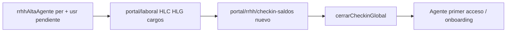

# Flujo propuesto — Alta de agente por RRHH (cáscara + legajo + saldos)

**Estado:** **Propuesta de producto** alineada al código vigente (mayo 2026).  
**Audiencia:** RRHH, arquitectura, implementación portal.

---

## 1. Hipótesis (tu planteo)

El **ciclo de alta de un nuevo usuario** realizado por RRHH quedaría compuesto por:

1. **Crear cáscara** — persona + cuenta en estado pendiente (`rrhhAltaAgente` + pantalla RRHH de alta).
2. **Completar legajo operativo** — datos laborales, HLC, HLG, efectores, etc. en **`/portal/laboral`**.
3. **Check-in de saldos** — fotografía contable inicial en **`/portal/rrhh/checkin-saldos`**.

URLs locales de referencia: `http://localhost:5173/portal/laboral` y `http://localhost:5173/portal/rrhh/checkin-saldos`.

---

## 2. Opinión (arquitectura / producto)

**Sí, el planteo es correcto y coherente con el modelo V2**, con matices importantes:

### A favor

| Punto | Por qué |
|-------|---------|
| **Orden lógico** | Sin `per_*` no hay dónde colgar HLC/HLG; sin HLC cargadas, el check-in LAO pierde sentido (el propio check-in exige confirmación HLC en modo **nuevo**). |
| **Separación de responsabilidades** | Alta = identidad/acceso; Laboral = vínculo y organigrama; Check-in = capa contable (`saldos_articulo_agente`). Eso coincide con módulos y Rules distintas. |
| **No mezclar ticketera con onboarding** | El check-in no valida solicitudes de licencia en rectificación; el legajo laboral no debería escribir bolsas directamente. |
| **Reutilización** | Ya existen piezas: `rrhhAltaAgente`, `DatosLaborales`, `CheckinSaldosAgente` — no hace falta un mega-formulario único para el MVP. |

### Matices / riesgos

| Tema | Recomendación |
|------|----------------|
| **No es un solo “wizard” hoy** | Son **tres pantallas** enlazadas por criterio operativo, no por estado de máquina en backend. RRHH puede saltar pasos o hacer check-in antes de HLC si no hay guardrails. |
| **Guardrails deseables** | Checklist en UI o menú RRHH: “Alta incompleta” si falta HLC vigente o falta `checkin_saldos_portal_en`. Opcional: bloquear cierre global si no hay HLC confirmada. |
| **Cuenta pendiente vs agente activo** | Tras alta, el agente completa **primer acceso** (`registrarPrimerAcceso`) y onboarding MVP; eso es **paralelo** al trabajo de RRHH en laboral/check-in, no sustituye el paso 2–3. |
| **Orden B vs LAO** | Para patrón B (64-A, etc.) el año ciclo es A; para LAO son años &lt; A. El orden entre “cargar 64-A” y “cargar LAO” es flexible; lo crítico es **HLC antes del check-in nuevo**. |
| **Rectificación posterior** | Agentes ya dados de alta solo pasan por check-in (rectificación) o actualización laboral; no repiten alta. |

### Conclusión breve

Tratarlo como **un mismo proceso de negocio “Alta de agente RRHH”** con **tres hitos de UI** es la lectura correcta. **No** implica que deba ser una sola ruta o un solo callable: la separación actual es sana para mantenimiento y permisos.

**Siguiente mejora de producto (opcional):** pantalla índice RRHH “Alta de agente” con progreso (Cáscara ✓ → Laboral → Check-in → Cierre global) y deep-links a `/portal/laboral?persona_id=…` y `/portal/rrhh/checkin-saldos` con agente preseleccionado.

---

## 3. Secuencia recomendada (checklist operativo)

| # | Acción | Salida en sistema |
|---|--------|-------------------|
| 1 | Alta RRHH | `personas`, `usuarios_cuenta` (pendiente registro), DDJJ familiar según alta |
| 2 | Datos laborales | `historial_laboral_cargos`, `historial_laboral_grupos`, vigencias |
| 3 | Check-in saldos (nuevo) | `saldos_articulo_agente` + parcial por artículo |
| 4 | Cerrar check-in global | `checkin_saldos_portal_en`, `anio_corte_portal_a` |
| 5 | (Paralelo) Agente | Login, PIN, onboarding personal |

---

## 4. Enlaces técnicos

| Paso | Callable / módulo | Doc |
|------|-------------------|-----|
| Alta | `rrhhAltaAgente` | [`DESARROLLO_ORDEN_LOGIN_DATOS_V2.md`](./DESARROLLO_ORDEN_LOGIN_DATOS_V2.md), [`AUDITORIA_PRE_PRODUCCION.md`](./AUDITORIA_PRE_PRODUCCION.md) |
| Laboral | Callables catálogo + servicios laborales | [`MODULO_DATOS_LABORALES_V2.md`](./MODULO_DATOS_LABORALES_V2.md) |
| Check-in | Ver handoff 2026-05-18 | [`HANDOFF_SESION_2026-05-18_CHECKIN_SALDOS.md`](./HANDOFF_SESION_2026-05-18_CHECKIN_SALDOS.md) |
| Guía alta (3 pasos) | `/portal/rrhh/alta-agente` | [`CHECKIN_SALDOS_BACKLOG.md`](./CHECKIN_SALDOS_BACKLOG.md) (decisiones 16–18: cierre global vs parciales) |

---

## 5. Qué no incluye este flujo

- Configuración de artículos/versiones (RRHH configurador, otra ruta).
- Solicitudes LAO del agente (portal agente, post check-in).
- Acreditación anual LAO por antigüedad (motor batch / callable futuro, año ≥ A).
