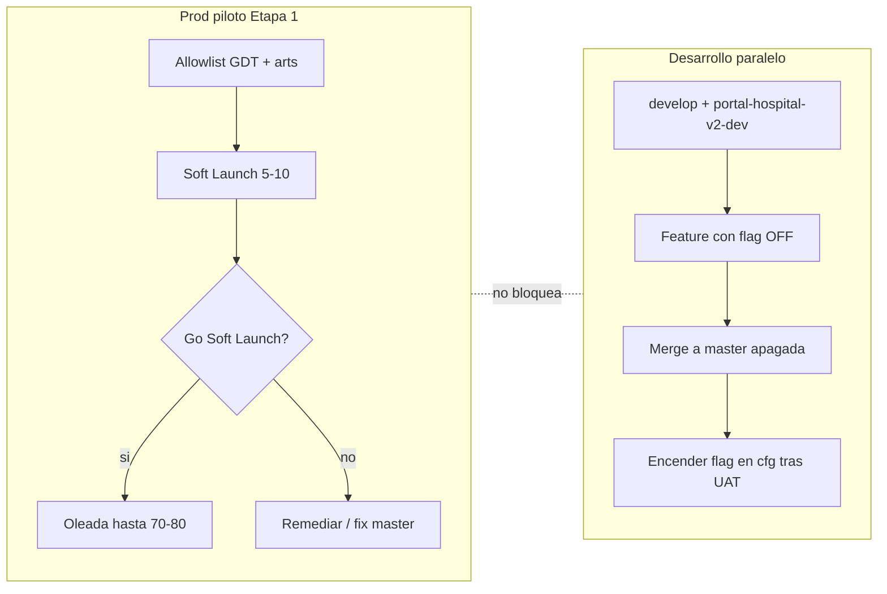

# Guía Etapa 1 — dónde estamos y por dónde seguimos

**Fecha foto:** 2026-07-14 (tarde — Vía B-dev operativa; pausa)  
**Objetivo del plan:** habilitar la web piloto para un cupo controlado (~5–10 Soft Launch → ~70–80 oleada) **y** seguir desarrollando el resto de V2 en paralelo, encendiendo novedades con flags.

**Documentos de contrato (no sustituye; resume):**  
[`ETAPA1_GIT_Y_ENTORNOS_V2`](./ETAPA1_GIT_Y_ENTORNOS_V2.md) · [`ETAPA1_POLITICA_DEPLOY_V2`](./ETAPA1_POLITICA_DEPLOY_V2.md) · [`ETAPA1_GO_LIVE_V2`](./ETAPA1_GO_LIVE_V2.md) · [`ACTA_RRHH_ETAPA1_VIDA_REAL_V2`](./ACTA_RRHH_ETAPA1_VIDA_REAL_V2.md) · [`CHECKLIST_UAT_ETAPA1_V2`](./CHECKLIST_UAT_ETAPA1_V2.md) · [`ETAPA1_FIREBASE_DEV_SETUP_V2`](./ETAPA1_FIREBASE_DEV_SETUP_V2.md)

**Pausa / retoma (ahora):** [`HANDOFF_SESION_2026-07-14_PAUSA_VIA_B_DEV.md`](./HANDOFF_SESION_2026-07-14_PAUSA_VIA_B_DEV.md)  
**Vía A (prod):** [`HANDOFF_SESION_2026-07-14_CIERRE_DEPLOY_ETAPA1.md`](./HANDOFF_SESION_2026-07-14_CIERRE_DEPLOY_ETAPA1.md) · detalle oleada [`HANDOFF_SESION_2026-07-14_SOFT_LAUNCH_UX_RULES_CALENDARIO.md`](./HANDOFF_SESION_2026-07-14_SOFT_LAUNCH_UX_RULES_CALENDARIO.md)

---

## 1. Veredicto: ¿vamos cumpliendo el plan?

**Sí en arquitectura, Soft Launch UX en prod, y entorno-dev usable; Soft Launch de negocio (UAT + altas) y smoke Vite-dev pendientes.**

| Eje del plan | Estado | Notas |
|--------------|--------|--------|
| Docs UAT / Deploy / Acta / Go-Live / Git | ✅ | Persistidos y aceptados 2026-07-08 |
| Tag inmutable `v0.9.0-base` | ✅ | `d58b73a` ← commit `f6ac0cc` (antes de commits Etapa 1) |
| Rama `master` = prod estable Etapa 1 | ✅ | HEAD docs pausa `e9a39ad` · feature Soft Launch `6dee722` |
| Rama `develop` arenero | ✅ | Alineada a `master` / `origin/*` @ pausa Vía A; wire-dev local sin commit |
| Candados `cfg_etapa1/runtime` + filtro catálogo | ✅ | Prod; LAO/LM/GSO jefe **off** |
| CAMBIO-DIA + B-BATCH + UX + rules | ✅ en prod | UAT vivo pendiente |
| Soft Launch 5–10 (Día D) | ⏳ | Hosting listo; faltan UAT firmado + altas RRHH |
| Oleada ~70–80 | ⏳ | Solo tras Go Soft Launch |
| Firebase `portal-hospital-v2-dev` | ✅ operativo | Firestore, Auth, Blaze, Functions, seed demo |
| Desarrollo paralelo features grandes en-dev | 🟡 listo para codear | Commit wire + smoke login pendientes |

### Orden ejecutivo (`ETAPA1_GIT_Y_ENTORNOS` §4)

| Paso | Qué | Estado |
|------|-----|--------|
| 0 | Docs + tag `v0.9.0-base` + rama `develop` | ✅ |
| 1 | Crear `portal-hospital-v2-dev` | ✅ setup completo (ver handoff Vía B) |
| 2 | `cfg_etapa1` / feature flags | ✅ prod · ✅ seed-dev |
| 3 | Candados allowlist / catálogo / hide superficies | ✅ prod |
| 4 | CAMBIO-DIA + B-BATCH | ✅ prod · ⏳ UAT |
| 5 | GDT nuevos + Soft Launch 5–10 | ⏳ negocio (altas + UAT) |

---

## 2. Foto Git / Firebase (2026-07-14 tarde)

| Recurso | Valor |
|---------|--------|
| `origin/master` | `e9a39ad` (docs pausa Soft Launch; feature en `6dee722`) |
| `origin/develop` | **mismo** remoto que master al pausar Vía A |
| Tag `v0.9.0-base` | `d58b73a` → `f6ac0cc` (baseline pre-Etapa1) |
| Working tree | Wire Vite-dev + bootstrap + docs Vía B **sin commit**; `scripts/_tmp-*` untracked |
| Prod Firebase | `portal-hospital-v2` · https://portal-hospital-v2.web.app |
| Dev Firebase | `portal-hospital-v2-dev` · alias `dev` · **operativo** |
| Rules / Functions-dev | ✅ desplegados |
| CLI `firebase use` | **`prod`** (volver a prod tras cada deploy-dev) |

### Convención de trabajo (reafirmar)

```text
master   →  solo lo que va (o ya va) a prod piloto Etapa 1
develop  →  arenero paralelo (features apagadas o solo-dev)
feature/* →  desde develop (o hotfix corto desde master)
```

Si en esta PC no ves `develop`:

```powershell
git fetch origin
git checkout -b develop origin/develop
```

---

## 3. Dos vías en paralelo (el modelo objetivo)



| Vía | Proyecto | Rama | Qué entra |
|-----|----------|------|-----------|
| **A — Cupo usuarios** | `portal-hospital-v2` | `master` | Fixes/UX Etapa 1, rules/functions del circuito, datos RRHH piloto |
| **B — Resto V2** | `portal-hospital-v2-dev` | `develop` / `feature/*` | LAO, médicas, GSO jefes, experimentos; a prod solo **apagados** hasta acta |

---

## 4. Ruta inmediata (ordenado)

### Hecho — Vía A técnica (2026-07-14)

1. ~~Commit oleada Soft Launch UX~~ → `6dee722`  
2. ~~Deploy functions acuse + hosting~~ → https://portal-hospital-v2.web.app  
3. ~~Docs pausa Vía A~~ → `e9a39ad`  

### Hecho — Vía B cloud (2026-07-14 tarde)

4. ~~App Web + `.env.v2.dev.local` + `dev:web:dev`~~ (local)  
5. ~~Rules/indexes + Functions-dev~~  
6. ~~Seed cfg + bootstrap agente demo~~  

### Ahora — Soft Launch (cupo real / negocio)

7. Completar **UAT** [`CHECKLIST_UAT_ETAPA1_V2`](./CHECKLIST_UAT_ETAPA1_V2.md) en vivo (o smoke firmado).  
8. RRHH: altas restantes (5–10 agentes, 1–2 jefes), HLg/HLc, check-in 64, jerarquías.  
9. Día D Soft Launch → revisión 48–72 h → **Go/No-Go oleada**.  
10. Oleada por tandas hasta ~70–80 (siempre vía GDT en `gdt_ids_etapa1`).

### Retoma técnica — Vía B

11. Commit wire Vite + bootstrap + docs (sin `_tmp-*`).  
12. Smoke: `npm run dev:web:dev` → DNI `28914247` / PIN `123456`.  
13. Features grandes solo contra-dev; a `master` con flags **false**.

Checklist-dev: [`ETAPA1_FIREBASE_DEV_SETUP_V2`](./ETAPA1_FIREBASE_DEV_SETUP_V2.md).

---

## 5. Superficie Etapa 1 (qué está “habilitable”)

| Trámite / rol | Estado producto |
|---------------|-----------------|
| 64-A / 64-B / 63.j | En catálogo Etapa 1 |
| CAMBIO-DIA | Seed + wizard + B-BATCH; UAT vivo pendiente |
| Agente: Mis solicitudes + acuse rechazo | **En prod** (`6dee722`) |
| Agente: Calendario institucional consulta | **En prod** |
| Jefe: solo bandeja | Política: sin GSO |
| LAO / LM / GSO jefe | **Off** por flag / menú |

**GDT piloto prod:** `gdt_01KX107ZZTPKF12A1ED2XVKNMM`  
**GDT base-dev:** `gdt_01KXGK9GXHHVE0FCKPJRPDDHXA`  
**CAMBIO-DIA:** `art_01KX0Z07N5PFY7ZG0ZZP93EJ8H` / `ver_01KX0Z07N70GZKBKF1P27C78SY`

---

## 6. Cómo encender novedades sin romper el cupo

1. Desarrollar en **dev**.  
2. Merge a `master` con la novedad **apagada** (`cfg_etapa1/runtime`).  
3. Deploy hosting/functions si hace falta.  
4. Encender flag / agregar `articulo_id` / `gdt_id` **solo** tras UAT del módulo.  
5. Rollback preferido = flag `false` (segundos), no borrar datos de usuarios.

---

## 7. Definición de “objetivo alcanzado” (corto)

Está **cumplido el objetivo del plan** cuando:

1. Soft Launch (o oleada) opera en prod con allowlist real y checklist/smoke verde.  
2. `portal-hospital-v2-dev` sirve para desarrollar el resto sin tocar datos piloto.  
3. Cada novedad llega a la web piloto **apagada** y se habilita por cfg/acta, no por “deploy de todo”.

Hoy: **(1) código Soft Launch en prod, pendiente UAT+altas · (2) casi ✅ — falta smoke Vite + commit · (3) modelo de flags ya en uso.**

---

**Puntero único de estado · 2026-07-14 tarde** — retomar: commit wire-dev + smoke login · en paralelo UAT Soft Launch RRHH.
