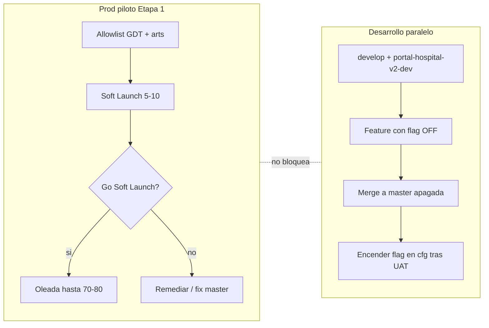

# Guía Etapa 1 — dónde estamos y por dónde seguimos

**Fecha foto:** 2026-07-14  
**Objetivo del plan:** habilitar la web piloto para un cupo controlado (~5–10 Soft Launch → ~70–80 oleada) **y** seguir desarrollando el resto de V2 en paralelo, encendiendo novedades con flags.

**Documentos de contrato (no sustituye; resume):**  
[`ETAPA1_GIT_Y_ENTORNOS_V2`](./ETAPA1_GIT_Y_ENTORNOS_V2.md) · [`ETAPA1_POLITICA_DEPLOY_V2`](./ETAPA1_POLITICA_DEPLOY_V2.md) · [`ETAPA1_GO_LIVE_V2`](./ETAPA1_GO_LIVE_V2.md) · [`ACTA_RRHH_ETAPA1_VIDA_REAL_V2`](./ACTA_RRHH_ETAPA1_VIDA_REAL_V2.md) · [`CHECKLIST_UAT_ETAPA1_V2`](./CHECKLIST_UAT_ETAPA1_V2.md) · [`ETAPA1_FIREBASE_DEV_SETUP_V2`](./ETAPA1_FIREBASE_DEV_SETUP_V2.md)

**Sesión reciente:** [`HANDOFF_SESION_2026-07-14_SOFT_LAUNCH_UX_RULES_CALENDARIO`](./HANDOFF_SESION_2026-07-14_SOFT_LAUNCH_UX_RULES_CALENDARIO.md)

---

## 1. Veredicto: ¿vamos cumpliendo el plan?

**Sí en arquitectura y candados; Soft Launch operativo aún no cerrado.**

| Eje del plan | Estado | Notas |
|--------------|--------|--------|
| Docs UAT / Deploy / Acta / Go-Live / Git | ✅ | Persistidos y aceptados 2026-07-08 |
| Tag inmutable `v0.9.0-base` | ✅ | `d58b73a` ← commit `f6ac0cc` (antes de commits Etapa 1) |
| Rama `master` = prod estable Etapa 1 | ✅ | `f5c8b5e` (Soft Launch CAMBIO-DIA documentado) |
| Rama `develop` arenero | ⚠️ | Existe en **remoto** y **igual** a `master` (`0/0`). Localmente a veces no está checkouteada |
| Candados `cfg_etapa1/runtime` + filtro catálogo | ✅ | Prod con `etapa1_habilitada`, arts 64A/B/63j/CAMBIO-DIA, LAO/LM/GSO jefe **off** |
| CAMBIO-DIA + B-BATCH | ✅ código/seed | IDs prod en seed; UAT vivo pendiente |
| Soft Launch 5–10 (Día D) | ⏳ | GDT piloto + tooling listos; faltan UAT firmado + altas restantes + release hosting de UX |
| Oleada ~70–80 | ⏳ | Solo tras Go Soft Launch (§ umbrales Acta) |
| Firebase `portal-hospital-v2-dev` | ⚠️ creado | Proyecto **sí** (sesión previa). **Firestore/Auth/app Web aún no operativos** |
| Desarrollo paralelo features grandes en-dev | ⏳ | Bloqueado hasta completar setup-dev |

### Orden ejecutivo (`ETAPA1_GIT_Y_ENTORNOS` §4)

| Paso | Qué | Estado |
|------|-----|--------|
| 0 | Docs + tag `v0.9.0-base` + rama `develop` | ✅ docs/tag · `develop` remoto = `master` |
| 1 | Crear `portal-hospital-v2-dev` | ✅ proyecto creado · ❌ sin APIs/app |
| 2 | `cfg_etapa1` / feature flags | ✅ en **prod** |
| 3 | Candados allowlist / catálogo / hide superficies | ✅ |
| 4 | CAMBIO-DIA + B-BATCH | ✅ implementado · ⏳ UAT |
| 5 | GDT nuevos + Soft Launch 5–10 | ⏳ en curso (1 GDT piloto; altas RRHH incompletas) |

---

## 2. Foto Git / Firebase (corroborado 2026-07-14)

| Recurso | Valor |
|---------|--------|
| `origin/master` | `f5c8b5e` Soft Launch CAMBIO-DIA |
| `origin/develop` | **mismo** `f5c8b5e` |
| Tag `v0.9.0-base` | `d58b73a` → `f6ac0cc` (baseline pre-Etapa1) |
| Working tree local | Cambios **sin commit** (Mis solicitudes/acuse, CAMBIO-DIA UX, calendario consulta, rules tests, handoffs) |
| Prod Firebase | `portal-hospital-v2` · https://portal-hospital-v2.web.app |
| Dev Firebase | `portal-hospital-v2-dev` · alias `.firebaserc` `dev` · **sin app Web · Firestore API no habilitada** |
| Rules CAMBIO-DIA (fix 1000 exprs) | **Desplegadas en prod** (2026-07-14) |
| Hosting UI sesión 14-jul | **Pendiente** (solo Vite local) |

### Convención de trabajo (reafirmar)

```text
master   →  solo lo que va (o ya va) a prod piloto Etapa 1
develop  →  arenero paralelo (features apagadas o solo-dev)
feature/* →  desde develop (o hotfix corto desde master)
```

Si en esta PC no ves `develop`:

```powershell
git fetch origin
git checkout -b develop origin/develop
```

---

## 3. Dos vías en paralelo (el modelo objetivo)



| Vía | Proyecto | Rama | Qué entra |
|-----|----------|------|-----------|
| **A — Cupo usuarios** | `portal-hospital-v2` | `master` | Fixes/UX Etapa 1, rules/functions del circuito, datos RRHH piloto |
| **B — Resto V2** | `portal-hospital-v2-dev` (cuando esté listo) | `develop` / `feature/*` | LAO, médicas, GSO jefes, experimentos; a prod solo **apagados** hasta acta |

Hasta que-dev esté usable: en prod **solo** entregas Etapa 1 (moratoria).

---

## 4. Ruta inmediata (ordenado)

### Ahora — cerrar el paquete local → prod Etapa 1

1. **Commit** oleada 2026-07-14 (sin `scripts/_tmp-*`).  
2. Smoke local: login Soft Launch · CAMBIO-DIA envío · Mis solicitudes/acuse · calendario consulta.  
3. Deploy:  
   - Functions acuse (si faltan en prod)  
   - `build:web` + `hosting`  
4. Smoke en `.web.app`.  
5. Merge/`push` a `master` (y alinear `develop` si hace falta).

### Luego — Soft Launch (cupo real)

6. Completar **UAT** [`CHECKLIST_UAT_ETAPA1_V2`](./CHECKLIST_UAT_ETAPA1_V2.md) o smoke firmado (64 + jefe + TC + CAMBIO-DIA happy path).  
7. RRHH: altas restantes (5–10 agentes, 1–2 jefes), HLg/HLc, check-in 64, jerarquías.  
8. Día D Soft Launch → revisión 48–72 h → **Go/No-Go oleada**.  
9. Oleada por tandas hasta ~70–80 (siempre vía GDT en `gdt_ids_etapa1`, no “abrir el hospital”).

### En paralelo (tan pronto se pueda) — habilitar-dev

10. Consola `portal-hospital-v2-dev`: Firestore + Auth + Storage + Blaze + app Web.  
11. `.env.v2.dev.local` + script Vite `dev:web` apuntando a-dev (hoy solo lee `.env.v2.local`).  
12. `firebase use dev` → deploy rules/indexes (+ functions).  
13. Seed mínimo `cfg_etapa1` + datos de prueba.  
14. Features grandes solo contra-dev; a `master` con flags **false**.

Checklist detallada-dev: [`ETAPA1_FIREBASE_DEV_SETUP_V2`](./ETAPA1_FIREBASE_DEV_SETUP_V2.md).

---

## 5. Superficie Etapa 1 (qué está “habilitable”)

| Trámite / rol | Estado producto |
|---------------|-----------------|
| 64-A / 64-B / 63.j | En catálogo Etapa 1 |
| CAMBIO-DIA | Seed + wizard + B-BATCH; UAT vivo pendiente |
| Agente: Mis solicitudes + acuse rechazo | Código local / hosting pendiente |
| Agente: Calendario institucional consulta | Código local / hosting pendiente |
| Jefe: solo bandeja | Política: sin GSO |
| LAO / LM / GSO jefe | **Off** por flag / menú |

**GDT piloto:** `gdt_01KX107ZZTPKF12A1ED2XVKNMM`  
**CAMBIO-DIA:** `art_01KX0Z07N5PFY7ZG0ZZP93EJ8H` / `ver_01KX0Z07N70GZKBKF1P27C78SY`

---

## 6. Cómo encender novedades sin romper el cupo

1. Desarrollar en **dev** (cuando exista) o, si es solo UI/flag, en `feature/*`.  
2. Merge a `master` con la novedad **apagada** (`cfg_etapa1/runtime`).  
3. Deploy hosting/functions si hace falta.  
4. Encender flag / agregar `articulo_id` / `gdt_id` **solo** tras UAT del módulo.  
5. Rollback preferido = flag `false` (segundos), no borrar datos de usuarios.

---

## 7. Definición de “objetivo alcanzado” (corto)

Está **cumplido el objetivo del plan** cuando:

1. Soft Launch (o oleada) opera en prod con allowlist real y checklist/smoke verde.  
2. `portal-hospital-v2-dev` sirve para desarrollar el resto sin tocar datos piloto.  
3. Cada novedad llega a la web piloto **apagada** y se habilita por cfg/acta, no por “deploy de todo”.

Hoy: **(1) casi listo en código, pendiente UAT+hosting+altas · (2) proyecto creado, setup incompleto · (3) modelo de flags ya en uso.**

---

**Puntero único de estado · 2026-07-14** — retomar: commit/hosting → UAT Soft Launch · en paralelo setup-dev.
