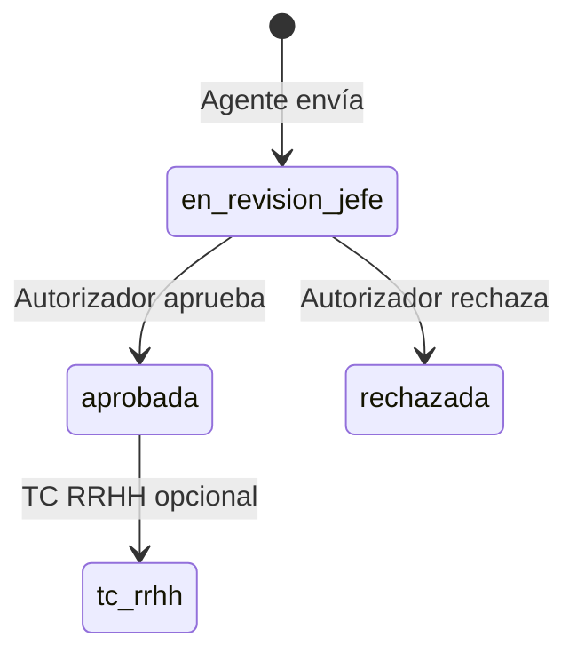

# Handoff sesión 2026-05-19 — Autorización ticketera (RFC + plan implementación)

**Estado:** **PAUSA documental** — sin código Oleada A en esta sesión.  
**Rama:** `feature/ticketera-puente-campos-config`  
**Firebase:** `portal-hospital-v2` · Functions `southamerica-east1` · Firestore `southamerica-east1`  
**Piloto:** DNI **28914247** · titular ejemplo `per_01KR3HD24AMJ6YX3N7B3GPAZJ4` · `sol_01KS0896610NA49M9G6VABMMEK`

> **Superseded por código:** ver [`HANDOFF_SESION_2026-05-20_MDC_OLEADA_B_PAUSA.md`](./HANDOFF_SESION_2026-05-20_MDC_OLEADA_B_PAUSA.md) §8 (Oleada A es el próximo paso; Oleada B ya implementada).

---

## 1. Qué se hizo en esta sesión (solo documentación)

| Entregable | Archivo |
|------------|---------|
| **RFC contrato** (taller producto cerrado) | [`RFC_TICKETERA_AUTORIZACION_TOMA_CONOCIMIENTO_V2.md`](./RFC_TICKETERA_AUTORIZACION_TOMA_CONOCIMIENTO_V2.md) |
| **Plan implementación** (oleadas A/B/C) | [`PLAN_IMPLEMENTACION_RFC_AUTORIZACION_TICKETERA_V2.md`](./PLAN_IMPLEMENTACION_RFC_AUTORIZACION_TICKETERA_V2.md) |
| **Análisis coordinación** con otros planes | § 6 de este handoff |
| Índice README | [`README.md`](./README.md) — fila RFC autorización |
| Pausa Fase 2–4 actualizada | [`HANDOFF_TICKETERA_PAUSA_2026-05-19_FASE2-4.md`](./HANDOFF_TICKETERA_PAUSA_2026-05-19_FASE2-4.md) § 0 |

**No se modificó** código de bandejas, triggers ni UI en esta sesión.

---

## 2. Decisiones de producto cerradas (resumen)

| Tema | Decisión |
|------|----------|
| RRHH | **Opción B:** toma de conocimiento; **cierre** `cfg_esa_aprobada` en bandeja **jefe** |
| Autorizador | Un paso; **máximo rango** en burbuja (`MIN(nivel_jerarquico)` entre superiores al titular); empate → **OR** |
| Sin superior | Escalar `gdt.parent_group_id` (máx. 10); huérfana → RRHH **cierre sustituto** |
| Saldo Patrón B | Descuento **al solicitar** (sin cambio) |
| MDC/RDA | Proyección **al solicitar**; consolidación al aprobar jefe (Oleada B/C) |
| Bypass RRHH en bandeja jefe | **Eliminar** en TO-BE |

Detalle taxativo: RFC §2, §5, §7, §10.

---

## 3. AS-IS desplegado (MVP — no cambiar hasta Oleada A)

| Acto | Estado resultante |
|------|-------------------|
| Jefe Aprueba | `cfg_esa_en_revision_rrhh` |
| RRHH Aprueba | `cfg_esa_aprobada` |
| RRHH en bandeja jefe | Bypass ve todas las pendientes |

Evidencia: [`HANDOFF_TICKETERA_PAUSA_2026-05-19_FASE2-4.md`](./HANDOFF_TICKETERA_PAUSA_2026-05-19_FASE2-4.md), [`TICKETERA_FASE3_EVIDENCIA_PILOTO.md`](./TICKETERA_FASE3_EVIDENCIA_PILOTO.md), [`TICKETERA_FASE4_EVIDENCIA_PILOTO.md`](./TICKETERA_FASE4_EVIDENCIA_PILOTO.md).

---

## 4. TO-BE objetivo (próxima implementación)



- Sin `en_revision_rrhh` en **solicitudes nuevas** (legacy permitido en lectura).
- RRHH: **Registrar toma de conocimiento** (no “Aprobar definitivo”) salvo huérfana.

---

## 5. Mapa documental unificado (ticketera + asistencia)

| Rol | Documento |
|-----|-----------|
| **Contrato negocio** | [`RFC_TICKETERA_AUTORIZACION_TOMA_CONOCIMIENTO_V2.md`](./RFC_TICKETERA_AUTORIZACION_TOMA_CONOCIMIENTO_V2.md) |
| **Cómo implementar** | [`PLAN_IMPLEMENTACION_RFC_AUTORIZACION_TICKETERA_V2.md`](./PLAN_IMPLEMENTACION_RFC_AUTORIZACION_TICKETERA_V2.md) |
| **Plan maestro ticketera** | [`PLAN_TICKETERA_V2.md`](./PLAN_TICKETERA_V2.md) |
| **Pausa bandejas MVP** | [`HANDOFF_TICKETERA_PAUSA_2026-05-19_FASE2-4.md`](./HANDOFF_TICKETERA_PAUSA_2026-05-19_FASE2-4.md) |
| **RDA / MDC / GSO** | [`ARQUITECTURA_MAESTRA_SIGAL_V2_MODULO_OPERATIVO_ASISTENCIA.md`](./ARQUITECTURA_MAESTRA_SIGAL_V2_MODULO_OPERATIVO_ASISTENCIA.md) |
| **HLg / jerarquía** | [`MODULO_DATOS_LABORALES_V2.md`](./MODULO_DATOS_LABORALES_V2.md) §4.4.1 |
| **Eventos** | [`PLAN_UNIFICACION_EVENTOS_RRHH_2026-05-06.md`](./PLAN_UNIFICACION_EVENTOS_RRHH_2026-05-06.md) |
| **Interfaces cruzadas** | [`BACKLOG_MODULOS_PARALELOS_ARTICULOS_V2.md`](./BACKLOG_MODULOS_PARALELOS_ARTICULOS_V2.md) |
| **RFC futuro asistencia** | `RFC_MODULO_ASISTENCIA_RDA_GSO_V2.md` (propuesto, no redactado) |

---

## 6. Coordinación con otros planes en marcha

| Frente | Estado | Relación con Oleada A |
|--------|--------|------------------------|
| Ticketera F2–F4 MVP | Pausado; piloto OK | **Sustituye** semántica bandejas |
| Roles HLC claims (19-may) | Hecho | Prerrequisito OK |
| Datos laborales (19-may) | Código cerrado; QA §9 puede pendiente | **Prerrequisito** HLg + `parent_group_id` |
| Ticketera P0 listado | Pendiente plan maestro | **Paralelo** — no bloquea A |
| Configurador workflow UI | Pendiente | **No esperar** — runtime sigue Opción B |
| Unificación eventos | Ticketera sin `evt_*` | Incluir en **A6** con resolvers |
| MDC/RDA/GSO | Sin `asi_*` | **Oleada B/C** después de A |

**Prioridad acordada:** Oleada A **antes** que P0 listado para piloto 64-A/B (flujo negocio incorrecto en prod piloto).

**Rama sugerida próxima implementación:** `feature/rfc-autorizacion-oleada-a` (desde esta rama o nueva).

---

## 7. Checklist — retomar mañana

### Antes de codificar

- [ ] `git pull` en otra PC (§ 9).
- [ ] Leer RFC §2, §5.2, §7, §10.
- [ ] Leer [`PLAN_IMPLEMENTACION_RFC_AUTORIZACION_TICKETERA_V2.md`](./PLAN_IMPLEMENTACION_RFC_AUTORIZACION_TICKETERA_V2.md) Oleada A0–A1.
- [ ] (Recomendado) Checklist QA datos laborales §9 en [`DATOS_LABORALES_AUDITORIA_E_IMPLEMENTACION_2026-05-19.md`](./DATOS_LABORALES_AUDITORIA_E_IMPLEMENTACION_2026-05-19.md).

### Primera tarea código (A0 + A1)

- [ ] Constantes error: `ELEG_SIN_HLG`, `PERMISOS_JERARQUICOS_CAMBIADOS`, `ORGANIGRAMA_CICLICO`.
- [ ] Crear `functions/modules/shared/solicitudAutorizacionJerarquicaCore.js`.
- [ ] Extender matrices F3/F4 (casos H*, R3 TO-BE, C3).

### Pausa humana tras A3

- Probar bandeja jefe en navegador (piloto 28914247) antes de A4 RRHH.

### No hacer en la primera sesión de código

- Colección RDA / GSO (Oleada C).
- Workflow configurable `pasos_aprobacion` (Opción C).
- Burbujeo TC superiores (`niveles_burbujeo` en runtime).

---

## 8. Matrices y piloto

| Matriz | Archivo | Nota |
|--------|---------|------|
| 64-A agente | `TICKETERA_SLICE_64A_MATRIZ_PRUEBAS.md` | Cerrada |
| F3 jefe | `TICKETERA_SLICE_64A_MATRIZ_PRUEBAS_FASE3_JEFE.md` | Actualizar a TO-BE |
| F4 RRHH | `TICKETERA_SLICE_64A_MATRIZ_PRUEBAS_FASE4_RRHH.md` | R3 AS-IS obsoleto; TC TO-BE |
| Casos borde | RFC §11 | H1–H8, C3, R3 |

**IDs artículos piloto:** 64-A `art_01KRNK10V10CH7W5M2W6VABMMEK` · 64-B `art_01KRYEX0JZY4Y8J1GY3Q9F8BJQ` (ver handoff pausa §8).

---

## 9. Otra PC — clonar / continuar

```powershell
git fetch origin
git checkout feature/ticketera-puente-campos-config
git pull origin feature/ticketera-puente-campos-config
cd web
npm install
npm run dev
```

**Primer archivo a abrir:** este handoff → RFC → plan implementación.

**Commit esperado en remoto tras esta sesión:** docs RFC + plan + handoff unificado (sin cambios Functions).

---

## 10. Deploy (sin cambios en esta sesión)

Si en otra PC solo se prueba MVP actual (AS-IS):

```powershell
# Solo si el código local de bandejas difiere del desplegado
firebase deploy --only "functions:listarSolicitudesBandejaJefe,functions:resolverDecisionJefeSolicitud,functions:listarSolicitudesBandejaRrhh,functions:resolverDecisionRrhhSolicitud"
firebase deploy --only hosting
```

Tras implementar Oleada A: deploy Functions afectadas + hosting (ver plan § deploy).

---

## 11. Changelog sesión

| Fecha | Cambio |
|-------|--------|
| 2026-05-19 | Taller producto → RFC autorización; plan oleadas A/B/C; análisis coordinación; pausa hasta A0 |

---

*Fin handoff — continuar mañana con [`PLAN_IMPLEMENTACION_RFC_AUTORIZACION_TICKETERA_V2.md`](./PLAN_IMPLEMENTACION_RFC_AUTORIZACION_TICKETERA_V2.md) § A0.*
