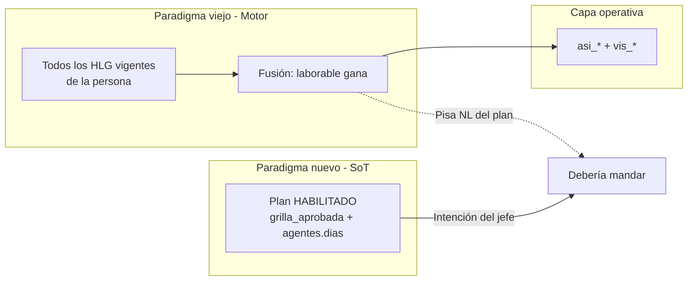

# Handoff — Materialización: Foto del plan vs fusión multi-HLG

**Fecha:** 29 de mayo de 2026  
**Estado:** **Arquitectura modelo final en BD y functions** — limpieza quirúrgica `asi_*` completada (0 legacy). QA §4.2 plan maestro y merge a `main` pendientes.  
**Épica:** Multi-HLG Opción A — `feat/epic-multi-hlg-fase1-execution`  
**Plan maestro:** [`PLAN_GRILLA_MULTI_HLG_V2.md`](./PLAN_GRILLA_MULTI_HLG_V2.md)  
**Audiencia:** RRHH, Jefe de servicio, desarrollo backend, QA

### Estado operativo (actualización RRHH)

| Agente | Opción 1 — HLG | Validación visual (post-limpieza) |
|--------|----------------|-----------------------------------|
| **CHAPARRO** | Una sola HLG vigente (zombie `hlg_01KR3HZ1XN` cerrado/acotado) | VER plan ≈ Calendario licencias: patrón **NL** lun–mié, **08:00–14:00** jue–vie, **F** fines de semana |
| **MOSTO** | Una sola HLG vigente (extras cerrados) | VER plan ≈ Calendario: **08:00–14:00** en laborables, **F** en fines de semana |
| **LOKITO** | Sin cambio requerido en incidente | Ya estaba alineado en auditoría previa |

Pendiente formalizar con script: `node scripts/audit-vis-junio-2026.mjs` (plan = `vis_*` = `asi_*` en verde). **Motor Opción A + Plan > HLG por `gdt`** implementado; fusión global **eliminada** en BD (strip 29/05).

---

## Cierre — Limpieza quirúrgica (29/05/2026)

Secuencia ejecutada en datos vivos (pre-prod):

| Paso | Acción | Resultado |
|------|--------|-----------|
| A | Deploy `fc54e8b` — gates E11, overrides E2, sin fallback `capa_teorica` | `firebase deploy --only functions` ✅ |
| B | Materializar mayo scoped Sala | `materializar-grupo-mes.mjs --gdt=gdt_01KQA6QCA8TDQK9YBTHKYA4R2V --periodo=2026-05` → **93** procesados |
| C | Strip campo legacy | `strip-capa-teorica-legacy.mjs --apply` → **244** docs; dry-run post = **0** con `capa_teorica` raíz |

**Verificación piloto post-strip:**

| Agente | Mayo 2026 | Junio 2026 |
|--------|-----------|------------|
| MOSTO | `asi_dias_capa_grupo` **31/31**, `vis` 31 celdas | **30/30** turnos + capa scoped ✅ |
| CHAPARRO | **31/31** capa scoped | Validación visual junio previa ✅ |

**Modelo final:** lectura/escritura solo vía `capa_teorica_por_grupo[gdt]` y `vis_*` con `_gdt_` en ID. Sin “inventar” capa cross-grupo.

---

## Resumen ejecutivo

Tras revertir y re-aprobar el plan piloto de **junio 2026**, la **grilla aprobada** (VER plan) muestra la intención correcta del jefe (francos, no laborables, horarios). El **calendario de licencias** y la capa operativa (`asi_*`, `vis_*`) **no reflejan esa intención** en agentes de régimen **fijo** (CHAPARRO en particular).

**Diagnóstico en una frase:** *Técnicamente el sistema hizo lo programado; funcionalmente rompió la intención del usuario.*

La trazabilidad entre colecciones funciona: el error es **procedente**, no opaco. No es un fallo del frontend, ni de `vis_*` “sordo”, ni de la lectura de la grilla en UI.

---

## Piloto de referencia

| Campo | Valor |
|-------|--------|
| **Plan** | `plt_01KSSPY2H5EZA925FQP4S1G2XW` |
| **Grupo** | Sala Internación 1 — `gdt_01KQA6QCA8TDQK9YBTHKYA4R2V` |
| **Período** | `2026-06` |
| **Estado** | `HABILITADO` |
| **Materialización** | `materializacion_fallida: null` (corrida OK) |
| **Última sync `vis_*`** | ~2026-05-29T17:59:12Z (post re-aprobar) |

### Agentes del piloto

| Agente | `persona_id` | Régimen en plan | Rol en el incidente |
|--------|----------------|-----------------|---------------------|
| LOKITO, LOKO | `per_01KQQJA5Q1VKBTJ74RHQ0HSHSB` | planificado | **Sin desvío** plan = `vis_*` = `asi_*` |
| CHAPARRO, NOELIA ANDREA | `per_01KR3HD24AMJ6YX3N7B3GPAZJ4` | fijo | **13 días** plan `no_laborable` → `laborable` en `asi_*`/`vis_*` |
| MOSTO, JORGE ANTONIO | `per_01KQN9WXFXF69Z9DCT5YNJ3TFZ` | fijo | Tipos alineados; `regimen_horario_id` en `asi_*` puede ser del HLG “ganador”, no del plan |

---

## Causa raíz — Choque de paradigmas

### Paradigma viejo: fusión multi-HLG

En hospitales un agente puede tener **varios cargos vigentes** (varios `historial_laboral_grupos`). El motor de materialización (`rdaTurnoTeoricoWorker`) fue diseñado para:

1. Obtener **todos los HLG vigentes** de la persona en el mes.
2. Resolver el turno teórico por régimen para cada HLG.
3. **Fusionar** con regla defensiva: *si algún contexto marca el día como `laborable` o `guardia`, ese día gana sobre `no_laborable` / `franco`* en el contexto previo.

Eso tenía sentido cuando **no existía** una foto mensual firmada por servicio.

### Paradigma nuevo: foto teórica del plan (PR 1)

Con la épica de **grilla aprobada**:

- El plan mensual **HABILITADO** es la verdad histórica para **VER plan**.
- La foto en `plan.agentes[].dias` y `grilla_aprobada` expresa la decisión del jefe (francos, NL, turnos).
- El acto de **Aprobar / Rehabilitar** debe materializar esa verdad en `asi_*` y `vis_*`.

### El conflicto

Al aprobar el plan, el flujo:

1. Persiste / construye la **foto** y `grilla_aprobada` (correcto).
2. Ejecuta **materialización global por persona** (`materializarGrupoMes` → `materializarTurnoMesBatch`).
3. Esa materialización **sigue fusionando todos los HLG vigentes de la persona**, incluidos HLGs de **otros grupos** o regímenes obsoletos no cerrados en RRHH.
4. Un HLG “zombie” con LMX–Vie **laborable** **pisa** los `no_laborable` que el plan acaba de consagrar (CHAPARRO).



---

## Lo que NO es el problema (descartado con evidencia)

| Hipótesis | Veredicto |
|-----------|-----------|
| El frontend / calendario “no lee bien” | **Descartado** — lee `vis_*` (+ enriquecimiento local con `grilla_aprobada` cuando falta horario). |
| `vis_*` desincronizado de `asi_*` | **Descartado** — `tipo_dia` idéntico en los 30 días por agente (`vis` = `asi` 30/30). |
| `listarVistaGrillaMesPorGrupo` falla | **Descartado** — responde; el contenido es el issue. |
| La foto del plan está mal | **Descartado** para CHAPARRO — plan y `grilla_aprobada` tienen **14 `no_laborable`**, coherente con régimen `CFG_REG_HOR_1779795758665`. |
| Solo un bug de colores UI | **Secundario** — el problema de fondo es **semántica de `tipo_dia`**. |

---

## Evidencia forense (Firestore, junio 2026)

### Conteo `tipo_dia` — CHAPARRO

| Fuente | no_laborable | franco | laborable |
|--------|--------------|--------|-----------|
| **Plan / grilla_aprobada** | **14** | 8 | 8 |
| **`vis_*` / `asi_*`** | **1** (día 15 feriado) | 8 | **21** |

**13 fechas** con plan `no_laborable` y `asi_*`/`vis_*` `laborable`:  
`01, 02, 03, 08, 09, 10, 16, 17, 22, 23, 24, 29, 30`.

### Patrón en `asi_*` en días erróneos

- `tipo_dia: "laborable"`, `origen: "regimen_fijo"`.
- `regimen_horario_id: CFG_REG_HOR_1779787599967` (**no** el del plan `CFG_REG_HOR_1779795758665`).
- `segmentos: []`, sin `ingreso`/`egreso` en capa.
- En `vis_*`: mismo `tipo_dia` pero **`rda_ingreso` / `rda_egreso` = 08:00–14:00** (resumen operativo).

### Regímenes en conflicto (CHAPARRO)

| ID régimen | Nombre (aprox.) | Lun–Mié | Jue–Vie | Sáb–Dom |
|------------|----------------|---------|---------|---------|
| **1779795758665** (plan) | 12hs-8a14-JVmenosNoHabiles | **no_laborable** | laborable 08–14 | franco |
| **1779787599967** (HLG zombie) | 30hs de8a14 LMXJV menos No Habiles | **laborable** | laborable | franco |

### LOKITO y MOSTO

- **LOKITO:** 30/30 alineado plan = `vis_*` = `asi_*`; feriados quedan `laborable` + `es_feriado` en capa (otro matiz menor).
- **MOSTO:** 30/30 alineado en tipos; varios HLG vigentes; `regimen_horario_id` en `asi_*` puede no coincidir con `plan.agentes[].regimen_horario_id`.

### Script de auditoría reproducible

```bash
node scripts/audit-vis-junio-2026.mjs
# Opcional: PLAN_ID=plt_01KSSPY2H5EZA925FQP4S1G2XW
```

Requiere `.env.v2.local` con `GOOGLE_APPLICATION_CREDENTIALS`.

---

## Datos afectados — HLGs “zombie” (limpieza táctica, Opción 1)

Acción para **RRHH / datos laborales**: cerrar o acotar vigencia (`fecha_fin`) de HLGs que **ya no deben participar** en la materialización del servicio actual.

### CHAPARRO — prioridad alta

| HLG | Régimen | Grupo | Vigencia | Acción recomendada |
|-----|---------|-------|----------|-------------------|
| **`hlg_01KR3HZ1XN`** | `CFG_REG_HOR_1779787599967` | Otro (`…WEQQXG`) | desde `2022-06-01`, sin fin | **Cerrar** o acotar `fecha_fin` si el cargo ya no existe. **Causante principal** del pisado de NL. |
| **`hlg_01KS50551P`** | `CFG_REG_HOR_1779795758665` | Sala Internación (`…YA4R2V`) | desde `2026-01-01` | **Mantener** — es el régimen del plan. |

### MOSTO — revisión recomendada

| HLG | Régimen | Grupo | Notas |
|-----|---------|-------|--------|
| **`hlg_01KQPW6YH9`** | `CFG_REG_HOR_1779795708612` (planificado) | Otro (`…WEQQXG`) | Vigente en junio; puede ganar fusión y estampar régimen ajeno al plan. |
| **`hlg_01KSMMYTHP`** | `CFG_REG_HOR_1779787599967` (fijo) | Sala Internación | Coherente con plan de junio; **mantener** si es el cargo actual. |
| `hlg_01KQYMY313` | `CFG_REG_HOR_1779795758665` | Otro | `fecha_fin` 2026-05-31 — no vigente en junio; bajo riesgo. |

### LOKITO

| HLG | Notas |
|-----|--------|
| `hlg_01KQQJDA…` (planificado, Internación) | Sin desvío detectado; revisión opcional. |

### Después de la limpieza (piloto)

1. **Rehabilitar** o re-aprobar plan `plt_01KSSPY2H5EZA925FQP4S1G2XW`.
2. Re-ejecutar auditoría (`audit-vis-junio-2026.mjs`).
3. Validar calendario junio: CHAPARRO con **NL** lun–mié, **08:00–14:00** jue–vie, **F** fines de semana según plan.

---

## Regla objetivo del motor (evolución estratégica, Opción 2)

**Alcance:** materialización disparada por **Aprobar / Rehabilitar** un **plan mensual** (`planes_turno_servicio` → `HABILITADO`) para un **`grupo_id` + `periodo`**.

### Principio

> **La foto teórica del plan es sagrada** frente a HLGs de otros grupos o vigencias obsoletas.  
> El sistema debe asumir datos sucios y defender la intención del usuario.

### Reglas (orden de prioridad)

1. **Ámbito:** Solo agentes listados en `plan.agentes` y días del `plan.periodo`.
2. **Tipo de día — Plan > HLG ajeno al plan:**  
   Si `plan.agentes[].dias[fecha].tipo_dia` es `no_laborable` o `franco`, **ningún otro HLG** (otro grupo, otro régimen) puede promover ese día a `laborable`/`guardia` en esa materialización.
3. **Régimen fijo — excepción ya acordada:** El plan solo puede imponer **`franco` explícito** sobre el régimen; no reescribir todo el patrón del régimen (los NL del régimen siguen saliendo del motor de régimen cuando el plan no define el día).
4. **Inmunidad reforzada (propuesta):** En el path de aprobación, para días presentes en la foto del plan, **`tipo_dia` de la foto gana** sobre la fusión multi-HLG (salvo multicargo explícito futuro).
5. **`regimen_horario_id` en `asi_*`:** Debe ser el de `plan.agentes[].regimen_horario_id`, no el del HLG que ganó una fusión irrelevante.
6. **Multicargo real (futuro):** Dos cargos legítimos el mismo día en **distintos servicios** no deben colapsarse en la misma celda de `vis_*` de un solo grupo; requiere producto aparte (alerta, segunda fila, `vis_*` por grupo). **Fuera de alcance** de este fix mínimo.

### Regla vieja que debe dejar de aplicar en este path

> ~~“Si en cualquier HLG vigente el día es laborable, el día entero es laborable.”~~  
> Solo puede aplicar a **re-materialización global** o contextos sin plan mensual firmado — no al aprobar un plan de servicio.

### Archivos de referencia (implementación futura)

| Área | Archivo |
|------|---------|
| Materialización | `functions/modules/asistencia/rdaTurnoTeoricoWorker.js` (`materializarGrupoMes`, `materializarTurnoMesBatch`, fusión HLG ~L466–486) |
| Aprobar plan | `functions/modules/asistencia/planesTurnoServicio.js` (`aprobarPlanTurnoServicio`) |
| Foto / snapshot | `functions/modules/asistencia/planGrillaAprobadaBuilder.js`, `planEnriquecimientoDias.js` |

---

## Criterio de cierre (DoD) — Épica grilla / plan aprobado

La épica **no** se considera cerrada arquitectónicamente con solo limpieza RRHH. DoD completo:

### A. Datos (piloto desbloqueado)

- [x] HLGs zombie de **CHAPARRO** y **MOSTO** — una sola HLG vigente cada uno (RRHH, post 29/05).
- [ ] Auditoría `audit-vis-junio-2026.mjs` en verde para los 3 agentes (confirmación Firestore).
- [x] Validación visual piloto: VER plan vs Calendario licencias junio — CHAPARRO y MOSTO alineados.
- [ ] CHAPARRO: **14 NL**, **8 franco**, **8 laborable** alineados en **plan**, **`vis_*`** y **`asi_*`** (cerrar con script).

### B. Motor (blindaje)

- [x] Implementada **Regla objetivo** (Plan > HLG) en materialización scoped por `gdt` (`rdaTurnoTeoricoWorker`).
- [x] Deploy de functions (gates E11, overrides E2, `fc54e8b`).
- [x] Strip `capa_teorica` raíz — **244** `asi_*`; **0** legacy post-apply.
- [ ] Repetir auditoría `audit-vis-junio-2026.mjs` post-strip (confirmación formal Firestore).

### C. Validación UI (muestra)

- [ ] VER plan = calendario licencias (misma semántica F / NL / horarios) para CHAPARRO y MOSTO en junio.
- [ ] LOKITO sin regresión.
- [ ] Matriz del handoff 28/05 (plan vs `asi_*` vs `vis_*`) actualizada con evidencia.

### D. Documentación

- [ ] Este handoff referenciado en `PENDIENTES_PROXIMA_SESION.md`.
- [ ] RFC o addendum a `RFC_GRILLA_APROBADA_PLAN_TURNO_V2.md` con prioridad Plan > HLG.

---

## Plan de ataque acordado (dos fases)

| Fase | Tipo | Acción |
|------|------|--------|
| **1 — Táctica** | Operativa (RRHH) | Cerrar HLGs zombie; rehabilitar plan junio; validar UI. |
| **2 — Estratégica** | Backend | **✅ Cerrada** — Opción A scoped + Plan > HLG por `gdt` + strip legacy (29/05). |

**Siguiente hito:** Paso 4 del plan maestro — QA §4.2 residual + merge `feat/epic-multi-hlg-fase1-execution` → `main`.

---

## Mensaje para stakeholders

- **Al jefe / RRHH:** El plan que aprobaste está bien guardado en “VER plan”. Lo que ve el calendario de licencias sale de otra capa que hoy mezcla cargos viejos no cerrados. Hay que limpiar historial laboral y luego blindar el motor.
- **A desarrollo:** No invertir más en parches de UI que enmascaren `vis_*` incorrecto; el fix es prioridad de materialización + datos.

---

## Referencias

- Handoff grilla aprobada: [`HANDOFF_SESION_2026-05-28_TURNOS_GRILLA_APROBADA.md`](./HANDOFF_SESION_2026-05-28_TURNOS_GRILLA_APROBADA.md)
- RFC snapshot: [`RFC_GRILLA_APROBADA_PLAN_TURNO_V2.md`](./RFC_GRILLA_APROBADA_PLAN_TURNO_V2.md)
- Índice sesión: [`PENDIENTES_PROXIMA_SESION.md`](./PENDIENTES_PROXIMA_SESION.md)

---

*Documento generado a partir de auditoría forense Firestore (29/05/2026). Actualizado con cierre limpieza quirúrgica `asi_*` (29/05/2026).*
