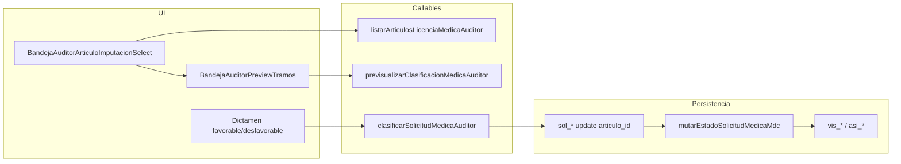

# Handoff de sesión — 2 de julio de 2026 (PAUSA épica 1919 — bandeja auditor médica P0/P2/P3)

**Proyecto:** `portal-hospital-v2`  
**Rama activa:** `feat/1919-p4-visor-auditor`  
**HEAD remoto:** `92cb14e` — `feat(1919): visor auditor P0, preview tramos P3 y selector artículo P2`  
**Firebase piloto:** `portal-hospital-v2` · región `southamerica-east1`  
**Hosting:** https://portal-hospital-v2.web.app  
**Índice brechas / UAT:** [`BRECHAS_FUNCIONALES_BANDEJA_AUDITOR_MEDICA_P4_V2.md`](./BRECHAS_FUNCIONALES_BANDEJA_AUDITOR_MEDICA_P4_V2.md)  
**Acta motor P4:** [`ACTA_RRHH_EPICA_1919_P4_V2.md`](./ACTA_RRHH_EPICA_1919_P4_V2.md)  
**Changelog épica:** [`CHANGELOG_1919.md`](./CHANGELOG_1919.md)

---

## 1. Estado al pausar (decisión explícita)

| Tema | Estado |
|------|--------|
| **Implementación código** | **PAUSADA** — no abrir nuevas features en bandeja auditor hasta cerrar UAT §6.1 y §6.4 |
| **Git** | Rama `feat/1919-p4-visor-auditor` sincronizada con `origin` @ `92cb14e` |
| **Deploy piloto (última oleada UI)** | Hosting + `listarArticulosLicenciaMedicaAuditor` (create) + `previsualizarClasificacionMedicaAuditor` (update) |
| **Merge a `master`** | **Pendiente** — rama incluye línea P4 completa (motor + P4.4 largas + bandeja + oleada visor); `master` @ `7a8997c` (P5 merge) |
| **Cierre formal épica 1919 bandeja** | Pendiente firma RRHH + UAT piloto usuario sobre caso canónico Caja Negra |

### Punto exacto de continuación (retomar aquí)

1. **UAT piloto** — completar checklists §6.1 (visor certificado) y §6.4 (cambio artículo) en [`BRECHAS_*`](./BRECHAS_FUNCIONALES_BANDEJA_AUDITOR_MEDICA_P4_V2.md).
2. Caso de referencia: **`sol_01KWHASRGSX2W154CEGSW57R1Y`** (17 d corridos, sin `articulo_id` en alta, titular DNI 28914247).
3. URL directa bandeja: `/portal/medico/solicitudes?sol_id=sol_01KWHASRGSX2W154CEGSW57R1Y`.
4. Si UAT detecta **residuos `vis_*`** al reclasificar solicitudes **ya consolidadas**, abrir iteración correctiva: flujo atómico `REVERTIR_PROYECCION` + `CONSOLIDAR_APROBADO` en `mutarEstadoSolicitudMedicaMdc.js` (acordado: no implementar hasta evidencia UAT).
5. Tras UAT verde: PR/merge `feat/1919-p4-visor-auditor` → `master` (estrategia release con P4.4 ya en rama).

### Lo que NO hacer al retomar

- No commitear `scripts/inspect-solicitud.mjs` salvo decisión explícita (herramienta back-office local).
- No redeploy masivo de functions sin necesidad; usar `--only` para callables tocadas.
- No bloquear clasificación sin selector: el UI ya envía `articulo_id`; el backend mantiene auto-resolve Art. 14 solo si faltan IDs.

---

## 2. Alcance entregado en esta oleada (Fase 4 bandeja — herramienta auditor)

### P0 — Visor certificado (commit `a3f00b5`)

| Capa | Entregable |
|------|------------|
| Backend | `solicitudBandejaAuditorCertificados.js` — DTO `certificado_adjuntos[]`, `tiene_certificado` en listado |
| UI | `web/src/components/medico/VisorPDF.jsx` (Storage v2 + `getDownloadURL`) |
| Integración | `BandejaAuditorSolicitudDetalle.jsx` — sección certificado, abrir en pestaña |

### P3 — Preview tramos / consumo (commit `92cb14e`)

| Capa | Entregable |
|------|------------|
| Core | `previsualizarClasificacionMedicaAuditorCore.js` — solo lectura, `modo_preview` corta/larga |
| Callable | `previsualizarClasificacionMedicaAuditor` |
| UI | `BandejaAuditorPreviewTramos.jsx` |
| Test | `functions/test/previsualizarClasificacionMedicaAuditorCore.test.js` |

### P2 — Imputación artículo por auditor (commit `92cb14e`)

| Capa | Entregable |
|------|------------|
| Core | `listarArticulosLicenciaMedicaAuditorCore.js` — catálogo LM publicado |
| Callable | `listarArticulosLicenciaMedicaAuditor` |
| UI | `BandejaAuditorArticuloImputacionSelect.jsx`, `useArticulosLicenciaMedicaAuditor.js` |
| Clasificar | `BandejaAuditorSolicitudes.jsx` pasa `articulo_id` / `version_id_aplicada` a `callClasificarSolicitudMedicaAuditor` |
| MDC | Sin cambio estructural: `mutarEstadoSolicitudMedicaMdc` lee `sol_*` **post-update** de clasificación |

### Fixes / soporte previos en la misma rama (antes de P0)

| Commit | Contenido |
|--------|-----------|
| `a83736e` | Bandeja visible para avisos con fechas estimadas (`resolverRangoYmdEfectivoAvisoMedico`) |
| `378de8d` | Doc brechas + `resolverArticuloLicenciaMedicaClasificacionCore` + auto-resolve Art. 14 en favorable Caja Negra |

---

## 3. Arquitectura de decisión (resumen técnico)



**Regla producto:** imputar **licencia larga** (Art. 16/19) sin CIE-10/causal en aviso Caja Negra pura → favorable falla (`CIE10_REQUERIDO` / `CAUSAL_LARGA_REQUERIDA`); la UI advierte en el selector.

---

## 4. Deploy piloto (evidencia 2026-07-02)

| Recurso | Acción |
|---------|--------|
| **Hosting** | Release con bundle post-`92cb14e` (selector + preview + visor) |
| **Function** `listarArticulosLicenciaMedicaAuditor` | Create `southamerica-east1` |
| **Function** `previsualizarClasificacionMedicaAuditor` | Update `southamerica-east1` |

**Nota operativa:** el primer `firebase deploy` falló por `FUNCTIONS_DISCOVERY_TIMEOUT` (10 s). Deploy exitoso con `FUNCTIONS_DISCOVERY_TIMEOUT=120`. Preferir `npm run firebase:deploy:functions` desde raíz (timeout 60 s) o exportar 120 s si reaparece.

**Callables ya en piloto de commits anteriores (no redeploy en oleada final):** `listarSolicitudesBandejaAuditorMedica`, `clasificarSolicitudMedicaAuditor` (con auto-resolve / `articulo_id`).

---

## 5. Inventario de archivos (oleada P0+P2+P3)

### Web

- `web/src/components/medico/VisorPDF.jsx`
- `web/src/features/solicitudes/BandejaAuditorArticuloImputacionSelect.jsx`
- `web/src/features/solicitudes/BandejaAuditorPreviewTramos.jsx`
- `web/src/features/solicitudes/useArticulosLicenciaMedicaAuditor.js`
- `web/src/features/solicitudes/BandejaAuditorSolicitudDetalle.jsx`
- `web/src/pages/BandejaAuditorSolicitudes.jsx`
- `web/src/services/callables.js`

### Functions

- `functions/modules/shared/solicitudBandejaAuditorCertificados.js`
- `functions/modules/shared/solicitudBandejaAuditorMedicaCore.js`
- `functions/modules/shared/listarArticulosLicenciaMedicaAuditorCore.js`
- `functions/modules/shared/previsualizarClasificacionMedicaAuditorCore.js`
- `functions/modules/shared/clasificarSolicitudMedicaAuditorCore.js`
- `functions/modules/shared/resolverArticuloLicenciaMedicaClasificacionCore.js`
- `functions/onCall/solicitudes/listarArticulosLicenciaMedicaAuditor.js`
- `functions/onCall/solicitudes/previsualizarClasificacionMedicaAuditor.js`
- `functions/index.js`
- `functions/test/solicitudBandejaAuditorMedicaCore.test.js`
- `functions/test/previsualizarClasificacionMedicaAuditorCore.test.js`

### Documentación

- `docs/v2/BRECHAS_FUNCIONALES_BANDEJA_AUDITOR_MEDICA_P4_V2.md`
- `docs/v2/HANDOFF_SESION_2026-07-02_PAUSA_BANDEJA_AUDITOR_P4_V2.md` (este archivo)
- `docs/v2/ACTA_RRHH_EPICA_1919_P4_V2.md` (actualizado en pausa)
- `docs/v2/CHANGELOG_1919.md` (entrada pausa)

### Fuera del repo (local)

- `scripts/inspect-solicitud.mjs` — **untracked** — lectura `sol_*` para soporte; no incluir en commits por defecto.

---

## 6. Brechas abiertas (post-pausa)

| ID | Ítem | Prioridad |
|----|------|-----------|
| **P1** | Ficha `ingreso_medico` completa en bandeja (tipo ingreso, contacto) | Alta |
| **P2b** | Edición `fecha_desde` / `fecha_hasta` en clasificación | Media |
| **P4** | Historial LM aprobadas del titular (año calendario) | Media |
| **P5** | Señales §5.8 (countdown incompleta, panel RRHH) | Baja |
| **UAT** | §6.1 visor, §6.4 cambio artículo + grilla/`asi_*` | **Bloqueante cierre** |
| **MDC** | Reversión atómica al cambiar artículo en casos ya consolidados | Solo si UAT lo exige |

---

## 7. Cómo retomar en otra PC

```bash
cd portal-hospital-v2
git fetch origin
git checkout feat/1919-p4-visor-auditor
git pull
# Verificar HEAD = 92cb14e o posterior en misma rama
cd web && npm install && npm run build
```

**Smokes útiles:** `scripts/smoke/med-*.mjs` (motor, no sustituyen UAT bandeja).

**Tests rápidos:**

```bash
cd functions
node --test test/previsualizarClasificacionMedicaAuditorCore.test.js test/solicitudBandejaAuditorMedicaCore.test.js
```

---

## 8. Commits de referencia (rama visor, orden cronológico reciente)

| SHA | Mensaje |
|-----|---------|
| `92cb14e` | feat(1919): visor auditor P0, preview tramos P3 y selector artículo P2 |
| `a3f00b5` | feat(1919): visor certificado bandeja auditor P0 + DTO adjuntos |
| `cb4f921` | docs(1919): enlazar brechas bandeja auditor en acta P4 |
| `378de8d` | feat(docs/1919): documentar brechas auditoría médica + fix clasificación |
| `a83736e` | fix(1919): bandeja auditor usa fechas estimadas aviso médico |

(Línea completa P4 + P4.4: ver `git log master..feat/1919-p4-visor-auditor`.)

---

## 9. Changelog sesión (humano)

- Confirmado diseño: auditor elige artículo; MDC consume `sol_*` post-clasificación (sin duplicar lógica en payload MDC).
- Preview dinámico corta ↔ larga antes de dictamen.
- Deploy piloto realizado; **UAT usuario pendiente** antes de cierre formal épica.
- **Pausa global** de implementación bandeja auditor hasta validación smoke/UAT.
