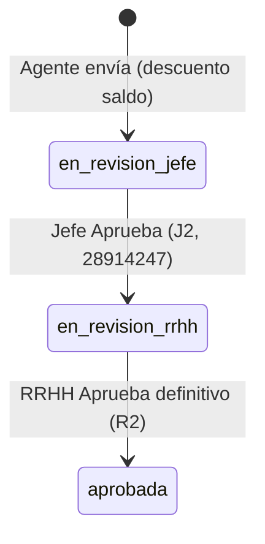

# Handoff — Pausa ticketera Fase 2–4 (dinámica, bandeja jefe, bandeja RRHH)

**Fecha cierre:** 2026-05-19  
**Rama:** `feature/ticketera-puente-campos-config`  
**Firebase:** `portal-hospital-v2` · Functions `southamerica-east1` · Firestore `southamerica-east1`  
**Piloto habitual:** DNI **28914247** · `per_01KQN9WXFXF69Z9DCT5YNJ3TFZ`

> **Retomar desde** [`HANDOFF_SESION_2026-05-21_BLOQUE_A_Y_CONTINUIDAD.md`](./HANDOFF_SESION_2026-05-21_BLOQUE_A_Y_CONTINUIDAD.md) (prioridades) → Oleada A [`HANDOFF_SESION_2026-05-19_AUTORIZACION_TICKETERA.md`](./HANDOFF_SESION_2026-05-19_AUTORIZACION_TICKETERA.md).

## 0. Continuidad post-taller (2026-05-19 tarde) y Bloque A (2026-05-21)

| Fecha | Documento |
|-------|-----------|
| 2026-05-21 | [`TICKETERA_EVIDENCIA_2026-05-21_CREATE_PATRON_B.md`](./TICKETERA_EVIDENCIA_2026-05-21_CREATE_PATRON_B.md) — fix Rules/Zod create; `sol_01KS4ZG2…`, `sol_01KS50G2…` |
| 2026-05-21 | [`HANDOFF_SESION_2026-05-21_BLOQUE_A_Y_CONTINUIDAD.md`](./HANDOFF_SESION_2026-05-21_BLOQUE_A_Y_CONTINUIDAD.md) |

| Documento | Rol |
|-----------|-----|
| [`RFC_TICKETERA_AUTORIZACION_TOMA_CONOCIMIENTO_V2.md`](./RFC_TICKETERA_AUTORIZACION_TOMA_CONOCIMIENTO_V2.md) | Contrato TO-BE |
| [`PLAN_IMPLEMENTACION_RFC_AUTORIZACION_TICKETERA_V2.md`](./PLAN_IMPLEMENTACION_RFC_AUTORIZACION_TICKETERA_V2.md) | Oleadas A/B/C |
| [`HANDOFF_SESION_2026-05-19_AUTORIZACION_TICKETERA.md`](./HANDOFF_SESION_2026-05-19_AUTORIZACION_TICKETERA.md) | **Entrada única** para retomar |

**Índice de evidencia:**  
[`PLAN_TICKETERA_V2.md`](./PLAN_TICKETERA_V2.md) · F2 [`TICKETERA_FASE2_EVIDENCIA_PILOTO.md`](./TICKETERA_FASE2_EVIDENCIA_PILOTO.md) · F3 [`TICKETERA_FASE3_EVIDENCIA_PILOTO.md`](./TICKETERA_FASE3_EVIDENCIA_PILOTO.md) · F4 [`TICKETERA_FASE4_EVIDENCIA_PILOTO.md`](./TICKETERA_FASE4_EVIDENCIA_PILOTO.md)

---

## 1. Resumen ejecutivo (qué quedó hecho)

| Fase | Entrega | Estado piloto |
|------|---------|----------------|
| **F2** | Ticketera shell, listado performante, preview Patrón B, fechas impuestas | OK 64-A/64-B (varias `sol_*` sept/ago 2026) |
| **F3b** | Bandeja jefe: listar + aprobar/rechazar + reverso saldo | **J2 OK**, **J3 OK** |
| **F4** | Bandeja RRHH: listar + aprobar definitivo / rechazar + reverso | **R2 OK** (toast definitivo) |

**Hosting web:** cambios en `web/` — en prod hace falta `firebase deploy --only hosting` (o pipeline habitual) para ver rutas nuevas fuera de `localhost:5173`.

---

## 2. Rutas y callables (referencia rápida)

### UI

| Ruta | Pantalla |
|------|----------|
| `/portal/solicitudes` | Hub ticketera |
| `/portal/solicitudes/patron-b` | Alta + preview 64-A / 64-B |
| `/portal/jefe/solicitudes` | Bandeja jefe |
| `/portal/rrhh/solicitudes-articulo` | Bandeja RRHH (RoleGuard) |

### Functions desplegadas en sesión (además de las de F2)

| Callable | Rol |
|----------|-----|
| `listarSolicitudesBandejaJefe` | Jefe / RRHH bypass listado jefe |
| `resolverDecisionJefeSolicitud` | Aprobar → `cfg_esa_en_revision_rrhh` · Rechazar → `cfg_esa_rechazada` + reverso |
| `listarSolicitudesBandejaRrhh` | Solo RRHH laboral |
| `resolverDecisionRrhhSolicitud` | Aprobar → `cfg_esa_aprobada` · Rechazar → `cfg_esa_rechazada` + reverso |

**Shared:** `solicitudPatronBReversoSaldo.js` (reverso bolsa usado por jefe y RRHH al rechazar).

**RFC:** [`RFC_TICKETERA_FASE2_DINAMICA_V2.md`](./RFC_TICKETERA_FASE2_DINAMICA_V2.md) · [`RFC_TICKETERA_FASE3_BANDEJA_JEFE_MVP_V2.md`](./RFC_TICKETERA_FASE3_BANDEJA_JEFE_MVP_V2.md) · [`RFC_TICKETERA_FASE4_BANDEJA_RRHH_MVP_V2.md`](./RFC_TICKETERA_FASE4_BANDEJA_RRHH_MVP_V2.md)

---

## 3. Cadena piloto documentada (`sol_01KS0896610NA49M9G6VABMMEK`)

Artículo **64-A** · titular `per_01KR3HD24AMJ6YX3N7B3GPAZJ4` · fecha **2026-05-19** · 1 día.



| Paso | Actor | `estado_solicitud_id` | Campos auditoría |
|------|--------|------------------------|------------------|
| Alta | Agente (titular) | `cfg_esa_en_revision_jefe` | `motor_descuento_aplicado`, `debito_origen` |
| J2 | DNI 28914247 (bandeja jefe) | `cfg_esa_en_revision_rrhh` | `jefe_revision_*` |
| R2 | DNI 28914247 (bandeja RRHH) | `cfg_esa_aprobada` (esperado) | `rrhh_revision_*` |

**Otro caso J3:** 64-B rechazada en bandeja jefe · `motor_reverso_jefe_aplicado` · saldos OK en BD (sin `sol_*` archivado en doc).

---

## 4. ¿Hubo «dos aprobaciones»? (pregunta abierta — próxima sesión)

**Sí, en el MVP actual hay dos actos de «Aprobar» en UI**, con significados distintos:

| # | Pantalla | Botón | Efecto de negocio (implementado) |
|---|----------|-------|----------------------------------|
| 1 | Bandeja jefe | Aprobar → RRHH | **Autorización jerárquica** — no cierra el trámite; deriva a RRHH |
| 2 | Bandeja RRHH | Aprobar (definitivo) | **Cierre favorable** — `cfg_esa_aprobada`; mantiene consumo de saldo |

**No** son dos aprobaciones duplicadas del mismo rol: son **dos etapas** del catálogo `cfg_estado_solicitud_articulo` (`en_revision_jefe` → `en_revision_rrhh` → `aprobada`).

### Qué falta revisar con producto / reglamento (§ obligatorio próxima sesión)

1. **Flujo de autorizaciones** frente a [`CONCEPTO_TICKETERA_BANDEJA_DINAMICA_V2.md`](./CONCEPTO_TICKETERA_BANDEJA_DINAMICA_V2.md): ¿RRHH debe **aprobar** o solo **tomar conocimiento** (registro sin segunda validación sustantiva)?
2. **Toma de conocimiento:** si aplica, ¿estado intermedio distinto de `cfg_esa_aprobada`? ¿Evento en `eventos_ticket`? ¿UI distinta de «Aprobar definitivo»?
3. **Mismo operador RRHH como jefe:** en piloto 28914247 usó bypass HLg en bandeja jefe y luego bandeja RRHH — válido para QA, **no** representa segregación de funciones en producción.
4. **Mensajes UI:** «Solicitud aceptada … en revisión por jefe» (alta agente) vs «Derivada a RRHH» vs «Aprobada (definitiva)» — alinear nomenclatura con estados oficiales del catálogo.
5. **Burbujeo / médico / SLA:** siguen fuera de MVP; no confundir con las dos etapas actuales.

**Entregable sugerido próxima sesión:** mini-RFC «Autorización vs toma de conocimiento» + ajuste de estados/callables/UI si producto define un solo cierre RRHH.

---

## 5. Matrices de prueba (estado)

| Matriz | Archivo | Pendiente |
|--------|---------|-----------|
| 64-A slice | `TICKETERA_SLICE_64A_MATRIZ_PRUEBAS.md` | Cerrada |
| F3 jefe | `TICKETERA_SLICE_64A_MATRIZ_PRUEBAS_FASE3_JEFE.md` | J4–J6 opcionales |
| F4 RRHH | `TICKETERA_SLICE_64A_MATRIZ_PRUEBAS_FASE4_RRHH.md` | **R3** rechazo RRHH + reverso |

---

## 6. Próxima sesión — checklist

- [x] Reunión producto: autorizaciones vs toma de conocimiento → **RFC** (2026-05-19).
- [ ] Implementar **Oleada A** según [`PLAN_IMPLEMENTACION_RFC_AUTORIZACION_TICKETERA_V2.md`](./PLAN_IMPLEMENTACION_RFC_AUTORIZACION_TICKETERA_V2.md).
- [ ] Confirmar en Firestore `sol_01KS0896610NA49M9G6VABMMEK`: histórico MVP (`en_revision_rrhh` → `aprobada`).
- [ ] Matrices F3/F4: actualizar a TO-BE (R3 AS-IS obsoleto).
- [ ] `git pull` en otra PC — ver handoff autorización § 9.

---

## 7. Otra PC — clonar / continuar

```powershell
git fetch origin
git checkout feature/ticketera-puente-campos-config
git pull origin feature/ticketera-puente-campos-config
cd web
npm install
npm run dev
```

Variables: `.env` / credenciales Firebase V2 según README del repo (sin mezclar V1).

**Redeploy Functions (solo si el código local difiere del desplegado):**

```powershell
firebase deploy --only "functions:listarSolicitudesBandejaJefe,functions:resolverDecisionJefeSolicitud,functions:listarSolicitudesBandejaRrhh,functions:resolverDecisionRrhhSolicitud,functions:listarArticulosIngresoAgente,functions:previsualizarSolicitudPatronB"
```

---

## 8. IDs de artículos (piloto)

| Código | `articulo_id` |
|--------|----------------|
| 64-A | `art_01KRNK10V10CH7W5M2W6V558GS` |
| 64-B | `art_01KRYEX0JZY4Y8J1GY3Q9F8BJQ` |

---

*Fin handoff — implementación pausada aquí.*
