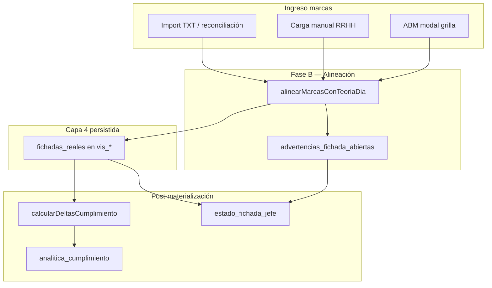

# Matriz fichada teórica ↔ real — V2

> **Estado:** SSoT para QA caso a caso (sesión 2026-06-12).  
> **Rama:** `feature/grilla-fase1-colision` · **Prod:** https://portal-hospital-v2.web.app  
> **Relación:** [`MODULO_FICHADAS_RELOJ_V2.md`](./MODULO_FICHADAS_RELOJ_V2.md) §14 · [`HANDOFF_SESION_2026-06-12_PAUSA_QA_FICHADAS_COLISION.md`](./HANDOFF_SESION_2026-06-12_PAUSA_QA_FICHADAS_COLISION.md) §3 · código: `shared/utils/calcularDeltasCumplimiento.js`, `fichadasAlineacionTeoria.js`, `grillaFichadaPresencia.js`, `grillaFichadaEstadoJefe.js`

---

## Cómo usar en la próxima sesión

1. Elegir un **escenario** de las tablas §2–§4.
2. Preparar datos en BD (agente piloto MOSTO · Sala Internación · junio 2026).
3. Validar **resultado motor** (`analitica_cumplimiento`, `advertencias_fichada_abiertas`, `estado_fichada_jefe`).
4. Validar **visual** (celda RRHH / jefe / modal).
5. Validar **acciones** permitidas y bloqueadas.
6. Marcar ✅/❌ en la columna «QA» al final de cada bloque (rellenar en sesión).

---

## Arquitectura — tres capas de validación



| Capa | Módulo | Cuándo corre |
|------|--------|--------------|
| **B** | `fichadasAlineacionTeoria.js` | Al importar, reconciliar o `guardarCapaFichadaDia` |
| **Presencia** | `grillaFichadaPresencia.js` | Lectura celda; contradicción básica |
| **Cumplimiento** | `calcularDeltasCumplimiento.js` | Tras `materializarTurnoTeoricoDia` / outbox |
| **Semáforo jefe** | `grillaFichadaEstadoJefe.js` | Materialización servidor → `estado_fichada_jefe` en `vis_*` |

---

## §1 — Alineación al guardar (Fase B)

| # | Escenario | Condición | Resultado BD | Advertencia | QA |
|---|-----------|-----------|--------------|-------------|-----|
| B1 | **Alineación nominal** | Marcas cerca de anclas `rda_ingreso` / `rda_egreso` (o segmentos) | `fichadas_reales` con pares ingreso–egreso | — | ⏳ |
| B2 | **Sin anclas teóricas** | Marcas pero celda sin horario teórico | `fichadas_reales` como `hora_hm` sueltas | — | ⏳ |
| B3 | **Nocturnidad D+1→D** | Marca en día siguiente, turno cruza medianoche | Rebucket al día D | — | ⏳ |
| B4 | **Nocturnidad ambigua** | Marca equidistante egreso D / ingreso D+1 (≤1 min) | Imputación al más cercano | `NOCTURNIDAD_AMBIGUA` | ⏳ |
| B5 | **Rol ambiguo** | Empate proximidad ingreso/egreso al asignar rol | Par armado | `NOCTURNIDAD_AMBIGUA` | ⏳ |
| B6 | **Capa 4 no materializada** | Sin campo `fichadas_reales` en `vis_*` | No se infiere ausente | — | ⏳ |

---

## §2 — Presencia y coherencia básica

| # | Escenario | Condición | Flag / código | Bandeja RRHH | Semáforo jefe | QA |
|---|-----------|-----------|---------------|--------------|---------------|-----|
| P1 | **Capa 4 vacía, laborable** | `fichadas_reales: []`, espera fichada | Presencia `ausente` | — | `ALERTA` (✕) si ventana cerrada y sin licencia | ⏳ |
| P2 | **Con registro** | `fichadas_reales.length > 0` | Presencia `presente` | — | Evalúa analítica | ⏳ |
| P3 | **Fichada en franco/NL** | Fichada + día sin expectativa | `evaluarContradiccionFichadaTeoria` | **Fichada vs teoría** | Sin ALERTA por ausencia | ⏳ |
| P4 | **Ausente en laborable** | Sin fichada + turno/`fichadas_esperadas` | Contradicción | **Fichada vs teoría** | `ALERTA` (✕) | ⏳ |
| P5 | **Fichada impar** | Marcas &lt; `fichadas_esperadas` (ej. solo ingreso con F:2) | `celdaTieneFichadaImpar` | **Fichada impar** | `ALERTA` (✕) | ⏳ |
| P6 | **Licencia justifica** | Licencia en celda + sin marcas o impar | — | Puede seguir contando | **No** ALERTA por ausencia/impar | ⏳ |
| P7 | **Revisado RRHH** | `resuelto_rrhh: true` tras ABM | Flag persistido | Sale de pendientes | `RRHH_RESUELTO` (◆) | ⏳ |
| P8 | **Advertencias abiertas** | `advertencias_fichada_abiertas.length > 0` | p. ej. `NOCTURNIDAD_AMBIGUA` | — | `RRHH_PENDIENTE` (!) | ⏳ |

---

## §3 — Cumplimiento horario (`analitica_cumplimiento`)

Parámetros habituales: tolerancia débito default **30 min**; ausencia automática = ingreso límite + **120 min**; fuera de turno = solape &lt; max(**30 min**, **25%** carga teórica).

| # | Escenario | Condición | Alertas | Celda RRHH (badges) | Celda RRHH (horario) | QA |
|---|-----------|-----------|---------|---------------------|----------------------|-----|
| C1 | **Coincidencia total** | Ingreso/egreso dentro de gracia; déficit ≤ tolerancia | ninguna | Sin badges | Real celeste si hay fichada | ⏳ |
| C2 | **Tardanza en gracia** | Ingreso después del nominal pero antes del límite con gracia | ninguna | Sin ▲ | Real celeste | ⏳ |
| C3 | **Tardanza punitiva** | Primera entrada &gt; `ingreso_limite_con_gracia` | `TARDANZA_PUNITIVA` | `▲ Nm` | Real celeste | ⏳ |
| C4 | **Salida anticipada** | Última salida &lt; `egreso_limite_con_gracia` | `SALIDA_ANTICIPADA` | `▼ Nm` | Real celeste | ⏳ |
| C5 | **Fuera de margen genérico** | Fuera de margen sin tardanza/salida calculable | `FUERA_MARGEN_HORARIO` | `!` | Real celeste | ⏳ |
| C6 | **Déficit contractual** | Déficit &gt; `tolerancia_debitohorario` (ej. 59m, tol. 30m) | `DEFICIT_HORARIO_GRAVE` | `-Nm` | Real celeste | ⏳ |
| C7 | **Déficit en tolerancia** | Déficit ≤ tolerancia | ninguna | Sin `-Nm` | Real celeste | ⏳ |
| C8 | **Marcas sueltas (`hora_hm`)** | Pares emparejados 2 en 2 (carga manual) | según C3–C7 | según motor | Real celeste | ⏳ |
| C9 | **Fuera de turno teórico** | Solape &lt; umbral — ej. teoría N 22:00–06:00, marcas 05:35–13:55 | `FICHADA_FUERA_TURNO_TEORICO` | Sin déficit absurdo | Real celeste; modal explica | ⏳ |
| C10 | **Ausencia automática** | Sin fichadas + laborable + pasó límite + 120 min | `AUSENCIA_AUTOMATICA` | — | Teórico verde (sin real) | ⏳ |

### Casos verificados en BD (scripts sesión 12/06)

| Día | Teoría | Real | Motor esperado | Estado doc |
|-----|--------|------|----------------|------------|
| 15 | M 06:00–14:00 | 06:00–13:01 | real 421m, déficit **59m** | ✅ recálculo script |
| 18 | N 22:00–06:00 | 05:35–13:55 | `fichada_fuera_turno_teorico`, sin déficit 480 | ✅ recálculo script |

---

## §4 — Visualización por rol (reglas UI actuales)

### Grilla — celda día

| Elemento | RRHH | Jefe | Sin capa fichada |
|----------|------|------|------------------|
| Horario principal | **Real celeste** (`sky-100`) si hay `fichadas_reales`; si no, teórico verde | Solo teórico | Teórico |
| Badge F:n | **Oculto** (2026-06-12) | — | — |
| Presencia P/A | Oculto si muestra horario real | — | — |
| Semáforo fichada | — | ✓ / ✕ / ! / ◆ (sin horas) | — |
| Analítica | `▲` / `▼` / `-Nm` (`DiaGrillaCelda`) | Misma analítica, copy abstracto | — |
| Teoría en celda | **Solo en modal** (desde 2026-06-12) | Tooltip + modal | Tooltip |

### Modal día

| Sección | RRHH | Jefe |
|---------|------|------|
| Turno teórico | Bloque índigo (turno, horario, fichadas esperadas) | Igual |
| Fichada real | Marcas crudas + auditoría técnica + cumplimiento numérico | Resumen abstracto, sin ABM |
| ABM fichada | Agregar / borrar / modificar (`guardarCapaFichadaDia`) | **No** |
| Carga manual | Enlace `?persona_id&fecha_ymd&gdt_id` | No |

### Bandeja auditoría diaria (solo RRHH)

| Tipo | Etiqueta | Prioridad |
|------|----------|-----------|
| `bloqueo_liquidacion` | Bloqueos liquidación | 0 |
| `fichada_impar` | Fichada impar | 1 |
| `fichada_inconsistente` | Fichadas vs teoría | 2 |
| `teoria_pendiente` | Teoría pendiente | 3 |

---

## §5 — Acciones autorizadas

| Escenario | RRHH | Jefe | Período cerrado |
|-----------|------|------|-----------------|
| Conforme (C1) | Ver; exportar matriz | Ver ✓ | Solo lectura |
| Tardanza / déficit (C3–C7) | ABM / carga manual / import | Ver badges; escalar | Bloqueo escritura |
| Fichada impar (P5) | Completar marcas; `resuelto_rrhh` | Ver ✕ | Bloqueo |
| Fuera de turno (C9) | Corregir teoría o fichada; no confiar en déficit auto | Ver modal; gestionar turno | Bloqueo fichadas |
| Contradicción franco (P3) | `BORRAR_CAPA` con motivo | Sin ABM fichada | Bloqueo |
| Ausente (P4, C10) | Carga manual / import / licencia | Ver ✕ | Bloqueo |
| NOCTURNIDAD_AMBIGUA (B4–B5) | Resolver manual; guardar | Ver ! | Bloqueo si cerrado |

**Callables escritura RRHH:** `guardarCapaFichadaDia`, `aplicarImportFichadasReloj`, `reconciliarMarcasHuerfanasReloj`.

---

## §6 — Fuera de alcance (próximas épicas)

- Tolerancias por `segmento_id` en turnos compuestos con huecos.
- `expectativas_fichada_extra` (salida momentánea).
- Bloqueos liquidación por desalineación teoría post-licencia (GSO).
- Titular: capa 4 no expuesta en calendario titular.

---

## §7 — Comandos útiles QA

```bash
npm run test:fichadas-modulo
node --test functions/test/calcularDeltasCumplimiento.test.js
node --test functions/test/grillaFichadaPresencia.test.js
npm run test --prefix web -- --run src/features/grilla/grillaAnaliticaCumplimientoUi.test.js
```

---

**Última actualización:** 2026-06-12 — matriz creada al cierre de sesión; columnas QA pendientes de validación navegador.
