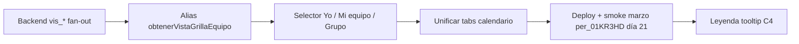

# Oleada C2 — Hoja de ruta GSO «vista equipo»

**Objetivo:** calendario **multipersona** (filas = personas, columnas = días del mes) con la misma celda MDC y el mismo detalle C3 al hacer clic.

**Nombre de producto:** callable **`obtenerVistaGrillaEquipo`** (contrato de negocio).  
**Implementación actual (slice 2):** callable desplegable **`listarVistaGrillaMesPorGrupo`** — mismo contrato de entrada/salida; renombre/alias opcional en un slice corto para no romper clientes ya cableados.

---

## 1. Backend — `obtenerVistaGrillaEquipo`

### Contrato (TO-BE)

| Parámetro | Tipo | Descripción |
|-----------|------|-------------|
| `grupo_trabajo_id` | `gdt_*` | Equipo / grupo de trabajo ancla |
| `anio` / `mes` | número | Período calendario |
| *(opcional futuro)* `fecha_corte` | `YYYY-MM-DD` | Por defecto: último día del mes |

**Respuesta:** `{ ok, grupo_trabajo_id, anio, mes, fecha_corte, total_personas, truncado, filas[] }` donde cada fila trae `persona_id`, `persona_label`, `vis_id`, `existe`, `dias` (mismo mapa que `obtenerVistaGrillaMesAgente`).

### Estrategia de datos (decisión)

| Opción | Estado | Notas |
|--------|--------|-------|
| **A — Fan-out sobre `vistas_grilla_mes_agente` (`vis_*`)** | **✅ Implementado** | Por cada integrante vigente en HLg al corte, leer `vis_<YYYY>_<MM>_per_<ULID>`. Sin recálculo de veredicto en la callable. |
| **B — Proyección agrupada `vis_grupo_*` o `vistas_grilla_mes_equipo`** | **No existe** | Solo si el volumen (N×lecturas, timeout) o RRHH exige una sola lectura; implicaría worker MDC nuevo. **Fuera de C2 inicial.** |

### Reglas de membresía (implementadas)

- Colección `historial_laboral_grupos`, filtro `grupo_de_trabajo_id == gdt_*`.
- Vigencia HLg (+ fechas en `historial_laboral_datos` si aplica) al **último día del mes**.
- Máximo **60** personas por respuesta (`truncado: true` si hay más).
- Etiquetas persona vía colección `personas` + `buildPersonaLabel`.

### Archivos (referencia)

- Core: `functions/modules/shared/grillaMesAgenteCore.js` → `listarVistaGrillaMesPorGrupo`
- Callable: `functions/onCall/grilla/listarVistaGrillaMesPorGrupo.js`
- Evidencia slice: [`OLEADA_C_SLICE2_GSO_VISTA_GRUPO.md`](./OLEADA_C_SLICE2_GSO_VISTA_GRUPO.md)

### Pendiente backend (C2b)

- [ ] Alias export **`obtenerVistaGrillaEquipo`** (misma función) o deprecación documentada de `listarVistaGrillaMesPorGrupo`.
- [ ] Callable **`listarOpcionesGrillaEquipo`** (o extender contexto laboral): devolver grupos elegibles para el usuario en una fecha (ver §2).
- [ ] Autorización fina: jefe solo grupos donde es autorizador / burbujeo; RRHH catálogo amplio (reutilizar patrones de bandeja jefe + `tokenHasRrhhLaborAccess`).

---

## 2. UI — Bandeja de selección

**Problema hoy:** inputs libres `per_*` / `gdt_*` (piloto manual).

**TO-BE:** un **Select / Combobox** (modo atómico móvil: lista nativa o drawer) con al menos:

| Opción UI | Comportamiento | Fuente datos |
|-----------|----------------|--------------|
| **Yo** | Una fila / calendario 1 agente (pestaña actual «Un agente») | `claims.persona_id` + `obtenerVistaGrillaMesAgente` |
| **Mi equipo** | Grilla multipersona del **grupo ancla por defecto** del revisor | Grupos HLg del usuario a fin de mes; si uno solo → auto; si varios → elegir en combobox |
| **Por grupo / sector** | RRHH o perfiles amplios: elegir `gdt_*` por nombre | Catálogo `grupos_de_trabajo` o read-model laboral ya usado en `/portal/grilla` |
| *(opcional)* **Persona puntual** | Búsqueda por nombre/DNI para RRHH | Callable búsqueda existente o read-model con filtro |

**Reutilización ya en el proyecto:**

- `callResolverContextoLaboralSolicitud({ fecha_desde })` → `grupos_trabajo_vigentes[]` con `etiqueta_ui` (mismo patrón que alta 64-A).
- `listarReadModelLaboralOperativo` en pestaña «Grilla operativa» laboral (filtros `grupo_de_trabajo_id`).

### Entregables UI (C2c)

- [x] Componente **`GrillaMesSelector.jsx`**: modos `TITULAR` | `EQUIPO` | `SECTOR` (RRHH), período, grupo desde resolver o catálogo.
- [x] Integrado en **`GrillaMesGrupoPanel`** · `callResolverContextoLaboralSolicitud` con `fecha_desde` = cierre del mes.
- [x] Sin `gdt_*` hardcodeado en UI.
- [x] Unificar pestañas (**C2d**): un solo `GrillaMesLicenciasPanel` + `useGrillaMesVista` · calendario si TITULAR, tabla si EQUIPO/SECTOR.

### Estado actual

- Subpestaña **Por grupo (C2)** + matriz tabla: **✅**
- Selector dinámico (C2c): **✅**

---

## 3. Renderizado — Grilla multipersona

| Requisito | Estado |
|-----------|--------|
| Filas = personas, columnas = días 1…N | **✅** `GrillaMesGrupoPanel.jsx` |
| Color / código desde `dias[dd].eventos[0]` (MDC) | **✅** `grillaMesCellUtils.js` |
| Borde punteado si `estado_solicitud_id` contiene `revision` | **✅** |
| `onClick` celda → **`DiaGrillaDetalleModal`** (C3) | **✅** + `subtitulo` = nombre persona |
| Enlace bandeja `?sol_id=` | **✅** (sin cambios C3) |

Vista **un agente** sigue siendo rejilla de celdas por día (no tabla); es coherente para autoconsulta. La vista **equipo** usa tabla horizontal scroll.

---

## 4. Orden de implementación recomendado

| Fase | Entrega | Prioridad |
|------|---------|-----------|
| **C2a** | Backend equipo (fan-out `vis_*`) | **Hecho** |
| **C2b** | Alias callable + auth jefe/RRHH | Media |
| **C2c** | Bandeja selección (combobox) | **Alta** (UX bloqueante prod) |
| **C2d** | Unificar UI agente/equipo bajo un selector | Media |
| **C4** | Tooltip / leyenda | Baja |

---

## 5. Criterios de aceptación (smoke)

1. Usuario jefe con un solo GDT vigente: elige **Mi equipo**, mes **2026-03**, ve fila del agente piloto y día **21** con `64-A` / color aprobado.
2. Clic día → modal con artículo, estado, **nombres** en cierre jefe y TC RRHH (C3).
3. **Ver solicitud en bandeja** abre la solicitud correcta.
4. Grupo con >60 integrantes: mensaje `truncado` visible.
5. Sin `vis_*` del mes: fila con `existe: false`, celdas vacías (no error 500).

---

## 6. Relación con otros docs

- Slice 1 mes agente: [`OLEADA_C_SLICE1_GSO_VISTA_MES.md`](./OLEADA_C_SLICE1_GSO_VISTA_MES.md)
- Slice 2 implementación: [`OLEADA_C_SLICE2_GSO_VISTA_GRUPO.md`](./OLEADA_C_SLICE2_GSO_VISTA_GRUPO.md)
- Arquitectura GSO/RDA: [`ARQUITECTURA_MAESTRA_SIGAL_V2_MODULO_OPERATIVO_ASISTENCIA.md`](./ARQUITECTURA_MAESTRA_SIGAL_V2_MODULO_OPERATIVO_ASISTENCIA.md)

---

*Última actualización: 2026-05-21 — alineado con especificación producto C2 (equipo + bandeja + multipersona).*
