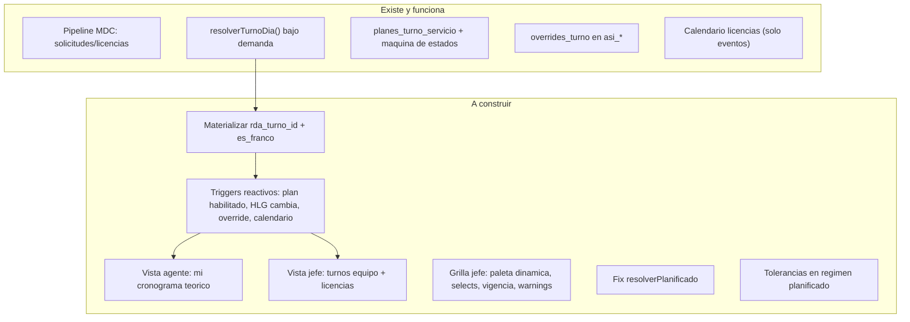
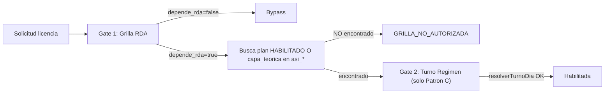
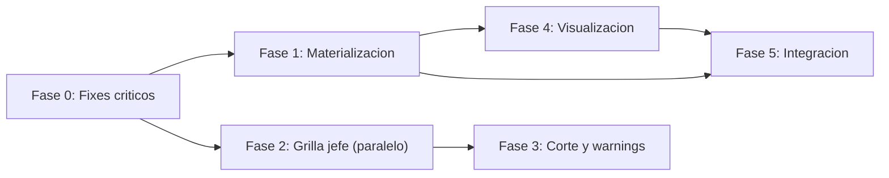

# Plan Maestro: Capa Teorica de Asistencia

## Estado actual

La arquitectura tiene dos capas en la RDA (`asistencia_diaria` + `vistas_grilla_mes_agente`):

- **Capa de solicitudes (MDC)**: Materializada y funcional. Los eventos de licencias/articulos se proyectan a `asi_*.aportes_normativos` y fan-out a `vis_*.dias[dd].eventos[]`. Pipeline event-driven completo.
- **Capa teorica (turno del dia)**: Motor de resolucion existe (`resolverTurnoDia`) pero NO materializa. Los campos `rda_turno_id` y `es_franco` en `vis_*` son slots vacios. El agente no puede ver su cronograma. El jefe no ve los turnos del equipo superpuestos con licencias.



---

## Fase 0: Fixes criticos y deuda tecnica

### 0A. Fix bug `resolverPlanificado`

**Archivo**: [functions/modules/asistencia/resolverTurnoDia.js](functions/modules/asistencia/resolverTurnoDia.js) (L135-171)

Bug: lee `plan.asignaciones[fechaYmd]` que no existe. El plan almacena `plan.agentes[i].dias[ymd]`. Ademas falta `personaId` en la firma.

Fix:
1. Agregar `personaId` a firma y al caller (L312)
2. Buscar `plan.agentes[].find(a => a.persona_id === personaId).dias[fechaYmd]`

### 0B. Tolerancias en formulario planificado

**Archivo**: [web/src/pages/rrhh/regimenes/RegimenHorarioForm.jsx](web/src/pages/rrhh/regimenes/RegimenHorarioForm.jsx)

Agregar `tolerancia_ingreso_min` y `tolerancia_egreso_min` al `EditorPlanificado`. Schema y backend ya los soportan.

---

## Fase 1: Materializacion de la capa teorica

### Contexto critico: la materializacion NO es solo visual

El motor de licencias tiene dos gates secuenciales. El **Gate 1** (`evaluarGrillaTurnoEntorno`) bloquea solicitudes con `depende_rda=true` si no encuentra `capa_teorica` en `asi_*` ni plan HABILITADO. Para regimenes fijo y rotativo, `resolverTurnoDia` puede calcular on-demand, pero el Gate 1 lo bloquea antes de que el Gate 2 pueda resolverlo.



**Sin materializacion: fijo/rotativo con `depende_rda=true` quedan bloqueados.**
**Con materializacion: los tres tipos funcionan con ambos gates.**

### 1A. Funcion core: `materializarTurnoMesBatch`

**Archivo nuevo**: `functions/modules/asistencia/rdaTurnoTeoricoWorker.js`

**Diseño optimizado** para minimizar lecturas Firestore. En vez de llamar `resolverTurnoDia` 30 veces (que repite reads de HLG/regimen/calendario cada vez), la funcion batch pre-carga los datos compartidos una sola vez:

```
materializarTurnoMesBatch({ personaId, grupoId, anio, mes })

1. PRE-CARGA (1 vez por agente/mes):
   - HLG vigente: 1 query
   - cfg_regimen_horario: 1 read
   - Calendario institucional: 0 reads (cache 5min existente)
   - Plan habilitado (si planificado): 1 query
   Total: ~3 reads

2. POR CADA DIA del mes (30 iteraciones):
   - Override (asi_*): 1 read  ← unico dato per-dia
   - Resolucion: computo puro (fijo=weekday, rotativo=modulo, planificado=lookup en plan pre-cargado)
   Total: 30 reads

3. ESCRITURAS en batch:
   - 30 writes a asi_*.capa_teorica (via db.batch())
   - 1 write a vis_*.dias (merge con 30 claves)
   Total: 31 writes

TOTAL POR AGENTE/MES: ~33 reads + 31 writes = 64 operaciones
```

**Comparacion sin optimizacion** (llamar `resolverTurnoDia` x30): ~180 reads + 31 writes = 211 operaciones. **Ahorro: 70%.**

**Estructura de `capa_teorica` en `asi_*`:**
```
capa_teorica: {
  tipo_dia, turno_id, ingreso, egreso, horas_efectivas,
  es_nocturno, es_feriado, origen, regimen_horario_id, plan_id
}
```

**Campos en `vis_*.dias[dd]`:**
- `rda_turno_id` = turno_id resuelto (o null si franco)
- `es_franco` = tipo_dia in ("franco", "no_laborable")

Reutiliza `buildVisDocumentId` y el patron `{...prev}` de `mdcFanOutVis.js` para preservar los `eventos[]` existentes.

### 1B. Funcion grupo: `materializarGrupoMes`

Wrapper que materializa un grupo completo para un mes. Optimizaciones adicionales:

- **Regimenes deduplicados**: si 15 de 20 agentes comparten el mismo regimen, se lee 1 vez (Map cache)
- **Calendario**: ya cacheado por el servicio existente (TTL 5min)
- **Paralelismo controlado**: `Promise.all` en chunks de 5 agentes para no saturar Firestore

```
materializarGrupoMes({ grupoId, anio, mes })

1. Query HLGs activos del grupo: 1 query → N agentes
2. Dedup regimenes: M reads (M <= N, tipicamente M = 2-3)
3. Plan habilitado (si planificado): 1 query
4. Por agente: materializarTurnoMesBatch (30 reads + 31 writes)

TOTAL GRUPO 20 AGENTES, 3 REGIMENES:
  Reads: 1 query + 3 regimenes + 20×30 overrides = ~604 reads
  Writes: 20×31 = 620 writes
  Total: ~1,224 operaciones (vs ~4,220 sin optimizar)
```

### 1C. Triggers de materializacion

| Evento | Trigger | Scope | Operaciones estimadas |
|--------|---------|-------|----------------------|
| Plan pasa a HABILITADO | Post-`habilitarPlanTurnoServicio` | Agentes del plan × dias del mes | 20 agentes: ~1,224 ops |
| Plan pasa a CERRADO | Post-`cerrarPlanPerpetuo` | Dias post-cierre x agentes | Variable, max ~1,224 ops |
| HLG guardado (regimen cambia) | Post-`guardarRegistroLaboralTemporal` (rama HLG) | 1 agente × mes actual | ~64 ops |
| HLG deshabilitado | Post-`rrhhDeshabilitarHlg` | 1 agente × mes vigencia | ~64 ops |
| Override registrado | Post-`registrarCambioTurno` | 1 dia | ~2 ops (1 read + 1 write) |
| Override eliminado | Post-`eliminarCambioTurno` | 1 dia | ~2 ops |

Implementacion: llamadas fire-and-forget (async sin await) al final de cada callable, similar al patron `dispararMdcDesdeSolicitudAsync` existente.

**NO se triggerea por cambio de calendario institucional** (impacto masivo, se maneja con job batch manual/programado).

### 1D. Materializacion automatica para fijo/rotativo

Para regimenes fijo y rotativo, la materializacion se dispara al guardar/modificar el HLG. Como el patron es deterministico (no depende de un plan mensual), se puede materializar el mes actual y el proximo automaticamente:

- Al guardar HLG con regimen fijo/rotativo → materializar mes actual + mes siguiente (2 × 64 = ~128 ops por agente)
- Al inicio de cada mes (job programado o lazy al primer acceso) → materializar el mes nuevo

---

## Fase 2: Grilla del jefe — paleta dinamica y selects

### 2A. Callable de contexto: `listarContextoPlanGrupo`

**Archivo**: [functions/modules/asistencia/planesTurnoServicio.js](functions/modules/asistencia/planesTurnoServicio.js)

Nuevo callable que dado `{ grupo_id, periodo }` retorna:
- `personas_grupo[]`: HLGs activos del grupo con persona_id, persona_label, hlg_id, regimen_horario_id, fecha_inicio, fecha_fin, regimen_fecha_ancla
- `regimenes{}`: Map de documentos cfg_regimen_horario referenciados (con turnos_disponibles, dias, ciclo, etc.)

### 2B. Paleta dinamica de turnos

**Archivo**: [web/src/pages/jefe/planes/GrillaMensualEditor.jsx](web/src/pages/jefe/planes/GrillaMensualEditor.jsx)

Eliminar `TURNOS_COLOR` hardcodeado. Derivar paleta desde `regimen.turnos_disponibles[]` (union de todos los regimenes del plan). Colores por indice desde paleta base. Franco como opcion universal.

### 2C. Selects dinamicos

**Archivos**:
- [web/src/pages/jefe/PlanTurnoServicioPage.jsx](web/src/pages/jefe/PlanTurnoServicioPage.jsx) — `grupo_id` como select
- [web/src/pages/jefe/planes/GrillaMensualEditor.jsx](web/src/pages/jefe/planes/GrillaMensualEditor.jsx) — persona como select, regimen/hlg auto-resueltos
- [web/src/pages/jefe/planes/PlanPerpetualViewer.jsx](web/src/pages/jefe/planes/PlanPerpetualViewer.jsx) — idem

### 2D. Grilla vacia inteligente

Reemplazar `crearGrillaVacia` (que hardcodea "M" en dias de semana) por inicializacion limpia: todas las celdas como franco. Opcionalmente, pre-popular desde el patron del regimen para fijo/rotativo.

---

## Fase 3: Corte visual y warnings en grilla del jefe

### 3A. Helpers de estado de celda

Funciones puras:
- `esDiaEnVigenciaHlg(fechaYmd, fechaInicio, fechaFin)` — hard block
- `esDiaAsignadoAlGrupo(regimen, fechaYmd, fechaAncla)` — soft warning (fijo/rotativo)

### 3B. Corte visual por vigencia HLG (Hard Block)

Celdas fuera de vigencia: `disabled`, patron rayado (CSS hatching), tooltip con fechas. Turnos huerfanos visibles pero inertes.

### 3C. Identificacion de dias asignados (Soft Warning)

4 estados visuales:
- Bloqueada (fuera vigencia): hatching gris, disabled
- Zona blanca (asignado): editable normal
- Zona gris claro (no asignado/franco contractual): editable con warning
- Excepcion (turno en zona gris): color turno + borde naranja

Planificado: toda la vigencia es blanca.

### 3D. Validacion backend al enviar plan

Extender `validarReglasContraRegimen` en [planesTurnoServicio.js](functions/modules/asistencia/planesTurnoServicio.js):
- `PLT-VIG-E001`: turno fuera de vigencia HLG — **error** (bloquea envio)
- `PLT-REG-W010`: turno en dia no asignado segun regimen — **warning**
- `PLT-REG-W003`: `max_consecutivos_trabajo` excedido — **warning**
- `PLT-REG-W004`: `min_consecutivos_franco` insuficiente — **warning**

---

## Fase 4: Visualizacion del turno teorico

### 4A. Enriquecer calendario del agente (modo TITULAR)

**Archivo**: [web/src/features/grilla/GrillaMesTitularCalendario.jsx](web/src/features/grilla/GrillaMesTitularCalendario.jsx)

Cada celda del calendario muestra actualmente solo los eventos de licencia. Agregar la capa teorica:
- Si `rda_turno_id` existe: mostrar etiqueta del turno (M/T/N) en una esquina de la celda
- Si `es_franco`: celda con fondo gris claro
- Si hay evento de licencia superpuesto: el turno teorico aparece tachado o en segundo plano
- Tooltip enriquecido: "Turno: Manana 07:00-14:00 | Licencia: Art. 64-A aprobada"

### 4B. Enriquecer vista de equipo (modo EQUIPO)

**Archivo**: [web/src/features/grilla/GrillaMesEquipoTabla.jsx](web/src/features/grilla/GrillaMesEquipoTabla.jsx)

Celdas de la tabla persona x dia:
- Fondo base = color del turno teorico (amarillo=M, azul=T, etc.)
- Si hay licencia superpuesta: icono/badge del codigo de licencia sobre el color del turno
- Si es franco: fondo gris
- Jefe ve de un vistazo: quien trabaja, en que turno, quien tiene licencia

### 4C. Detalle del dia

**Archivo**: [web/src/features/grilla/DiaGrillaDetalleModal.jsx](web/src/features/grilla/DiaGrillaDetalleModal.jsx)

Agregar seccion "Turno teorico" al modal de detalle del dia:
- Tipo de dia (laborable/guardia/franco)
- Turno: ID + etiqueta + horario (ingreso/egreso)
- Horas efectivas
- Origen (regimen fijo / plan mensual / override)
- Si hay override: mostrar turno original + override

---

## Fase 5: Integracion y consistencia

### 5A. Override actualiza vista materializada

Modificar `registrarCambioTurno` y `eliminarCambioTurno` en [cambiosTurno.js](functions/modules/asistencia/cambiosTurno.js) para que, post-escritura en `asi_*`, disparen `materializarTurnoTeoricoDia` para el dia afectado. Esto actualiza `rda_turno_id` en `vis_*`.

### 5B. `grillaTurnoEntornoGate` funciona automaticamente

Una vez materializada la capa teorica en `asi_*.capa_teorica`, el gate que valida entorno operativo para solicitudes (`depende_rda: true`) funcionara sin cambios adicionales.

---

## Orden de ejecucion sugerido



Fase 0 es prerequisito de todo. Fases 1 y 2 pueden avanzar en paralelo. Fase 3 depende de 2. Fase 4 depende de 1. Fase 5 integra ambos tracks.

## Archivos impactados (resumen)

**Backend**:
- `functions/modules/asistencia/resolverTurnoDia.js` — fix resolverPlanificado
- `functions/modules/asistencia/planesTurnoServicio.js` — callable contexto + validaciones + trigger materializacion
- `functions/modules/asistencia/cambiosTurno.js` — trigger materializacion post-override
- `functions/modules/asistencia/rdaTurnoTeoricoWorker.js` — **nuevo**: core de materializacion
- `functions/modules/catalogosLaborales.js` — trigger materializacion post-guardar HLG
- `functions/modules/catalogosRegimenHorario.js` — (futuro: trigger si regimen cambia)

**Frontend**:
- `web/src/pages/rrhh/regimenes/RegimenHorarioForm.jsx` — tolerancias planificado
- `web/src/pages/jefe/PlanTurnoServicioPage.jsx` — selects, carga contexto
- `web/src/pages/jefe/planes/GrillaMensualEditor.jsx` — paleta dinamica, selects, vigencia, warnings
- `web/src/pages/jefe/planes/PlanPerpetualViewer.jsx` — selects dinamicos
- `web/src/features/grilla/GrillaMesTitularCalendario.jsx` — turno teorico en calendario agente
- `web/src/features/grilla/GrillaMesEquipoTabla.jsx` — turno teorico en vista equipo
- `web/src/features/grilla/DiaGrillaDetalleModal.jsx` — detalle turno teorico

## Analisis de impacto en lecturas Firestore

### Costos actuales (baseline)

| Operacion | Reads hoy |
|-----------|-----------|
| `listarVistaGrillaMesPorGrupo` (20 agentes) | ~80 reads |
| `validarEntornoOperativoSolicitud` (1 solicitud) | ~8-12 reads |
| `resolverTurnoDia` (1 dia) | ~5 reads (sin cache) |
| `habilitarPlanTurnoServicio` (20 agentes × 30 dias, overrides fantasma) | ~600 reads (secuenciales!) |
| `DatosLaborales.jsx` al montar (19 colecciones) | ~19 queries |

### Costos nuevos (con materializacion)

| Operacion | Reads | Writes | Cuando ocurre |
|-----------|-------|--------|---------------|
| Materializar 1 agente × 1 mes | ~33 | 31 | Al guardar HLG / habilitar plan |
| Materializar grupo 20 × 1 mes | ~604 | 620 | Al habilitar plan |
| Re-materializar 1 agente (cambio HLG) | ~33 | 31 | Al editar HLG |
| Override puntual (1 dia) | ~1 | 2 | Al registrar/eliminar override |
| `listarContextoPlanGrupo` (20 agentes) | ~43 | 0 | Al abrir editor grilla |

### Estrategias de optimizacion aplicadas

**1. Pre-carga con deduplicacion** (Fase 1A): HLG, regimen y calendario se leen 1 vez por agente/mes en vez de 30. **Ahorro 70%** en reads de materializacion.

**2. `db.batch()` para escrituras**: Los 30 writes de `asi_*` se ejecutan en 1 batch atomico en vez de 30 transacciones individuales.

**3. Regimenes compartidos**: Si 15 agentes comparten el mismo regimen, se lee 1 doc en vez de 15. Cache Map within request.

**4. Materializacion lazy para fijo/rotativo**: Solo se materializa el mes actual + siguiente. Los meses futuros se calculan on-demand si son necesarios (el Gate 2 resuelve sin materializacion).

**5. Visualizacion sin reads adicionales**: El calendario del agente (`GrillaMesTitularCalendario`) ya lee `vis_*` — los campos `rda_turno_id` y `es_franco` llegan gratis, sin lecturas extra.

**6. `listarContextoPlanGrupo` unico**: El callable carga personas + regimenes en 1 invocacion (~43 reads). El frontend no necesita llamadas adicionales para la paleta dinamica, vigencia HLG ni selects.

### Operaciones que NO agregan reads al frontend

- Visualizacion del turno teorico en calendario agente: **0 reads extra** (ya lee vis_*)
- Visualizacion del turno teorico en vista equipo: **0 reads extra** (ya lee vis_*)
- Corte visual por vigencia: **0 reads extra** (datos vienen en `listarContextoPlanGrupo`)
- Dias asignados por regimen: **0 reads extra** (computo puro en frontend con datos pre-cargados)

## Checklist tecnico para codificacion (Fase 1)

### Gestion de fechas y zonas horarias

El worker `materializarTurnoMesBatch` itera dias del mes. Riesgos: transiciones de horario de verano, offsets UTC, saltos/duplicaciones de dias al usar `Date` nativo.

**Regla**: trabajar estrictamente con strings `YYYY-MM-DD` para el bucle. El sistema ya usa `fechaInstitucionalBa.js` con zona fija `America/Argentina/Buenos_Aires` (UTC-3). Generar el array de dias del mes con aritmetica de strings, no instanciando `new Date()` para cada iteracion. Patron existente a reutilizar: `diasDelMes()` en `GrillaMensualEditor.jsx` (L12-22).

### Idempotencia de los batches

Si el worker corre dos veces para el mismo agente/mes (retry, timeout, duplicacion de trigger), no debe sobreescribir destructivamente los `eventos[]` del MDC que ya existan en `vis_*`.

**Regla**: la escritura a `vis_*.dias[dd]` debe usar `{ merge: true }` y solo escribir `rda_turno_id` y `es_franco`, preservando `eventos[]` y `tiene_conflicto` intactos. El patron `{...prev}` de `mdcFanOutVis.js` ya hace esto — reutilizar la misma tecnica de transaccion+merge.

Para `asi_*.capa_teorica`: usar `update` con dot-notation (`"capa_teorica.tipo_dia": valor`) en vez de `set` sobre el documento completo, para no destruir `aportes_normativos` ni `overrides_turno`.

### Manejo de fallos en chunks

`materializarGrupoMes` procesa agentes en chunks de 5 via `Promise.all`. Si un chunk falla (error de red, timeout), los demas chunks deben continuar.

**Regla**: envolver cada chunk en `Promise.allSettled` en vez de `Promise.all`. Recolectar errores en un array `fallos[]` y retornarlos en el resultado. Los agentes fallidos se pueden reintentar individualmente sin re-procesar todo el grupo.

```javascript
for (const chunk of chunks) {
  const resultados = await Promise.allSettled(
    chunk.map(ag => materializarTurnoMesBatch({ ...ag, anio, mes }))
  );
  for (const r of resultados) {
    if (r.status === "rejected") fallos.push({ agente: ag, error: r.reason });
  }
}
```

### Limite de 500 escrituras por batch Firestore

Cada agente genera 31 writes (30 `asi_*` + 1 `vis_*`). Un chunk de 5 agentes = 155 writes, holgadamente bajo el limite de 500. No agrupar mas de 15 agentes por batch (15 × 31 = 465).

## Fuera de alcance

- Acumulacion de horas semanales/mensuales en grilla
- Re-materializacion por cambio de calendario institucional (job batch manual)
- Campos `banda_ingreso` / `banda_egreso` en UI
- Fichadas reales (capa de control vs capa teorica)
