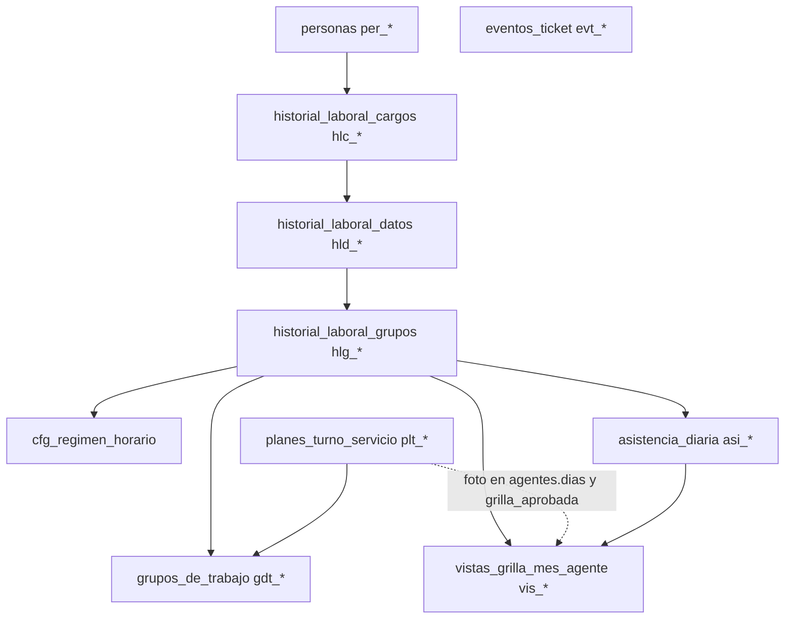
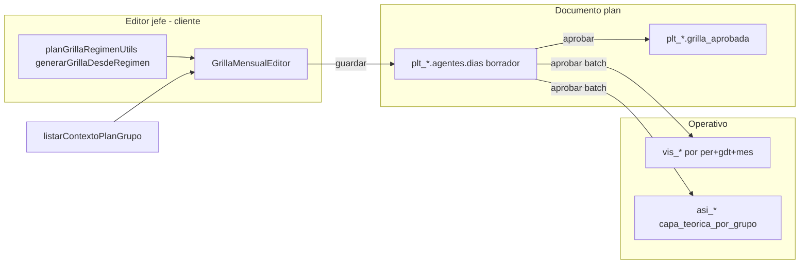
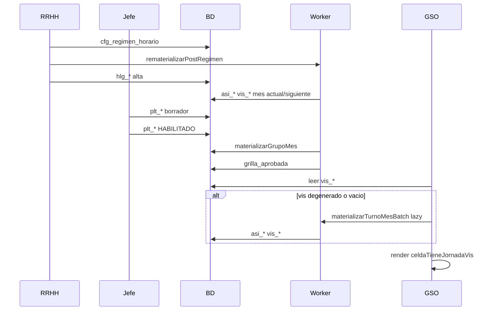
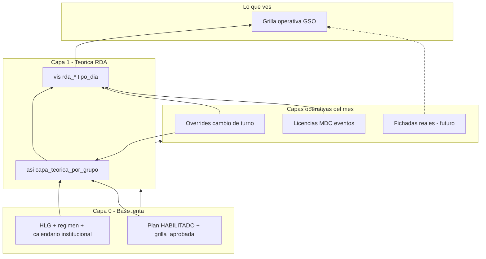
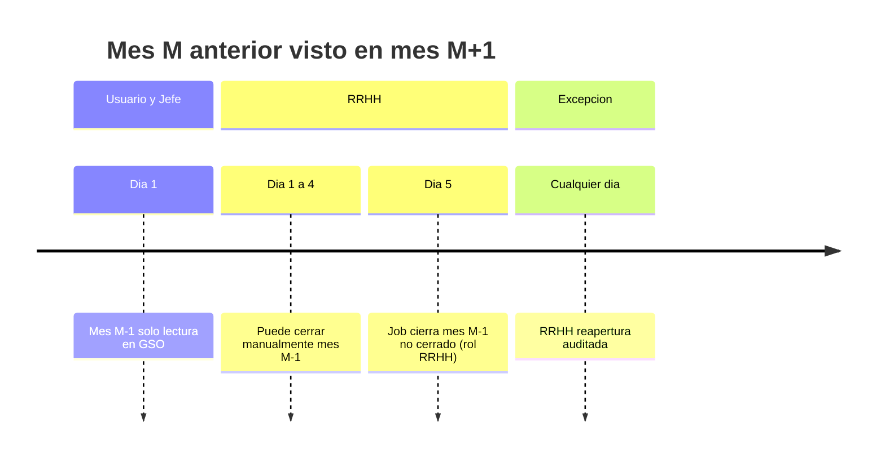

# Análisis integral: HLG → turnos → materialización → grilla operativa

## 1. Modelo de datos (ancla del sistema)

Cadena canónica documentada en [`docs/v2/MODULO_DATOS_LABORALES_V2.md`](docs/v2/MODULO_DATOS_LABORALES_V2.md) y [`docs/v2/PLAN_GRILLA_MULTI_HLG_V2.md`](docs/v2/PLAN_GRILLA_MULTI_HLG_V2.md):



| Colección | ID | Quién escribe | Para qué sirve |
|-----------|-----|---------------|----------------|
| `historial_laboral_cargos` | `hlc_*` | `guardarRegistroLaboralTemporal` | Cargo, carga horaria, rol, efector |
| `historial_laboral_datos` | `hld_*` | mismo callable (UI casi siempre embebido) | Puente cargo → detalle (función real, jerarquía) |
| `historial_laboral_grupos` | `hlg_*` | mismo callable | **Burbuja operativa**: persona + grupo + **`regimen_horario_id`** |
| `cfg_regimen_horario` | `CFG_REG_HOR_*` | `guardarRegimenHorario` | Patrón fijo / rotativo / planificado |
| `planes_turno_servicio` | `plt_*` | flujo planes jefe/RRHH | Gobernanza mensual; `grilla_aprobada` al aprobar |
| `asistencia_diaria` | `asi_{per}_{YYYYMMDD}` | worker + overrides + MDC | Capa teórica por día, **mapa** `capa_teorica_por_grupo.{gdt}` |
| `vistas_grilla_mes_agente` | `vis_{YYYY}_{MM}_per_{ulid}_gdt_{ulid}` | worker + `mdcFanOutVis` | Read model UI (turno + `eventos[]` licencias) |
| `eventos_ticket` | `evt_*` | casi todo guardado laboral/plan | Auditoría / bandeja RRHH |

**No hay triggers Firestore** sobre HLG/HLD/HLc ni régimen: todo es **callable onCall** ([`functions/index.js`](functions/index.js)).

---

## 2. Fase A — Alta y edición de datos laborales (HLG)

### 2.1 Secuencia típica (UI)

[`web/src/pages/DatosLaborales.jsx`](web/src/pages/DatosLaborales.jsx) → [`payloadBuilders.js`](web/src/pages/payloadBuilders.js) → [`datosLaboralesService.js`](web/src/services/datosLaboralesService.js) → callable **`guardarRegistroLaboralTemporal`** ([`functions/modules/catalogosLaborales.js`](functions/modules/catalogosLaborales.js)).

Orden habitual al **crear asignación a grupo**:

1. Guardar **HLD** (si no existe) con `cargo_id` del HLC vigente.
2. Guardar **HLG** con `dato_laboral_id`, `grupo_de_trabajo_id`, **`regimen_horario_id` obligatorio**, `fecha_inicio`/`fecha_fin`, `regimen_fecha_ancla` (rotativos).

### 2.2 Qué registra en BD (por entidad)

| Paso | Escritura | Efectos colaterales |
|------|-----------|---------------------|
| HLC | merge en `historial_laboral_cargos` | `eventos_ticket` + `refreshClaimsLaboralPersona` |
| HLD | merge en `historial_laboral_datos` | idem |
| HLG activo con régimen | merge en `historial_laboral_grupos` | idem + **`materializarTurnoMesBatch`** mes **actual y siguiente** (persona + `grupo_de_trabajo_id`) |

Fragmento materialización post-HLG ([`catalogosLaborales.js`](functions/modules/catalogosLaborales.js) ~L600):

- Solo si `regimen_horario_id` y `activo`.
- Errores en batch se loguean; **no bloquean** el guardado del HLG.

### 2.3 Validaciones backend (HLG)

| Código | Regla |
|--------|--------|
| VAL-HLG-016 | `regimen_horario_id` obligatorio |
| VAL-HLG-017 | régimen debe existir y estar activo en `cfg_regimen_horario` |
| VAL-HLG-018 | **en edición no se puede cambiar** `regimen_horario_id` (cerrar HLg y crear nueva) |
| VAL-HLG-014 | sin solape misma persona + mismo grupo |
| VAL-HLG-007/010/005/006 | integridad persona/HLD/cargo/fechas |
| VAL-HLG-W003 | warning si carga semanal del régimen ≠ `hlc.carga_horaria_total` (no bloquea) |

### 2.4 Deshabilitación

- **`rrhhDeshabilitarHlg`**: cierra fechas, `activo: false` → rematerializa **solo mes actual** (recalcula sin esa asignación en ese `gdt`).
- **`rrhhDeshabilitarHlc`**: cascada HLC → HLD → HLG; **no** rematerializa explícitamente en el flujo revisado.

### 2.5 Qué NO hace el alta de HLG

- No crea `plt_*`.
- No toca otros meses salvo actual/siguiente en materialización post-alta.
- No actualiza agentes con régimen distinto si solo se editó HLC/HLD.

---

## 3. Fase B — Régimen horario (catálogo RRHH)

### 3.1 Flujo

[`web/src/pages/rrhh/RegimenesHorariosPage.jsx`](web/src/pages/rrhh/RegimenesHorariosPage.jsx) → **`guardarRegimenHorario`** ([`functions/modules/catalogosRegimenHorario.js`](functions/modules/catalogosRegimenHorario.js)) → **`cfg_regimen_horario`**.

Campos clave: `tipo_patron` (`fijo` | `rotativo` | `planificado`), `dias[]` / `ciclo[]` / `turnos_disponibles[]`, `carga_horaria_semanal_teorica`, `impacta_calendario_institucional`.

### 3.2 Impacto al actualizar régimen

| Acción | Efecto en `asi_*` / `vis_*` |
|--------|------------------------------|
| Guardar/editar `cfg_regimen_horario` | **Ninguno automático** |
| Callable **`rematerializarPostRegimen`** | Busca HLGs activos con ese `regimen_horario_id` → por cada `gdt` único → `materializarGrupoMes` (mes actual + siguiente) |
| Nuevo guardado de HLG (misma persona/grupo, régimen nuevo vía **nuevo** HLg) | Batch persona mes actual/siguiente |

**Deuda producto:** `callRematerializarPostRegimen` existe en [`web/src/services/callables.js`](web/src/services/callables.js) pero **no se invoca** desde la página de regímenes. Tras editar un patrón fijo, agentes ya asignados quedan con `vis_*`/`asi_*` viejos hasta rematerialización manual, lazy load (si snapshot inválido), o nuevo HLg / aprobación de plan.

---

## 4. Fase C — Turnos mensuales (planes)

### 4.1 Máquina de estados

[`functions/modules/asistencia/planesTurnoServicio.js`](functions/modules/asistencia/planesTurnoServicio.js):

```
BORRADOR → ENVIADO → HABILITADO → (CERRADO perpetuo)
         ↘ rechazar → BORRADOR
         revertir → EN_REVISION
```

### 4.2 Qué escribe cada acción (sin materializar salvo excepciones)

| Callable | Colección | Contenido principal |
|----------|-----------|---------------------|
| `guardarPlanTurnoServicio` | `plt_*` | `agentes[].dias` (mensual/planificado); enriquecimiento vía [`planEnriquecimientoDias.js`](functions/modules/asistencia/planEnriquecimientoDias.js) + **`resolverDiaConPreCarga`** (mismo motor que worker) |
| `enviarPlanTurnoServicio` | `plt_*` | `ENVIADO`, historial aprobación |
| `rechazarPlanTurnoServicio` | `plt_*` | vuelve a `BORRADOR`; **no** des-materializa |
| `revertirPlanTurnoServicio` | `plt_*` | `EN_REVISION`; capa operativa **permanece** |
| `aprobarPlanTurnoServicio` | `plt_*` + **batch** | Pre-aprobar: `materializarGrupoMes`; luego `grilla_aprobada`, `HABILITADO` |
| `eliminarPlanTurnoServicio` / `cerrarPlanPerpetuo` | `plt_*` + batch | Re-cálculo grupo sin plan habilitado |

### 4.3 Tres fuentes de verdad para “cómo se ve el mes”



| Pantalla | Fuente | ¿Materializa? |
|----------|--------|---------------|
| Editor / “Ver turnos del equipo” | `listarContextoPlanGrupo` + cálculo **cliente** [`planGrillaRegimenUtils.js`](web/src/pages/jefe/planes/planGrillaRegimenUtils.js) | **No** lee `vis_*` |
| VER plan aprobado | `plt_*.grilla_aprobada` | No |
| Calendario licencias GSO | `vis_*` vía callables grilla | Lazy si hace falta |

**Divergencia conocida (backend vs editor):** en [`resolverTurnoDia.js`](functions/modules/asistencia/resolverTurnoDia.js) `resolverFijo` sin match de `dia_semana` → `no_laborable`; en cliente sin match → **`franco`**. Puede generar meses “todo NL” en `vis_*` si el match falla (p. ej. `dia_semana` string vs number) — caso Portería mayo MOSTO.

---

## 5. Fase D — Motor de materialización

**Núcleo:** [`functions/modules/asistencia/rdaTurnoTeoricoWorker.js`](functions/modules/asistencia/rdaTurnoTeoricoWorker.js)

| Función | Alcance | Salida |
|---------|---------|--------|
| `materializarTurnoMesBatch` | 1 `per` × 1 mes × 1 `gdt` | ~31 writes `asi_*` + 1 merge `vis_*` |
| `materializarGrupoMes` | Todos HLg del `gdt` en el mes | Chunks de 5 × batch |
| `materializarTurnoTeoricoDia` | 1 día | Overrides / batch asistencia |

### 5.1 Lecturas por día (batch)

- HLGs de la persona filtrados por `gdt` (vigencia: **solo** `hlg.fecha_inicio` / `hlg.fecha_fin`, sin fallback HLD).
- `cfg_regimen_horario` por `regimen_horario_id`.
- Plan `HABILITADO` si régimen `planificado` o si viene `planCache` (aprobación).
- Calendario institucional (TTL 5 min).
- `asistencia_diaria` existente (overrides `reemplazo` por `gdt`).
- `grupos_de_trabajo` (etiqueta corta).

### 5.2 Prioridad de resolución (Opción A — plan > HLG por `gdt`)

Documentado en [`docs/v2/HANDOFF_SESION_2026-05-29_MATERIALIZACION_PLAN_VS_HLG.md`](docs/v2/HANDOFF_SESION_2026-05-29_MATERIALIZACION_PLAN_VS_HLG.md):

1. **`resolucionDesdeFotoPlan`** — si plan HABILITADO trae foto en `agentes[].dias[fecha]` → gana directo.
2. Si no hay foto: iterar HLGs vigentes en el `gdt`; elegir resolución “más laboral” entre HLGs del mismo grupo.
3. **`aplicarFotoPlanDia`** — si origen ≠ `plan_mensual`, la foto puede **forzar** NL/franco (Plan > HLG).
4. Overrides activos en `asi_*` pisan turno final.
5. Feriado institucional: lógica en `resolverDiaConPreCarga` (puede anular laborable) + reglas al escribir `vis_*` (`jornadaDesdePlanFoto` conserva turno si hay foto con horario).

### 5.3 Qué queda escrito

**`asi_{per}_{YYYYMMDD}`:**

- `capa_teorica_por_grupo.{gdt}`: segmentos, `tipo_dia`, `origen`, `hlg_id`, `regimen_horario_id`, `plan_id`, feriado, `materializado_en`.
- `overrides_turno[]` (persisten al rechazar plan).

**`vis_{YYYY}_{MM}_per_*_gdt_*`:**

- `dias["01"…"31"]`: `tipo_dia`, `rda_*`, `es_franco`, `es_feriado`, `grupo_de_trabajo_id`, `etiqueta_grupo_corta`.
- `dias[].eventos[]` — **no** del worker teórico; lo alimenta **MDC** ([`mdcFanOutVis.js`](functions/modules/shared/mdcFanOutVis.js)).

### 5.4 Cuándo se dispara materialización

| Disparador | Tipo | Alcance temporal típico |
|------------|------|-------------------------|
| Aprobar plan mensual | Batch pre-transacción | Mes del plan, todo el `gdt` |
| Alta/edición HLG activo | Batch | Mes actual + siguiente |
| Deshabilitar HLG | Batch | Mes actual |
| `rematerializarPostRegimen` / `PostCalendario` | Batch RRHH | Mes actual + siguiente (todos o por régimen) |
| `obtenerVistaGrillaMesAgente` / `listarVistaGrillaMesPorGrupo` | **Lazy** | 1 persona × mes × `gdt` |
| Override turno | Día | `materializarTurnoTeoricoDia` |
| Licencias MDC | Fan-out | Solo `eventos[]` en `vis_*` (+ worker asistencia licencias) |

**Lazy gate:** [`grillaMesAgenteCore.js`](functions/modules/shared/grillaMesAgenteCore.js) — `visRequiereMaterializacion` (vacío, sin señal de turno, o snapshot **degenerado** ≥20 días sin horario/franco o todo `no_laborable`). **Desplegado** en functions.

**No materializa:** guardar/enviar/rechazar/revertir plan; lectura pura de contexto plan.

---

## 6. Fase E — Grilla operativa (GSO)

### 6.1 UI

[`web/src/pages/GrillaOperativa.jsx`](web/src/pages/GrillaOperativa.jsx) — pestaña **Calendario licencias** → [`useGrillaMesVista.js`](web/src/features/grilla/useGrillaMesVista.js).

| Modo | Callable | Backend |
|------|----------|---------|
| Titular | N × `obtenerVistaGrillaMesAgente` | `ensureMaterializacionVisMes` por persona |
| Equipo / sector | `listarVistaGrillaMesPorGrupo` | HLg vigentes al **último día del mes** (máx. 60) + lazy por fila |

Presentación: [`GrillaMesEquipoTabla.jsx`](web/src/features/grilla/GrillaMesEquipoTabla.jsx), [`grillaMesEquipoDisplay.js`](web/src/features/grilla/grillaMesEquipoDisplay.js), estilos [`grillaTurnosVisual.js`](web/src/features/grilla/grillaTurnosVisual.js).

**El cliente no lee Firestore** de `vis_*`; solo interpreta payload del callable.

### 6.2 Pestaña “Vista laboral”

`listarReadModelLaboralOperativoTemporal` — read-model HLc/HLd/HLg; **independiente** de `vis_*` (no es grilla de turnos teóricos).

---

## 7. Matriz de desactualización (índice rápido)

| # | Punto | Síntoma | Causa técnica |
|---|--------|---------|----------------|
| D1 | Editar régimen sin rematerializar | Turno mensual ≠ calendario | `cfg_*` nuevo; `vis_*`/`asi_*` viejos |
| D2 | `resolverFijo` vs editor cliente | Mes entero NL en `vis_*` | Sin match `dia_semana` → NL backend vs F cliente |
| D3 | Snapshot `vis_*` degenerado | Todo NL con `tipo_dia` set | Materialización histórica fallida; capa 1 mitiga lazy |
| D4 | Vigencia HLg inconsistente | En tabla equipo pero celda vacía | Listado usa fechas HLD; worker no |
| D5 | Plan rechazado / revertido | VER plan ≠ operativo | Rechazar no des-materializa |
| D6 | Overrides post-aprobación | Histórico plan ≠ operativo | Overrides solo en `asi_*`/`vis_*` |
| D7 | Feriado + turno nocturno | FER tapa turno o solo NL | Feriado anula laborable; UI no prioriza horario |
| D8 | Multi-HLG multicargo | “¿Cuál es mi turno?” | Un `vis_*` por `gdt`, no por persona |
| D9 | Calendario institucional | Feriado nuevo no aparece | Falta `rematerializarPostCalendario` |
| D10 | `materializado_lazy` invisible | Usuario no sabe si hubo sync | Flag backend sin UI |

**Detalle con escenarios hospitalarios:** sección 13.

---

## 13. Problemas y soluciones concretas (escenarios hospitalarios)

Cada caso sigue el mismo esquema: **situación real** → **qué ve cada rol** → **estado en BD** → **impacto clínico/administrativo** → **solución concreta** → **criterio de cierre**.

Actores del piloto (referencia):

| Agente | `persona_id` | Grupos típicos |
|--------|----------------|-----------------|
| MOSTO | `per_01KQN9WXFXF69Z9DCT5YNJ3TFZ` | Portería, Oficina, Sala |
| CHAPARRO | `per_01KR3HD24AMJ6YX3N7B3GPAZJ4` | Sala Internación |
| LOKITO | `per_01KQQJA5Q1VKBTJ74RHQ0HSHSB` | Sala (planificado) |

Grupos: Sala `gdt_01KQA6QCA8TDQK9YBTHKYA4R2V`, Portería `gdt_01KQA9FVEW53JSNTPGX32NWQ5B`, Oficina `gdt_01KR3H81ENQK84ZK21EQWEQQXG`.

---

### D1 — RRHH corrige un régimen fijo y nadie rematerializa

**Situación hospitalaria**

RRHH detecta que el régimen “Administrativo Portería 08–14” tenía mal cargados los jueves (deberían ser NL, no laborables). Edita `cfg_regimen_horario` en **Regímenes horarios** y guarda. Enfermería jefe ya había armado el plan de junio; los agentes de Portería siguen viendo el patrón viejo en **Calendario licencias**.

**Qué ve cada rol**

| Rol | Pantalla | Resultado |
|-----|----------|-----------|
| Jefe Portería | Turnos mensuales / editor | Patrón **nuevo** (calculado en cliente desde régimen actualizado) |
| Agente / jefe | Calendario licencias GSO | Patrón **viejo** (lee `vis_*` materializado antes del cambio) |
| RRHH | Bandeja licencias | Puede validar LAO contra turno teórico **incorrecto** |

**Estado en BD**

- `cfg_regimen_horario`: días actualizados ✅
- `hlg_*`: sin cambio (mismo `regimen_horario_id`) ✅
- `vis_*` / `asi_*`: timestamps de materialización **anteriores** al cambio de régimen ❌
- `plt_*` junio: si existe borrador, foto puede mezclar régimen nuevo (cliente) con operativo viejo

**Impacto**

- Solicitud de licencia en día que el sistema marca laborable pero RRHH considera NL → rechazo o consumo de bolsa erróneo.
- Jefe planifica dotación con una grilla; GSO muestra otra → desconfianza en el portal.

**Solución concreta**

1. **Producto (P0):** tras guardar régimen en [`RegimenesHorariosPage.jsx`](web/src/pages/rrhh/RegimenesHorariosPage.jsx), modal: *“Este cambio afecta N agentes en M grupos. ¿Rematerializar mes actual y siguiente?”* → `callRematerializarPostRegimen({ regimen_horario_id })`.
2. **Operativa (hoy, sin código):** RRHH ejecuta callable o script `materializar-grupo-mes.mjs --gdt=... --periodo=2026-06` por grupo afectado.
3. **Proceso:** instructivo RRHH: *“Editar régimen ≠ actualizar calendarios automáticamente”* hasta deploy P0.

**Criterio de cierre**

Para un agente Portería con ese régimen: `listarContextoPlanGrupo` (cliente) = `vis_*` = `asi_*` en al menos 5 días laborables, NL y francos del mes en curso.

---

### D2 — Mes entero “NL” en calendario pero turno mensual correcto (Portería mayo MOSTO)

**Situación hospitalaria**

MOSTO tiene HLg en Portería con régimen fijo L–M–X 08:00–14:00, J–V NL, S–D franco. El jefe abre **Ver turnos del equipo** (mayo): ve el patrón correcto. Abre **Calendario licencias** (mayo, filtro Portería): las 31 celdas muestran **NL**.

**Qué ve cada rol**

| Fuente | Mayo 2026 MOSTO + Portería |
|--------|----------------------------|
| Turno mensual | L–M–X verde 08–14, J–V NL, S–D F |
| `vis_*` mes 5 | 31× `tipo_dia: no_laborable`, sin `rda_ingreso` |
| `vis_*` mes 4 | Patrón correcto (materialización posterior OK) |

**Estado en BD**

- Snapshot **degenerado**: tiene `tipo_dia` en todas las celdas → antes el lazy load **no** rematerializaba.
- Causa probable de generación: `resolverFijo` sin match de `dia_semana` (tipo string vs number) → 31× NL al materializar el 30/05.

**Impacto**

- Jefe no puede cruzar licencia con turno teórico en mayo.
- Si MDC usa `vis_*` para preview de días hábiles, subestima jornadas laborables.

**Solución concreta**

| Capa | Acción | Archivo |
|------|--------|---------|
| **1 (desplegada)** | Lazy detecta degenerado y rematerializa al cargar calendario | [`grillaMesAgenteCore.js`](functions/modules/shared/grillaMesAgenteCore.js) |
| **2 (pendiente)** | Sin match día → `franco`; `Number(dia_semana)` | [`resolverTurnoDia.js`](functions/modules/asistencia/resolverTurnoDia.js) |
| **Inmediata** | Script rematerializar Portería mayo MOSTO | `materializar-grupo-mes.mjs` o reabrir calendario post-deploy |

**Criterio de cierre**

Mayo MOSTO Portería = mismo patrón que abril (`laborable` + horarios en L–M–X, `franco` en S–D).

---

### D3 — Snapshot “completo” pero inválido (falso positivo de materialización)

**Situación hospitalaria**

Un mes se materializó en un deploy intermedio o con régimen mal referenciado. Firestore tiene 31 días con datos, así que el sistema asumía “ya está listo”. RRHH confía en que el calendario está sincronizado porque **no está vacío**.

**Síntoma técnico**

- `vis_*.dias` tiene 31 keys.
- 0 celdas con `rda_ingreso`, 0 con `es_franco`, 100% `no_laborable`.
- `metadata.ultima_sync_teorica` existe → parece “sano”.

**Solución concreta (capa 1)**

Función `visSnapshotDegenerado`: si ≥20 días y (sin horario y sin franco) OR (todos NL) → tratar como no materializado.

**Escenario de regresión a evitar**

Enfermera de guardia 24h en régimen rotativo: muchos días NL explícitos en plan **pero** con horarios en foto del plan → no debe marcarse degenerado si hay `rda_ingreso` en al menos un día.

**Criterio de cierre**

Test [`grillaMesAgenteCore.test.js`](functions/test/grillaMesAgenteCore.test.js): degenerado = true para 31× NL; false para patrón fijo válido.

---

### D4 — Agente aparece en grilla del equipo pero sin turno materializado

**Situación hospitalaria**

RRHH da de alta a un auxiliar de limpieza en **Sala Internación** el día 15. Las fechas de vigencia están en **HLD** (`fecha_inicio: 2026-06-15`) pero el **HLG** quedó con `fecha_inicio` vacío o distinto por carga manual incompleta.

**Qué pasa**

| Componente | Comportamiento |
|------------|----------------|
| `listarVistaGrillaMesPorGrupo` | Usa fallback HLD → agente **aparece** en filas de junio |
| `materializarTurnoMesBatch` | Solo mira `hlg.fecha_inicio` → días 1–14 **no** materializa; puede omitir todo el mes |
| Titular (vista propia) | Puede no listar el grupo si el resolver de contexto usa otra regla |

**Impacto**

- Jefe ve nombre en grilla con celdas grises/vacías → no sabe si falta turno o falta dato.
- Dotación de junio incompleta en reportes.

**Solución concreta**

1. **P0:** función única `vigenteEnCorte(hlg, hld, fechaCorte)` en [`grillaMesAgenteCore.js`](functions/modules/shared/grillaMesAgenteCore.js) y [`rdaTurnoTeoricoWorker.js`](functions/modules/asistencia/rdaTurnoTeoricoWorker.js).
2. **Validación alta:** al guardar HLG, si `fecha_inicio` vacía, copiar desde HLD (o error VAL-HLG-010 explícito).
3. **UI Datos laborales:** mostrar warning si HLG.fecha_inicio ≠ HLD.fecha_inicio.

**Criterio de cierre**

Agente alta 15/jun: aparece en grilla **desde día 15** con turno teórico; días 1–14 sin fila o sin materialización (según regla producto acordada).

---

### D5 — Plan revertido por RRHH; operativo sigue con versión anterior

**Situación hospitalaria**

Jefe de Sala envía plan de junio con francos extra en feriado. RRHH **revierte** el plan (`EN_REVISION`) para corregir. El jefe abre **VER plan**: ve borrador nuevo. Los agentes en **Calendario licencias** siguen viendo la versión **aprobada anteriormente** (o la materializada en la última aprobación).

**Estado en BD**

- `plt_*`: `EN_REVISION`; `grilla_aprobada` puede seguir existiendo del ciclo anterior según implementación de revertir.
- `vis_*` / `asi_*`: **no se tocan** en revertir/rechazar.

**Impacto**

- Comunicación interna: “el plan fue revertido” pero enfermería ve turnos viejos en GSO.
- Riesgo bajo si revertir es previo a nueva aprobación; riesgo alto si se confunde con “plan vigente”.

**Solución concreta**

| Opción | Descripción | Esfuerzo |
|--------|-------------|----------|
| **A — Banner (P3)** | En GSO, si existe plan `EN_REVISION` para ese `gdt`/mes: banner amarillo *“Plan en revisión; calendario operativo puede no coincidir con borrador del jefe”* | Bajo |
| **B — Rematerializar al revertir** | `revertirPlanTurnoServicio` llama `materializarGrupoMes` sin foto de plan | Medio; puede borrar intención operativa |
| **C — Política explícita** | Documentar: operativo = última materialización exitosa; plan aprobado = histórico legal | Bajo |

**Recomendación:** A + C (no rematerializar automático en revertir salvo pedido RRHH).

---

### D6 — Cambio de turno por guardia (override) no figura en plan aprobado

**Situación hospitalaria**

Plan de junio aprobado: LOKITO noche 22:00–06:00 el 10/06. El 08/06 hay baja imprevista; jefe registra **override** vía `registrarCambioTurno` → LOKITO cubre guardia diurna 07:00–14:00 el 10/06.

**Qué ve cada rol**

| Pantalla | 10/06 LOKITO |
|----------|--------------|
| VER plan aprobado | 22:00–06:00 (snapshot `grilla_aprobada`) |
| Calendario licencias | 07:00–14:00 (override en `asi_*` → `vis_*`) |
| Fichada futura (cuando exista) | Debe usar operativo |

**Impacto**

- **Correcto por diseño** para operación diaria.
- Problema si auditoría legal exige que “plan aprobado” refleje realidad → hoy no lo hace.

**Solución concreta**

1. **Producto:** definir que `grilla_aprobada` = intención del jefe al aprobar; operativo = fuente para licencias y asistencia.
2. **UI:** en modal celda GSO, badge *“Cambio operativo”* si hay override activo en `asi_*`.
3. **No hacer (salvo requisito legal):** regenerar `grilla_aprobada` en cada override.

---

### D7 — Feriado 25 de Mayo con guardia nocturna (LOKITO)

**Situación hospitalaria**

25/05 es feriado. El plan de Sala asigna a LOKITO guardia nocturna 22:00–06:00 (servicio esencial). En **Calendario licencias**: columna ámbar (feriado) pero celda mostraba **FER** tapando el horario, o solo **NL** con modal contradictorio (`tipo_dia: no_laborable` + horario 22–06).

**Causa en cadena**

1. `resolverDiaConPreCarga`: feriado institucional anula `laborable` → `no_laborable` sin turno.
2. Worker al escribir `vis_*`: regla `jornadaDesdePlanFoto` **restaura** turno si hay foto del plan con horario.
3. UI antigua: priorizaba texto FER / `tipo_dia` sobre `rda_ingreso`.

**Solución concreta**

| Capa | Acción |
|------|--------|
| Backend (parcial) | Mantener `jornadaDesdePlanFoto` en worker |
| **Capa 3 UI** | `celdaTieneJornadaVis`: si hay `rda_ingreso`/`rda_egreso`, mostrar chip horario aunque `tipo_dia` sea NL; feriado solo en **fondo de columna**, sin texto FER en celda |
| Deploy | Hosting web (functions ya desplegadas) |

**Criterio de cierre**

25/05 LOKITO: columna feriado ámbar + chip **22:00–06:00** visible; modal coherente.

---

### D8 — Agente multicargo: MOSTO en Portería y Oficina

**Situación hospitalaria**

MOSTO tiene dos HLg vigentes: Portería (régimen fijo 08–14 L–M–X) y Oficina (similar). RRHH abre **Calendario licencias** sin filtrar grupo y espera “un solo calendario del agente”.

**Realidad del modelo**

- Un documento `vis_*` **por par** (persona + mes + **`gdt`**).
- Titular en GSO: N calendarios (uno por grupo laboral).
- No hay fusión global de turnos en un solo renglón.

**Impacto**

- Agente puede solicitar licencia en contexto de un grupo; preview LAO debe usar el `gdt` correcto.
- Confusión: “¿Por qué tengo dos grillas?” → respuesta de producto: multicargo = múltiples burbujas operativas.

**Solución concreta**

1. **UX:** etiqueta clara por calendario: *“Portería”* / *“Oficina”* (`etiqueta_grupo_corta` ya en `vis_*`).
2. **Wizard solicitud:** obligar selección de contexto laboral (`resolverContextoLaboralSolicitud`) antes de preview.
3. **No recomendado:** volver a fusión global multi-HLG (eliminada 29/05; rompe Opción A).

**Ejemplo junio**

- `vis_2026_06_per_..._gdt_porteria`: L–M–X 08–14.
- `vis_2026_06_per_..._gdt_oficina`: patrón Oficina.
- Independientes; licencia en Portería no borra turno Oficina.

---

### D9 — Nuevo feriado provincial cargado en calendario institucional

**Situación hospitalaria**

Gobierno declara asueto el 17/06. RRHH carga evento en **Calendario institucional**. Agentes de régimen fijo que tenían laborable ese día siguen viendo 08–14 en GSO hasta rematerializar.

**Solución concreta**

1. Tras guardar evento institucional: botón **“Actualizar grillas afectadas”** → `rematerializarPostCalendario` (callable existente).
2. Lazy: al abrir junio post-cambio, si snapshot previo no tiene `es_feriado` en 17/06 pero calendario sí → considerar “desactualizado por calendario” (mejora futura P2: versión `calendario_version` en metadata `vis_*`).

**Criterio de cierre**

17/06: columna feriado + tipo_dia coherente con régimen (NL si no hay guardia en plan).

---

### D10 — Usuario no sabe si el calendario se actualizó al abrir

**Situación hospitalaria**

Jefe de servicio abre Calendario licencias después del deploy de capa 1. El backend rematerializa 40 agentes (lazy). No hay feedback; jefe cree que sigue roto y recarga 5 veces.

**Solución concreta**

- Consumir `materializado_lazy: true` del callable en [`useGrillaMesVista.js`](web/src/features/grilla/useGrillaMesVista.js).
- Toast: *“Calendario actualizado con turnos teóricos recientes”* (una vez por carga).
- Opcional: indicador en header del mes si `metadata.ultima_sync_teorica` &lt; 24h.

---

### D11 — CHAPARRO: plan dice NL pero operativo dice laborable (junio Sala)

**Situación hospitalaria (incidente documentado en handoff 29/05)**

CHAPARRO, régimen **fijo**, plan junio Sala: jefe marcó lun–mié como **NL** en la foto del plan (excepción administrativa). Tras aprobar, **VER plan** muestra NL. **Calendario licencias** muestra **laborable 08–14** esos días.

**Causa**

Antes de Opción A, worker **fusionaba** HLGs y el régimen fijo “ganaba” sobre foto del plan en algunos días. Post-fix: `resolucionDesdeFotoPlan` + `aplicarFotoPlanDia` (Plan > HLG).

**Solución concreta**

1. Verificar deploy motor Opción A en producción.
2. Re-aprobar plan o `materializarGrupoMes` junio Sala.
3. Audit script: 13 días discrepantes → 0.

**Criterio de cierre**

Para cada día del mes: `plt.agentes[CHAPARRO].dias[fecha].tipo_dia` = `vis_*`.dias[dd].tipo_dia` = `asi_*`.capa_teorica_por_grupo[Sala].tipo_dia`.

---

### D12 — Alta HLG solo materializa mes actual y siguiente

**Situación hospitalaria**

RRHH asigna enfermera a Sala el 20/05 con régimen rotativo. Materialización post-alta corre para **mayo y junio** solamente. Jefe abre **Calendario licencias marzo** (histórico): vacío o degenerado → lazy rematerializa si capa 1 activa; si no, queda inconsistente.

**Solución concreta**

| Corto plazo | Lazy + capa 1 al abrir cualquier mes |
| Mediano | Al alta HLG, materializar también mes de `fecha_inicio` si ≠ actual |
| Largo | Job batch nocturno mes+1 para todos los HLg activos |

---

### D13 — Plan planificado sin HABILITADO (LOKITO fuera de ventana de aprobación)

**Situación hospitalaria**

LOKITO tiene régimen **planificado**. Jefe armó borrador de julio pero RRHH aún no aprobó. Calendario julio: worker no encuentra plan HABILITADO → días NL o vacíos según fallback.

**Comportamiento esperado**

- Sin plan HABILITADO: no hay foto; régimen planificado sin plan → **no laborable** (o franco según capa 2).
- Tras aprobar: `materializarGrupoMes` llena `vis_*`.

**Solución producto**

- En GSO julio pre-aprobación: banner *“Plan julio pendiente de aprobación RRHH”*.
- Turno mensual borrador ≠ operativo hasta aprobación (comunicar en capacitación).

---

## 14. Tabla resumen: problema → solución → responsable

| ID | Problema (1 línea) | Solución concreta | Quién dispara | Prioridad |
|----|-------------------|-------------------|---------------|-----------|
| D1 | Régimen editado, calendario viejo | Wire `rematerializarPostRegimen` en UI RRHH | RRHH al guardar régimen | P0 |
| D2 | Mes todo NL (Portería mayo) | Capa 2 + lazy capa 1 + script mayo | Deploy + usuario abre calendario | P0 |
| D3 | Snapshot falso completo | `visSnapshotDegenerado` | Automático lazy | Hecho |
| D4 | Fechas HLG vs HLD | `vigenteEnCorte` unificado | Dev backend | P0 |
| D5 | Plan revertido ≠ GSO | Banner EN_REVISION | Dev frontend | P3 |
| D6 | Override ≠ plan aprobado | Badge “cambio operativo”; política documentada | Producto + UI | P2 |
| D7 | Feriado tapa turno | Capa 3 UI + worker foto plan | Deploy hosting | P1 |
| D8 | Multicargo confuso | Etiquetas por `gdt`; contexto en solicitud | UX | P1 |
| D9 | Feriado nuevo | `rematerializarPostCalendario` post-guardar | RRHH | P0 |
| D10 | Sin feedback lazy | Toast `materializado_lazy` | Dev frontend | P1 |
| D11 | Plan NL ≠ operativo laborable | Motor Opción A + re-materializar | Dev + jefe re-aprobar | P0 |
| D12 | Histórico sin materializar | Lazy al abrir mes; opcional batch fecha_inicio | Automático / RRHH | P2 |
| D13 | Planificado sin aprobar | Banner pendiente aprobación | Dev frontend | P2 |

---

## 8. Validaciones transversales (resumen)

| Dominio | Dónde | Qué valida |
|---------|-------|------------|
| HLG | `catalogosLaborales.js`, `hlgValidacionesCore.js` | Solape, régimen, fechas, no cambiar régimen en edición |
| Régimen | `catalogosRegimenHorario.js` | Patrón, turnos, carga |
| Plan | `planesTurnoServicio.js` | Estados, tokens, permisos jefe/RRHH, agentes en grupo |
| Grilla callable | `grillaMesAgenteCore.js` | Params `per_*`, `gdt_*`, mes 1–12 |
| Materialización | worker | HLg con régimen; plan planificado sin HABILITADO → NL |
| GSO listado equipo | `listarVistaGrillaMesPorGrupo` | Sesión + `persona_id`; **no** valida jefe del `gdt` (deuda §PLAN_GRILLA_MULTI_HLG) |

---

## 9. Código obsoleto, duplicado o residual

| Item | Ubicación | Estado propuesto |
|------|-----------|------------------|
| `GrillaMesGrupoPanel.jsx` | deprecated, sin imports | **Eliminar** o mantener solo si docs lo referencian |
| `titularDias` export | `useGrillaMesVista.js` | **Eliminar** export muerto |
| Alias `obtenerVistaGrillaEquipo` | docs OLEADA_C2 | **Implementar** o borrar de docs |
| Schema `visDocumentId` sin `_gdt_` | `web/src/schemas/articulo.tripleLayer.schema.js` | **Actualizar** a `buildVisDocumentId` 3 args |
| `obtenerPlanHabilitado` duplicado | `grillaMesAgenteCore` vs `rdaTurnoTeoricoWorker` | **Unificar** módulo shared |
| 5+ `normalizarTipoDia*` | web + functions | **Un solo módulo shared** (sync script ya existe para parte) |
| `callRematerializarPostRegimen` sin UI | `callables.js` | **Wire** post-guardar régimen o job RRHH |
| Campo legacy `capa_teorica` raíz en `asi_*` | limpiado 29/05 según handoff | Verificar con `audit-vis-junio-2026.mjs`; no reintroducir lecturas |
| Fusión global multi-HLG | eliminada en worker | Docs viejos que hablen de “un turno por persona” → **archivar** |
| `resolverDiaConPreCarga` feriado anula laborable | worker L501–512 vs escritura `vis_*` L689+ | **Unificar** regla feriado en un solo lugar |

---

## 10. Propuestas (roadmap — enlazado a sección 13)

Cada ítem referencia el ID de problema (D1–D13) de la sección 13.

### P0 — Coherencia operativa (datos correctos)

1. **D2 — Capa 2:** alinear `resolverFijo`/`resolverRotativo` con cliente (`franco` sin match + `Number(dia_semana)`).
2. **D1/D9 — Post-guardar catálogo:** invocar `rematerializarPostRegimen` / `rematerializarPostCalendario` desde UI RRHH (confirmación + progreso).
3. **D4 — Vigencia HLg:** función `vigenteEnCorte(hlg, hld?, ymd)` en listado equipo, titular, worker.
4. **D11 — QA automatizado:** extender audit script — `plt foto` = `vis_*` = `asi_*` (CHAPARRO junio, MOSTO multicargo).

### P1 — Contrato y observabilidad

5. **D10 —** consumir `materializado_lazy` en UI (toast).
6. **D7 —** deploy hosting capa 3 (feriado + horario en celda).
7. **D8 —** etiquetas claras por `gdt` en titular multicargo.
8. Schema Zod `vis_*` con `_gdt_` en ID.

### P2 — Deuda estructural

9. Una sola fuente de resolución de día (eliminar divergencia D2 a largo plazo).
10. Permisos jefe en `listarVistaGrillaMesPorGrupo`.
11. **D12 —** materializar mes de `fecha_inicio` al alta HLG.
12. **D6 —** badge override en modal GSO.

### P3 — Producto / arquitectura

13. **D5 —** banner plan `EN_REVISION` en GSO.
14. **D13 —** banner plan pendiente aprobación (régimen planificado).
15. Política escrita: `grilla_aprobada` vs operativo vs overrides (D6).

---

## 11. Diagrama de sincronización recomendado (estado objetivo)



---

## 12. Verificación manual post-deploy (Portería mayo)

1. Calendario licencias · `gdt_01KQA9FVEW53JSNTPGX32NWQ5B` · 2026-05 · MOSTO.
2. Comparar con turno mensual y con `vis_*` abril (mismo patrón L–M–X laborable, J–V NL, S–D franco).
3. Si persiste NL: ejecutar rematerialización explícita (`rematerializarPostRegimen` o script grupo-mes) y evaluar capa 2.

**Referencias:** [`docs/v2/PLAN_CAPA_TEORICA_ASISTENCIA_V2.md`](docs/v2/PLAN_CAPA_TEORICA_ASISTENCIA_V2.md), [`RFC_GRILLA_APROBADA_PLAN_TURNO_V2.md`](docs/v2/RFC_GRILLA_APROBADA_PLAN_TURNO_V2.md), tests [`functions/test/grillaMesAgenteCore.test.js`](functions/test/grillaMesAgenteCore.test.js).

---

## 15. Modelo simple de capas y reglas de coherencia (propuesta)

Objetivo: una regla mental para RRHH, jefes y desarrollo — **qué capa es qué**, **quién la toca**, y **qué pasa cuando cambia la base** (HLG, régimen, plan, calendario).

### 15.1 Las capas en una frase (de abajo hacia arriba)

Piensa la grilla operativa como **un sándwich por día**, por **persona + grupo (`gdt`) + mes**:



| Capa | Nombre simple | Qué responde | Dónde vive hoy | Ejemplo hospitalario |
|------|---------------|--------------|----------------|----------------------|
| **0** | **Base** | ¿A qué grupo/régimen pertenece y qué dice el plan aprobado? | `hlg_*`, `cfg_regimen_horario`, `plt_*` (HABILITADO + `grilla_aprobada`), calendario institucional | MOSTO asignado a Portería con régimen 08–14 L–M–X |
| **1** | **Teórica (RDA)** | ¿Qué **debería** trabajar ese día? | `asi_*.capa_teorica_por_grupo[gdt]`, `vis_*.dias` (`rda_*`, `tipo_dia`) | Lunes Portería 08:00–14:00 |
| **2** | **Cambios de turno** | ¿Hubo un **ajuste operativo** acordado? | `asi_*.overrides_turno[]` → rematerializa día | Baja de guardia: LOKITO pasa de noche a día 10/06 |
| **3** | **Licencias** | ¿Hay **permiso/licencia** que pinta el calendario? | `vis_*.dias[].eventos[]`, `asi_*.aportes_normativos` (MDC) | LAO 3 días en junio — chip verde LAO en GSO |
| **4** | **Fichada real** | ¿Qué **pasó** en el reloj? (futuro) | `asi_*.fichadas[]`, divergencias | Entró 08:12, salió 13:50 |
| **—** | **Grilla operativa** | **Pantalla** que superpone 1+2+3 (+4) | Lee `vis_*` (no es capa de escritura propia) | Calendario licencias del jefe de Sala |

**Materialización** = recalcular **solo la capa 1** (teórica) desde la capa 0, y volcar el resultado a `asi_*` + `vis_*` **sin borrar** licencias (`eventos[]`) ni overrides (regla merge ya en worker/MDC).

### 15.2 Definición operativa «materializar» y visibilidad (decisión repaso)

| Requisito | Detalle |
|-----------|---------|
| **Identidad del concepto** | «Materializar» ≠ rematerializar por purge, ≠ lazy silencioso sin aviso, ≠ MDC, ≠ aprobar plan. Siempre: **capa 1** desde base vigente. |
| **Informar en la app** | Toda ejecución iniciada por UI o job visible para RRHH/jefe debe mostrar **qué** se materializó (`per`, `gdt`, mes/es), **por qué** (alta HLg, día 5, régimen, plan, manual) y **resultado**. Deuda: unificar en callables existentes + evitar lazy como único feedback en producción. |
| **Ventana automática fijo/rotativo** | Mantener **mes calendario actual + mes siguiente**. Alta HLg: ambos; al avanzar el calendario: materializar el **nuevo** M+1 (ej. alta mayo → may+jun; en junio → julio). |
| **Licencias** | Tope de `fecha_desde` alineado a la **misma ventana** (fin del mes siguiente); `fecha_hasta` sin tope. Propuesta 45d corridos **archivada** salvo RRHH. |

**Plan aprobado (`grilla_aprobada`)** = foto **legal/histórica** del mes al aprobar; **no** es la grilla operativa del día a día.

---

### 15.2 El eje del tiempo: período del mes

Cada `vis_*` (persona + mes + `gdt`) tiene un **estado de período** (`estado_periodo_liquidacion_id`). Ya existe gate [`asistenciaPeriodoLiquidacion.js`](functions/modules/asistencia/asistenciaPeriodoLiquidacion.js): mes **cerrado** → error ASI-PER-001.

| Estado del mes (concepto) | Quién lo pone | Qué significa en simple |
|---------------------------|---------------|-------------------------|
| **ABIERTO** | Default | Se puede materializar, override, licencias (según reglas MDC), cambios de turno |
| **EN_LIQUIDACION** | RRHH (futuro explícito) | Solo lectura operativa; RRHH revisa fichadas vs teórico |
| **CERRADO** | RRHH o job automático (post-plazo) | **Congelado**: no rematerializar, no overrides, no tocar teórico salvo des-cierre excepcional |

**Regla de oro del cierre:** *“Mayo cerrado = la foto operativa de mayo ya no se reescribe; si hay error, se corrige con nota/ajuste del mes siguiente o des-cierre auditado.”*

Ejemplo: el 5 de junio RRHH **cierra mayo** para Portería → aunque corrijan el régimen retroactivamente, **mayo no se rematerializa** salvo proceso explícito de reapertura.

---

### 15.3 Tres tipos de cambio (reglas simples)

Clasificar **todo** cambio en una de tres cajas:

| Tipo | Ejemplos | Regla simple |
|------|----------|--------------|
| **A — Base (lenta)** | Editar régimen, alta/cierre HLG, aprobar/revertir plan, feriado institucional | **Rematerializar capa 1** en meses **ABIERTOS** del `gdt` afectado (actual + siguiente como mínimo). **No tocar** mes CERRADO. |
| **B — Operativo (rápido)** | Override turno, licencia aprobada, cambio de turno del día | Escribe **solo su capa** (2 o 3). **No** requiere rematerializar todo el mes. |
| **C — Corrección de datos** | Snapshot `vis_*` degenerado, bug de deploy | **Rematerializar capa 1** (lazy o batch) si período ABIERTO; auditoría si era CERRADO |

**Frase para el equipo:** *“Base mueve el piso; operativo pinta encima; cierre protege el pasado.”*

---

### 15.4 Matriz de impacto (base → qué hacer)

| Cambio en base (Capa 0) | Capa 1 teórica | Capa 2 overrides | Capa 3 licencias | Plan `grilla_aprobada` | Acción mínima |
|-------------------------|----------------|------------------|------------------|------------------------|---------------|
| Editar régimen | Recalcular | Conservar | Conservar | No cambia | `rematerializarPostRegimen` |
| Alta / cierre HLG | Recalcular persona+gdt | Conservar | Conservar | No cambia | `materializarTurnoMesBatch` (ya en alta) |
| Aprobar plan mensual | Recalcular grupo | Puede invalidar fantasmas (planes) | Conservar | **Nueva foto** | `materializarGrupoMes` pre-aprobar |
| Revertir / rechazar plan | **No** auto | Conservar | Conservar | Borrador / revisión | Banner GSO (no rematerializar) |
| Feriado institucional | Recalcular | Conservar | Conservar | No cambia | `rematerializarPostCalendario` |
| Mes **CERRADO** | **Prohibido** | **Prohibido** | Solo lectura / excepción RRHH | Inmutable | Des-cierre auditado si error grave |

---

### 15.5 Cinco reglas de coordinación (propuesta SSoT)

1. **Un dueño por capa:** cada escritura solo toca los campos de su capa (`eventos[]` solo MDC; `rda_*` solo materialización; `overrides_turno[]` solo cambios de turno).

2. **La teórica siempre se deriva de la base:** no editar `rda_ingreso` a mano en `vis_*`; si está mal, arreglar base o rematerializar.

3. **Licencias y overrides no se pisan entre sí:** merge al escribir `vis_*`; licencia no borra turno teórico; override no borra `eventos[]`.

4. **Rematerializar ≠ cerrar:** materializar actualiza capa 1; cerrar mes congela **todas** las capas operativas del período.

5. **Multi-HLG = un sándwich por `gdt`:** cambiar Portería no rematerializa Oficina; las reglas A/B/C aplican **por burbuja** (`persona + gdt + mes`).

---

### 15.6 Plazos simples (idea producto)

| Plazo | Evento | Automatización posible |
|-------|--------|------------------------|
| Día 1–25 del mes | Mes **ABIERTO** | Lazy materialización al abrir GSO |
| Día 26–5 del mes siguiente | **Ventana liquidación** | RRHH cierra mes anterior por `gdt` o global |
| Día 6+ | Mes anterior **CERRADO** por defecto | Job: si `vis_*` completo y sin conflictos → `CFG_EPL_LIQUIDADO_CERRADO` |
| Excepción | Des-cierre | Solo RRHH + motivo + evento ticket |

Hospitalario: *“Junio se opera en julio hasta el día 5; el 6 junio queda cerrado para Portería y Sala.”*

---

### 15.7 Qué falta implementar vs concepto

| Concepto | En código hoy | Gap |
|----------|---------------|-----|
| Capas 0–3 separadas | Sí (campos distintos) | Falta UI/reglas explícitas para RRHH |
| Materialización capa 1 | Sí | Falta wire post-régimen/calendario (D1, D9) |
| Cierre período | Gate `assertPeriodoNoCerrado` | Falta pantalla RRHH “cerrar mes” + job automático |
| Capa 4 fichadas | Documentado, no productivo | Futuro |
| Regla “no rematerializar cerrado” | Parcial (gate overrides) | Extender a rematerializar batch y post-régimen |

---

### 15.8 Próximo paso de diseño (sin codificar)

1. Validar con RRHH la tabla de estados ABIERTO / EN_LIQUIDACION / CERRADO y el plazo día 6.
2. Redactar **una página** “Manual de capas” para el hospital (derivado de 15.1–15.5).
3. Implementar P0 técnico alineado: rematerializar solo meses ABIERTOS + capa 2 `resolverFijo`.

---

## 16. Vigencia `fecha_desde`, materialización parcial y cierre por rol (análisis 2026-05-29)

Refinamiento del modelo de capas (§15): los cambios de **base en mes en curso** no deben reescribir el mes entero “a ciegas”, sino desde una **fecha de impacto** hasta el menor entre fin de mes, fin de HLg o cierre de período.

### 16.1 Principio rector

**Regla:** *“Solo se recalcula la teórica (capa 1) en el intervalo [fecha_desde, fecha_hasta_efectiva]; el resto del mes queda como quedó al cerrar o al materializar anterior.”*

Donde:

`fecha_hasta_efectiva = min(último día del mes, hlg.fecha_fin si existe, día anterior al cierre de período si aplica)`

| Capa | ¿Se reescribe en el intervalo? | ¿Fuera del intervalo? |
|------|-------------------------------|----------------------|
| 1 Teórica (`asi` slice + `vis` rda_*) | Sí, rematerializar rango | **No tocar** (salvo feriado global — ver 16.4) |
| 2 Overrides | No automático | Conservar |
| 3 Licencias `eventos[]` | No automático | Conservar |
| 4 Fichadas | N/A | N/A |
| 0 `grilla_aprobada` | **No** reescribir | **Anotación** del hecho (16.5) |

---

### 16.2 Escenarios hospitalarios con `fecha_desde`

#### A — Cerrar HLg y abrir otra (cambio de grupo o régimen)

**Ejemplo:** MOSTO deja Portería el 15/06 y entra a Oficina el 16/06.

| Registro | Campos clave |
|----------|----------------|
| HLg vieja | `fecha_fin = 2026-06-15`, `activo = false` |
| HLg nueva | `fecha_inicio = 2026-06-16`, nuevo `gdt` y/o `regimen_horario_id` |

**Materialización propuesta:**

| Mes | Rango a recalcular | Comportamiento |
|-----|-------------------|----------------|
| Junio (en curso) | Portería: solo si cambió algo → no rematerializar 1–15 si ya correcto; Oficina: **16–30** | Worker por día ya salta `fi/ff`; falta **no pisar** días 1–15 de Oficina y **no borrar** Portería 1–15 al rematerializar Oficina |
| Julio (siguiente) | Mes completo por cada HLg vigente en julio | Si julio ya materializado → **pisar** teórica con reglas nuevas (16.6) |

**Régimen fijo/rotativo:** días 16–30 con patrón del régimen Oficina en `asi`/`vis`.

**Régimen planificado:** desde 16/06 el jefe **puede** cargar celdas en plan borrador; operativo vacío/NL hasta aprobación RRHH.

**Hoy (gap):** post-alta dispara `materializarTurnoMesBatch` mes completo; días antes de `fecha_inicio` no escriben teórica nueva pero **no limpia** teórica vieja si cambió el grupo en el mismo mes.

---

#### B — Nueva HLg en el mes (sin cerrar otra en mismo `gdt`)

**Ejemplo:** Alta auxiliar Sala el 20/06, `fecha_inicio = 2026-06-20`.

**Materialización:** solo **20–30/06** para ese `per + gdt`; días 1–19 sin documento o sin fila en grilla equipo.

**Planificado:** plan mensual Sala solo editable ≥20/06 para ese agente (UI + validación guardar plan).

---

#### C — “Cambiar régimen” en HLg vigente — **bloqueado (decisión repaso)**

**Regla:** **no** se puede modificar `regimen_horario_id` (ni patrón equivalente) en un HLg **vigente**. Debe **cerrarse** o **eliminarse** el HLg y crear el vínculo correcto (nueva HLg con el régimen deseado).

| Paso | Acción |
|------|--------|
| 1 | Cerrar HLg actual (`fecha_fin`) **o** eliminar HLg (ver §19.4) |
| 2 | Nueva HLg con régimen nuevo: `fecha_inicio` = primer día de vigencia del cambio |
| 3 | Purge teórica del `gdt` viejo desde la fecha de impacto (§19) + materializar nueva burbuja (M+M+1) |
| 4 | Anotación en plan / evento (16.5); aviso **turnos mensuales** si aplica (§19.6) |

VAL-HLG-018 en código ya apunta a este patrón; **no** habilitar edición in-place de régimen en HLg abierto.

---

#### D — Feriado institucional en mes en curso

**Ejemplo:** Asueto 17/06 cargado el 10/06.

**Alcance:** todos los `asi_*` / `vis_*` del mes donde `regimen.impacta_calendario_institucional !== false` y el agente tiene HLg vigente ese día.

**Materialización:** para ese **día único** (o rango si es puente): recalcular capa 1; feriado en `resolverDiaConPreCarga` + `jornadaDesdePlanFoto` si hay guardia en plan.

**Hoy:** `rematerializarPostCalendario` rematerializa mes actual+siguiente **completo** por grupo — cumple “pisar” pero es más ancho que un solo día; aceptable si período ABIERTO.

---

### 16.3 Comparación: hoy vs propuesto

| Aspecto | Hoy | Propuesto |
|---------|-----|-----------|
| Alcance batch | Mes entero (todos los días del calendario) | **Rango** `[fecha_desde, fecha_hasta_efectiva]` obligatorio en API interna |
| Días antes del cambio | Pueden quedar basura o no actualizarse | **Inmutables** para esa burbuja `per+gdt` |
| HLg fin mid-mes | Worker `continue` si fuera de vigencia | OK; + no rematerializar días ya cerrados en período |
| Mes siguiente ya materializado | Se vuelve a escribir en alta HLg (merge) | **Explícito:** siempre pisar teórica mes+1 si base cambió |
| Período CERRADO | Gate parcial (`cambiosTurno`) | **Todos** los paths de rematerializar + base deben respetar |
| Plan histórico | `grilla_aprobada` fija | + **`anotaciones_base[]`** o vínculo `evt_*` |

---

### 16.4 API conceptual: `materializarRango`

Parámetros mínimos para coordinar capas:

```
materializarRango({
  personaId, grupoId, anio, mes,
  fecha_desde,      // YMD inclusive
  fecha_hasta,      // YMD inclusive; default = fin mes o fin HLg
  motivo,           // "alta_hlg" | "purge_cierre_hlg" | "purge_eliminacion_hlg" | "feriado" | "plan_aprobado" | "correccion"
  origen_evento_id  // opcional: evt_* o plt_*
})
```

**Reglas de ejecución:**

1. `assertPeriodoNoCerrado` para cada día del rango (o fallar si algún día cae en mes cerrado).
2. Loop solo `fecha_desde … fecha_hasta` (no 01–31 completo).
3. Merge en `vis_*` / `asi_*` solo campos teóricos; preservar `eventos[]`, `overrides_turno`.
4. Registrar en `vis_*.metadata.ultima_sync_teorica` + opcional `metadata.ultimo_rango_materializado`.

**Feriado masivo:** `fecha_desde = fecha_hasta = feriado` × N agentes vía `materializarGrupoMes` con rango.

---

### 16.5 Plan base histórico — anotación mínima

`grilla_aprobada` **no se recalcula** al cambiar HLg/régimen/feriado en mes abierto (sigue siendo foto legal al aprobar).

**Mínimo registro del cambio** (elegir uno o ambos):

| Mecanismo | Contenido |
|-----------|-----------|
| `plt_*.anotaciones_base[]` | `{ en, tipo, fecha_desde, persona_id?, gdt?, regimen_id?, hlg_id?, evt_id?, texto }` |
| `eventos_ticket` | Ya existe en guardados laborales/plan — enlazar `plan_id` + referencia |

**Ejemplo:** “16/06/2026 — MOSTO cambia de Portería a Oficina (HLg nueva). Operativo rematerializado desde 16/06; plan aprobado de junio no modificado.”

**UI:** pestaña VER plan muestra banner “Hubo cambios de base después de la aprobación” con lista de anotaciones.

---

### 16.6 Mes en curso + mes siguiente

| Disparador actual | Mes actual | Mes siguiente |
|-------------------|------------|---------------|
| Alta HLg | Batch completo | Batch completo |
| Rematerializar régimen | Actual + siguiente (grupos) | Idem |
| Lazy GSO | El mes pedido | — |

**Regla nueva:**

- **Mes en curso:** solo rango `[fecha_desde, …]` (§16.2).
- **Mes siguiente:** si existe materialización previa → **recalcular mes completo** (pisar teórica) porque la base cambió antes de que el mes opere.
- Si mes siguiente está **CERRADO** (caso raro) → no pisar; exigir reapertura RRHH.

---

### 16.7 Cierre automático por rol (propuesta)



| Rol | Día 1 del mes | Días 1–4 | Día 5 | Después de CERRADO |
|-----|---------------|----------|-------|---------------------|
| **Usuario / Jefe grupo** | Mes anterior **solo lectura** (UI); no overrides ni nuevas licencias que impacten M-1 | Igual | Igual | N/A |
| **RRHH** | Puede operar y **cerrar** M-1 manualmente (primera entrega) | Idem | **Fase 2:** auto-cierre M-1 pendiente vía job (diferido) | Reapertura → materializar rango si corrige base; luego re-cerrar |

**Después de CERRADO (todos los roles salvo excepción RRHH):**

| Permitido | Prohibido |
|-----------|-----------|
| **Licencias ya en trámite** que impactan M-1: seguir workflow hasta **aprobar o rechazar** (decisión repaso: cierre 5/jun sobre mayo) | **Nuevas** solicitudes/overrides que **creen** escritura operativa en M-1 |
| Conciliación / lectura / export | Rematerializar teórica M-1; nuevas fichadas M-1 (futuro) |

**Implementación gate:** `assertPeriodoNoCerrado` debe permitir transiciones MDC de solicitudes **abiertas antes del cierre** (por `sol_id` / estado workflow), y rechazar **altas nuevas** con días en M-1 cerrado.

**Implementación (decisión repaso — fase 1 manual):**

1. **UI GSO + callable** `cerrarPeriodoLiquidacion` (solo RRHH): botón cerrar mes M-1, auditoría `periodo_cerrado_en` / `periodo_cerrado_por_persona_id` (ver RFC).
2. **UI:** mes M-1 `solo_lectura` para usuario/jefe desde día 1 (`estado_periodo_liquidacion_id` en respuestas GSO).
3. **Backend:** extender `assertPeriodoNoCerrado` a MDC fan-out y `rematerializar*` (hoy incompleto).

**Fase 2 (diferida):** Cloud Scheduler día 5 → `cerrarPeriodosPendientes` solo cuando RRHH haya asimilado el freeze de M-1 (rematerialización + MDC bloqueados).

**Estados existentes en seed:** `CFG_EPL_ABIERTO`, `CFG_EPL_CONCILIADO`, `CFG_EPL_LIQUIDADO_CERRADO` — usar CONCILIADO como “terminando pendientes” si hace falta.

---

### 16.8 Coherencia con capas 2–3–4

| Capa | Tras rematerialización parcial base |
|------|-------------------------------------|
| Overrides | Se mantienen; día rematerializado reaplica override en `materializarTurnoTeoricoDia` |
| Licencias | `eventos[]` intactos; si teórica pasa a NL y licencia cubre, UI ya muestra ambos |
| Fichadas (futuro) | Comparan contra teórica **del día**; cambiar base en mes abierto actualiza expectativa solo en rango |

**Orden de aplicación en un día:** Base (foto plan + régimen) → teórica → override → licencia (visual) → fichada (futuro).

---

### 16.9 Resumen de reglas simples (añado a §15.5)

6. **Todo cambio de base lleva `fecha_desde`** (explícita o = `hlg.fecha_inicio` / día del feriado).

7. **Rematerializar = rango**, no mes entero, salvo mes siguiente o batch feriado global.

8. **Mes cerrado = intocable** para teórica y capas 2–3; RRHH reapertura con auditoría.

9. **Plan aprobado = histórico + anotaciones**, no recálculo silencioso.

10. **Día 1 / día 5** = gobernanza de tiempo por rol; la técnica sigue siendo `estado_periodo_liquidacion_id` en `vis_*`.

---

### 16.10 Próximos pasos de implementación (orden)

1. Contrato `materializarRango` + usar en alta/cierre HLg (desde `fecha_inicio` / día después de `fecha_fin`).
2. `rematerializarPostRegimen` / `PostCalendario`: respetar período cerrado; feriado = rango día.
3. `anotaciones_base[]` en `plt_*` + evento ticket.
4. Gates MDC + rematerializar batch si período cerrado.
5. UI solo lectura mes anterior (rol usuario/jefe) desde día 1.
6. Job cierre día 5 RRHH + callable reapertura.

---

## 17. Orquestación automática fijo/rotativo (ventana deslizante)

**Estado:** propuesta de diseño — pendiente validación RRHH y DEUDA-CT-001.

### 17.1 Cadencia acordada en conversación

| Disparador | Alcance (solo `tipo_patron` fijo / rotativo) |
|------------|-----------------------------------------------|
| **Alta HLg** (ya en código) | Materializar **mes calendario actual + mes siguiente** |
| **Día 5 de cada mes** (job) | Mantener ventana hacia adelante (ver 17.2) |
| **Cambio de base** | Rematerializar meses **ABIERTOS** afectados (régimen vía nueva HLg, feriado, etc.) |
| **Planificado** | **Fuera** del auto; sigue plan HABILITADO + aprobar + `materializarGrupoMes` |

### 17.2 Regla día 5 — solo fijo / rotativo (decisión repaso)

**Alcance:** únicamente `tipo_patron` **fijo** y **rotativo**. Planificado queda fuera (§17.1).

**Por qué el día 5 (y no el día 1):** los **días 1–4** suelen concentrar **cambios de grupo y movimientos de personal**; al cargar o ajustar HLg el sistema ya dispara materialización de **mes en curso + mes siguiente**. El job del día 5 **cierra** la ventana rodante **después** de esa ventana de movimientos, no antes.

| Mes | Día 5 del mes M |
|-----|-----------------|
| **M+1** (ej. julio el 5/jun) | Materializar mes completo **solo si aún no está hecho** de forma válida (ver 17.2.1). Es el mes que **entra** como nuevo M+1 en la ventana. |
| **M** (ej. junio el 5/jun) | **Solo si** hubo cambio de base desde última sync o snapshot degenerado |
| **M-1 y anteriores** | **No** si `CFG_EPL_LIQUIDADO_CERRADO`; RRHH reapertura excepcional |

**Licencias:** tope de `fecha_desde` **a la par** de esta ventana M + M+1 (fin del mes siguiente); coherente con lo que el teórico automático cubre.

#### 17.2.1 Idempotencia M+1 el día 5 (no pisar, no escribir de más)

Antes de invocar `materializarTurnoMesBatch` para **M+1**, el job debe **validar por `per × gdt × mes`**:

| Condición | Acción |
|-----------|--------|
| Mes M+1 ya materializado con snapshot **no degenerado**, `metadata.ultima_sync_teorica` reciente y **sin** evento pendiente de cambio de base (HLg/régimen/feriado) posterior a esa sync | **Omitir** batch (0 writes innecesarios) |
| Materializado en días 1–4 por **alta/cambio HLg** (mismo mes M+1) | **Omitir** salvo degenerado o cambio de base posterior |
| Sin `vis_*` / capa 1 vacía o `visSnapshotDegenerado` | **Materializar** |
| Cambio de base registrado después de la última materialización de ese mes | **Rematerializar** M+1 (o M según tabla) |

**Ejemplo:** alta HLg el 2/jun materializa junio + **julio** → el **5/jun** el job **no** rehace julio si la validación pasa.

**Detección “cambió algo” (mínimo):** `ultimo_motivo` + timestamp en `vis_*.metadata`; flag/evento al guardar HLg, régimen o feriado institucional.

### 17.3 Ventana temporal — decisión repaso (M + M+1, no 45d corridos)

**Cerrado en repaso:**

- **Materialización automática (fijo/rotativo):** siempre **mes calendario actual (M)** y **mes siguiente (M+1)**.
- **Alta HLg:** materializar M y M+1 (ej. mayo → mayo + junio).
- **Avance de calendario:** el **día 5** (fijo/rotativo) materializa el **nuevo M+1** si aún no quedó cubierto por altas HLg en días 1–4 (idempotente, §17.2.1).
- **Solicitudes:** `fecha_desde` no más allá del **fin del mes siguiente** (misma ventana que §20); `fecha_hasta` sin tope.

**Archivado:** propuesta `[hoy, hoy + 45 días]` como horizonte único — no adoptada en repaso; conservar solo como nota histórica si RRHH la reabre.

### 17.4 Costo Firestore (orden de magnitud piloto)

- ~35–40 reads + ~32 writes por `persona × gdt × mes` materializado.
- Job día 5: **M+1** solo si falta o hay cambio de base; **M** condicional → evita rehacer batches tras movimientos HLg del 1–4.
- **No** materializar diario todo el hospital.

### 17.5 Relación con lazy GSO

Si el job día 5 + alta HLg cubren bien: **desactivar o acotar** lazy para fijo/rotativo (ej. solo si `vis` degenerado o `ultima_sync` > N días).

---

## 18. Cierre de período por rol (día 1 / día 5)

| Rol | Día 1 del mes | Días 1–4 | Día 5 | Post-CERRADO |
|-----|---------------|----------|-------|--------------|
| **Usuario / Jefe** | Mes M-1 **solo lectura** en GSO | Igual | Igual | Sin nuevas licencias/overrides que escriban M-1 |
| **RRHH** | Cerrar M-1 **manual** (fase 1) | Idem | Auto-cierre job (**fase 2**, diferido) | Reapertura auditada; luego re-cerrar |

**Permitido tras CERRADO:** terminar workflows de cierre pendiente (conciliación, última validación en trámite — **a definir**).

**Técnico:** `estado_periodo_liquidacion_id` en `vis_*` (`CFG_EPL_ABIERTO`, `CFG_EPL_CONCILIADO`, `CFG_EPL_LIQUIDADO_CERRADO`). Hoy gate parcial en `cambiosTurno.js` — extender a MDC y `rematerializar*`.

---

## 19. Cierre / baja HLg — limpieza `asi` / `vis` (no solo rematerializar)

### 19.1 Problema hoy

- `rrhhDeshabilitarHlg` rematerializa **solo mes en curso**.
- Días **posteriores** a `fecha_fin`: worker no escribe (sin vigencia) pero **no borra** teórico viejo → turnos fantasma en `asi`/`vis`.

### 19.2 Qué se purga (solo capa teórica de materialización)

**Alcance del purge:** únicamente lo que produce **materializar** en **capa 1** para ese `gdt`: horarios esperados, turnos teóricos, `rda_*` / `capa_teorica_por_grupo[gdt]`, etc.

**No tocar:** licencias (`eventos[]` / MDC), **fichadas reales** (futuro capa 4), **overrides** de turno, ni otros datos operativos.

**Tope hacia adelante:** hasta fin de meses **abiertos** en liquidación, acotado por ventana teórica **M + M+1** (misma regla de horizonte del repaso). **No purge** en mes `CFG_EPL_LIQUIDADO_CERRADO`.

### 19.3 Cerrar HLg vs eliminar HLg — **fecha de impacto (decisión repaso)**

| Acción | Fecha que define el purge “desde” (inclusive hacia adelante) | Ejemplo |
|--------|--------------------------------------------------------------|---------|
| **Cerrar HLg** | **`fecha_fin + 1`** | `fecha_fin = 15/05/2026` → purge desde **16/05/2026** inclusive |
| **Eliminar HLg** | **`fecha_inicio`** del HLg eliminado | HLg vigente desde 01/03 → purge desde **01/03/2026** inclusive en ese `gdt` |

En ambos casos la **misma operación de purge** sobre capa 1; cambia solo el **origen temporal** impuesto por la acción de RRHH.

**Antes del día de impacto:** mantener histórico teórico del tramo donde el HLg aplicaba.

### 19.4 UX obligatoria al cerrar / eliminar HLg

Callable + pantalla RRHH deben mostrar **antes** de confirmar:

- Tipo de acción (cierre vs eliminación).
- **`purge_desde`** (YMD) calculado según §19.3.
- `gdt`, persona, días/meses afectados (resumen).
- Qué se borra (solo teórico materializado) y qué **no** (licencias, overrides, fichadas).
- Impacto en **turnos mensuales** si hay plan del grupo/mes (§19.6).

**Doble aceptación** (checkbox + confirmar / segundo botón). Registrar auditoría (`evt_*`, motivo).

**Purge ≠ materializar:** no usar `materializarTurnoMesBatch` como sustituto del purge.

### 19.5 Nueva HLg vs baja sin HLg

| Caso | Acción |
|------|--------|
| **Nueva HLg** (otro `gdt` o mismo grupo) | Purge `gdt` viejo desde fecha de impacto del cierre/eliminación + materializar nueva desde `fecha_inicio` (M+M+1) |
| **Baja** (sin HLg nueva) | Solo purge forward en `gdt` cerrado/eliminado |

**Grilla:** licencias/overrides del `gdt` viejo no deben mostrar turno teórico futuro; overrides post-baja **ignorar** al renderizar.

### 19.6 Sector turnos mensuales — usuario nuevo en plan existente (decisión repaso)

Cuando cierre/eliminación HLg + alta nueva implica un **usuario que entra** a un turno **ya planificado** (cualquier estado del `plt_*`: borrador, enviado, aprobado, etc.):

| Regla | Detalle |
|-------|---------|
| **Aviso** | Indicador / warning en **Turnos mensuales**: “Requiere plan individual para agente(s) nuevo(s)”. |
| **Plan grupal** | El plan del grupo **no se reescribe** para los agentes que ya estaban; **`grilla_aprobada`** de quienes ya figuraban **no cambia** por este proceso. |
| **Proceso paralelo** | El plan puede **reabrirse en paralelo** (flujo acotado) solo para **incorporar** el/los usuario(s) nuevo(s): habilitar turno únicamente de ese agente en el mes afectado. |
| **Sin efecto colateral** | Agentes ya en el plan **no sufren cambios** de horario/turno durante este proceso; es exclusivo del alta nueva. |

Tras habilitar al nuevo en el plan paralelo → `materializarGrupoMes` / rango solo para ese `per` (o política documentada en implementación).

---

## 20. Licencias, horizonte 45 días y tramos largos (LAO 1 año) — DUDAS ABIERTAS

### 20.1 Horizonte de pedido (decisión repaso)

| Campo | Regla |
|-------|--------|
| **`fecha_desde`** | Máximo **fin del mes calendario siguiente** al mes en curso (ventana **M + M+1**, alineada a materialización automática fijo/rotativo) |
| **`fecha_hasta`** | **Sin límite** por horizonte (1 día o 1 año indistinto) |

**Código:** `validarHorizonteTemporalAgente` ya apunta a fin de **mes siguiente** — **mantener y reforzar mensajes** al usuario; no implementar 45d corridos salvo nueva decisión RRHH.

### 20.2 ¿Materializar automáticamente todo el tramo de la licencia?

**No.** La ventana automática (**M + M+1**) es para **capa 1 teórica** (fijo/rotativo), no para precalcular 365 días por cada LAO.

| Capa | Licencia 1 año |
|------|----------------|
| **1 Teórica** | Se va llenando con día 5 / cambios HLg **mes a mes** |
| **3 Licencias** | **MDC** (`mdcFanOutVis`) pinta `eventos[]` en `vis_*` **mes a mes** al aprobar |

### 20.3 `fecha_hasta` más allá del teórico materializado (decisión repaso)

**`fecha_desde`:** tope ya fijado en bloques anteriores (**fin del mes siguiente**, ventana M+M+1).

**El conflicto aparece cuando `fecha_hasta` supera los días con RDA/capa 1 materializada** y el artículo exige validación contra turno teórico.

| Tipo de artículo / validación | Alta de solicitud |
|------------------------------|-------------------|
| **Calendario institucional**, **días corridos**, **días hábiles** | **Permitir** (no dependen de RDA día a día en el gate de grilla). |
| **`depende_rda: true`** (requiere RDA previo para iniciar) | **Bloquear** si no hay capa teórica/RDA en los **anclajes** del pedido (ver gate abajo). |

**Frecuencia:** casos excepcionales; en la práctica los plazos suelen caer dentro del período ya materializado.

**Gate `depende_rda` (decisión repaso — implementación):** si `fecha_hasta` es lejana, **no** iterar día a día todo el tramo. Consultar RDA/capa teórica en **`fecha_hasta`** (y en **`fecha_desde`** al validar el inicio). Si falta en el ancla comprobado → **bloqueo**. *(Hoy el código recorre `desde..hasta` completo — deuda cambiar a anclas.)*

### 20.4 Caso excepcional `depende_rda` + cola sin materializar — **regla diferida**

Si en producción aparece un pedido **válido en RRHH** con `fecha_hasta` más allá del teórico ya generado (ej. LAO largo con `depende_rda`):

- **No** adoptar por defecto “materializar el año” ni materialización masiva al aprobar (**L-C** descartada).
- **No** implementar aún “materializar solo los RDA faltantes del tramo” sin un caso real documentado.
- **Procedimiento:** registrar el caso (artículo, persona, gdt, rango, meses sin `vis`), decidir con RRHH entre:
  - materializar **rango acotado** de meses abiertos (`materializarRango` / batches por mes), o
  - ajuste puntual de configuración del artículo si corresponde.
- Hasta tener ese precedente: mantener **bloqueo** coherente con §20.3.

*(Opción histórica del análisis L-A / L-B / L-D: sustituida por la tabla §20.3 + diferido §20.4.)*

### 20.5 Régimen en tramo largo (LAO) — **rodante (cerrado)**

**Política:** **rodante** por defecto.

| Situación | Comportamiento |
|-----------|----------------|
| Usuario con **LAO vigente** (capa 3 / `eventos[]`) | Cambiar o cerrar HLg **solo afecta capa 1** (teórica). **La LAO no se toca.** |
| **Reintegro** / nuevo vínculo | Aplica **`grupo_de_trabajo_id` vigente** en esa fecha + materialización M+M+1 correspondiente. |
| MDC mes a mes | Sigue el HLg/grupo vigente **cada mes** al fan-out (no congelar año entero al aprobar). |

**Congelado al aprobar:** no adoptado salvo requisito legal futuro documentado.

### 20.6 `vis_*` mínimo (MDC) y fusión con materialización

**Requisito (repaso):** el motor de licencias **necesita** `vis_*`; debe poder **crearlo mínimo** (solo datos del motor al momento del pedido: `dias[].eventos[]`, metadata MDC, `persona_id`, `anio`, `mes`, `grupo_de_trabajo_id`).

**Comportamiento actual de la app:**

| Orden | Qué pasa |
|-------|----------|
| **MDC primero** (solicitud pendiente/aprobada sin teórico previo) | [`mdcFanOutVis.js`](functions/modules/shared/mdcFanOutVis.js): transacción `set(..., { merge: true })` en `vistas_grilla_mes_agente/{visId}`; crea o actualiza el doc; en `dias[diaKey]` deja **`eventos[]`** (y `tiene_conflicto`); **no** escribe `rda_*`. |
| **Materialización después** (mismo `visId` = `per + YMD-mes-01 + gdt`) | [`rdaTurnoTeoricoWorker.js`](functions/modules/asistencia/rdaTurnoTeoricoWorker.js): `update` con rutas punteadas `dias.{diaKey}.rda_*`, `tipo_dia`, etc. En Firestore **no pisa** hermanos del mismo día → **`eventos[]` se conservan** en el mismo `vis_*`. |
| **Materialización primero, MDC después** | MDC hace merge en `dias[diaKey]` con `...prev` y reemplaza solo la lista de eventos de esa solicitud → **coexisten** teórico + licencia en el mismo documento. |

**Mismo `vis_*`:** un documento por `(persona_id, mes calendario, gdt)` — capa 3 y capa 1 **comparten** el doc; no hay dos `vis` paralelos para el mismo mes/grupo.

**Deuda / riesgos a revisar en implementación:**

1. Gate `depende_rda`: pasar de bucle `desde..hasta` a validación por **anclas** (`fecha_desde` + `fecha_hasta`) §20.3.
2. Mensajes `HORIZONTE_TEMPORAL` (M+M+1).
3. Caso excepcional §20.4 (materializar rango acotado solo con precedente RRHH).

---

## 21. Tabla borrador evento → acción (para manual RRHH)

| Evento | Tipo | Capa 1 | Capa 2–3 | Plan histórico | Período cerrado |
|--------|------|--------|----------|---------------|-----------------|
| Alta HLg | A | Mat **M + M+1** | — | Anotación opcional | — |
| Cierre HLg | A | Purge capa1 desde fin+1; UX doble ok | — | Anotación; §19.6 si plan | No purge cerrado |
| Eliminar HLg | A | Purge capa1 desde fecha_inicio HLg | — | Idem | No purge cerrado |
| Nueva HLg | A | Mat desde inicio; purge gdt viejo | — | Anotación | — |
| Editar régimen (nueva HLg) | A | Remat ABIERTOS en ventana | — | Anotación | Bloqueado |
| Feriado institucional | A | Remat días/grupos afectados | — | — | Bloqueado |
| Aprobar plan | A | `materializarGrupoMes` | — | `grilla_aprobada` | — |
| Job día 5 | Tiempo | M+1 si falta (idempotente); M si cambió | — | — | Skip M-1 cerrado |
| Día 1 | Tiempo | — | UI solo lectura M-1 (usuario/jefe) | — | — |
| Cierre período RRHH | B | — | — | — | Callable manual fase 1; job día 5 fase 2 |
| Override turno | B | Re-día afectado | Escribe OVR | — | Bloqueado |
| Licencia aprobada / en trámite | B | — | MDC `eventos[]` | — | Cerrado: **nuevas** bloqueadas; **en trámite** hasta aprobar/rechazar |
| Lazy GSO | C | Si degenerado/vacío | — | — | Bloqueado |

**Tipo:** A = base, B = operativo, C = reparación.

---

## 22. Punto de continuación (sesión siguiente)

**Repaso Bloques 1–6:** decisiones cerradas en [`HANDOFF_SESION_2026-05-29_ANALISIS_ORQUESTACION.md`](HANDOFF_SESION_2026-05-29_ANALISIS_ORQUESTACION.md) §7.

**Backlog implementación:** [`PENDIENTES_PROXIMA_SESION.md`](PENDIENTES_PROXIMA_SESION.md) — sección *Backlog orquestación* (O-P0 … O-P2).

**Contención P0 (no prod sin mitigar):** ver [`ANALISIS_COHERENCIA_ORQUESTACION_VS_CODIGO.md`](ANALISIS_COHERENCIA_ORQUESTACION_VS_CODIGO.md) §5.

**Roadmap implementación sucesiva (F0→F4):** [`ROADMAP_IMPLEMENTACION_SUCESIVA_V2.md`](ROADMAP_IMPLEMENTACION_SUCESIVA_V2.md) — Epic 1 (segmentos + día atómico) antes de Epic 2 (Outbox).

**Siguiente trabajo sugerido:** **F0** contención → **F1** merge Multi-HLG + freeze manual → **F2** orquestación HLg.

**Referencias código:** `validarFechasArticulo.js`, `grillaTurnoEntornoGate.js`, `rdaTurnoTeoricoWorker.js`, `catalogosLaborales.js`, `asistenciaPeriodoLiquidacion.js`, `mdcFanOutVis.js`.

**Doc repo:** [`docs/v2/MANUAL_CAPAS_ORQUESTACION_BORRADOR.md`](docs/v2/MANUAL_CAPAS_ORQUESTACION_BORRADOR.md)

**Ya desplegado:** capa 1 `visSnapshotDegenerado` en `grillaMesAgenteCore.js`.
