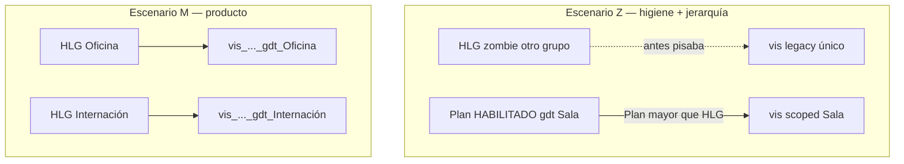
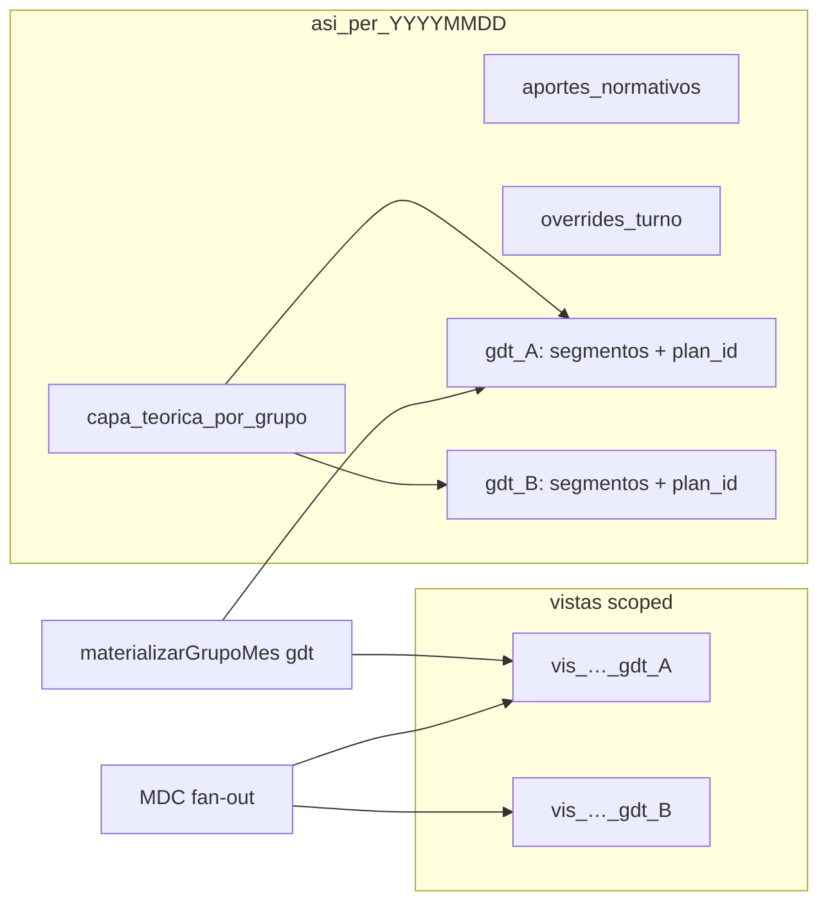

# Plan maestro — Grilla multi-HLG (Opción A)

**Épica:** Turnos compuestos / coberturas — bounded context por grupo de trabajo  
**Estado:** Implementación core **cerrada** (piloto junio 2026); deuda técnica residual documentada en §8  
**Rama de entrega:** `feat/epic-multi-hlg-fase1-execution`  
**Tag salvavidas:** `v2.2.0-pre-multi-hlg`  
**Última actualización:** 29 de mayo de 2026

---

## Documentos relacionados

| Documento | Rol |
|-----------|-----|
| [`HANDOFF_SESION_2026-05-29_MATERIALIZACION_PLAN_VS_HLG.md`](./HANDOFF_SESION_2026-05-29_MATERIALIZACION_PLAN_VS_HLG.md) | Incidente piloto (escenario **Z**) que motivó la épica |
| [`RFC_GRILLA_APROBADA_PLAN_TURNO_V2.md`](./RFC_GRILLA_APROBADA_PLAN_TURNO_V2.md) | Snapshot `grilla_aprobada` en `plt_*` — Plan > HLG en aprobación |
| [`CAPA_TEORICA_SEGMENTOS_V2.md`](./CAPA_TEORICA_SEGMENTOS_V2.md) | Segmentos SoT, cobertura parcial, contrato `capa_teorica` |
| [`ANEXO_ALINEACION_RDA_GEMINI_V6_A_V2.md`](./ANEXO_ALINEACION_RDA_GEMINI_V6_A_V2.md) | Mandato RDA: `asi_*` diario + `vis_*` mensual |
| [`RFC_SOLICITUD_GRUPOS_TRABAJO_INVOLUCRADOS_V2.md`](./RFC_SOLICITUD_GRUPOS_TRABAJO_INVOLUCRADOS_V2.md) | Fan-out MDC multi-`gdt` vía `grupos_trabajo_involucrados_ids` |
| [`OLEADA_C2_HOJA_RUTA_GSO_EQUIPO.md`](./OLEADA_C2_HOJA_RUTA_GSO_EQUIPO.md) | Grilla equipo jefe — lectura por `gdt` |
| [`PLAN_CAPA_TEORICA_ASISTENCIA_V2.md`](./PLAN_CAPA_TEORICA_ASISTENCIA_V2.md) | Motor materialización — addendum Fase 6 multi-HLG |
| [`RFC_CIERRE_PERIODO_LIQUIDACION_V2.md`](./RFC_CIERRE_PERIODO_LIQUIDACION_V2.md) | Freeze en `vis_*` (ahora scoped por `gdt`) |

---

## 1. Resumen ejecutivo

### 1.1 Problema

En pre-producción, agentes con **varios cargos vigentes** (varios `historial_laboral_grupos` / `gdt_*`) provocaban que la materialización **fusionara** todos los HLGs de la persona en un único `vis_*` y un `capa_teorica` plano en `asi_*`. Eso **pisaba** la foto del plan mensual aprobado cuando un HLG “zombie” marcaba el día como laborable (incidente CHAPARRO, junio 2026).

### 1.2 Decisión arquitectónica — Opción A (aprobada)

**Un bounded context por `gdt_*`:** cada grupo de trabajo tiene su propia vista mensual (`vis_*`) y su slice de capa teórica en `asi_*`. No se fusionan cargos en una sola grilla operativa.

| Opción | Descripción | Veredicto |
|--------|-------------|-----------|
| **A** | `vis_*` + lecturas/escrituras scoped por `gdt_*` | **Adoptada** |
| B | Colección agregada `vis_grupo_*` | Descartada (complejidad sin beneficio en pre-prod) |
| Fusión global | Un `vis_*` por persona/mes | **Prohibida** — deuda eliminada en Fase 5 |

**Principio DDD:** el jefe de Internación no debe leer ni mutar un documento que pueda ser alterado por el contexto de Urgencias. Si LOKITO trabaja en ambos servicios, existen **dos** documentos `vis_*` independientes.

### 1.3 Taxonomía Z / P / M

Separación de tres clases de problemas que antes se mezclaban:

| Escenario | Nombre | Descripción | Resolución en Opción A |
|-----------|--------|-------------|------------------------|
| **Z** | **Zombie** | HLG obsoleto o de otro servicio que gana en fusión global y pisa el plan | **Plan > HLG** al materializar **dentro del `gdt` del plan** + scope estricto por grupo |
| **P** | **Planificado** | Foto mensual en `plt_*` / `grilla_aprobada` — verdad histórica del servicio | Materialización escribe en `vis_*` y `capa_teorica_por_grupo[gdt]` del **mismo** `gdt` del plan |
| **M** | **Multicargo real** | Persona con dos cargos vigentes el mismo día (ej. Oficina + Internación) | **Dos** `vis_*` + **dos** entradas en `capa_teorica_por_grupo`; UI titular elige contexto activo |



### 1.4 Reglas transversales (no negociables)

1. **Sin retrocompat en runtime:** `buildVisDocumentId` exige `gdt_*`; no hay fallback al ID `vis_YYYY_MM_per_ULID`.
2. **Deploy conjunto:** functions + hosting que consumen `grupo_trabajo_id` en el mismo release.
3. **Plan > HLG:** en materialización del grupo del plan, la foto del día en `plan.agentes[].dias` protege `no_laborable` / `franco`.
4. **Prohibido leer `capa_teorica` raíz en código nuevo** — usar `resolverCapaTeoricaGrupo(asiData, gdtId)`.
5. **Prohibido reintroducir fusión cross-grupo** en worker, MDC o UI.

---

## 2. Modelo de datos

### 2.1 Vista mensual — `vistas_grilla_mes_agente`

**Contrato de ID (único formato válido):**

```text
vis_{YYYY}_{MM}_per_{ULID}_gdt_{ULID}
```

Ejemplo piloto:

```text
vis_2026_06_per_01KQN9WXFXF69Z9DCT5YNJ3TFZ_gdt_01KQA6QCA8TDQK9YBTHKYA4R2V
```

| Campo | Tipo | Notas |
|-------|------|-------|
| `persona_id` | `per_*` | Titular |
| `grupo_de_trabajo_id` | `gdt_*` | Bounded context |
| `anio`, `mes` | number | Período calendario |
| `dias.{DD}` | map | `rda_ingreso`, `rda_egreso`, `es_franco`, `eventos[]`, etc. |
| `metadata.version_token` | timestamp | Concurrencia optimista (outbox) |
| `estado_periodo_liquidacion_id` | FK cfg | Freeze por **este** `gdt` (ver KI-2) |

**Builder canónico:** `functions/modules/shared/mdcRdaDocumentIds.js` → `buildVisDocumentId(personaId, fechaYmd, grupoTrabajoId)`.

**IDs legacy (obsoletos):** `vis_{YYYY}_{MM}_per_{ULID}` — purgados en pre-prod vía [`scripts/purge-vis-legacy.mjs`](../../scripts/purge-vis-legacy.mjs).

### 2.2 Asistencia diaria — `asistencia_diaria`

**ID:** `asi_{per_ULID}_{YYYYMMDD}` — **uno por persona y día** (no se parte por grupo).

**Mapa por bounded context (SoT operativa por cargo):**

```json
{
  "persona_id": "per_01KQN9WXFXF69Z9DCT5YNJ3TFZ",
  "fecha": "2026-06-10",
  "aportes_normativos": { "...": "MDC licencias — transversal" },
  "overrides_turno": [],
  "capa_teorica_por_grupo": {
    "gdt_01KQA6QCA8TDQK9YBTHKYA4R2V": {
      "hlg_id": "hlg_…",
      "regimen_horario_id": "cfg_reg_…",
      "plan_id": "plt_01KSSPY2H5EZA925FQP4S1G2XW",
      "tipo_dia": "laborable",
      "segmentos": [],
      "turno_compuesto_id": "cfg_reg_turno_01_manana+…",
      "ingreso_teorico_final": "08:00",
      "egreso_teorico_final": "06:00",
      "origen": "plan_mensual",
      "materializado_en": "2026-05-29T…"
    }
  }
}
```



### 2.3 Reglas de escritura Firestore (T1)

| Preferido | Evitar |
|-----------|--------|
| `update({ [\`capa_teorica_por_grupo.${gdtId}\`]: slice })` | `set` con merge que reemplace el mapa entero |
| Borrado slice (E8): `FieldValue.delete()` en path dinámico | Borrar doc `asi_*` completo |

**Helper de lectura:** `functions/modules/shared/capaTeoricaPorGrupoCore.js` → `resolverCapaTeoricaGrupo(asiData, gdtId)`.

### 2.4 Campo obsoleto — `capa_teorica` (raíz)

| Estado | Detalle |
|--------|---------|
| Escritura | El worker **ya no escribe** `capa_teorica` plano en el path nuevo |
| Lectura legacy | Algunos gates aún hacen fallback — **Paso 2 pendiente** |
| BD | Puede existir en docs históricos — strip planificado (`strip-capa-teorica-legacy.mjs`) |

### 2.5 Plan de turno — `planes_turno_servicio`

- `grilla_aprobada`: snapshot inmutable al habilitar (VER plan).
- `materializarGrupoMes({ grupoId: plan.grupo_id })` escribe `vis_*` y slices **solo** de ese `gdt`.
- La grilla operativa (`vis_*` / `asi_*`) **puede divergir** del snapshot tras overrides o licencias; el snapshot **no** cambia.

### 2.6 Flujo de lectura UI

| Pantalla | Callable / fuente | Requiere `grupo_trabajo_id` |
|----------|-------------------|----------------------------|
| Titular multicargo | `obtenerVistaGrillaMesAgente` | **Sí** — selector obligatorio |
| Equipo jefe | `listarVistaGrillaMesPorGrupo` | **Sí** — `gdt` del panel |
| VER plan RRHH | `obtenerVistaPlanTurnoServicio` → `grilla_aprobada` | Implícito en `plt_*` |
| Cobertura parcial | `obtenerCapaTeoricaDia` | **Sí** |

---

## 3. Matriz de edge cases (E1–E20)

Referencia para QA y code review. **Comportamiento esperado** tras Opción A.

### 3.1 Críticos

| ID | Escenario | Comportamiento esperado | Mitigación / estado |
|----|-----------|-------------------------|---------------------|
| **E1** | Materializar Grupo A luego B el mismo día | Cada uno escribe solo su clave en `capa_teorica_por_grupo` y su `vis_*` | Dot-path write; remat idempotente — **✅ implementado** |
| **E2** | `overrides_turno[]` sin `grupo_de_trabajo_id` | Override de Internación no altera slice Urgencias | Tag en registro + filtro en worker — **⚠️ pendiente** |
| **E3** | Outbox / batch sin `grupo_id` | Error `[BATCH-007]`; no rematerializar a ciegas | Validación FE + BE — **✅ implementado** |
| **E4** | `assertConcurrenciaVis` / `version_token` | Token del `vis_*` del **grupo activo** | `buildVisDocumentId(pid, fecha, gdt)` — **✅ implementado** |
| **E5** | `obtenerCapaTeoricaDia` sin gdt | Rechazo `PARAMS_INVALIDOS` | Param obligatorio — **✅ implementado** |
| **E6** | `listarContextoPlanGrupo` licencias | Lee `vis_*` scoped del `plan.grupo_id` | **✅ implementado** |

### 3.2 Altos

| ID | Escenario | Comportamiento / decisión |
|----|-----------|---------------------------|
| **E7** | `estado_periodo_liquidacion_id` por `vis_*` | Cierre puede existir en un `gdt` y no en otro; consultar freeze del **contexto activo** (ver KI-2) |
| **E8** | Deshabilitar HLG / `fecha_fin` mid-month | Borrar `capa_teorica_por_grupo[gdtX]` en días futuros; dejar de escribir `vis_*` de ese gdt |
| **E9** | Revert plan HABILITADO → EN_REVISION | `materializarGrupoMes` post-eliminar **no** borra slices de **otros** gdt |
| **E10** | Cobertura parcial titular + cobertura mismo gdt | Batch rematerializa ambos con el **mismo** `grupo_id` del contexto grilla |
| **E11** | Gate `depende_rda` sin plan HABILITADO en gdt ancla | Usar `capa_teorica_por_grupo[gdt_ancla]`; no aceptar capa solo en otro gdt — **⚠️ gate legacy pendiente** |

### 3.3 Medios

| ID | Escenario | Tratamiento |
|----|-----------|-------------|
| **E12** | LAO aprobada → nuevo HLG/gdt después | Known Issue KI-1; hook proyección best-effort — **⚠️ no implementado** |
| **E13** | Mismo día laborable en 2 gdt (M real) | 2 `vis_*` + 2 slices; UI titular elige contexto; **no** colapsar |
| **E14** | Feriado: `laborable+es_feriado` vs `no_laborable` | Regla actual del worker en `vis_*`; auditoría separada |
| **E15** | `invalidado_por_replanificacion` en overrides | Invalidar overrides **del gdt** al re-aprobar plan del grupo |
| **E16** | Outbox localStorage pre-deploy | TTL / descartar ops sin `grupoId` al recuperar |
| **E17** | Modo SECTOR RRHH | Mismo contrato: `listarVistaGrillaMesPorGrupo` ancla por `gdt` elegido |

### 3.4 Bajos / observabilidad

| ID | Escenario | Nota |
|----|-----------|------|
| **E18** | Purge masivo `vis_*` legacy | Batches 500 ops; `--dry-run` default — **✅ script en repo** |
| **E19** | Persona sin HLG en gdt pero en listado equipo | Fila `existe: false` |
| **E20** | `rematerializarPostCalendario` | Itera `materializarGrupoMes` por grupo — compatible |

---

## 4. Definition of Done (DoD)

Checklist de cierre de épica. Marcar en PR / release notes.

### 4.1 Contrato e implementación

- [x] `buildVisDocumentId(persona, ymd, gdt)` — sin fallback legacy
- [x] Worker: HLG filtrado por `gdt`, Plan > HLG, write `vis_*` scoped
- [x] Worker: write `capa_teorica_por_grupo.${gdt}` vía dot-path (T1)
- [x] Callables grilla exigen `grupo_trabajo_id`
- [x] MDC fan-out multi-`gdt` vía `grupos_trabajo_involucrados_ids`
- [x] Outbox / batch: `context.grupo_id` obligatorio (`[BATCH-007]`)
- [x] UI titular: selector multicargo + lazy load al cambiar `gdt` (T2)
- [x] Purga `vis_*` sin `_gdt_` (Fase 5)
- [ ] Strip campo `capa_teorica` raíz en `asi_*` (Fase 5b)
- [ ] Gates: `grillaTurnoEntornoGate` + eliminar fallback legacy en `obtenerCapaTeoricaDia`
- [ ] `overrides_turno[].grupo_de_trabajo_id` + filtro materialización (E2)
- [ ] Hook `proyectarAportesNormativosVisGrupo` best-effort (T3 / KI-1)
- [ ] Scripts audit/smoke actualizados (`audit-fase4-6`, `rematerializar-vis-turno-teorico`)
- [ ] Cero lecturas de `capa_teorica` raíz en código productivo (grep gate en PR)

### 4.2 Matriz de control manual (10 puntos — sign-off QA)

Ejecutar antes de merge a `main`.

| # | Caso | Verificar | Estado piloto |
|---|------|-----------|---------------|
| 1 | CHAPARRO junio Internación | `grilla_aprobada` = `vis_*` scoped = slice `asi_*` (NL / 08–14 / F) | ⚠️ junio OK; mayo sin remat |
| 2 | MOSTO LAO + GS-A en días distintos | Eventos MDC en `vis_*` del `gdt` correcto | ⚠️ parcial |
| 3 | LOKITO régimen planificado / compuesto | Sin regresión turnos compuestos | ⚠️ pendiente doc |
| 4 | Outbox cobertura parcial | Token concurrencia + remat con `gdt` | ✅ smoke dev |
| 5 | Titular multicargo | Cambiar `gdt` recarga otro calendario; Oficina vacío si sin plan | ✅ MOSTO jun 2026 |
| 6 | Rehabilitar / eliminar plan | No pisa `vis_*` de otro `gdt` | ⚠️ pendiente |
| 7 | Solicitud `depende_rda` | Gate OK con capa en `gdt` ancla o plan HABILITADO | ❌ gate legacy |
| 8 | Grilla equipo jefe | `listarVistaGrillaMesPorGrupo` coherente con materialización | ⚠️ pendiente |
| 9 | Override jefe | Solo muta `asi_*`/`vis_*` del contexto; snapshot plan intacto | ⚠️ pendiente |
| 10 | Período liquidado | `assertPeriodoNoCerrado` scoped al `gdt` activo | ✅ fix gate jun 2026 |

### 4.3 Operaciones pre-prod ejecutadas

| Acción | Script | Resultado |
|--------|--------|-----------|
| Materializar junio 2026 Sala | `materializar-grupo-mes.mjs` | 90 días-procesados (3 agentes × 30) |
| Verificar agente | `verificar-vis-mes-agente.mjs` | MOSTO/CHAPARRO 30/30 celdas |
| Purga vis legacy | `purge-vis-legacy.mjs --apply` | 8 docs borrados; 3 scoped conservados |
| Deploy | `firebase deploy --only "functions,hosting"` | ✅ |

---

## 5. Known Issues (fuera de alcance de esta épica)

Documentados explícitamente para evitar tickets “bug” futuros.

| ID | Título | Descripción | Mitigación actual | Épica futura |
|----|--------|-------------|-------------------|--------------|
| **KI-1** | Licencia antes de alta HLG en nuevo `gdt` | LAO aprobada hoy; semana próxima nuevo cargo → `vis_*` nuevo nace sin `eventos[]` históricos | Hook `proyectarAportesNormativosVisGrupo` post-mat (**pendiente**) | Replay MDC dirigido al alta HLG |
| **KI-2** | Cierre liquidación multi-`gdt` | `estado_periodo_liquidacion_id` vive en cada `vis_*`; un cargo puede estar cerrado y otro abierto | Freeze consultado por **contexto activo** | Cierre coordinado RRHH multi-cargo |
| **KI-3** | Replay MDC retroactivo masivo | Re-proyectar todas las licencias históricas al crear HLG | No automatizado | Rediseño MDC / licencias |

---

## 6. Scripts operativos

| Script | Uso |
|--------|-----|
| [`materializar-grupo-mes.mjs`](../../scripts/materializar-grupo-mes.mjs) | `--gdt=gdt_* --periodo=YYYY-MM` — rematerialización batch |
| [`verificar-vis-mes-agente.mjs`](../../scripts/verificar-vis-mes-agente.mjs) | Auditoría post-mat por persona/`gdt`/mes |
| [`purge-vis-legacy.mjs`](../../scripts/purge-vis-legacy.mjs) | Purga `vis_*` sin `_gdt_` (`--dry-run` default) |
| `strip-capa-teorica-legacy.mjs` | **Pendiente** — delete campo `capa_teorica` raíz |

---

## 7. Piloto de referencia

| Campo | Valor |
|-------|--------|
| Plan | `plt_01KSSPY2H5EZA925FQP4S1G2XW` |
| Grupo | Sala Internación 1 — `gdt_01KQA6QCA8TDQK9YBTHKYA4R2V` |
| Período | `2026-06` |
| Agentes smoke | MOSTO `per_01KQN9WXFXF69Z9DCT5YNJ3TFZ`, CHAPARRO `per_01KQQJA5Q1VKBTJ74RHQ0HSHSB` |
| DNI piloto habitual | 28914247 (MOSTO) |

---

## 8. Roadmap post-épica (Pasos 2–4 acordados)

Orden de estabilización **antes** de merge a `main`:

1. **Paso 2 — Limpieza y gates:** strip `capa_teorica` + `grillaTurnoEntornoGate` + overrides E2 + eliminar fallbacks legacy.
2. **Paso 3 — Paridad histórica:** materializar **mayo 2026** scoped para grupos con plan HABILITADO.
3. **Paso 4 — QA + merge:** completar matriz §4.2 (ítems 6–10) → merge `feat/epic-multi-hlg-fase1-execution` → `main`.

---

## 9. Anti-patrones (lista roja)

| Anti-patrón | Por qué está prohibido |
|-------------|------------------------|
| `buildVisDocumentId(pid, fecha)` a 2 args | Genera o asume IDs legacy |
| Leer `asi.capa_teorica` en código nuevo | Mezcla cargos; ignora bounded context |
| Fusionar HLGs de distintos `gdt` en un batch | Reintroduce escenario Z |
| Dual-read vis legacy + scoped | Enmascara bugs; ya purgado en BD |
| Deploy functions sin hosting (o viceversa) en release multi-HLG | 404 masivos / `PARAMS_INVALIDOS` |

---

## 10. Historial

| Fecha | Evento |
|-------|--------|
| 2026-05-29 | Handoff incidente Plan vs fusión multi-HLG (escenario Z) |
| 2026-05-29 | Voto arquitectónico Opción A; plan consolidado |
| 2026-05-29 | Fases 1–4 implementadas; deploy conjunto |
| 2026-05-29 | Piloto junio validado; purge 8 `vis_*` legacy |
| 2026-05-29 | Este documento — biblia de referencia |

---

*Mantenimiento:* cualquier PR que toque materialización, grilla, MDC o gates de ticketera debe referenciar este plan y actualizar la matriz E1–E20 si introduce un caso nuevo.
