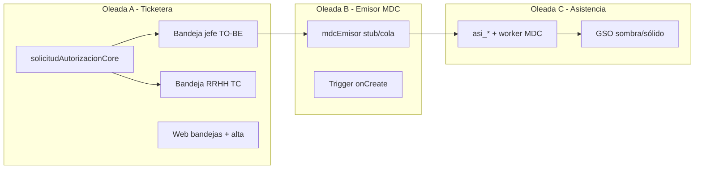
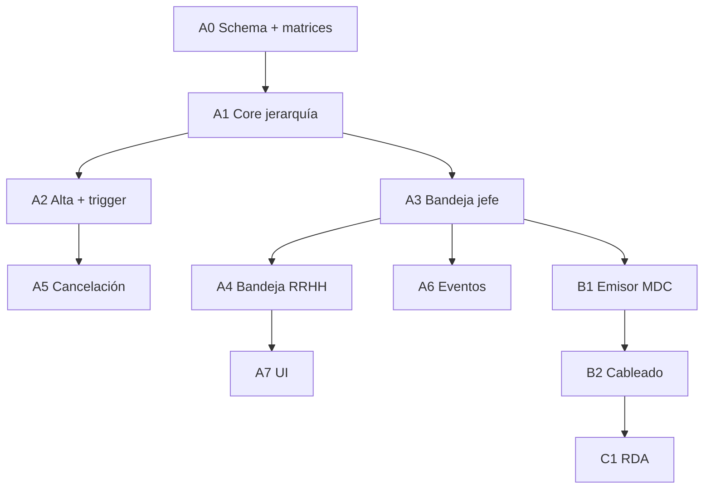

# Plan de implementación — RFC autorización y toma de conocimiento

**Estado:** plan vivo · **2026-05-20** · Oleada **B** MDC worker en `functions/modules/shared/mdc*.js`  
**Handoff sesión:** [`HANDOFF_SESION_2026-05-19_AUTORIZACION_TICKETERA.md`](./HANDOFF_SESION_2026-05-19_AUTORIZACION_TICKETERA.md)  
**Contrato:** [`RFC_TICKETERA_AUTORIZACION_TOMA_CONOCIMIENTO_V2.md`](./RFC_TICKETERA_AUTORIZACION_TOMA_CONOCIMIENTO_V2.md)  
**AS-IS clave:** jefe aprueba → `cfg_esa_en_revision_rrhh`; RRHH aprueba → `cfg_esa_aprobada`; bypass RRHH en bandeja jefe ([`solicitudBandejaJefeCore.js`](../../functions/modules/shared/solicitudBandejaJefeCore.js)).

**Regla de pausa (proyecto):** al cerrar cada sub-entregable A1–A5, B1, C1… detener hasta prueba en navegador/emulador antes del siguiente bloque.

---

## Coordinación con otros planes (2026-05-19)

| Frente | Acción |
|--------|--------|
| [`HANDOFF_TICKETERA_PAUSA_2026-05-19_FASE2-4.md`](./HANDOFF_TICKETERA_PAUSA_2026-05-19_FASE2-4.md) | MVP bandejas documentado; §4 producto **cerrado** en RFC |
| [`PLAN_TICKETERA_V2.md`](./PLAN_TICKETERA_V2.md) | Siguiente sprint = **Oleada A** (no P0 listado primero para piloto 64-A/B) |
| [`HANDOFF_SESION_2026-05-19.md`](./HANDOFF_SESION_2026-05-19.md) (datos laborales) | QA §9 recomendado **antes** de probar A3 en navegador |
| [`HANDOFF_SESION_2026-05-19_ROLES_HLC_CLAIMS.md`](./HANDOFF_SESION_2026-05-19_ROLES_HLC_CLAIMS.md) | Hecho — sin bypass `portal_role` |
| Configurador workflow (`pasos_aprobacion`, TC UI) | **No bloquear** Oleada A |
| [`PLAN_UNIFICACION_EVENTOS_RRHH_2026-05-06.md`](./PLAN_UNIFICACION_EVENTOS_RRHH_2026-05-06.md) | Emitir eventos en **A6** junto con resolvers |

**Checklist oleadas:** A0 → A1 → A2 → A3 → (pausa QA jefe) → A4 → A5 → A6 → A7 → B → C.

---

## Oleada A — Motor autorización + bandejas (sin MDC real)

### A0 — Preparación (schema + docs prueba)

- Añadir constantes/códigos de error: `ELEG_SIN_HLG`, `PERMISOS_JERARQUICOS_CAMBIADOS`, `ORGANIGRAMA_CICLICO` en módulo compartido (p. ej. junto a [`solicitudesArticuloEstados.js`](functions/modules/shared/solicitudesArticuloEstados.js)).
- Documentar en [`web/SCHEMA.md`](web/SCHEMA.md) (o anexo RFC) campos nuevos `sol_*`: `grupo_trabajo_id_ancla`, `grupo_autorizacion_id`, `escalamiento_jerarquico_ids`, `autorizacion_rrhh_sustituta`, `version_id_aplicada`.
- Extender matrices: [`TICKETERA_SLICE_64A_MATRIZ_PRUEBAS_FASE3_JEFE.md`](./TICKETERA_SLICE_64A_MATRIZ_PRUEBAS_FASE3_JEFE.md) y Fase4 RRHH con casos H1–H8, R3, C3.

### A1 — Núcleo de resolución jerárquica (backend puro)

**Nuevo módulo** `functions/modules/shared/solicitudAutorizacionJerarquicaCore.js` (funciones puras + lecturas Firestore):

| Función | Responsabilidad |
|---------|-----------------|
| `resolverAutorizadoresElegibles(db, { titularPersonaId, grupoTrabajoIdAncla, fechaRefYmd })` | Algoritmo RFC §5.2: candidatos con `nivel < titular`, `MIN(nivel)`, set OR |
| `escalarGrupoPadre(db, gdtId, depth)` | Lee `grupos_de_trabajo.parent_group_id`; `MAX_DEPTH = 10` |
| `resolverCadenaAutorizacion(db, titular, ancla, fecha)` | Retorna `{ autorizadores_elegibles_ids, grupo_autorizacion_id, escalamiento_jerarquico_ids, autorizacion_rrhh_sustituta }` |

- Reutilizar helpers de vigencia HLg de [`solicitudBandejaJefeCore.js`](functions/modules/shared/solicitudBandejaJefeCore.js) (`hlgVigenteEnFecha`, `loadHlgRows`) — extraer a `solicitudHlgVigencia.js` si el archivo supera ~100 líneas.
- Tests unitarios en `functions/test/` (casos H1, H2, H4, H8 sin Firestore real si hay mocks; si no, script manual documentado).

**Criterio de done:** dado titular + `gdt` ancla + fecha, el set de autorizadores coincide con taller (incl. empate OR y escalamiento).

### A2 — Alta y trigger Patrón B

| Archivo | Cambio |
|---------|--------|
| [`solicitudPatronBAltaMotor.js`](functions/modules/shared/solicitudPatronBAltaMotor.js) / trigger [`solicitudArticuloPatronBOnCreate.js`](functions/triggers/solicitudArticuloPatronBOnCreate.js) | Persistir `version_id_aplicada`, `grupo_trabajo_id_ancla` (desde payload cliente), pre-calcular y guardar `autorizadores_elegibles_ids`, `grupo_autorizacion_id`, `escalamiento_jerarquico_ids`, `autorizacion_rrhh_sustituta` |
| [`previsualizarSolicitudPatronB.js`](functions/onCall/solicitudes/previsualizarSolicitudPatronB.js) + listado ingreso | **H5:** si titular sin HLg vigente en `fecha_desde` → `ELEG_SIN_HLG` antes de borrador |
| Web [`PatronB`](web/src/features/solicitudes/) (alta) | Selector `grupo_trabajo_id_ancla` cuando titular tiene >1 HLg vigente; enviar en create |

- Mantener descuento saldo en onCreate (sin cambio RFC §8.2).

### A3 — Bandeja jefe TO-BE

Refactor [`solicitudBandejaJefeCore.js`](functions/modules/shared/solicitudBandejaJefeCore.js):

| Comportamiento AS-IS | TO-BE |
|---------------------|-------|
| `esSubordinadoPorHlg` (cualquier superior) | `revisor ∈ autorizadores_elegibles` (snapshot en `sol_*` o re-cálculo en listado) |
| `rrhhBypass` en listado/resolver | **Eliminar** bypass; RRHH solo ve ítems si está en set elegible |
| Aprobar → `en_revision_rrhh` | Aprobar → **`cfg_esa_aprobada`** |
| Rechazar | Igual + reverso saldo |
| Resolver sin transacción en aprobar | **Transacción** + revalidación F3 contra HLg vigente |

- Callable [`resolverDecisionJefeSolicitud.js`](functions/onCall/solicitudes/resolverDecisionJefeSolicitud.js): quitar parámetro `rrhhBypass` (o ignorar con log deprecación).
- Huérfanas: listado jefe **no** muestra; flag `autorizacion_rrhh_sustituta` en `sol_*` para bandeja RRHH (A4).

### A4 — Bandeja RRHH TO-BE

Refactor [`solicitudBandejaRrhhCore.js`](functions/modules/shared/solicitudBandejaRrhhCore.js):

| Modo | Query / acción |
|------|----------------|
| **Visibilidad (R4)** | Listar por **todos** los `estado_solicitud_id` relevantes (filtro opcional en UI), no solo `en_revision_rrhh` |
| **TC formal** | Nuevo callable `registrarTomaConocimientoRrhhSolicitud` → no cambia estado sustantivo; campos `rrhh_toma_conocimiento_*` o evento |
| **Huérfana sustituta** | Si `autorizacion_rrhh_sustituta` y `en_revision_jefe`: `aprobar`/`rechazar` → `aprobada`/`rechazada` + reverso si rechaza |
| **Flujo normal** | Tras `aprobada`: solo botón **Registrar toma de conocimiento** (no segundo “Aprobar definitivo”) |

- Deprecar transición `en_revision_rrhh` en flujo 64-A/B nuevo (estado puede quedar en catálogo para datos legacy).

### A5 — Cancelación agente (C3)

- Callable `cancelarSolicitudPatronBAgente` (o ampliar existente): solo `borrador` | `en_revision_jefe`; reverso bolsa en transacción.
- Web: botón cancelar en mis solicitudes / detalle Patrón B.

### A6 — Eventos (opcional dentro de A, recomendado)

- Integrar [`eventosV2.js`](functions/modules/shared/eventosV2.js) en trigger onCreate y resolvers jefe/RRHH/TC:
  - `ART_SOLICITUD_CREADA`, `ART_SOLICITUD_ESTADO_CAMBIADO`, `ART_TOMA_CONOCIMIENTO_REGISTRADA`
- Payload B6: solo referencias (`sol_id`, estados, `gdt_id`, actores).

### A7 — UI web

| Pantalla | Cambio |
|----------|--------|
| [`BandejaJefeSolicitudes.jsx`](web/src/pages/BandejaJefeSolicitudes.jsx) | Copy “Aprueba cierra el trámite”; quitar suposición de paso RRHH; manejar errores `ESTADO_INVALIDO` / permisos cambiados |
| [`BandejaRrhhSolicitudes.jsx`](web/src/pages/BandejaRrhhSolicitudes.jsx) | Filtros multi-estado; CTA TC vs Aprobar/Rechazar según `autorizacion_rrhh_sustituta` |
| [`callables.js`](web/src/services/callables.js) | Nuevos callables TC / cancelar |

**Prueba piloto Oleada A:** DNI `28914247`, 64-A/64-B — recorrer H1 (dos jefes mismo nivel), H5 (sin HLg), R3 (huérfana simulada), C3 cancelación; validar que **no** aparece `en_revision_rrhh` en solicitudes nuevas.

---

## Oleada B — Emisor MDC (sin persistencia `asi_*`)

### B1 — Módulo worker MDC (implementado)

| Archivo | Rol |
|---------|-----|
| `mdcComandosConstants.js` | Comandos y colecciones |
| `mdcRdaDocumentIds.js` | Ids `asi_*`, `vis_*` |
| `mdcWorkerCore.js` | SSoT `asi_*` |
| `mdcFanOutVis.js` | Fan-out `vis_*` |
| `mdcGrillaHorariaGate.js` | Gate `depende_rda` |
| `mdcTicketeraEmisor.js` | Emisor async |

### B2 — Cableado (implementado)

| Punto | Comando |
|-------|---------|
| Trigger → `en_revision_jefe` | `PROYECTAR_PENDIENTE` |
| RRHH aprueba (MVP) | `CONSOLIDAR_APROBADO` |
| Rechazo jefe/RRHH | `REVERTIR_PROYECCION` |
| Preview `depende_rda` | gate 403 |

### B3 — Infra cola (futuro)

Tasks/PubSub si hace falta desacoplar el worker.

### B3 — Infra cola (cuando producto apruebe Tasks vs Pub/Sub)

- Function consumidora stub que marca comando procesado.
- DLQ + alerta si `mdc_consolidacion_pendiente` > N horas.

**Prueba Oleada B:** ver en logs/Firestore cola que cada transición dispara el comando correcto; aprobación jefe no bloquea aunque emisor falle (S2).

---

## Oleada C — Asistencia RDA + GSO (épica aparte)

Documento guía futuro: `RFC_MODULO_ASISTENCIA_RDA_GSO_V2.md` (aún no redactado).

| Paso | Entregable |
|------|------------|
| C1 | Colección RDA + reglas Firestore; `cfg_*` para `estado_instancia` PENDIENTE/APROBADO |
| C2 | Worker MDC: implementar handlers de §7 (proyección, consolidación, rollback, `recalcularVeredicto`) |
| C3 | Materialización `vis_*` (PF §2.5) |
| C4 | GSO: celdas sombra/sólido, tooltip, clic → bandeja jefe |
| C5 | Prueba R1: tras aprobar, celda día coherente en grilla piloto |

**Fuera de Oleada C en este plan:** TC superiores por burbujeo config (`niveles_burbujeo`), workflow configurable (Opción C), SLA.

---

## Orden recomendado y dependencias

**Rama sugerida Git:** `feature/rfc-autorizacion-oleada-a` (A completa) → `feature/mdc-emisor-oleada-b` → épica asistencia.

**Deploy:** tras cada oleada — `firebase deploy --only functions` (+ hosting si A7); no migrar datos legacy de `sol_*` en `en_revision_rrhh` sin script one-off acordado.

---

## Riesgos y mitigaciones

| Riesgo | Mitigación |
|--------|------------|
| Solicitudes en vuelo en `en_revision_rrhh` | Callable de lectura acepta legacy; nuevas altas no usan ese estado |
| Performance listado jefe (80 docs × HLg) | Cache autorizadores en `sol_*` al crear; listado filtra por `autorizadores_elegibles_ids` |
| RRHH pierde “cierre” en UI | Copy claro + TC obligatorio post-aprobada |
| MDC sin colección RDA | Oleada B solo cola/log; no romper aprobación (S2) |

---

## Criterios de aceptación globales

- RFC §2 decisiones 1–17 verificables en piloto 64-A/B.
- Matriz §11 casos **C** pasan en QA documentado.
- Sin bypass RRHH en bandeja jefe.
- Jefe aprueba → `cfg_esa_aprobada` directo (flujo normal).
- RRHH registra TC sin cambiar estado sustantivo (salvo huérfana).
- Contrato MDC encolado en Oleada B (aunque worker sea no-op).
