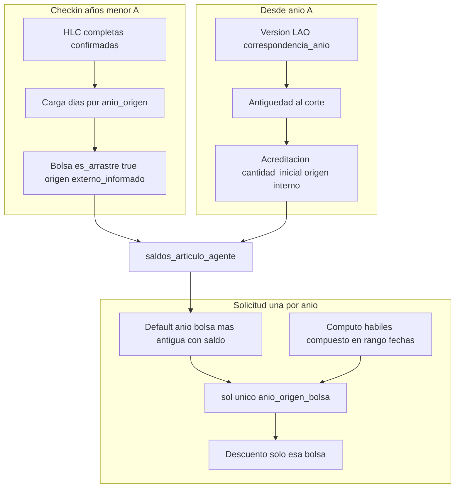

# Plan maestro — LAO bolsas, check-in y solicitudes (V2)

**Estado:** acordado en sesión 2026-05-15 (producto/RRHH). **Implementación:** por fases (RFCs al final).  
**Relación:** [`DECRETO_1919_89_ANTIGUEDAD_Y_LAO_V2.md`](./DECRETO_1919_89_ANTIGUEDAD_Y_LAO_V2.md), [`MODULO_ARTICULOS_V2_SCHEMA_PRODUCT_FIRST.md`](./MODULO_ARTICULOS_V2_SCHEMA_PRODUCT_FIRST.md) §4.1, [`ROADMAP_MOTOR_LAO_V2_POST_CHECKPOINT.md`](./ROADMAP_MOTOR_LAO_V2_POST_CHECKPOINT.md), handoff [`HANDOFF_SESION_2026-05-15.md`](./HANDOFF_SESION_2026-05-15.md).

---

## Decisiones cerradas (producto)

| Tema | Decisión |
|------|----------|
| Bolsas | Una bolsa LAO por `anio_origen` en `saldos_articulo_agente` (doc `sal_YYYY_per_…`, mapa `bolsas{}`). |
| Vencimiento | Ninguno hasta agotar: artículo `cfg_cad_nunca`; bolsa `fecha_vencimiento` = null. |
| Reinicio cupo | `cfg_rcc_nunca` (no renovación automática del mismo año). |
| Cómputo consumo | `cfg_rcd_habiles_compuesto` (+ `cfg_calendario_feriados_institucional`). |
| Origen artículo | `cfg_os_interno`; bolsas check-in con `origen_saldo_id` = `cfg_os_externo_informado` + `es_arrastre: true`. |
| Check-in vs motor | **Opción 1:** check-in solo años **&lt; A**; desde **A** solo acreditación por antigüedad/matriz. |
| **A** | **Año calendario de go-live del portal** (ej. go-live 2026 → check-in ≤ 2025; acreditación motor ≥ 2026). |
| Solicitudes | **Una solicitud = un solo año de bolsa** (`anio_origen_bolsa`). **Prohibido** repartir un mismo `sol_*` entre varias bolsas/años. Dos años → **dos solicitudes**. |
| FIFO | Al elegir año: portal **sugiere/bloquea** consumir primero la bolsa con menor `anio_origen` y `disponible > 0` (recomendación producto: **bloqueo** si existe saldo en año más viejo). **No** repartir días entre años en un trámite. |

---

## Configuración artículo LAO (versión por ejercicio)

- Un `articulo_id` (`LAO`).
- Versiones publicadas por año con `correspondencia_anio` = ejercicio (ej. versión **2024** para parametrización histórica; versiones ≥ **A** para acreditación viva).
- Parámetros fijos (Impacto y saldo + Avanzado): hábiles compuesto, `cfg_rcc_nunca`, `cfg_os_interno`, `cfg_cad_nunca`, `cfg_as_resta`, unidad días, `es_lao_anual`, matriz Art. 40 + corte **31/12** (salvo cambio RRHH).
- Referencia de carga similar a artículo piloto **64-A**: [`HANDOFF_SESION_2026-05-14.md`](./HANDOFF_SESION_2026-05-14.md).

### Tabla rápida configurador (todas las versiones LAO)

| Campo | Valor `cfg_*` / nota |
|--------|----------------------|
| Es LAO anual | true |
| Criterio de descuento | `cfg_rcd_habiles_compuesto` |
| Momento de reseteo | `cfg_rcc_nunca` |
| Origen saldo (artículo) | `cfg_os_interno` |
| Tipo de vencimiento | `cfg_cad_nunca` |
| Acción saldo | `cfg_as_resta` |
| Cupo fijo por ciclo | *(no usar; cupo por matriz + bolsas)* |

---

## Flujos de datos (objetivo)

---

## Reglas de solicitud (una por año)

1. `anio_origen_bolsa` obligatorio y único por solicitud (MVP: `web/src/pages/SolicitudLaoAlta.jsx`).
2. Validación: días hábiles compuesto del rango ≤ `disponible` de esa bolsa.
3. Prohibida lógica multi-bolsa en un mismo `sol_*`.
4. FIFO UX: preseleccionar año más antiguo con saldo; bloqueo recomendado si eligen año nuevo con saldo viejo pendiente.
5. Fechas de uso pueden ser calendario posterior al `anio_origen` (consumo **stock** de bolsa antigua).

---

## Check-in (años &lt; A)

| Campo / regla | Detalle |
|---------------|---------|
| Prerequisito | `hlc_confirmadas_completas` |
| Filas | `anio_origen`, `dias_disponibles`, observación fuente |
| Persistencia | `es_arrastre: true`, `origen_saldo_id: cfg_os_externo_informado` |
| Idempotencia | No duplicar año; si `consumido > 0` → ajuste manual RRHH |
| Año ≥ A | Rechazar en check-in |

Módulo check-in: **no implementado** en repo (depende ticketera).

---

## Acreditación (años ≥ A)

- Job o acción RRHH al publicar versión del año **A** (y ciclos siguientes).
- Cupo: matriz + Stock/Proporcional (`functions/modules/shared/laoPreviewMotor.js`).
- Bolsa: `es_arrastre: false`, `origen_saldo_id: cfg_os_interno`.
- **No sobrescribir** bolsas con `es_arrastre: true`.

---

## Brecha vs implementación actual

| Capacidad | Estado actual | Objetivo |
|-----------|---------------|----------|
| FIFO multi-año en un descuento | Roadmap | **No** aplicar; una bolsa por solicitud |
| Descuento trigger | Agregado preview motor | Días hábiles del rango |
| Check-in → saldos | No existe | RFC + UI RRHH |
| Acreditación anual | Parcial (preview) | Job apertura bolsa |
| Config LAO 2024 | Pendiente RRHH | Publicar versión |

---

## RFCs sugeridos (orden)

1. Plan estable (este doc) + **A** en config maestra (año go-live).
2. Check-in → `saldos_articulo_agente` (años &lt; A).
3. Acreditación anual (años ≥ A).
4. Solicitud LAO: una bolsa, hábiles rango, FIFO año (bloqueo).
5. Ajustes manuales RRHH post-consumo.

---

## Criterios de aceptación

- **T1:** Check-in 2023 (5 d) + 2024 (10 d); A=2026; solicitud `anio_origen_bolsa=2023`, ≤5 hábiles → solo bolsa 2023.
- **T2:** Más días → segundo `sol_*` con `anio_origen_bolsa=2024`.
- **T3:** Saldo 2023 &gt; 0 e intento solicitud 2024 → **bloqueo** (recomendado).
- **T4:** No arrastre 2026 si solo acreditación motor (opción 1).
- **T5:** Sin vencimiento por fecha (`cfg_cad_nunca`).
- **T6:** Preview proporcional coherente con bolsa acreditada (sin doble cupo).

---

## Próxima sesión

1. Cargar/publicar **versión LAO 2024** en configurador (matriz Art. 40 desde RRHH).
2. Fijar **A** (año go-live) en documentación institucional.
3. Abrir RFC check-in o alinear solicitud según prioridad ticketera.
