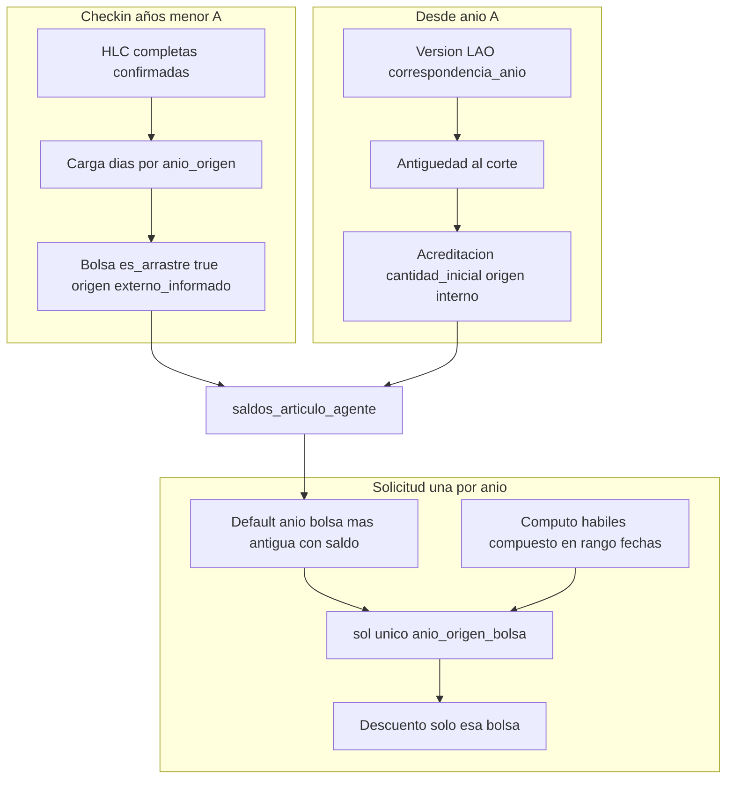

# Plan maestro — LAO bolsas, check-in y solicitudes (V2)

**Estado:** acordado en sesión 2026-05-15 (producto/RRHH). **Implementación:** por fases (RFCs al final).  
**Relación:** [`DECRETO_1919_89_ANTIGUEDAD_Y_LAO_V2.md`](./DECRETO_1919_89_ANTIGUEDAD_Y_LAO_V2.md), [`MODULO_ARTICULOS_V2_SCHEMA_PRODUCT_FIRST.md`](./MODULO_ARTICULOS_V2_SCHEMA_PRODUCT_FIRST.md) §4.1, [`RFC_SALDOS_PATRONES_ABC_V2.md`](./RFC_SALDOS_PATRONES_ABC_V2.md) §10, [`CASOS_BORDE_SALDOS_V2.md`](./CASOS_BORDE_SALDOS_V2.md), [`REGISTRO_FASE_DOCUMENTAL_SALDOS_ABC_V2.md`](./REGISTRO_FASE_DOCUMENTAL_SALDOS_ABC_V2.md), [`ROADMAP_MOTOR_LAO_V2_POST_CHECKPOINT.md`](./ROADMAP_MOTOR_LAO_V2_POST_CHECKPOINT.md), handoff [`HANDOFF_SESION_2026-05-15.md`](./HANDOFF_SESION_2026-05-15.md).

---

## Decisiones cerradas (producto)

| Tema | Decisión |
|------|----------|
| Bolsas | Una bolsa LAO por `anio_origen` en `saldos_articulo_agente` (doc `sal_YYYY_per_…`, mapa `bolsas{}`). |
| Vencimiento | Ninguno hasta agotar: artículo `cfg_cad_nunca`; bolsa `fecha_vencimiento` = null. |
| Reinicio cupo | `cfg_rcc_nunca` (no renovación automática del mismo año). |
| Cómputo consumo | `cfg_rcd_habiles_compuesto` (+ `cfg_calendario_feriados_institucional`). |
| Origen artículo | `cfg_os_interno`; bolsas check-in con `origen_saldo_id` = `cfg_os_externo_informado` + `es_arrastre: true`. |
| Check-in vs motor | **Opción 1:** check-in solo años **&lt; A**; desde **A** solo acreditación por antigüedad/matriz. |
| **A** | **Año calendario de go-live del portal.** El **número** se informa/indica **en el acto de check-in** (no config estática previa). Copy RRHH: *«A partir del año **A** inclusive en adelante…»* (motor); años **&lt; A** = carga histórica. Ej.: A=2026 → check-in ≤ 2025, motor ≥ 2026. |
| Solicitudes | **Una solicitud = un solo año de bolsa** (`anio_origen_bolsa`). **Prohibido** repartir un mismo `sol_*` entre varias bolsas/años. Dos años → **dos solicitudes**. |
| FIFO | Al elegir año: portal **sugiere/bloquea** consumir primero la bolsa con menor `anio_origen` y `disponible > 0` (recomendación producto: **bloqueo** si existe saldo en año más viejo). **No** repartir días entre años en un trámite. |

---

## Configuración artículo LAO (versión por ejercicio)

- Un `articulo_id` (`LAO`).
- Versiones publicadas por año con `correspondencia_anio` = ejercicio (ej. versión **2024** para parametrización histórica; versiones ≥ **A** para acreditación viva).
- Parámetros fijos (Impacto y saldo + Avanzado): hábiles compuesto, `cfg_rcc_nunca`, `cfg_os_interno`, `cfg_cad_nunca`, `cfg_as_resta`, unidad días, `es_lao_anual`, matriz Art. 40 + corte **31/12** (salvo cambio RRHH).
- Referencia de carga similar a artículo piloto **64-A**: [`HANDOFF_SESION_2026-05-14.md`](./HANDOFF_SESION_2026-05-14.md).
- **LAO 2024 publicado:** `art_01KRNYDN5WR7RER7MWXRZ817E7` / `ver_01KRNYDP14Y5V6F73DFXPBFATM` — ver [`HANDOFF_SESION_2026-05-15.md`](./HANDOFF_SESION_2026-05-15.md).
- **Regla A:** confirmada; valor numérico en **check-in** + copy acordado (ver tabla decisiones).
- **LAO 2024:** auditado RRHH 2026-05-15 (`ver_01KRNYDP14Y5V6F73DFXPBFATM`).
- **Estrategia versiones:** una versión **publicada** por cada `correspondencia_anio` (aunque la matriz sea idéntica). Backlog RRHH: [`LAO_VERSIONES_RRHH_BACKLOG.md`](./LAO_VERSIONES_RRHH_BACKLOG.md).

### Tabla rápida configurador (todas las versiones LAO)

| Campo | Valor `cfg_*` / nota |
|--------|----------------------|
| Es LAO anual | true |
| Criterio de descuento | `cfg_rcd_habiles_compuesto` |
| Momento de reseteo | `cfg_rcc_nunca` |
| Origen saldo (artículo) | `cfg_os_interno` |
| Tipo de vencimiento | `cfg_cad_nunca` |
| Acción saldo | `cfg_as_resta` |
| Cupo fijo por ciclo | *(no usar; cupo por matriz + bolsas)* |

---

## Flujos de datos (objetivo)

---

## Reglas de solicitud (una por año)

1. `anio_origen_bolsa` obligatorio y único por solicitud (MVP: `web/src/pages/SolicitudLaoAlta.jsx`).
2. Validación: días hábiles compuesto del rango ≤ `disponible` de esa bolsa.
3. Prohibida lógica multi-bolsa en un mismo `sol_*`.
4. FIFO UX: preseleccionar año más antiguo con saldo; bloqueo recomendado si eligen año nuevo con saldo viejo pendiente.
5. Fechas de uso pueden ser calendario posterior al `anio_origen` (consumo **stock** de bolsa antigua).

---

## Check-in (años &lt; A)

| Campo / regla | Detalle |
|---------------|---------|
| Prerequisito | `hlc_confirmadas_completas` |
| Filas | `anio_origen`, `dias_disponibles`, observación fuente |
| Persistencia | `es_arrastre: true`, `origen_saldo_id: cfg_os_externo_informado`, `version_id_origen` = versión con `correspondencia_anio` = `anio_origen` |
| Idempotencia | No duplicar año; si `consumido > 0` → ajuste manual RRHH |
| Año ≥ A | Rechazar en check-in |
| Versión por fila | Resolver `ver_*` publicada por `correspondencia_anio` (una por año) |

**RFC:** [`RFC_LAO_CHECKIN_SALDOS_V2.md`](./RFC_LAO_CHECKIN_SALDOS_V2.md) — callable `persistirCheckinLaoBolsas`.

---

## Acreditación (años ≥ A)

- Job o acción RRHH al publicar versión del año **A** (y ciclos siguientes).
- Cupo: matriz + Stock/Proporcional (`functions/modules/shared/laoPreviewMotor.js`).
- Bolsa: `es_arrastre: false`, `origen_saldo_id: cfg_os_interno`.
- **No sobrescribir** bolsas con `es_arrastre: true`.

**RFC:** [`RFC_LAO_ACREDITACION_ANUAL_V2.md`](./RFC_LAO_ACREDITACION_ANUAL_V2.md) — callable `acreditarLaoBolsaAgente` + hook publicación versión.

---

## Brecha vs implementación actual

| Capacidad | Estado actual | Objetivo |
|-----------|---------------|----------|
| FIFO multi-año en un descuento | Roadmap | **No** aplicar; una bolsa por solicitud |
| Descuento trigger | Agregado preview motor | Días hábiles del rango |
| Check-in → saldos | Callable [`persistirCheckinLaoBolsas`](./RFC_LAO_CHECKIN_SALDOS_V2.md) | UI ticketera |
| Acreditación anual | Callable [`acreditarLaoBolsaAgente`](./RFC_LAO_ACREDITACION_ANUAL_V2.md) + hook versión | Batch por agente |
| Config LAO 2024 | **Publicado y auditado** | Ver handoff 2026-05-15 |
| Resolver versión por `anio_origen` | `shared/utils/laoVersionResolver.js` | UI solicitud + triggers |
| Validación bolsa↔versión | Trigger solicitud LAO | Invariante §4.1 |
| FIFO año en solicitud | Trigger + UI | Bloqueo si saldo en año más viejo |

---

## RFCs (orden de implementación)

| # | RFC | Entregable |
|---|-----|------------|
| 1 | Plan estable (este doc) | **A** informado en check-in (no config maestra estática) |
| 2 | [`RFC_LAO_CHECKIN_SALDOS_V2.md`](./RFC_LAO_CHECKIN_SALDOS_V2.md) | Callable check-in + `version_id_origen` en bolsa |
| 3 | [`RFC_LAO_ACREDITACION_ANUAL_V2.md`](./RFC_LAO_ACREDITACION_ANUAL_V2.md) | Callable acreditación + hook `onCfgArticuloVersionWritten` |
| 4 | [`RFC_LAO_SOLICITUD_VERSION_FIFO_V2.md`](./RFC_LAO_SOLICITUD_VERSION_FIFO_V2.md) | Resolver versión, validación, FIFO |
| 5 | Ajustes manuales RRHH post-consumo | Pendiente ticketera |

---

## Smoke Fase 3 (check-in motor / saldos)

Script Admin (mismo contrato que callable `persistirCheckinLaoBolsas`): `scripts/lao-smoke-checkin-bolsas.mjs`.

- Dry-run: `npm run smoke:lao-checkin`
- Aplicar (proyecto del JSON de credenciales): `node scripts/lao-smoke-checkin-bolsas.mjs --apply`
- Opciones: `--dni=`, `--anio-a=2026`, `--articulo=`, `--2024-dias=`, `--2025-dias=`

**Solicitud (trigger `onSolicitudArticuloLaoMotorValidate`):**  
`npm run smoke:lao-solicitud` (dry-run) · `node scripts/lao-smoke-solicitud-borrador.mjs --apply --anio-bolsa=2024`  

Nota: el motor **stock** descontará `dias_base` de la matriz (~27); la bolsa debe tener `disponible` suficiente o la solicitud quedará rechazada (comportamiento correcto).

Ejemplo piloto DNI **28914247**: por defecto **10** días bolsa 2024 y **8** días bolsa 2025, **A=2026**.

---

## Criterios de aceptación

- **T1:** Check-in 2023 (5 d) + 2024 (10 d); A=2026; solicitud `anio_origen_bolsa=2023`, ≤5 hábiles → solo bolsa 2023.
- **T2:** Más días → segundo `sol_*` con `anio_origen_bolsa=2024`.
- **T3:** Saldo 2023 &gt; 0 e intento solicitud 2024 → **bloqueo** (recomendado).
- **T4:** No arrastre 2026 si solo acreditación motor (opción 1).
- **T5:** Sin vencimiento por fecha (`cfg_cad_nunca`).
- **T6:** Preview proporcional coherente con bolsa acreditada (sin doble cupo).

---

## Estados de bolsa y consumo (acordado 2026-05-16)

Alineado a [`RFC_SALDOS_PATRONES_ABC_V2.md`](./RFC_SALDOS_PATRONES_ABC_V2.md) §3 y §10:

| Transición | Cuándo |
|------------|--------|
| `cfg_esb_agotado` | Al confirmar consumo que deja `disponible === 0` en la bolsa (trigger post-inicio de trámite) |
| `cfg_esb_expirado` | Patrón B: job según `cfg_fechas_cierre_ciclo` por `reinicio_ciclo_id` — **no** aplica a LAO (Patrón A, `cfg_rcc_nunca`) |
| Reverso | Rechazo/anulación devuelve días a la bolsa de `_debito_origen` / `anio_origen_bolsa` (Caso 3 — implementación pendiente) |

**Prohibido en producto:** borrado físico de bolsas en `saldos_articulo_agente` salvo limpieza piloto auditada (handoff 2026-05-16).

**Consumo LAO:** al **iniciar trámite** (`onDocumentCreated` en `solicitudArticuloLaoOnCreate.js`); aprobación jefe no vuelve a descontar.

---

## Próxima sesión

**Pausa 2026-05-16** — Smoke Fase 3 ejecutado (piloto DNI 28914247): check-in bolsas 2024/2025, primera solicitud rechazada por saldo vs `dias_base` motor (~27); tras fix **`update`** en callable check-in sobre `sal_*` existente, segunda solicitud OK (`sol_01KRPV0R…`). Para dejar estado limpio, **se borraron en BD manualmente ambas bolsas** piloto (`saldos_articulo_agente` ese `per_*`). Al retomar: repetir check-in antes de nuevas pruebas T1–T6 si se requiere saldo fresco; opcional borrar docs `sol_*` de smoke en `solicitudes_articulo`.

1. ~~Publicar **LAO 2024**~~ — hecho (`ver_01KRNYDP…`).
2. ~~Regla **A**~~ — valor en check-in + copy acordado.
3. ~~LAO 2023~~ — `ver_01KRPPTZ86XK1GR4MNCJA804TE` (Firestore OK).
4. ~~**UI «Ver versiones»** por artículo~~ — cubierta (grilla + callable `listarVersionesCfgArticulo`).
5. ~~RRHH: **2025** y versión ejercicio **2026** (A de ejemplo piloto)~~ — `ver_01KRPT6XEF3MD46NZT9SKW42C4` en `art_01KRNYDN5WR7RER7MWXRZ817E7`.
6. ~~Registrar `version_id` LAO 2026 en backlog~~ — [`LAO_VERSIONES_RRHH_BACKLOG.md`](./LAO_VERSIONES_RRHH_BACKLOG.md).
7. Pruebas T1–T6 (callables desplegados).
8. UI ticketera: check-in y solicitud LAO (selector bolsas + FIFO).
9. ~~**Configurador — ayuda Impacto y Saldo (D2)**~~ — **hecho** 2026-05-16: ver [`REGISTRO_FASE_DOCUMENTAL_SALDOS_ABC_V2.md`](./REGISTRO_FASE_DOCUMENTAL_SALDOS_ABC_V2.md) §8.