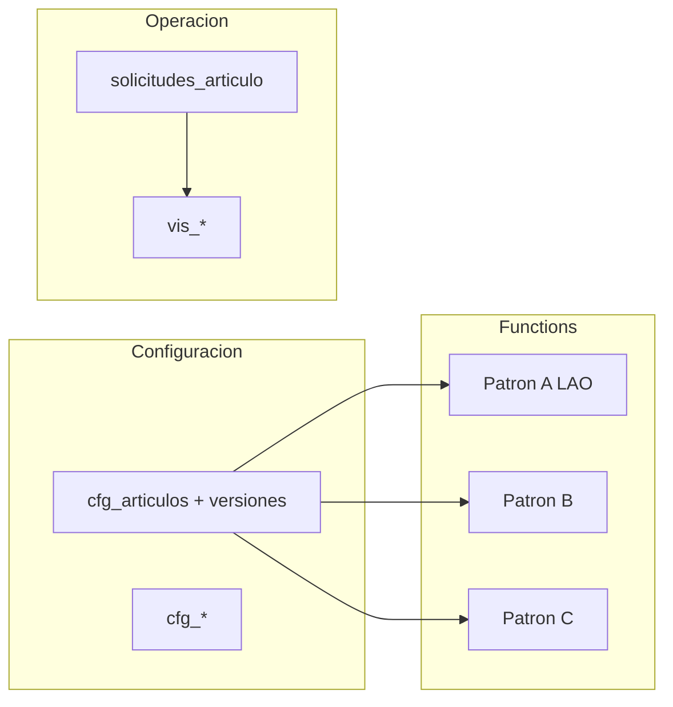
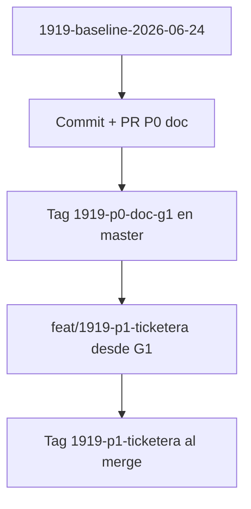

# Plan — Lineamientos Decreto 1919/89 y afinación del motor de solicitudes

**Estado épica:** **P0 listo para cierre formal** (auditoría doc 24-jun-2026) · **G1-doc cerrado** · pendiente acta RRHH + tag `1919-p0-doc-g1` · **P1** ticketera tras cierre P0.  
**Fuente normativa:** [Decreto 1919/89 — Santa Fe (SIN)](https://www.santafe.gov.ar/index.php/web/content/view/full/119989/decreto-191989-regimen-de-licencias-y-franquicias-del-personal-de-la-administracion-publica-provincial).  
**Handoff origen:** `[HANDOFF_SESION_2026-06-11_PLAN_LINEAMIENTOS_1919_MOTOR.md](./HANDOFF_SESION_2026-06-11_PLAN_LINEAMIENTOS_1919_MOTOR.md)`.  
**Changelog tags:** `[CHANGELOG_1919.md](./CHANGELOG_1919.md)`.

---

## 1. Objetivo y alcance

Alinear **cada artículo con impacto en ausencias** entre:

1. **Configurador** — `cfg_articulos` + `versiones` (7 bloques), solo `cfg_`* (regla de oro: **sin hardcode** de negocio).
2. **Motores** — Patrones A (LAO), B (cupos), C (horas).
3. **Operación** — ticketera, bandejas, `vistas_grilla_mes_agente`.

**Grilla pasiva:** unifica y valida teoría RDA, fichada y licencias; **no sugiere** artículos ni aplica sanciones.

---

## 2. Ecosistema documental (índice)

| Documento                                                                                                        | Rol                                                      |
| ---------------------------------------------------------------------------------------------------------------- | -------------------------------------------------------- |
| `[LINEAMIENTOS_DECRETO_1919_89_POR_ARTICULO_V2.md](./LINEAMIENTOS_DECRETO_1919_89_POR_ARTICULO_V2.md)`           | Fichas por artículo/inciso (tablas bloques 1–7 + grilla) |
| `[GUIA_POLITICA_DIA_VS_TRAMO_JUSTIFICACIONES_V2.md](./GUIA_POLITICA_DIA_VS_TRAMO_JUSTIFICACIONES_V2.md)`         | Política día vs tramo / asistencia                       |
| `[ANALISIS_IMPACTO_GRILLA_ARTICULOS_1919_V2.md](./ANALISIS_IMPACTO_GRILLA_ARTICULOS_1919_V2.md)`                 | Capas grilla 1/3/4, MDC, fichada                         |
| `[RFC_CONFIGURADOR_ARTICULOS_1919_EXTENSIONES_P0_V2.md](./RFC_CONFIGURADOR_ARTICULOS_1919_EXTENSIONES_P0_V2.md)` | Extensiones ABM (duelo, vigencias, ayudas)               |
| `[MODULO_CONFIGURACION_ARTICULOS_V2.md](./MODULO_CONFIGURACION_ARTICULOS_V2.md)`                                 | Contrato ABM §5.1 ciclo vida, §5.2 LAO                   |
| `[ARTICULOS_BASICOS_OPERATIVOS_V2.md](./ARTICULOS_BASICOS_OPERATIVOS_V2.md)`                                     | LAO, 64-A/B, 68-B piloto                                 |
| `[ACTA_RRHH_EPICA_1919_BLOQUE_E_V2.md](./ACTA_RRHH_EPICA_1919_BLOQUE_E_V2.md)`                                   | Acta oleada 63.c–k                                       |
| `[MATRIZ_ESCENARIOS_ARTICULOS_V2.md](./MATRIZ_ESCENARIOS_ARTICULOS_V2.md)`                                       | Escenarios → parámetros                                  |

---

## 3. Gates

| Gate         | Criterio                                     | Estado                           |
| ------------ | -------------------------------------------- | -------------------------------- |
| **G0**       | Grilla piloto estable                        | Cerrado                          |
| **G1**       | Índice + fichas oleada 63 + guía + acta RRHH | **G1-doc cerrado** (24-jun-2026); **G1 formal** pendiente firma acta + PR + tag |
| **G2**       | RFC schema (máx. 5 brechas)                  | Lista hecha; RFC P0 configurador |
| **G3**       | Código motor masivo                          | Tras G1 o RFC puntual            |
| **Baseline** | Tag `1919-baseline-2026-06-24` post-CHAPARRO | Cerrado                          |

### 3.1 Consolidación técnica (auditoría ecosistema — 24-jun-2026)

Criterios verificados sin contradicción entre plan, módulo, RFC P0, grilla, fichas y acta plantilla:

| Tema | Decisión documentada |
|------|----------------------|
| Regla de oro | Cero hardcode de negocio; reglas en `cfg_articulos` + `versiones` + `cfg_*` |
| Grilla | Pasiva: teoría RDA → MDC licencias → fichada; sin sugerencias ni sanciones automáticas |
| Bloque E (P2) | **63.c, 63.d, 63.i, 63.j, 63.k** — día entero exclusivo (`cfg_nod_exclusivo`); **63.a** en backlog |
| Cómputo motor B | **63.j** → `cfg_rcd_corridos`; resto oleada 63 → `cfg_rcd_habiles_compuesto` |
| RDA | `depende_rda: true` en los cinco incisos (turno teórico autorizado para ingreso) |
| Ocupación vs superposición | `nivel_ocupacion_dia_id` gobierna intradía / `tiene_conflicto` en fan-out; superposición entre artículos manual en bandeja P2 — no sustituye `cfg_nod_exclusivo` en esta oleada |
| 63.j modo degradado | `opciones_consumo_solicitud[]` en **versión** hasta UI P5; ticketera (P1) consume JSON genérico |
| ABM C5 | Sin delete físico; modificar-desde-X = nueva versión publicada; vigencias en schema (**preferencia implementación P5:** ventana en documento de **versión** para cambios normativos; núcleo para deshabilitación de artículo — ver RFC §2.5 y MODULO §5.1) |
| CHAPARRO + baseline | Merge previo a épica; tag `1919-baseline-2026-06-24` aplicado (`CHANGELOG_1919`) |

---

## 4. Restricciones no negociables

| Regla                      | Implicación                                                                                                                                                   |
| -------------------------- | ------------------------------------------------------------------------------------------------------------------------------------------------------------- |
| Sin hardcode negocio       | Reglas en `cfg_articulos` + versiones + `cfg_`*; quitar listas `art_*` en web (`solicitudesArticuloV2.js`) salvo invariantes técnicos                         |
| Sin compat BD atrás        | Limpieza piloto permitida; no romper shape `saldos_articulo_agente`                                                                                           |
| Check-in + **LAO Art. 40** | Patrones A/B/C, `resolvePatronSaldo`, bolsas, `LAO_ARTICULO_ID`; **un** `art_`* LAO, versiones por `correspondencia_anio` — sin refactor (§5.2 MODULO_CONFIG) |
| Elegibilidad / circuito    | Conservar `bloque_elegibilidad_filtros` y `circuito_ingreso_ids`                                                                                              |
| ABM completo               | Crear, modificar desde fecha X (nueva versión), deshabilitar desde fecha X; `vigente_desde`/`vigente_hasta`; sin delete físico                                |
| Grilla pasiva              | Sin auto-justificación ni sugerencias                                                                                                                         |

---

## 5. Checklist de ejecución

| ID               | Tarea                                                     | Estado           |
| ---------------- | --------------------------------------------------------- | ---------------- |
| md-lineamientos  | Fichas `LINEAMIENTOS` oleada 63.c–k                          | Hecho (G1-doc)   |
| guia-tramo       | `GUIA_POLITICA_DIA_VS_TRAMO_*`                            | Hecho            |
| rfc-config-p0    | `RFC_CONFIGURADOR_ARTICULOS_1919_EXTENSIONES_P0_V2.md`    | Hecho            |
| acta-rrhh        | `ACTA_RRHH_EPICA_1919_BLOQUE_E_V2.md` firmada             | Pendiente        |
| cross-links      | ANEXO §5, README, MATRIZ, MODULO                          | Hecho (jun-2026) |
| plan-merge       | Este plan ampliado                                        | Hecho (jun-2026) |
| tag-p0           | `1919-p0-doc-g1` tras PR merge                            | Pendiente        |
| pre-impl-b1-b7   | Protocolo §11.1 (commit P0, tag G1, rama P1)              | Pendiente        |
| p1-ticketera     | Deshardcode S1                                            | Pendiente        |
| p2-oleada-63     | Altas Firestore + UAT                                     | Pendiente        |
| p5-config-ui     | `opciones_consumo_solicitud[]`, vigencias ABM, C2         | Pendiente        |
| p6-grilla-franja | `licenciaCubreSegmento`, arts. 65–70 bis                  | Backlog          |

---

## 6. Contexto técnico repo

- **Configurador:** `[ArticuloConfigTabs.jsx](../web/src/features/configuracion/articulos/ArticuloConfigTabs.jsx)`, `[articulo.schema.js](../web/src/schemas/articulo.schema.js)`.
- **Motores:** LAO A; Patrón B (`runPatronBAltaMotorV2`); Patrón C (`runPatronCAltaMotorV2`).
- **Ticketera:** backend catálogo (`listarArticulosIngresoCore`); frontend aún con guards MVP.
- **MDC/grilla:** `mdcFanOutVis.js`, `licenciaCubreDiaFichada.js` (día entero hoy).

---

## 7. Entregable documental — plantilla ficha

Ver `[LINEAMIENTOS_DECRETO_1919_89_POR_ARTICULO_V2.md](./LINEAMIENTOS_DECRETO_1919_89_POR_ARTICULO_V2.md)`: bloques 1–7 + grilla + enlace asistencia + SARH.

**Oleada P2 justificaciones:** **63.c, 63.d, 63.i, 63.j, 63.k** (acta RRHH). **63.a** fuera.

**Prioridad fichas siguientes:** 52, 54 → 34–39 → médicas → franquicias horarias (65+ post P6).

---

## 8. Configurador — fases C0–C5

| Fase   | Contenido                                                                     |
| ------ | ----------------------------------------------------------------------------- |
| **C0** | Fichas, seeds `cfg_`*, gold en `docs/v2/seeds/` (P2)                          |
| **C1** | Quitar defaults negocio en código (LAO placeholders desde versión)            |
| **C2** | `variantes_sarh[]`, incompatibilidades, `texto_ayuda_`*, enlace lineamiento   |
| **C5** | Vigencias ABM, deshabilitar desde fecha, nueva versión desde fecha (§2.5 RFC) |
| **C4** | Advertencias coherencia horas/`cfg_nod_parcial` (solo RRHH en ABM)            |

**63.j:** `opciones_consumo_solicitud[]` en versión + wizard (sin tabla en TS).

---

## 9. Solicitudes — fases S1–S4

| Fase   | Contenido                                                               |
| ------ | ----------------------------------------------------------------------- |
| **S1** | `GuardArticuloIngreso` ∈ callable; `WIZARD_BY_PATRON`; quitar MVP lists |
| **S2** | LAO tile opcional vía catálogo (sin romper `LAO_ARTICULO_ID`)           |
| **S3** | Wizards B/C + ayudas cuando existan en versión                          |
| **S4** | Bandejas sin cambio de filtros; nuevos `codigo_grilla`                  |

### 9.1 S1 — Ticketera dinámica (decisión 24-jun-2026, Opción B)

**Rama:** `feat/1919-p1-ticketera` · tag cierre previsto: `1919-p1-ticketera`.

| Tema | Decisión |
|------|----------|
| Ruta alta | **Única:** `/portal/solicitudes/alta?articulo=art_*` (+ `fecha` opcional) |
| LAO | Rutas `/portal/solicitudes/lao` y `lao-formulario` **sin cambio** |
| Legacy | `/patron-b` y `/patron-c` → redirect a `/alta` con misma query |
| Guard | Validación **1:1** del `articulo` en query contra catálogo del provider (no `ids.some()`) |
| Despacho | `WIZARD_BY_PATRON[B|C]` → shells `TicketeraPatronB` / `TicketeraPatronC` (hooks existentes) |
| Provider | `Map<articulo_id, { patron_saldo, version_id, … }>` desde `listarArticulosIngresoAgente` |
| Menú | Quitar `articulosIngresoIds` MVP; `ticketeraSiempreVisible: true` |
| Constantes | Eliminar `ARTICULO_IDS_PATRON_*_MVP`; conservar `ARTICULO_64A_ID` etc. solo seeds/tests |
| Backend | Ya en modo `catalogo` (`ticketeraArticulosMvp.js` `ARTICULO_IDS_MVP = []`) |

**Archivos a tocar (web):**

- `web/src/features/solicitudes/ArticulosIngresoProvider.jsx` — mapa + `obtenerDatosArticuloElegible`
- `web/src/features/solicitudes/GuardArticuloIngreso.jsx` — query + redirect hub `?error=ELEG_NO_DISPONIBLE`
- `web/src/features/solicitudes/ticketeraRouteUtils.js` (+ test vitest intrusión URL)
- `web/src/features/solicitudes/ticketeraWizardRegistry.js`
- `web/src/pages/TicketeraAltaPage.jsx`
- `web/src/features/solicitudes/RedirectTicketeraAlta.jsx`
- `web/src/App.jsx`, `web/src/constants/modulosEstado.js`, `web/src/pages/TicketeraHub.jsx`
- `web/src/constants/solicitudesArticuloV2.js` — quitar arrays MVP

**Tests mínimos:** `ticketeraRouteUtils.test.js` — agente con solo 64-A en mapa → `art_68B` rechazado.

**Estado implementación:** commit `ef4ba9c` en `feat/1919-p1-ticketera` · PR [#8](https://github.com/jorgemosto1981/portal-hospital-v2/pull/8) · tag `1919-p1-ticketera` tras merge + smoke piloto.

---

## 10. Grilla y asistencia

Modelo: calendario → tramo → teoría/fichada → OK / incompleto / inasistencia → solicitud manual → MDC. Sanciones fuera del portal.

UAT plantilla: U1–U5 (config/solicitudes/grilla/check-in) + U6–U8 asistencia en `[GUIA_POLITICA_](./GUIA_POLITICA_DIA_VS_TRAMO_JUSTIFICACIONES_V2.md)*`.

**P6:** franjas horarias, `licenciaCubreSegmento`, `cfg_nod_parcial` en UI.

---

## 11. Proceso por paquetes P0–P6

| Paquete | Entregable clave                                   |
| ------- | -------------------------------------------------- |
| **P0**  | Fichas 63.c–k, guía, acta, tag `1919-p0-doc-g1`    |
| **P1**  | Tag `1919-p1-ticketera`                            |
| **P2**  | 5 `art_`* publicados, UAT MDC+GSO (mín. 2 incisos) — **cerrado 24-jun-2026** |

**Estado (24-jun-2026):** oleada 63 **completada** — merge `feat/1919-p2-oleada-63` + tag `1919-p2-oleada-63`.

| **P3**  | Smoke check-in si limpieza BD                      |
| **P4**  | 52, 54                                             |
| **P5**  | UI configurador + motores leen nuevos campos       |
| **P6**  | Grilla por tramo                                   |

**Gobernanza Git:** baseline + tags `1919-p0`…`p6`; PR por paquete; prefijo commit `1919:`.

**Firestore limpieza:** export `gs://<proyecto>-firestore-backups/epica_1919/`; RRHH firma antes de borrado; tag `1919-pre-firestore-clean` si hay scripts.

### 11.1 Pre-implementación, seguridad y restauración (obligatorio antes de P1+)

Objetivo: poder volver a un **punto conocido** (código +, si aplica, datos) sin adivinar commits.

#### A. Puntos de restauración Git (tags anotados)

| Tag | Cuándo crear | Restaurar código |
|-----|----------------|------------------|
| `1919-baseline-2026-06-24` | Ya aplicado (post-CHAPARRO, pre-épica código) | `git checkout 1919-baseline-2026-06-24` (detached) o rama `restore/1919-baseline` |
| `1919-p0-doc-g1` | **Inmediatamente después** del merge a `master` del PR P0 doc | Último estado **solo documentación** + plan §3.1 antes de ticketera |
| `1919-p1-ticketera` | Tras merge PR P1 (S1) + tests/smoke acordados | Antes de oleada Firestore P2 |
| `1919-pre-firestore-clean` | **Antes** de cualquier script de borrado/reseed piloto (P2/P12) | Par con export GCS (abajo) |
| `1919-p2-oleada-63` … `1919-p6-*` | Cierre de cada paquete | Rollback por paquete |

**Convención:** tags **anotados** (`git tag -a`) con mensaje que cite gate y commit; **push** explícito: `git push origin <tag>` (no asumir que el tag viajó solo con la rama).

#### B. Secuencia de arranque (orden estricto)

| Paso | Acción | Criterio de salida |
|------|--------|-------------------|
| **B0** | Confirmar tag local `1919-baseline-2026-06-24` y que `master` incluye fix CHAPARRO | `git tag -l '1919*'` · grilla tests verdes si se revalida |
| **B1** | En `feat/1919-p0-doc`: **commit único o serie** `1919:` con todo el doc pendiente (G1-doc + §3.1 + §11.1) | `git status` limpio en `docs/v2/` |
| **B2** | PR `feat/1919-p0-doc` → `master` (solo docs salvo acuerdo explícito) | Review + CI verde si aplica |
| **B3** | Acta RRHH firmada (puede ser **paralelo** a B1–B2; **bloqueante** solo para tag G1 si política institucional lo exige) | PDF/firma en acta o referencia en CHANGELOG |
| **B4** | En `master` post-merge: `git tag -a 1919-p0-doc-g1 -m "P0 doc G1 formal"` y push tag | Registro en `CHANGELOG_1919.md` |
| **B5** | `git checkout master` · `git pull` · `git checkout -b feat/1919-p1-ticketera` **desde** commit del tag G1 | Rama nueva; **no** codificar P1 en `feat/1919-p0-doc` |
| **B6** | Smoke mínimo pre-código P1 (regresión rápida) | p. ej. `npm test -- grillaPresentacionCompuestoUi`; listar artículos ingreso en piloto si hay entorno |
| **B7** | Primer commit P1 con prefijo `1919:` · PR acotado a S1 (ticketera) | Sin mezclar P2 Firestore en el mismo PR |

#### C. Restaurar sin perder historia

| Situación | Acción recomendada |
|-----------|-------------------|
| Abortar rama de trabajo | `git checkout master` · borrar rama local `feat/1919-p1-*` o dejarla; no merge |
| Deshacer merge ya en `master` | **Revert** del merge commit (`git revert -m 1 <merge_sha>`), nuevo PR; **no** `push --force` a `master` |
| Volver a baseline épica | Rama `restore/1919-baseline` desde tag `1919-baseline-2026-06-24` o cherry-pick selectivo |
| Deploy hosting/functions roto | Re-deploy desde commit del tag del paquete anterior (`1919-p0-doc-g1` o `1919-p1-ticketera`) según runbook Firebase del proyecto |

#### D. Datos (Firestore piloto) — solo cuando P2+ toque BD

1. Export nombrado (`epica_1919_YYYYMMDD`) al bucket acordado.  
2. Tag `1919-pre-firestore-clean` en el **commit** que contiene scripts/instrucciones de limpieza (si los hay).  
3. Acta RRHH / checklist §12.  
4. Tras cambios en saldos: **P3** smoke check-in obligatorio (`resolvePatronSaldo`, LAO, bolsas).

#### E. Checklist “listo para empezar P1” (una página)

- [ ] `1919-baseline-2026-06-24` existe (local y preferiblemente `origin`).  
- [ ] P0 doc commiteado; PR mergeado o merge inminente acordado.  
- [ ] Tag `1919-p0-doc-g1` en `master` (o fecha fijada para crearlo **antes** del primer commit de código P1).  
- [ ] Rama `feat/1919-p1-ticketera` creada desde ese punto.  
- [ ] Plan §4 intocables leídos (LAO, check-in, grilla pasiva).  
- [ ] Sin cambios mezclados de P2/P5 en el PR P1.

**Estado repo (24-jun-2026):** rama activa `feat/1919-p0-doc`; cambios doc en working tree **pendientes de commit** (B1); tag baseline local presente.

---

## 12. Limpieza BD (piloto)

1. Export / acta RRHH.
2. Borrar solicitudes/vis de prueba (opcional).
3. Recrear `cfg_articulos` desde fichas.
4. Re-check-in piloto si se tocan saldos.
5. No cambiar `art_`* LAO/64/68 sin plan.

---

## 13. Hoja de ruta macro (fases épica histórica)

| Fase | Contenido                                    |
| ---- | -------------------------------------------- |
| 0    | Documentación (este plan + LINEAMIENTOS)     |
| 1    | Motor B + ticketera dinámica                 |
| 2    | Proyección `vis_*`; LAO interrupción Art. 44 |
| 3    | RFC extensiones schema                       |
| 4    | Licencia médica integrada                    |
| 5    | Horas / franjas + RDA                        |

---

## 14. MVP épica “hecho”

- 63.c–k + 52 + 54 operativos con fichas.  
- Hub 100 % discovery por callable.  
- 64 / LAO / 68 sin regresión.  
- P6 documentado.

---

## 15. Riesgos

- SARH 1:N sin inventario completo.  
- 63.j sin `opciones_consumo_solicitud[]` en UI → piloto manual en bandeja.  
- Franjas 65+ antes de P6.  
- Modificatorias legales posteriores al 1989.

---

## 16. Changelog del plan

| Fecha      | Cambio                                                                                                       |
| ---------- | ------------------------------------------------------------------------------------------------------------ |
| 2026-06-11 | Planificación macro (handoff)                                                                                |
| 2026-06-24 | Merge épica: P0–P6, restricciones, ABM, LAO §5.2, oleada 63.c–k, grilla pasiva, tags, RFC configurador       |
| 2026-06-24 | Cross-links: README, ANEXO §5, PENDIENTES, HANDOFF addendum, CHANGELOG, ACTA plantilla; corrección MODULO §6 |
| 2026-06-24 | Auditoría consolidación ecosistema: G1-doc cerrado; §3.1 plan maestro |
| 2026-06-24 | §11.1 pre-implementación: tags, ramas, restauración Git/Firestore, checklist P1 |
| 2026-06-24 | §9.1 S1 Opción B: ruta `/solicitudes/alta`, guard 1:1, WIZARD_BY_PATRON |

