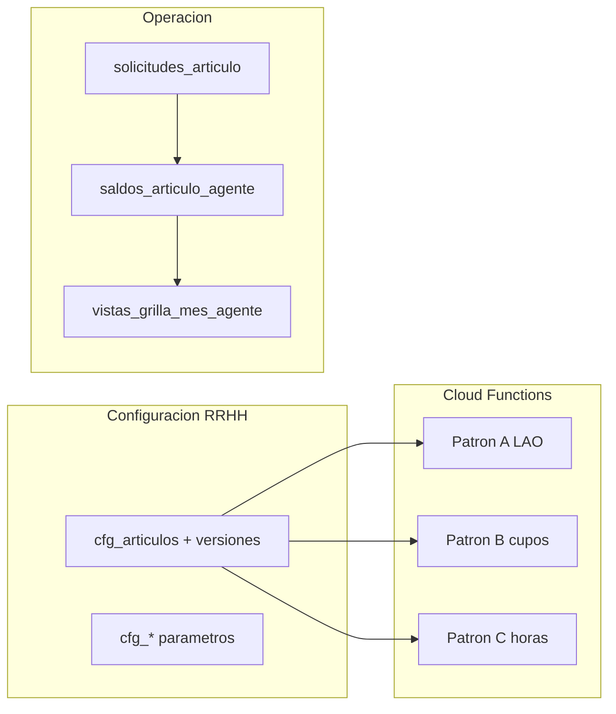

# Plan — Lineamientos Decreto 1919/89 y afinación del motor de solicitudes

**Estado:** **planificación cerrada** 2026-06-11 · ejecución Fase 0 (lineamientos MD) **pendiente** · sin código en la sesión de cierre.  
**Fuente normativa:** Decreto 1919/89 (PDF / SIN Santa Fe).  
**Handoff:** `[HANDOFF_SESION_2026-06-11_PLAN_LINEAMIENTOS_1919_MOTOR.md](./HANDOFF_SESION_2026-06-11_PLAN_LINEAMIENTOS_1919_MOTOR.md)`.

**Checklist de ejecución:**

| ID                | Tarea                                                                                                | Estado                       |
| ----------------- | ---------------------------------------------------------------------------------------------------- | ---------------------------- |
| md-lineamientos   | Redactar `LINEAMIENTOS_DECRETO_1919_89_POR_ARTICULO_V2.md` (ficha por artículo)                      | en curso (índice 2026-06-24) |
| cross-links       | Actualizar ANEXO_NORMATIVO, MODULO_CONFIGURACION_ARTICULOS, MATRIZ_ESCENARIOS                        | pendiente                    |
| gap-rfc-list      | Lista priorizada brechas schema (Art. 14, ámbitos carrera/episodio, plazos horarios, grilla horaria) | hecho (handoff §3)           |
| backlog-articulos | Backlog altas RRHH: 63 → 52/54 → 34–39 → médicas → franquicias horarias                              | hecho (handoff §4)           |
| ayuda-copy        | Textos instructivos agente/jefe/RRHH por familia normativa                                           | pendiente                    |
| fase-motor-grilla | Al codificar: Fase 1 motor B + Fase 2 grilla; RFC extensiones schema Fase 3                          | pendiente                    |

---

## Contexto actual del repo

- **Normativa:** el producto ya declara el Decreto 1919/89 como núcleo en `[MODULO_ARTICULOS_V2_SCHEMA_PRODUCT_FIRST.md](./MODULO_ARTICULOS_V2_SCHEMA_PRODUCT_FIRST.md)` y `[ANEXO_NORMATIVO_ARTICULOS_1919_SARH_8525_V2.md](./ANEXO_NORMATIVO_ARTICULOS_1919_SARH_8525_V2.md)`. Solo existe desglose funcional profundo para **LAO** en `[DECRETO_1919_89_ANTIGUEDAD_Y_LAO_V2.md](./DECRETO_1919_89_ANTIGUEDAD_Y_LAO_V2.md)`.
- **Configuración:** contrato de **7 bloques** en versión (`cfg_articulos` + `versiones`); ABM en `web/src/features/configuracion/articulos/ArticuloConfigTabs.jsx`.
- **Motores implementados (solicitud + saldos):**
  - **Patrón A:** LAO — `runLaoAltaMotorCompleto` + `functions/triggers/solicitudArticuloLaoOnCreate.js`.
  - **Patrón B:** topes cíclicos — `runPatronBAltaMotorV2` + `solicitudArticuloPatronBOnCreate.js` (64-A/B en `[ARTICULOS_BASICOS_OPERATIVOS_V2.md](./ARTICULOS_BASICOS_OPERATIVOS_V2.md)`).
  - **Patrón C:** cuenta continua — `runPatronCAltaMotorV2` + trigger homónimo (68-B compensatorio).
- **Ayuda contextual:** `articuloLabels.js`, modal patrones bolsa, ayuda check-in RRHH; sin campo dedicado “texto para el agente al solicitar” en schema publicado.

---

## Entregable documental (esta etapa, sin código)

### Archivo principal propuesto

`**docs/v2/LINEAMIENTOS_DECRETO_1919_89_POR_ARTICULO_V2.md**` (índice + plantilla; fichas ⏳), con convención fija por fila normativa:

| Sección por artículo           | Contenido                                                              |
| ------------------------------ | ---------------------------------------------------------------------- |
| **Referencia**                 | Nº artículo, sección del decreto, enlace al texto oficial SIN Santa Fe |
| **Resumen operativo**          | 3–8 líneas: derecho, plazo, goce de haberes, quién autoriza            |
| **¿Artículo en portal?**       | Sí / No / Solo RRHH-médico / Informativo                               |
| **Patrón saldo**               | A / B / C / Neutro / Médico-caja-negra                                 |
| **Parámetros versión**         | Campos Bloque 1–7 con valores orientativos                             |
| **Brecha motor**               | Qué valida hoy el backend vs manual o pendiente                        |
| **Texto instructivo sugerido** | Agente, Jefe, RRHH                                                     |
| **Grilla operativa**           | `codigo_grilla`, ocupación día/hora, `vistas_grilla_mes_agente`        |
| **Relación SARH**              | Pendiente hasta inventario anexo §6                                    |

**Actualizar enlaces** en ANEXO_NORMATIVO §5 y MODULO_CONFIGURACION_ARTICULOS §2.

**No duplicar** el PDF completo (resumen operativo + enlace oficial).

---

## Inventario normativo → motor (resumen)

- **Arts. 1–13:** procedimental / ingreso / juntas — documentar, no motorizar cupos estándar.
- **Arts. 14–33:** licencias médicas — schema parcial; `es_licencia_medica` como caja negra hasta RFC médico.
- **Arts. 34–47:** maternidad, guarda, **LAO operativa** (40–47); plan anual (42) módulo aparte.
- **Arts. 48–62:** extraordinarias — mayoría Patrón B/C + workflow.
- **Art. 63:** justificaciones — un `art`_* por inciso frecuente (plantilla configurador).
- **Arts. 64–70 bis:** 64-A/B y 68-B operativos; pendientes horarias (65–69 ter, 70 bis).

**Conclusión:** el schema de 7 bloques cubre la mayoría de licencias administrativas; extensiones necesarias para Art. 14 (tramos % haberes), topes carrera/episodio (17, 23), plazos en horas (15, 20), grilla por franja (65–69 ter).

---

## Ayuda contextual (opciones)

1. Lineamientos MD + enlace desde `inciso_normativo`.
2. RFC: `texto_ayuda_solicitante`, `texto_ayuda_jefe`, `checklist_documentacion[]`.
3. Módulos JS de ayuda en wizard (patrón check-in).
4. `motor_snapshot.warnings` con códigos normativos en servidor.
5. `descripcion_ui` en catálogos `cfg`_*.

---

## Hoja de ruta — próxima etapa

| Fase  | Contenido                                                                   |
| ----- | --------------------------------------------------------------------------- |
| **0** | MD lineamientos por artículo + backlog RRHH                                 |
| **1** | Motor B administrativo + elegibilidad unificada + ticketera 64-A/B          |
| **2** | Proyección `vistas_grilla_mes_agente`; interrupción LAO (Art. 44)           |
| **3** | RFC extensiones schema (topes %, ámbitos carrera/episodio, plazos horarios) |
| **4** | Licencia médica integrada (bandeja, SARH opcional)                          |
| **5** | Horas / compensación (65, 68 a, 69 ter, 70 bis) + RDA Fase 2                |

---

## Criterios de aceptación (etapa documental)

- Fichas para todos los artículos con impacto en ausencias.
- LAO, 64, 68 alineados a `[ARTICULOS_BASICOS_OPERATIVOS_V2.md](./ARTICULOS_BASICOS_OPERATIVOS_V2.md)`.
- Lista de brechas schema priorizadas (máx. 5) para RFC.
- `[MATRIZ_ESCENARIOS_ARTICULOS_V2.md](./MATRIZ_ESCENARIOS_ARTICULOS_V2.md)` enlaza el MD de lineamientos.

---

## Riesgos

- SARH 1:N sin inventario.
- Modificatorias (775/14, 4439/15, etc.) en referencias, no solo texto 1989.
- Grilla: días vs horas requiere `nivel_ocupacion_dia_id` antes de masificar artículos.

