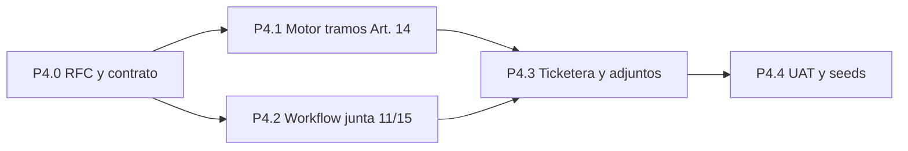
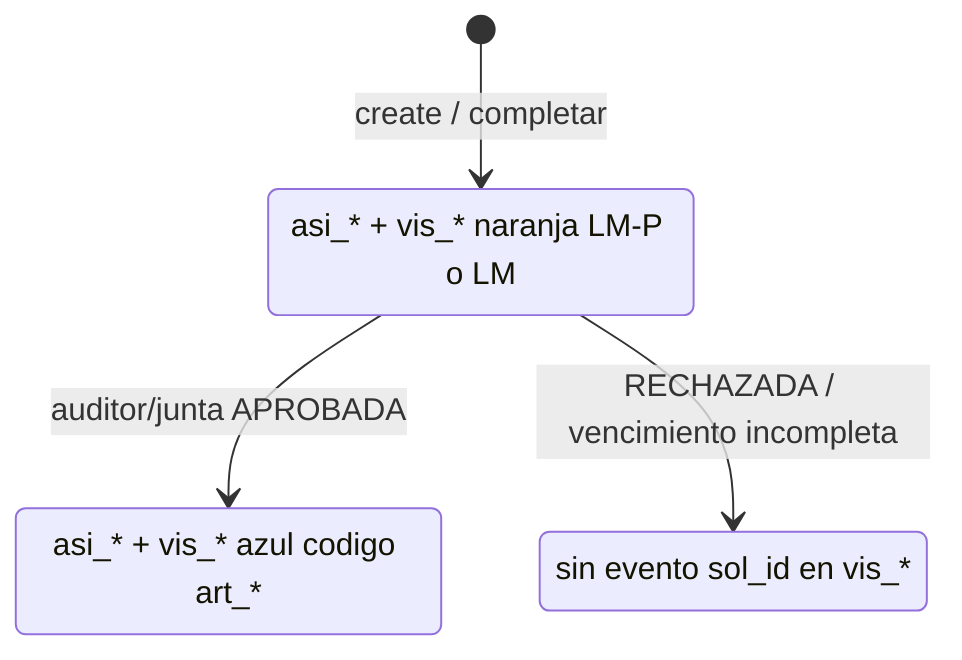

# Plan P4 — Licencias médicas (Arts. 11, 14 y workflow Art. 15)

**Épica:** Decreto 1919 / Bloque B — licencias médicas  
**Estado:** **Pausa código** — 24-jun-2026 tras P4.3b (modal completar incompleta + exclusividad); ver [`HANDOFF_SESION_2026-06-24_P4_AVISO_MEDICO_PAUSA.md`](./HANDOFF_SESION_2026-06-24_P4_AVISO_MEDICO_PAUSA.md). Último deploy piloto incompleta: `d669b32`. Motor S_MED al **`APROBADA`**.  
**Rama prevista:** `feat/1919-p4-licencias-medicas`  
**Tag de cierre previsto:** `1919-p4-licencias-medicas`

**Relación con roadmap histórico:** en [`PLAN_LINEAMIENTOS_DECRETO_1919_MOTOR_SOLICITUDES_V2.md`](./PLAN_LINEAMIENTOS_DECRETO_1919_MOTOR_SOLICITUDES_V2.md) §11 el ítem “P4 (52, 54)” queda **re-etiquetado** como backlog **P4bis** (franquicias / otros incisos). El **P4 activo** de esta épica es **médico (11 + 14 + junta 15)**.

**Precedentes técnicos cerrados (P5):** opciones dinámicas, calendario institucional en Patrón B, Fase S con `SALDO_EVENTO_SIN_CICLO`, ABM RRHH con Zod estricto, rules Firestore alineadas.

**Fichas normativas:** [`LINEAMIENTOS_DECRETO_1919_89_POR_ARTICULO_V2.md`](./LINEAMIENTOS_DECRETO_1919_89_POR_ARTICULO_V2.md) — Bloque B (⬛ hasta este paquete).  
**Motor as-built:** [`RFC_MOTOR_V2_AS_BUILT.md`](./RFC_MOTOR_V2_AS_BUILT.md).

---

## 1. Objetivo de negocio

| Prioridad | Motivo |
|-----------|--------|
| Volumen | Licencias médicas corta/larga concentran la mayor parte del ausentismo transaccional. |
| Riesgo haberes | Art. 14 exige **tramos acumulativos** en año calendario (100 % → 60 % → sin goce), no una bolsa fija. |
| Auditoría | Art. 11 / 15 obligan **circuito de junta médica** cuando el episodio supera umbrales (p. ej. 15 días continuos). |

**Criterio de éxito:** aviso dentro de obligación (completo o **incompleta** con plazo configurable); mismo `solicitud_id` hasta clasificación; medicina otorga/rechaza; tramos al **`APROBADA`**; jefe/RRHH toman conocimiento.

**Modos:** **A** Caja Negra (producción) · **B** artículo conocido en ticketera (piloto motor — ver RFC P4 §7 preview).

---

## 2. Alcance por pista (esqueleto acordado)

### P4.0 — RFC y contrato de datos

**Entregables**

| Ítem | Descripción |
|------|-------------|
| `RFC_P4_LICENCIAS_MEDICAS_ART_11_14_V2.md` | Estados, tramos, consultas históricas, impacto liquidación (solo metadatos en V2). |
| Zod versión artículo | Extender `bloque_identidad_naturaleza` / bloques impacto donde aplique: `es_licencia_medica: true`, causales Art. 19 (catálogo), flags de **modo cómputo médico** (continua vs intermitente si aplica). |
| Zod solicitud | Campos de episodio: `dias_solicitados`, `tramo_haberes_proyectado` (snapshot motor), `requiere_junta_medica`, `junta_medica_id` (opcional), enlaces certificado. |
| Catálogo `cfg_estado_solicitud_articulo` | Nuevo valor propuesto: `cfg_esa_esperando_dictamen_junta` (nombre UI: *Esperando dictamen de junta*). Validar convivencia con `cfg_esa_borrador`, `cfg_esa_en_revision_jefe`, `cfg_esa_rechazada`. |
| Firestore rules | Rama create/update Patrón B/C médico; inmutabilidad de tramo post-aprobación. |

**Punto de partida en repo (ya existe, no reimplementar):**

- `es_licencia_medica`, `requiere_dictamen` en `articulo.schema.js` y resolvers Patrón B/C (`patronBMotorConfigResolver.js`, `patronCMotorConfigResolver.js`).
- Auto-activación de adjunto obligatorio al marcar caja negra en configurador (`ArticuloConfigTabs`).
- Borrador Patrón C en `solicitudArticuloCreate.schema.js` / `crearSolicitudArticuloPatronCBorrador`.

**Fuera de alcance P4.0 (explícito):** integración SARH liquidación; solo persistir metadatos de tramo para export futuro.

---

### P4.1 — Motor de tramos (Art. 14)

**Regla de negocio (año calendario, por agente, episodios `es_licencia_medica`):**

| Tramo acumulado (días aprobados en el año) | Haberes |
|-------------------------------------------|---------|
| 0–35 | 100 % |
| 36–70 | 60 % |
| 71+ | Sin remuneración |

**Diseño motor (Fase S extendida o subfase `S_MED`):**

1. **Consulta histórica:** sumar días consumidos en solicitudes **aprobadas** del año calendario actual para artículos con `es_licencia_medica` (misma persona, mismo `correspondencia_anio` o año civil según RFC).
2. **Proyección:** dado el pedido actual, calcular **split exacto por día/cantidad** al cruzar 35/70 (ver RFC — no tramo dominante).
3. **Respuesta callable:** `previsualizarSolicitudPatronB/C` devuelve `tramos_haberes_resumen` + flag si el episodio cruza límites 35/70.
4. **Persistencia onCreate:** snapshot en `solicitudes_articulo` para auditoría (`motor_auditoria` o mapa dedicado `licencia_medica_tramos`).

**Reutilización P5:** cómputo de días con `calendarInstitucionalCore` cuando la versión use hábiles; no confundir con `opciones_consumo_solicitud` (duelo). Art. 14 usa **topes por tramo anual**, no `cupo_dias_por_ciclo` clásico.

**Tests obligatorios:** casos borde en 34→35, 69→70, año nuevo reinicia acumulador; solicitud que parte en 100 % y termina en 60 % en un mismo pedido multi-día.

---

### P4.2 — Workflow junta médica (Arts. 11 y 15)

**Caja Negra:** otorgamiento = `APROBADA` por auditor (≤15 d) o junta; jefe/RRHH = toma de conocimiento únicamente ([`RFC_TICKETERA_SLICE_MEDICO_CAJA_NEGRA_V2.md`](./RFC_TICKETERA_SLICE_MEDICO_CAJA_NEGRA_V2.md) §3–§6.1).

**Disparadores:**

- Duración **continua** &gt; 15 días → `cfg_esa_esperando_dictamen_junta` tras clasificación auditor (no `APROBADA` hasta dictamen).
- ≤ 15 días → auditor fija **`cfg_esa_aprobada`** y corre S_MED en el mismo acto.
- Reenvío a junta Santa Fe / Rosario: metadatos de sede (`junta_medica_sede_id` catálogo) sin integración externa en V2.

**Componentes**

| Capa | Acción |
|------|--------|
| Trigger onCreate / onUpdate | Si `requiere_junta_medica`, no avanzar a estados finales sin registro de dictamen. |
| Bandeja RRHH / Medicina | Vista filtrada por estado + `es_licencia_medica` (puede ser P4.3 UI mínima). |
| Check-in | Etiqueta distinta a “validación por evento” P5; mostrar tramo proyectado y estado junta. |
| Jefe / RRHH | Bandeja con **`APROBADA`** + toma de conocimiento; **sin** rechazo médico. |

**Estados intermedios:** alinear nomenclatura con `ESPERANDO_DICTAMEN_JUNTA` del brief; implementación = fila en `cfg_estado_solicitud_articulo` + constantes shared (`ESTADO_SOLICITUD_*`).

---

### P4.3 — Ticketera, certificados y previsualización

- Wizard médico: Patrón C (rango continuo) como default Art. 14; Patrón B solo si ficha lo define.
- Certificado obligatorio (`requiere_adjunto_obligatorio` ya cableado); plazos Art. 19 en copy UI.
- `PatronBPreviewInfo` / equivalente C: bloque **Tramo de haberes proyectado** (100/60/sin goce).
- `validarEntornoOperativoSolicitud`: gates adicionales si junta pendiente o tramo sin goce puro (warning, no bloqueo salvo política).

### P4.3b — Grilla operativa (`asistencia_diaria` + `vistas_grilla_mes_agente`)

**Requisito de negocio:** los avisos provisorios y completos deben **verse en grilla** y quedar **registrados** como cualquier licencia, respetando las características de cada fase (código, color, ocupación del día, rango de fechas). El **mismo `solicitud_id`** acompaña todo el ciclo hasta cierre; los cambios de estado por auditoría médica, junta o vencimiento documental deben **actualizar** los registros materializados, no duplicar solicitudes.

**Modelo (alineado a [`RFC_TICKETERA_SLICE_MEDICO_CAJA_NEGRA_V2.md`](./RFC_TICKETERA_SLICE_MEDICO_CAJA_NEGRA_V2.md) §5.9):**

| Fase P4 | Entrega grilla | Estado implementación |
|---------|----------------|------------------------|
| Alta aviso + completar certificado | `PROYECTAR_PENDIENTE` → `asi_*` + `vis_*` (`LM-P` / `LM`) | ✅ código rama (`avisoMedicoGrillaMdc*`, trigger onCreate, resync completar) |
| Clasificación auditor | `CONSOLIDAR_APROBADO` o mantener pendiente (junta) o `REVERTIR` (rechazo) | ✅ `mutarEstadoSolicitudMedicaMdc` enganchado en `clasificarSolicitudMedicaAuditorCore` |
| Dictamen junta (P4.2) | `CONSOLIDAR` / `REVERTIR` | ❌ |
| Job vencimiento incompleta | `REVERTIR` | ❌ |
| `aplicarLicenciaMedicaAprobada` | S_MED + MDC aprobado mismo `sol_id` | ❌ |

**Criterios de aceptación (UAT grilla):**

1. Día de inicio de reposo con aviso provisorio muestra chip **`LM-P`** naranja en grilla del `gdt_*` ancla (y fan-out a grupos vigentes).
2. Tras completar certificado, mismo `sol_id` pasa a **`LM`** (y extiende días si cambió `fecha_fin_reposo_estimada`).
3. Tras clasificación favorable, mismo `sol_id` muestra **`codigo_grilla` del artículo** en azul, con `aportes_normativos` en estado aprobado.
4. Tras rechazo o vencimiento sin certificado, desaparece el evento de la celda y se limpia el aporte diario.
5. Modal detalle grilla (`obtenerResumenSolicitudArticuloGrilla`) muestra fechas estimadas y etiqueta de aviso pre-clasificación.

**Dependencias técnicas:** despliegue **Functions** (trigger + callables); avisos históricos sin proyección → callable `reprocesarMdcSolicitudPatronB` con `solicitud_id` en estado pendiente clasificación.

---

### P4.4 — Seeds, deploy y UAT

| Artefacto | Contenido |
|-----------|-----------|
| Seeds | `art_*` / `ver_*` para **corta (Art. 14)** y **larga (Arts. 16/19)** en piloto; specs JSON + `apply` idempotente. |
| Deploy | Functions: previsualizar, onCreate, listado; rules; hosting. |
| Matriz | `MATRIZ_UAT_P4_LICENCIAS_MEDICAS.md` (plantilla UAT-P4-01 … en P4.4). |

**Piloto de referencia:** `per_01KQN9WXFXF69Z9DCT5YNJ3TFZ` (DNI 28914247), mismo criterio que P2/P5.

---

## 3. Matriz de dependencias técnicas

| Dependencia | Estado |
|-------------|--------|
| Patrón B motor + calendario | ✅ P5 |
| `es_licencia_medica` en configurador | ✅ flag existente |
| Patrón C borrador + trigger | ✅ base; extender médico |
| Acumulador anual Art. 14 | ❌ P4.1 |
| Estado junta médica | ❌ P4.0 catálogo + P4.2 |
| **MDC grilla aviso (asi_* / vis_*)** | **Parcial** — alta + completar + clasificar auditor ✅; job vencimiento y dictamen junta ❌ |
| Fichas LINEAMIENTOS Bloque B completas | ⏳ redacción en paralelo a P4.0 |

---

## 4. Orden de ejecución Git (propuesto)

| Paso | Acción |
|------|--------|
| 1 | `git checkout master` · `git pull` · `git checkout -b feat/1919-p4-licencias-medicas` |
| 2 | Commit `docs(1919): plan y RFC borrador P4 licencias médicas` (P4.0 doc only) |
| 3 | PRs acotados: P4.1 motor → P4.2 workflow → P4.3 UI → **P4.3b grilla MDC** → P4.4 UAT |
| 4 | Tag `1919-p4-licencias-medicas` en merge a `master` |

**Convención commits:** prefijo `1919:` o `feat(1919):` / `fix(1919):` como en P5.

---

## 5. Decisiones de negocio (workshop — cerradas)

| Tema | Decisión |
|------|----------|
| **Granularidad tramo (35/70)** | **Split exacto** por día/cantidad. Snapshot con desglose `tramos: { "100": n, "60": m, "0": k }` (export SARH). |
| **Corta vs larga** | **Dos `art_*` distintos:** corta = Art. 14 (contador anual ciego); larga = Arts. 16/19 (causal catalogada, tope ~2 años continuos, goce distinto, sin reinicio a fin de año). |
| **Reagravamiento** | **Corta:** toda solicitud suma al mismo acumulador del año civil. **Larga (V2):** bloquear alta sin dictamen favorable; `episodio_seguimiento_id` en backlog post-V2. |
| **P4bis (52, 54)** | No mezclar en esta rama. |

Detalle técnico: [`RFC_P4_LICENCIAS_MEDICAS_ART_11_14_V2.md`](./RFC_P4_LICENCIAS_MEDICAS_ART_11_14_V2.md).

---

## 6. Próximo paso inmediato

1. **P4.3b (cierre):** job vencimiento incompleta §5.7 (`REVERTIR_PROYECCION`), dictamen junta P4.2 y `aplicarLicenciaMedicaAprobada` según matriz §5.9.1 del RFC Caja Negra. *(Clasificación auditor → MDC ya enganchada en `mutarEstadoSolicitudMedicaMdc`.)*
2. **P4.1:** `runLicenciaMedicaTramosV2` / Fase `S_MED` tras merge del RFC en la rama.
