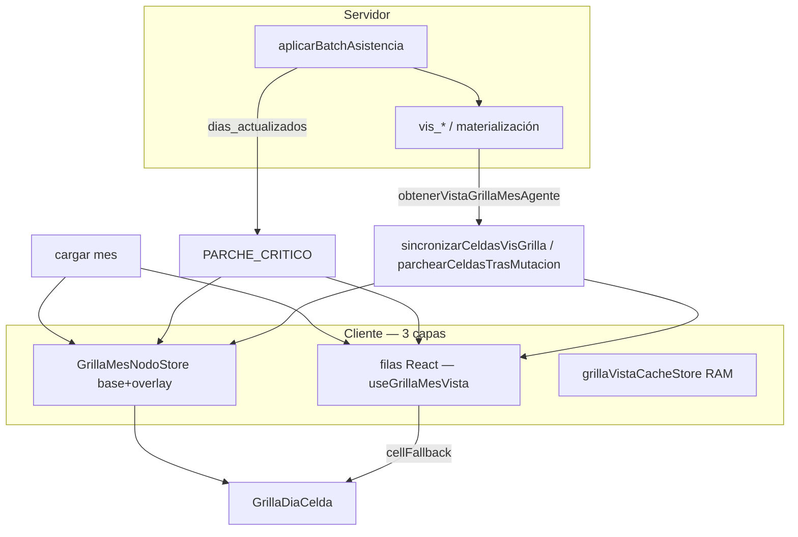

# RFC — Ciclo de visibilidad de celda día (grilla GSO)

> **Nombre canónico:** **CVC** — *Ciclo de Visibilidad de Celda*  
> **Módulo web (punto de llamada):** `web/src/features/grilla/cicloVisCeldaGrilla.js`  
> **Batch gestión turno:** extiende `FASE_CICLO_APLICAR_CAMBIO` en `grillaCicloAplicarCambioInmediato.js`  
> **Estado:** identificado 2026-06-23 · consolidación en curso (hoy disperso en 3 capas)

---

## 1. Problema

La misma celda se alimenta desde **varias fuentes** y **varios caminos** según la acción (abrir mes, batch, fichada, error de concurrencia). A veces el ciclo completo se cumple (destino + origen coherentes); a veces no (origen con turno “fantasma”, destino OK).

No es un solo bug: es **arquitectura desparramada** sin una única función “regenerar vis de estas celdas”.

---

## 2. Las tres capas de estado (SSoT fragmentado)

| Capa | Dónde vive | Qué contiene |
|------|------------|--------------|
| **A — Listado React** | `useGrillaMesVista` → `data.filas[].dias[dd]` | Payload de `listarVistaGrillaMesPorGrupo` / titular |
| **B — Store nodos** | `createGrillaMesNodoStore()` → `base` + `overlay` | Copia por `CellKey` (gdt × persona × fecha) |
| **C — Servidor** | `vis_*` vía `obtenerVistaGrillaMesAgente` / `dias_actualizados` | Verdad materializada post-batch |

**Render final de una celda** (`GrillaDiaCelda.jsx`):

```text
cellFallback (capa A, fila del listado)
        ↓
mergeCeldaNodoConFallback({ fromStore: capa B, fallback: A })
        ↓  ← si hay store: { ...fallback, ...store }  ⇒  **STORE GANA**
filasPresentacionGrillaDesdeCelda(cell)  → chips M/T/N
```

Archivo clave: `grillaDiaCeldaMerge.js` — **si el store B tiene teoría vieja, la capa A parcheada no se ve**.

---

## 3. Ciclo completo (inicio → fin)

### 3.1 CVC-0 — Carga inicial del mes

```text
Usuario abre tarjeta grupo×mes
  → GrillaMesLicenciasPanel.seleccionarTarjeta
  → useGrillaMesVista.cargar()
  → listarVistaGrillaMesPorGrupo (callable)
  → setData(vistaData)                    [capa A]
  → useGrillaMesNodos: hidratarDesdeListadoVista(vista)  [capa B, base.clear + relleno]
  → GrillaMesEquipoTabla → GrillaDiaCelda(cellFallback=cell de A)
```

**Archivos:** `useGrillaMesVista.js`, `useGrillaMesNodos.js` (effect `vistaListado`), `grillaMesNodoStore.js` (`hidratarDesdeListadoVista`).

---

### 3.2 CVC-1 — Render continuo (sin mutación)

```text
GrillaDiaCelda
  → useGrillaMesCeldaSnapshot(cellKey)
  → getCellRenderSnapshot → getCeldaMerged (base + overlay pending)
  → merge con cellFallback
  → filasPresentacionGrillaDesdeCelda + chips
```

**Overlay `pending`:** `marcarOpsPendientes` durante batch/fichada (muestra “···” / proyección).

---

### 3.3 CVC-2 — Mutación batch (gestión turno A/B/C) — *ciclo documentado*

Ya nombrado: **`FASE_CICLO_APLICAR_CAMBIO`** (`grillaCicloAplicarCambioInmediato.js`).

| Fase | Qué hace | Archivos |
|------|----------|----------|
| **INICIO** | Cierra modales, `marcarOpsPendientes`, `aplicandoBatch=true` | `GrillaMesLicenciasPanel.aplicarCambioInmediato` |
| **SERVIDOR** | `aplicarBatchAsistencia` | `grillaAplicarCambioInmediato.js` |
| **PARCHE_CRITICO** | Invalidar caché RAM · parches vis · store + filas | `faseParcheCriticoTrasBatch` → `confirmarBatchTrasExito` + `vista.patchFilasDesdeParchesVis` |
| **FIN_BLOQUEO_UI** | `aplicandoBatch=false` | `finally` panel |
| **POST** (background) | `sanearMaterializacionDiaSiNecesario` + re-parche | `iniciarFasePostCicloAplicarCambio` → `parchearCeldasTrasMutacion` |

**Pares afectados (contrato):** `paresCeldaDesdeOp(op)` en `shared/utils/grillaMesNodos/grillaMesNodoImpacto.js`  
— reemplazo: **origen + destino**; intercambio: **dos agentes × dos fechas**; adicional: **un día**.

---

### 3.4 CVC-3 — Mutación micro (fichada ABM en modal)

```text
onInicioGuardadoFichadaEnModal → marcarOpsPendientes(micro_celda)
onFinalizadoGuardadoFichadaEnModal
  → refrescarCeldaMicroTrasMutacion (sanear día, forzar recálculo fichada)
  → parchearCeldasTrasMutacion([{ persona_id, fecha_ymd, gdt }])
```

**Archivos:** `GrillaMesLicenciasPanel.jsx`, `refrescarCeldaMicroTrasMutacion.js`.

---

### 3.5 CVC-4 — Regeneración puntual (función unificada *de facto*)

Hoy se llama **`parchearCeldasTrasMutacion`** en el panel. Hace:

1. `invalidarCacheGrillaTrasMutacion` (`grillaCacheMemoryStore.js`)
2. `grillaMesNodos.aplicarParchesVisEnGrilla(refs)` → fetch `obtenerVistaGrillaMesAgente` por persona×mes
3. `store.confirmarBatch([], parches, { reemplazoTeoriaCompleto })`
4. `vista.patchFilasDesdeParchesVis(parches)` → `patchFilasGrillaDesdeParchesVis` + `mergeCeldaVisParche` + `coherirCeldaVisTeoriaFranco`

**Alias canónico exportado:** `sincronizarCeldasVisGrilla` en `cicloVisCeldaGrilla.js` (misma semántica; el panel puede migrar al alias).

---

### 3.6 CVC-5 — Recarga nuclear (fallback)

```text
vista.cargar({ bypassCache: true })
  → vuelve a CVC-0 (pierde overlay local; store re-hidrata)
```

Concurrencia batch, “desactualizado”, algunos modales.

---

## 4. Diagrama



---

## 5. Por qué “a veces perfecto, a veces no”

| Síntoma | Causa probable en el modelo |
|---------|------------------------------|
| **Destino OK, origen no** | `presentacion_compuesto.filas` con tramos viejos mientras `rda_turno_id` ya bajó (traslados sucesivos); la grilla usaba `filasPresentacionGrillaDesdeCelda` **sin** `filtrarFilasPresentacionAlTeoricoOperativo` (el modal sí filtra) |
| **POST mejora unos segundos después** | PARCHE_CRITICO incompleto; POST ejecuta `parchearCeldasTrasMutacion` para todos los `paresCeldaDesdeOp` |
| **F5 arregla** | CVC-0 re-hidrata A y B desde listado |
| **Franco con M+T fantasma** | Servidor marca `es_franco` pero deja `rda_turno_id` / filas; mitigación: `coherirCeldaVisTeoriaFranco` en `mergeCeldaVisParche` |
| **Fichada sin piso T** | Capa presentación/analítica servidor; cliente solo reparte marcas si hay 3×3 fichadas (`marcasHhmmPorTramoDesdeCelda`) |

---

## 6. Regla de oro (para cerrar el ciclo)

> Tras **cualquier** mutación que toque teoría o fichadas, invocar **sincronización visual** para **todos** los pares de `paresCeldaDesdeOp(op)` (origen **y** destino), no solo los que vengan en `dias_actualizados`.

**Implementación PARCHE_CRITICO (2026-06-23):** `resolverParchesVisTrasBatchExito` hace **fetch de todas las celdas afectadas** y fusiona con batch (`mergeParchesVisLista`: batch gana por celda si existe; fetch rellena huecos).

**Llamada única recomendada:**

```js
import {
  paresCeldaDesdeOp,
  sincronizarCeldasVisGrilla,
} from "./cicloVisCeldaGrilla.js";

// Tras batch, fichada, o sanación:
const refs = paresCeldaDesdeOp(op).map((p) => ({
  persona_id: p.persona_id,
  fecha_ymd: p.fecha_ymd,
  gdt: p.gdt,
}));
await sincronizarCeldasVisGrilla(refs, deps);
```

`deps` = `{ grillaMesNodos, vista, invalidarCache, periodo, gdt, grupoIdVista }` (inyectado desde panel).

---

## 7. Mapa de archivos (índice rápido)

| Responsabilidad | Archivo |
|-----------------|---------|
| Fases batch INICIO…POST | `grillaCicloAplicarCambioInmediato.js` |
| Orquestación panel | `GrillaMesLicenciasPanel.jsx` (`aplicarCambioInmediato`, `parchearCeldasTrasMutacion`) |
| Store + snapshot | `useGrillaMesNodos.js`, `grillaMesNodoStore.js` |
| Parches batch/fetch | `grillaMesNodosBatchParches.js` |
| Merge parche + franco | `mergeCeldaVisParche.js`, `visCeldaFusionLectura.js` |
| Merge store/fallback | `grillaDiaCeldaMerge.js` |
| Pintura chips | `grillaPresentacionCompuestoUi.js`, `GrillaDiaCelda.jsx` |
| Pares celda ↔ op | `grillaMesNodoImpacto.js` |
| Carga mes | `useGrillaMesVista.js` |
| Caché listado | `grillaCacheMemoryStore.js` |

---

## 8. Próximo refactor (opcional, no bloqueante)

1. Panel: `parchearCeldasTrasMutacion` delega en `sincronizarCeldasVisGrilla` (CVC-4).
2. PARCHE_CRITICO: **no** depender solo de `dias_actualizados` (hecho: fetch siempre de pares).
3. Evaluar `mergeCeldaNodoConFallback`: si `reemplazoTeoriaCompleto`, ignorar store stale vs fallback (o vaciar base antes de parche).
4. Unificar POST en el mismo await que PARCHE_CRITICO para origen+destino en un solo frame (menos parpadeo).

---

## Changelog

| Fecha | Nota |
|-------|------|
| 2026-06-23 | Identificación CVC, RFC, alias `sincronizarCeldasVisGrilla`, fetch completo en PARCHE_CRITICO |
| 2026-06-23 | Fix traslados sucesivos: filtro teórico en hot path grilla + `coherirPresentacionCompuestoAlTeoricoVis` en merge parche |
| 2026-06-23 | QA piloto OK (LOKITO d19/d6/d16, CHAPARRO d16); empareje 3×3 fichadas por franja M/T/N |
