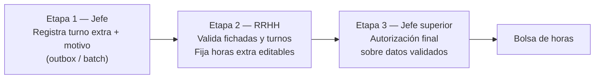

# RFC F4 ampliado — Outbox gestión turno del día (F-UX.3)

**Estado:** **implementado** 2026-06-04 — UI + batch A/B/C v2 desplegado · QA grilla prod OK  
**Registro maestro:** [`REGISTRO_FASE_DOCUMENTAL_FUX_GESTION_TURNO_V3.md`](./REGISTRO_FASE_DOCUMENTAL_FUX_GESTION_TURNO_V3.md)  
**Tag spec:** `v2.4.0-pre-fux-gestion-turno-spec` · tag release: `v2.4.0-fux-gestion-turno` (post-merge)  
**Handoff:** [`HANDOFF_SESION_2026-06-02_PAUSA_FUX_GESTION_TURNO_DIA.md`](./HANDOFF_SESION_2026-06-02_PAUSA_FUX_GESTION_TURNO_DIA.md)  
**Visual:** [`RFC_F4_AMENDMENT_VISUAL_GRILLA_GESTION_TURNO.md`](./RFC_F4_AMENDMENT_VISUAL_GRILLA_GESTION_TURNO.md)  
**Base:** [`RFC_CACHE_LOCAL_ASISTENCIA_V2.md`](./RFC_CACHE_LOCAL_ASISTENCIA_V2.md)

---

## 1. Envelope outbox (sin cambio)

| Campo | Descripción |
|-------|-------------|
| `editorPersonaId` | `per_*` del editor |
| `periodo` | `YYYY-MM` |
| `ops[]` | Cola local |
| `id` | UUID por op → `temp_id` en batch |
| `creado_en` | ISO |

Cada op incluye además (UI → batch mapper):

- `tipo` — `cobertura_parcial` | `reemplazo` | `adicional`
- `grupoId` — `gdt_*`
- `periodo` — redundante con envelope
- `expectedVersionToken` — concurrencia `vis_*` (Flujo A v2: `expectedVersionTokenOrigen` + `expectedVersionTokenDestino`)
- `motivo` — ≥3 caracteres (todos los tipos)
- `payload` — forma v2 según §3

---

## 2. Batch wire format (envío a `aplicarBatchAsistencia`)

```json
{
  "editor_persona_id": "per_…",
  "periodo": "2026-06",
  "ops": [
    {
      "id": "uuid",
      "tipo": "cobertura_parcial",
      "creado_en": "ISO",
      "concurrencia": { "expected_version_token": "ISO" },
      "context": { "grupo_id": "gdt_…", "periodo": "2026-06" },
      "payload": { }
    }
  ]
}
```

**Compatibilidad:** el normalizador en `cambiosTurno.js` acepta `payload` anidado o campos planos legacy (MVP una fecha).

**Batch consolidado (B-BATCH-1 + A-BATCH):** ver §3.1 (A-BATCH) y §3.2 (B-BATCH-1). Las UIs A y B ya vuelcan contrato v2 al outbox; el mapper web (`coberturaParcialService.js`) emite wire v2. El normalizador backend (`cambiosTurno.js`) **aún solo acepta MVP legacy** en `cobertura_parcial` (una fecha, `segmentos_cubiertos`). Hasta A-BATCH: outbox + preview UI = fuente de verdad operativa; **no confiar en «Aplicar cambios»** para swaps bilaterales entre fechas distintas.

#### Wire v2 — `cobertura_parcial` (intercambio de guardia)

```json
{
  "id": "uuid",
  "tipo": "cobertura_parcial",
  "creado_en": "ISO",
  "concurrencia": {
    "expected_version_token": "ISO-token-vis-XX@fecha_origen",
    "expected_version_token_destino": "ISO-token-vis-YY@fecha_destino"
  },
  "context": { "grupo_id": "gdt_…", "periodo": "2026-06" },
  "payload": {
    "origen": {
      "persona_id": "per_XX",
      "fecha": "2026-06-05",
      "segmentos_cedidos": ["cfg_reg_turno_n"]
    },
    "destino": {
      "persona_id": "per_YY",
      "fecha": "2026-06-12",
      "segmentos_cedidos": ["cfg_reg_turno_m"]
    },
    "tipo_compensacion_id": "cfg_tcc_…",
    "motivo": "Intercambio acordado",
    "tipo": "cobertura_parcial"
  }
}
```

Detección v2 en normalizador: `payload.origen.persona_id` + `payload.destino.persona_id` + arrays `segmentos_cedidos` en ambos lados (§3.1 A-BATCH).

---

## 3. Payloads v2 por flujo

### 3.1 A — `cobertura_parcial` (Intercambio de guardia)

Swap **bilateral** entre **dos agentes** del mismo cargo (`gdt_*`), mismo mes, mismo `regimen_horario_id`. Emparejamiento **parcial** de tramos (`cfg_reg_turno_*`); **igualdad de horas cedidas** entre lados. Las fechas de cada agente **pueden ser distintas** (ej. XX día 5 ↔ YY día 12) o iguales (corrimiento intra-día permitido salvo noop A-N5).

**Amendment 2026-06-03:** reglas A-N1…A-N5, A-REG, A-TIPO, validación UI ✅. **A-BATCH implementado** 2026-06-04 (`17a04bf`, §3.1.4). QA navegador + grilla prod ✅.

#### Payload v2 (contrato outbox → batch)

```json
{
  "tipo": "cobertura_parcial",
  "motivo": "Intercambio acordado con guardia pediátrica",
  "expectedVersionTokenOrigen": "ISO",
  "expectedVersionTokenDestino": "ISO",
  "grupoId": "gdt_…",
  "periodo": "2026-06",
  "payload": {
    "origen": {
      "persona_id": "per_XX",
      "fecha": "2026-06-05",
      "segmentos_cedidos": ["cfg_reg_turno_n"]
    },
    "destino": {
      "persona_id": "per_YY",
      "fecha": "2026-06-12",
      "segmentos_cedidos": ["cfg_reg_turno_m"]
    },
    "tipo_compensacion_id": "cfg_tcc_01KSN4ZJPJZ6H3ARPEX750YBTH"
  }
}
```

Ejemplo mismo día (LOKITO cede N, recibe M; contraparte cede M):

```json
{
  "origen": { "persona_id": "per_A", "fecha": "2026-06-05", "segmentos_cedidos": ["cfg_reg_turno_n"] },
  "destino": { "persona_id": "per_B", "fecha": "2026-06-05", "segmentos_cedidos": ["cfg_reg_turno_m"] }
}
```

#### Campos

| Campo | Uso |
|-------|-----|
| `origen.persona_id` | Agente 1 (`per_*`) — quien abre el flujo desde su celda |
| `origen.fecha` | Día del agente 1 (`YYYY-MM-DD`) |
| `origen.segmentos_cedidos` | Ids régimen que agente 1 **cede** (≥1) |
| `destino.persona_id` | Agente 2 (`per_*`), distinto de origen |
| `destino.fecha` | Día del agente 2 (puede = `origen.fecha`) |
| `destino.segmentos_cedidos` | Ids régimen que agente 2 **cede** (≥1) |
| `tipo_compensacion_id` | Default **`cfg_tcc` → CAMBIO_INTERNO** (`seed-ids-asistencia-turnos.v2.json`) |
| `motivo` | ≥3 caracteres (envelope) |
| `expectedVersionTokenOrigen` | Token `vis_*` de `origen.persona_id` @ `origen.fecha` @ `gdt` |
| `expectedVersionTokenDestino` | Token `vis_*` de `destino.persona_id` @ `destino.fecha` @ `gdt` |

#### Outbox UI (campos planos — implementación referencia)

El builder `buildIntercambioGuardiaOutboxOp` persiste campos planos en localStorage; el mapper batch anida § payload v2:

| Outbox plano | Wire / payload |
|--------------|----------------|
| `personaOrigenId` | `origen.persona_id` |
| `personaDestinoId` | `destino.persona_id` |
| `fechaOrigenYmd` | `origen.fecha` |
| `fechaDestinoYmd` | `destino.fecha` |
| `segmentosCedidosOrigen` | `origen.segmentos_cedidos` |
| `segmentosCedidosDestino` | `destino.segmentos_cedidos` |
| `segmentosCubiertos` | Legacy = `segmentosCedidosOrigen` (compat MVP) |
| `personaCoberturaId` | Legacy = `personaDestinoId` |

Detector v2 outbox: `esIntercambioGuardiaV2(op)` — requiere ambas fechas, ambos agentes y ambos arrays de segmentos cedidos.

#### Reglas de negocio (producto cerrado)

| Id | Regla |
|----|--------|
| **A1** | Día **laborable** materializado con **fichada esperada** ≥1 en capa teórica. **No** franco / no laborable. |
| **A1b** | Sin segmentos materializados → bloqueo + CTA «Calcular turno de este día». |
| **A-FER** | Feriado con turno laborable + fichada esperada → **permitido** (guardia en feriado). Sin regla extra de UI; pasa A1 si la capa lo materializa. |
| **A2** | **Emparejamiento horario:** suma de horas de `segmentos_cedidos` origen = suma destino (>0). Tramos parciales OK (ej. M ↔ T). |
| **A-REG** | Mismo `regimen_horario_id` en el cargo/período para ambos agentes. Selector agente 2 filtra por régimen (no basta turno visible igual en grilla). |
| **A-TIPO** | **Régimen fijo** (`tipo_patron === "fijo"`) → intercambio **no** permitido; usar Flujo B. Bloqueo en wizard + dominio. |
| **A-N1** | Preview acumulado: tramos cedidos ⊆ tramos disponibles en **capa + ops pendientes** del mismo `persona_id` y fecha (`proyectarDiaConOpsPendientes`). |
| **A-N2** | Tope **24 h**/día **tras el swap** sobre preview acumulado (cada agente en su fecha). |
| **A-N5** | **Anti-noop:** si `origen.fecha === destino.fecha` y ambos lados ceden el **mismo conjunto** de tramos → rechazar. Mismo día con tramos distintos (N↔M) → **permitido**. |
| **Mes** | Ambas fechas ∈ `periodo` (`YYYY-MM`) del envelope. |
| **Agentes** | Dos `persona_id` distintos; mismo `gdt_*`. |

#### Reglas deliberadamente distintas de Flujo B

| Regla B | En Flujo A |
|---------|------------|
| **B-N7** (colisión al incorporar tramo ya presente) | **No aplica.** En swap bilateral, recibir un tramo que ya figura en el día es permuta válida (ej. LOKITO M+T+N cede N, recibe M). |
| **B-N6** (cantidad origen = destino al trasladar) | **No aplica.** A2 exige igualdad de **horas**, no igual cantidad de tramos. |
| **B-N4** (franco auditado en origen) | **No aplica.** Intercambio parcial no deja franco por diseño de swap. |

#### Validación UI (implementación referencia)

- Módulo: `web/src/features/grilla/grillaCoberturaParcialPreview.js` → `validarIntercambioGuardia`.
- Proyección compartida con B: `grillaCambioTurnoPropioPreview.js` → `proyectarDiaConOpsPendientes` (tipo `cobertura_parcial` en ops).
- Modal: `ModalCoberturaParcial.jsx` + `useIntercambioGuardiaDestino.js`; recibe `opsPendientes` del outbox grilla.
- Tests: `grillaCoberturaParcialPreview.test.js` (13 casos dominio + A-N1/A-N5).

Orden de validación en dominio: identidad/fechas → A-TIPO → A-REG → preview A/B → A1 → A-N5 → subset cedidos (A-N1) → régimen tramos → A2 → A-N2.

#### Mapper y batch (estado)

| Contexto | Comportamiento |
|----------|----------------|
| **Outbox UI** | ✅ Payload plano v2 + tokens duales |
| **Mapper web → wire** | ✅ `mapOutboxOpToBatchPayload` si `esIntercambioGuardiaV2` |
| **Batch backend (A-BATCH)** | ❌ Pendiente — §3.1.4 |
| **Mapper legacy (transición)** | Si solo hay `persona_origen_id`, `persona_cobertura_id`, **una** `fecha`, `segmentos_cubiertos` → MVP mismo día (cobertura unilateral legacy). |

---

#### 3.1.4 A-BATCH — Especificación backend (implementado 2026-06-04)

**Objetivo:** persistir swap bilateral v2, assert de concurrencia dual, rematerializar todas las celdas afectadas, y aplicar overrides en el worker sin asumir misma fecha para ambos agentes.

**Archivos a modificar:**

| Archivo | Responsabilidad |
|---------|-----------------|
| `functions/modules/asistencia/cambiosTurno.js` | `normalizeBatchOpCoberturaV2`, transacción batch, escritura `asi_*` |
| `functions/modules/asistencia/rdaTurnoTeoricoWorker.js` | `aplicarCoberturasParciales` v2 (cross-fecha) |
| `functions/test/batchAsistenciaNormalize.test.js` | Casos v2 + compat legacy |

##### Detección v2 vs legacy

```
esCoberturaV2(payload) :=
  payload.origen?.persona_id (per_*)
  AND payload.destino?.persona_id (per_*)
  AND payload.origen?.fecha (YMD)
  AND payload.destino?.fecha (YMD)
  AND payload.origen.segmentos_cedidos?.length >= 1
  AND payload.destino.segmentos_cedidos?.length >= 1
```

Si no cumple → `normalizeBatchOpCobertura` legacy (comportamiento actual).

##### Normalización (`normalizeBatchOpCoberturaV2`)

Entrada: op wire §2 (payload anidado + `concurrencia.expected_version_token` + `concurrencia.expected_version_token_destino`).

Salida item normalizado (extensión del item actual):

| Campo item | Valor |
|------------|--------|
| `tipo` | `"cobertura_parcial"` |
| `schema_version` | `2` |
| `fecha` | `origen.fecha` (clave doc origen; **no** única fecha global) |
| `fecha_destino` | `destino.fecha` |
| `persona_origen_id` | `origen.persona_id` |
| `persona_cobertura_id` | `destino.persona_id` |
| `expected_version_token` | token origen |
| `expected_version_token_destino` | token destino (**obligatorio** en v2) |
| `grupo_trabajo_id` | `gdt_*` del context |
| `override` | objeto persistido (§ Override Firestore v2) |

Validaciones en normalización (códigos sugeridos):

| Código | Condición |
|--------|-----------|
| `[BATCH-A001]` | Falta `origen`/`destino` o arrays `segmentos_cedidos` vacíos |
| `[BATCH-A002]` | `origen.fecha` o `destino.fecha` fuera de `context.periodo` |
| `[BATCH-A003]` | `origen.persona_id === destino.persona_id` |
| `[BATCH-A004]` | `motivo` < 3 chars o `tipo_compensacion_id` inválido |
| `[BATCH-A005]` | Falta `expected_version_token_destino` en v2 |
| `[BATCH-A006]` | (Opcional backend) horas cedidas origen ≠ destino — mirror A2 |

##### Override Firestore v2 (`asistencia_diaria.overrides_turno[]`)

Objeto canónico appendeado en **ambos** documentos (`asi_{per_XX}_{f1}` y `asi_{per_YY}_{f2}`) con el mismo `op_batch_id`:

```json
{
  "tipo": "cobertura_parcial",
  "tipo_override_id": "cfg_tov_*",
  "tipo_compensacion_id": "cfg_tcc_*",
  "motivo": "…",
  "schema_version": 2,
  "persona_origen_id": "per_XX",
  "persona_cobertura_id": "per_YY",
  "fecha_origen": "2026-06-05",
  "fecha_destino": "2026-06-12",
  "segmentos_cedidos_origen": ["cfg_reg_turno_n"],
  "segmentos_cedidos_destino": ["cfg_reg_turno_m"],
  "segmentos_cubiertos": ["cfg_reg_turno_n"],
  "grupo_de_trabajo_id": "gdt_…",
  "es_override_manual": true,
  "op_batch_id": "uuid-op",
  "creado_en": "ISO",
  "invalidado_por_replanificacion": false
}
```

- `segmentos_cubiertos` se mantiene = `segmentos_cedidos_origen` para **compat** con lectores legacy que solo miran ese campo en el doc del titular origen.
- Duplicar el mismo objeto en ambos `asi_*` permite que `listarCoberturasDia(fecha, persona)` lo encuentre en cada celda.

##### Transacción batch (`aplicarBatchAsistencia`)

Para cada item v2:

1. **Concurrencia dual:** assert token origen en `vis_{per_XX}_{f1}_{gdt}`; assert token destino en `vis_{per_YY}_{f2}_{gdt}`. Mismatch → `[ASI-CONC-001]`.
2. **Período editable:** `assertGrillaGsoEscrituraEnFecha` en **ambas** fechas/personas.
3. **Freeze liquidado:** verificar `vis_*` de ambos agentes en sus fechas (extender check actual que hoy usa una sola `fecha`).
4. **Escritura:** append override v2 en `asi_{per_XX}_{f1}` **y** `asi_{per_YY}_{f2}` (crear docs mínimos si no existen).
5. **Rematerialización post-commit:** invocar `materializarTurnoTeoricoDia` para el conjunto único `{ (per_XX, f1), (per_YY, f2) }` — **cuatro invocaciones máx.**, deduplicadas por par `(persona, fecha)`.

Cambios en helpers actuales:

| Helper actual | Limitación | Cambio A-BATCH |
|---------------|------------|----------------|
| `personaIdDocAsi(it)` | Solo origen | Escritura en **dos** docs para v2 |
| `personaIdConcurrencia(it)` | Solo origen | Assert **dos** tokens |
| `rematerializarBatchOps` | Una `fecha` por item | Set de `(persona_id, fecha)` por item v2 |
| `materializarDiaAfectado` | Misma fecha ambos agentes | Loop explícito por par persona-fecha |

##### Worker — `aplicarCoberturasParciales` v2

El algoritmo legacy (líneas ~470–505) asume **misma `fechaYmd`** al copiar tramos del agente origen al agente cobertura. Reemplazar/ampliar:

**Para persona P en fecha F:**

1. Listar overrides v2 activos donde `(P,F)` es lado origen **o** lado destino.
2. **Si P es `persona_origen_id` y F = `fecha_origen`:**
   - Para cada `segmento_id` ∈ `segmentos_cedidos_origen`: marcar segmento en capa base con `persona_ejecutante_id = persona_cobertura_id`, `origen_segmento = override_cobertura`.
   - Para cada `segmento_id` ∈ `segmentos_cedidos_destino`: **importar** tramo materializado del par `(persona_cobertura_id, fecha_destino)` en la base del par (resolver vía `resolverBaseDiaPersona` en **fecha_destino** del override) e insertar/upsert en resultado con titular/ejecutante acordes al swap.
3. **Si P es `persona_cobertura_id` y F = `fecha_destino`:** simétrico (cede `segmentos_cedidos_destino`, recibe tramos de `(persona_origen_id, fecha_origen)`).
4. Overrides **legacy** (`schema_version` ausente o `< 2`): conservar rama actual sin regresión.

Ordenar segmentos resultantes por `ingreso_iso` (comportamiento actual).

##### Compatibilidad legacy

| Entrada batch | Comportamiento |
|---------------|----------------|
| Payload plano MVP (una `fecha`, `segmentos_cubiertos`) | Sin cambio — `validarOverrideCobertura` actual |
| Outbox v2 vía mapper web | Requiere A-BATCH; hasta entonces el normalizador **rechaza** o **degrada** con error explícito `[BATCH-A010] payload v2 requiere A-BATCH` (recomendado: rechazar, no degradar silenciosamente) |

##### Verificación A-BATCH

```bash
npm run test:batch-asistencia-normalize
# + casos nuevos:
# - normaliza cobertura_parcial v2 bilateral dos fechas
# - rechaza v2 sin token destino
# - legacy MVP sigue pasando
# - (integración) worker cross-fecha M↔N distintos días
```

Implementación sugerida en fase 6 junto con **B-BATCH-1** (§5), compartiendo patrones de dual-fecha y rematerialización múltiple.

---

### 3.2 B — `reemplazo` (Cambio de turno propio)

Traslado origen → destino (mismo mes); **aditivo** en destino (no pisar segmentos ya presentes); origen con **franco total o saldo parcial** según tramos quitados.

#### Payload v2 (contrato outbox → batch)

```json
{
  "tipo": "reemplazo",
  "motivo": "Traslado por reunión institucional",
  "expectedVersionToken": "ISO",
  "grupoId": "gdt_…",
  "periodo": "2026-06",
  "payload": {
    "persona_id": "per_…",
    "fecha_origen": "2026-06-16",
    "fecha_destino": "2026-06-17",
    "segmentos_a_trasladar": ["cfg_reg_turno_n"],
    "segmentos_incorporados_destino": ["cfg_reg_turno_m"],
    "turno_id_destino": "cfg_reg_turno_m",
    "franco_en_origen": false,
    "origen_op_ref": "uuid-op-outbox"
  }
}
```

Ejemplo multi-tramo con compuesto régimen (M+T+N):

```json
{
  "segmentos_a_trasladar": ["cfg_reg_turno_m", "cfg_reg_turno_t", "cfg_reg_turno_n"],
  "segmentos_incorporados_destino": ["cfg_reg_turno_m", "cfg_reg_turno_t", "cfg_reg_turno_n"],
  "turno_id_destino": "cfg_reg_turno_m+cfg_reg_turno_t+cfg_reg_turno_n",
  "franco_en_origen": true
}
```

#### Campos

| Campo | Uso |
|-------|-----|
| `fecha_origen` | Día del que se **quitan** tramos |
| `fecha_destino` | Día al que se **incorporan** tramos (puede ser igual a origen — ver B-N5) |
| `segmentos_a_trasladar` | Ids régimen simples a quitar del origen (≥1) |
| `segmentos_incorporados_destino` | **SSoT** de lo que se suma en destino; longitud = `segmentos_a_trasladar.length` |
| `turno_id_destino` | Id **wire** para batch/materialización: compuesto del régimen si existe para ese conjunto exacto; si no, primer id de `segmentos_incorporados_destino` |
| `franco_en_origen` | `true` **solo si** no queda ningún tramo teórico en origen tras quitar `segmentos_a_trasladar`; si queda saldo (ej. M+T tras quitar N), `false` |
| `origen_op_ref` | Id op outbox para auditoría B-N4 (opcional en UI, recomendado) |

#### Reglas de negocio (producto cerrado)

| Id | Regla |
|----|--------|
| **B-N1** | Preview acumulado: validar contra grilla destino + ops pendientes del mismo `persona_id` y `fecha_destino`. |
| **B-N2** | Tope **24 h**/día en destino tras aplicar preview. |
| **B-N3** | Destino en feriado: persiste flag feriado en registro; celda mantiene color feriado. |
| **B-N4** | Auditoría franco/saldo origen: motivo obligatorio + `origen_op_ref` recomendado (sin nuevo `cfg_*` motivo franco). |
| **B-N5** | **Corrimiento intra-día:** `fecha_origen === fecha_destino` **permitido** (caso hospitalario: reubicar tramos dentro del mismo día). **Rechazar** si `segmentos_a_trasladar` y `segmentos_incorporados_destino` son el **mismo conjunto** (noop). UI: aviso informativo mientras el preview muestre cambio neto. |
| **B-N6** | **Destino multi-tramo:** cantidad destino = cantidad origen. Combinación **libre** entre simples incorporables del régimen (**sin exigir contigüidad** — ej. M+N válido). Contigüidad solo afecta si el régimen define un `turno_id` compuesto para ese conjunto exacto (M+T, T+N, M+T+N…). |
| **B-N7** | Colisión: ningún id en `segmentos_incorporados_destino` puede estar ya presente en destino (capa + borradores). |

#### Validación UI (implementación referencia)

- Colisión por tramo (B-N7), no solo por `turno_id_destino` único.
- Anti-noop mismo día (B-N5).
- `franco_en_origen` calculado, no constante.

#### Mapper y batch

| Contexto | Comportamiento |
|----------|----------------|
| **Outbox UI (fase actual)** | Payload §3.2 completo; `fecha` redundante = `fecha_destino`. |
| **Mapper legacy (transición)** | Si falta `fecha_destino`, `fecha` = `fecha_origen` (corrimiento mismo día MVP). |
| **Batch v2 (B-BATCH-1)** | ✅ `17a04bf` — dos ítems por op; `reemplazo_traslado_v2`; rematerializar origen y destino. |

---

### 3.3 C — `adicional` (Horas adicionales)

Registro declarativo para **sumar** trabajo extra en cualquier naturaleza de día (laborable, **feriado**, **no laborable**, **franco**). El jefe elige **turno régimen extra** + motivo; **no** declara horas. El sistema empaqueta la **foto del estado previo** para el trámite posterior.

**Amendment 2026-06-03 (C-SNAPSHOT):** payload con `estado_previo`. UI ✅ · dominio ✅.

**Amendment 2026-06-03 (C-FICHADAS):** sin `horas_adicionales_solicitadas` en alta jefe; las horas extra surgen de **fichadas reales** (editables por RRHH al evaluar). UI declarativa ✅.

**Amendment 2026-06-03 (C-WORKFLOW):** circuito de trámite **RRHH → jefe superior** (no al revés). RRHH valida fichadas/turnos y fija horas; jefe superior autoriza con datos exactos ya validados.

#### Payload v2 (contrato outbox → batch)

```json
{
  "tipo": "adicional",
  "motivo": "Cobertura por emergencia",
  "expectedVersionToken": "ISO",
  "grupoId": "gdt_…",
  "periodo": "2026-06",
  "payload": {
    "persona_id": "per_123",
    "fecha": "2026-06-20",
    "turno_id": "cfg_reg_turno_n",
    "turno_id_adicional": "cfg_reg_turno_n",
    "motivo": "Cobertura por emergencia",
    "es_feriado": true,
    "estado_previo": {
      "es_franco": false,
      "es_feriado": true,
      "es_no_laborable": false,
      "tipo_dia": "laborable",
      "turno_preasignado_id": "cfg_reg_turno_m",
      "segmentos_preasignados": ["cfg_reg_turno_m"],
      "etiqueta_preasignada": "M",
      "horas_preasignadas": 8
    }
  }
}
```

Ejemplo franco (sin preasignado):

```json
{
  "estado_previo": {
    "es_franco": true,
    "es_feriado": false,
    "es_no_laborable": false,
    "turno_preasignado_id": null,
    "horas_preasignadas": 0
  },
  "turno_id_adicional": "cfg_reg_turno_m"
}
```

> **C-FICHADAS:** no incluir `horas_adicionales_solicitadas` ni `horas_efectivas` en alta jefe. RRHH calcula horas extra desde fichadas (ej. turno M + extra T → fichada 06:00–18:00 = 4 h extra) y puede editarlas al evaluar.

#### Campos

| Campo | Uso |
|-------|-----|
| `turno_id` / `turno_id_adicional` | Id régimen del turno **extra** elegido (alias compat wire) |
| `estado_previo` | **Snapshot** del día antes de esta op (capa ± borradores previos en outbox) |
| `estado_previo.horas_preasignadas` | Horas del teórico ya materializado (0 en franco / sin tramos) |
| `estado_previo.turno_preasignado_id` | Id simple, compuesto (`M+T`) o `null` |
| `estado_previo.es_franco` / `es_feriado` / `es_no_laborable` | Naturaleza del día para factor RRHH |
| `motivo` | ≥3 caracteres |
| `horas_efectivas` / `horas_adicionales_solicitadas` | **Prohibido / omitido** en alta jefe; imputación desde **fichadas reales** en fase RRHH (editable) |

#### Reglas de negocio (producto cerrado)

| Id | Regla |
|----|--------|
| **C-N0** | Aplica en **cualquier** día del mes (franco, feriado, no laborable, laborable con o sin turno). |
| **C-N1** | Si hay teórico laborable con tramos, `turno_id_adicional` **≠** tramo ya presente (capa + borradores). |
| **C-N2** | Tope **24 h**/día tras sumar el adicional sobre preview acumulado. |
| **C-SNAPSHOT** | Al agregar, persistir `estado_previo` (incl. `horas_preasignadas` para contexto RRHH). |
| **C-FICHADAS** | UI jefe: solo turno extra + motivo + aviso de fichadas pendientes; **sin** carga horaria declarada. |
| **C-WORKFLOW** | Trámite en **3 etapas** (ver §3.3.1): registro jefe → **RRHH** (validación fichadas/turnos, horas editables) → **jefe superior** (autorización final sobre datos validados) → bolsa de horas. **No** burbujeo a superior antes de RRHH. |
| **C-RRHH** | Etapa 2: cruza fichadas reales con `estado_previo` + turno extra declarado; fija/edita horas extra; aplica factor simple/doble (feriado / no laborable → doble; laborable con preasignado → simple sobre extra). |
| **C-SUP** | Etapa 3: jefe superior aprueba o rechaza **solo** con el paquete ya validado por RRHH (horas, motivo, naturaleza del día). |

#### 3.3.1 Circuito de trámite (C-WORKFLOW)

Flujo C **no** escala primero a jefe superior. RRHH debe revisar fichadas y turnos **antes** de cualquier autorización jerárquica, porque las horas reales solo existen (o se confirman) tras ese cruce.



| Etapa | Actor | Acción |
|-------|-------|--------|
| **1 — Registro** | Jefe (grilla) | Declara `turno_id_adicional` + motivo; persiste `estado_previo`; **sin** horas imputadas. |
| **2 — Validación** | RRHH | Revisa fichadas nuevas o fuera de horario; cruza con preasignado vs extra; calcula/edita horas extra (ej. M + extra T, fichada 06:00–18:00 → 4 h extra); deja trámite listo para autorización. |
| **3 — Autorización** | Jefe superior | Sí/No sobre el **expediente validado** (no sobre estimaciones del régimen). |
| **4 — Imputación** | Sistema / RRHH | Incorpora horas autorizadas a bolsa del agente (factor según naturaleza del día). |

> **Implementación:** etapas 2–4 = módulo trámite posterior (fuera del outbox F4 actual). El payload §3.3 alimenta la etapa 2 con contexto suficiente para que RRHH no dependa del formulario del jefe.

#### Validación UI (implementación referencia)

- Módulo: `grillaAdicionalPreview.js` → `capturarEstadoPrevioDia`, `validarAdicionalTurno`, `buildAdicionalOutboxOp`.
- Modal: `ModalTurnoAdicional.jsx` — turno preasignado vs turno extra declarado; aviso de fichadas; sin horas en pantalla.
- Tests: `grillaAdicionalPreview.test.js`.

#### Mapper y batch

| Contexto | Comportamiento |
|----------|----------------|
| **Outbox UI** | `estadoPrevio` + `turnoId` + `motivo` (sin horas extra) |
| **Mapper web → wire** | Anida `estado_previo`; **no** envía `horas_adicionales_solicitadas` |
| **Batch backend (C-BATCH)** | ✅ `a49e9f1` — `estado_previo` en override; rechazo horas en alta jefe |
| **Mapper legacy** | `turno_id` + `motivo` sin snapshot (transición MVP) |

---

## 4. Callable auxiliar — materializar celda

| Callable | `materializarTurnoTeoricoDia` |
|----------|--------------------------------|
| Input | `persona_id`, `fecha` (YYYY-MM-DD), `grupo_trabajo_id` |
| Efecto | Capa teórica segmentada en `asi_*` para ese `gdt` |
| UI | Gate «Calcular turno de este día» (Entregable 1) |

---

## 5. Orden implementación ↔ RFC

| Fase | Entregable | RFC |
|------|------------|-----|
| 1 | Shell + gate + materializar celda | §4 |
| 2 | Wizard A/B/C paso 1 | — |
| 3 | Flujo B + preview + outbox §3.2 | §3.2 (UI ✅; batch B-BATCH-1 diferido) |
| 4 | Flujo A UI + outbox §3.1 | §3.1 UI ✅ · QA navegador ✅ · A-BATCH diferido |
| 5 | Flujo C | §3.3 |
| 6 | Batch consolidado B-BATCH-1 + A-BATCH | §2, §3.1.4, §3.2 |
| 7–9 | Ayuda, banner, QA apply post-batch | — |

---

## 6. Verificación

**UI / dominio (Flujo A):**

```bash
node --test web/src/features/grilla/grillaCoberturaParcialPreview.test.js
```

**Batch (legacy + tras A-BATCH):**

```bash
npm run test:batch-asistencia-normalize
```

Tras A-BATCH: tests v2 bilateral en `batchAsistenciaNormalize.test.js` + worker cross-fecha. Tras B-BATCH-1: tests reemplazo v2 multi-tramo.

**Visualización grilla (preview / post-batch / consulta ligera):** [`RFC_F4_AMENDMENT_VISUAL_GRILLA_GESTION_TURNO.md`](./RFC_F4_AMENDMENT_VISUAL_GRILLA_GESTION_TURNO.md) — producto cerrado 2026-06-04.
