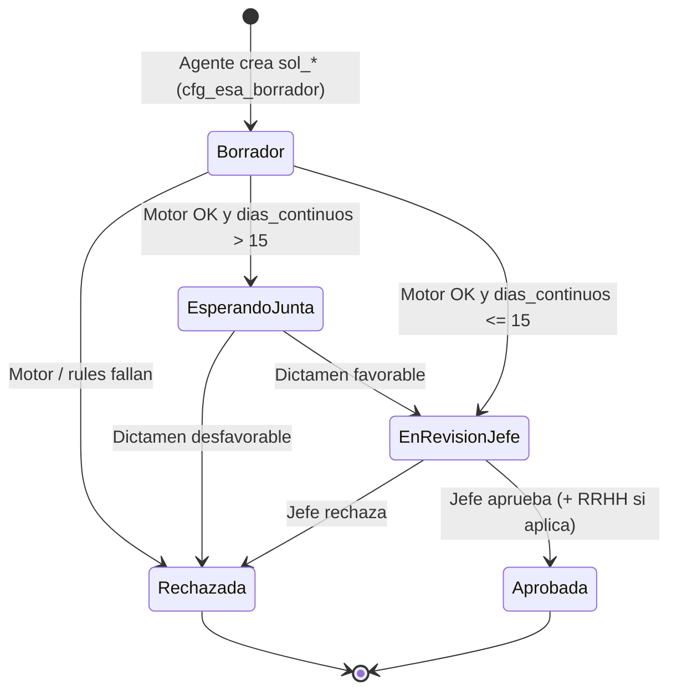

# RFC P4 — Licencias médicas (Arts. 11, 14, 16/19 y workflow Art. 15)

> **Flujo agente en producción:** [`RFC_TICKETERA_SLICE_MEDICO_CAJA_NEGRA_V2.md`](./RFC_TICKETERA_SLICE_MEDICO_CAJA_NEGRA_V2.md) (Modo A). Este RFC detalla el **motor normativo** y el **Modo B** (artículo ya elegido en ticketera, preview P4.1).

**Estado:** **Motor P4.1 implementado** · **Orquestación Caja Negra pendiente** (ver RFC ticketera médico)  
**Rama:** `feat/1919-p4-licencias-medicas`  
**Plan:** [`PLAN_P4_LICENCIAS_MEDICAS_ART_11_14_V2.md`](./PLAN_P4_LICENCIAS_MEDICAS_ART_11_14_V2.md)  
**Motor base:** [`RFC_MOTOR_V2_AS_BUILT.md`](./RFC_MOTOR_V2_AS_BUILT.md) · Patrón B/C existentes

**Norma:** Decreto 1919/89 — Bloque B (licencias médicas). Este RFC **no** sustituye el texto legal; fija contratos V2 para motor, Firestore y ticketera.

---

## 1. Resumen ejecutivo

El Paquete P4 introduce:

1. **Fase `S_MED`** — acumulador y **split de tramos de haberes** para **enfermedad de corta duración (Art. 14)** en año calendario (35 días al 100 %, 35 al 60 %, resto sin goce).
2. **Dos artículos de catálogo** — corta (Art. 14) vs larga (Arts. 16/19) con validaciones Zod y UI distintas.
3. **Workflow de junta médica (Arts. 11 y 15)** — estado `cfg_esa_esperando_dictamen_junta` cuando el episodio continuo supera 15 días.
4. **Contratos de preview y persistencia** — desglose `tramos_haberes` compatible con export SARH futuro.

**Fuera de alcance V2:** liquidación SARH, integración con juntas externas (Santa Fe/Rosario), `episodio_seguimiento_id` para larga duración (backlog).

---

## 2. Decisiones de negocio (workshop — vinculantes)

| ID | Tema | Decisión |
|----|------|----------|
| **WN-01** | Cruce 35/70 | **Split exacto** por unidad de consumo (día o fracción según `unidad_medida_id`). Persistir `tramos: { "100": n, "60": m, "0": k }`. Prohibido “tramo dominante” único. |
| **WN-02** | Catálogo | **Dos `art_*`:** (A) corta Art. 14 — contador anual agnóstico de patología; (B) larga Arts. 16/19 — causal obligatoria (Art. 19), tope continuo ~2 años, goce distinto, **sin** reinicio a fin de año. |
| **WN-03** | Intermitencia | **Corta:** toda solicitud aprobada suma al mismo acumulador del año civil del titular. **Larga V2:** rechazar o bloquear alta si no hay **dictamen favorable** registrado (sin ID de seguimiento multi-año en esta entrega). |

---

## 3. Taxonomía de artículos (configurador)

Campo propuesto en versión (`bloque_identidad_naturaleza` o extensión RFC P4 en bloque dedicado):

| Campo | Tipo | Uso |
|-------|------|-----|
| `es_licencia_medica` | `boolean` | Ya existe. Debe ser `true` en ambos artículos P4. |
| `modo_licencia_medica_id` | `cfgRowId` | `cfg_mlm_corta_anual` (Art. 14) \| `cfg_mlm_larga_episodio` (Arts. 16/19). |
| `causal_larga_duracion_id` | `cfgRowId` \| `null` | Obligatorio solo si `modo_licencia_medica_id === cfg_mlm_larga_episodio` (catálogo Art. 19). |

**Patrón de solicitud recomendado**

| Modo | Patrón ticketera | Motivo |
|------|------------------|--------|
| Corta anual | **C** (rango continuo) o B multi-día según ficha | Episodios por fechas; cómputo con calendario institucional si la versión lo define. |
| Larga episodio | **C** | Continuidad y tope en meses/años; gate dictamen. |

**Listado ingreso:** `requiere_licencia_medica: true`, `modo_licencia_medica_id`, y para larga `requiere_causal_larga: true` + opciones desde catálogo (no confundir con `opciones_consumo_solicitud` de P5).

---

## 4. Fase motor `S_MED` (solo corta anual — WN-01)

### 4.1 Entrada

Ejecutar **después** de validar fechas y **antes** o **en lugar** del descuento de bolsa clásica cuando `modo_licencia_medica_id === cfg_mlm_corta_anual`.

**Inputs:**

- `titular_persona_id`
- `anio_calendario` — año civil de `fecha_desde` (ISO date).
- `dias_esta_solicitud` — entero ≥ 1 (unidades de consumo ya normalizadas por Patrón B/C y calendario).
- Histórico: suma de unidades ya **aprobadas** en el año para **cualquier** solicitud cuyo artículo tenga `cfg_mlm_corta_anual` (misma persona).

### 4.2 Algoritmo de split (pseudocódigo)

```
consumido_previo = queryAprobadosCortaAnual(persona, anio)
restante_100 = max(0, 35 - consumido_previo)
restante_60  = max(0, 70 - consumido_previo - restante_100)  // en la práctica: tramo 36..70

n100 = min(dias_esta_solicitud, restante_100)
n60  = min(dias_esta_solicitud - n100, restante_60)
n0   = dias_esta_solicitud - n100 - n60

tramos = { "100": n100, "60": n60, "0": n0 }
```

**Ejemplo workshop:** consumido_previo = 34, pedido = 5 → `{ "100": 1, "60": 4, "0": 0 }`.

### 4.3 Elegibilidad

- Si `n0 > 0` y la política institucional lo exige: **warning** en preview (días sin goce); alta permitida salvo regla RRHH futura.
- **No** usar `cupo_dias_por_ciclo` del bloque 4 como tope anual médico; el tope es la suma 35+35+∞ con degradación de haberes.
- Convive con `sin_descuento_bolsa_ciclo` de P5 solo si la ficha médica corta declara `cupo_dias_por_ciclo: null` (recomendado).

### 4.4 Larga duración (V2 mínimo)

- **No** ejecutar acumulador 35/35 en `S_MED` para `cfg_mlm_larga_episodio`.
- Fase **`S_MED_LARGA`:** validar `dictamen_favorable === true` en solicitud o en subdocumento `licencia_medica.dictamen` antes de pasar a revisión jefe.
- Tope continuo 2 años: validación en P4.1b (consulta rango aprobado + pedido actual).

---

## 5. Workflow y estados (Arts. 11 y 15)

### 5.1 Catálogo nuevo

| ID | Etiqueta UI |
|----|-------------|
| `cfg_esa_esperando_dictamen_junta` | Esperando dictamen de junta médica |

Constante shared propuesta: `ESTADO_SOLICITUD_ARTICULO_ESPERANDO_DICTAMEN_JUNTA`.

### 5.2 Disparador junta (continuidad > 15 días)

Tras **motor onCreate exitoso** (o tras previsualización si se confirma en UI):

- Si `dias_solicitados` (continuos en el episodio) **> 15** y `es_licencia_medica` → `estado_solicitud_id = cfg_esa_esperando_dictamen_junta` en lugar de `cfg_esa_en_revision_jefe`.
- **Política P4:** disparador en **onCreate** post-motor; RRHH/medicina resuelve dictamen antes de jefe final.

### 5.3 Diagrama de estados



**Notas:**

- `cfg_esa_en_revision_rrhh` permanece legacy; no usar en flujo médico nuevo salvo compatibilidad.
- Transiciones desde `EsperandoJunta` requieren rol medicina/RRHH (callable dedicado en P4.2).

---

## 6. Contrato Firestore — `solicitudes_articulo`

### 6.1 Mapa `licencia_medica` (persistido en onCreate / inmutable post-aprobación)

```typescript
// Contrato lógico V2 — claves string en Firestore para tramos
licencia_medica: {
  schema_version: 1;                    // entero
  modo_licencia_medica_id: string;        // cfg_mlm_corta_anual | cfg_mlm_larga_episodio
  anio_calendario?: number | null;        // solo corta anual
  dias_acumulados_previos?: number | null; // snapshot al momento del alta (corta)
  tramos_haberes: {
    "100": number;                        // enteros >= 0
    "60": number;
    "0": number;
  };
  dias_solicitud_total: number;           // = sum(tramos) = dias_solicitados motor
  requiere_junta_medica: boolean;
  junta_medica_sede_id?: string | null;   // catálogo futuro
  causal_larga_duracion_id?: string | null;
  dictamen?: {
    favorable: boolean | null;
    registrado_en?: Timestamp | null;
    registrado_por_persona_id?: string | null;
    observacion?: string | null;
  } | null;
  // Opcional P4.1+: desglose por día para grilla / SARH
  tramos_por_dia?: Array<{
    fecha: string;           // YYYY-MM-DD
    tramo_haberes: "100" | "60" | "0";
  }> | null;
}
```

**Reglas:**

- Si `estado_solicitud_id === cfg_esa_aprobada`, **prohibido** mutar `licencia_medica.tramos_haberes` (rules + validación servidor).
- `tramos_haberes` debe cumplir `100 + 60 + 0 === dias_solicitud_total`.
- Borrador: puede existir sin `dictamen`; larga duración **no** puede pasar motor sin `dictamen.favorable === true` (WN-03).

### 6.2 Índice / consulta histórica (corta anual)

Query para `dias_acumulados_previos`:

- Colección: `solicitudes_articulo`
- Filtros: `titular_persona_id`, `estado_solicitud_id == cfg_esa_aprobada`, rango `fecha_desde` dentro del año civil, artículos con modo corta (vía `licencia_medica.modo_licencia_medica_id` o join por `articulo_id` + versión cacheada en solicitud).

**Campo denormalizado recomendado en solicitud:** `licencia_medica.modo_licencia_medica_id` para evitar leer versión en cada agregación.

### 6.3 Extensión `motor_snapshot`

El snapshot existente del motor Patrón B/C se mantiene. `licencia_medica` es **ortogonal** y se escribe en el trigger cuando `es_licencia_medica === true`.

---

## 7. Contrato callable — previsualización

Aplica a `previsualizarSolicitudPatronB` y `previsualizarSolicitudPatronC` cuando la versión resuelta tenga `es_licencia_medica === true`.

### 7.1 Request (campos adicionales opcionales)

| Campo | Tipo | Notas |
|-------|------|-------|
| `causal_larga_duracion_id` | `string` | Requerido si modo larga. |
| `dictamen_favorable` | `boolean` | Solo preview larga; en producción viene de medicina. |

### 7.2 Response — bloque `licencia_medica_preview`

Se agrega al payload actual cuando `eligible === true` (y en algunos warnings cuando `eligible === false` por dictamen).

```json
{
  "ok": true,
  "eligible": true,
  "fecha_desde": "2026-06-02",
  "fecha_hasta": "2026-06-06",
  "dias_solicitados": 5,
  "licencia_medica_preview": {
    "schema_version": 1,
    "modo_licencia_medica_id": "cfg_mlm_corta_anual",
    "anio_calendario": 2026,
    "dias_acumulados_previos": 34,
    "tramos_haberes": { "100": 1, "60": 4, "0": 0 },
    "dias_solicitud_total": 5,
    "cruza_limite_35": true,
    "cruza_limite_70": false,
    "requiere_junta_medica": false,
    "mensaje_ui": "Esta solicitud consume 1 día al 100% de haberes y 4 días al 60%. Te quedan 0 días al 100% en 2026.",
    "mensaje_ui_corto": "1 día al 100% · 4 días al 60%"
  }
}
```

**Reglas de copy (`mensaje_ui`):**

- Generar en servidor (i18n único) a partir de `tramos_haberes` y saldos remanentes `restante_100_post`, `restante_60_post` opcionales.
- Si `tramos_haberes["0"] > 0`, incluir frase de **sin remuneración** explícita.
- Si `requiere_junta_medica === true`, prefijar aviso de junta antes del texto de tramos.

**Ejemplo junta:** `dias_solicitados: 16` → `requiere_junta_medica: true`, mensaje adicional: *"Supera 15 días continuos: la solicitud pasará a revisión de junta médica."*

### 7.3 Compatibilidad

- Clientes antiguos ignoran `licencia_medica_preview`.
- Campos `saldo_ciclo` **no** se envían para corta médica si `cupo_dias_por_ciclo === null` (misma semántica P5).

---

## 8. Frontend (referencia P4.3)

| Superficie | Comportamiento |
|------------|----------------|
| `PatronBPreviewInfo` / preview C | Renderizar `mensaje_ui` o chips desde `tramos_haberes`. |
| Wizard larga | Select causal Art. 19; bloquear envío sin dictamen cuando el motor lo exija. |
| Check-in RRHH | Mostrar desglose y `dias_acumulados_previos` + año. |

---

## 9. Seguridad (Firestore rules — sketch)

- **Create:** permitir `licencia_medica` solo si shape valida (enteros, suma coherente) y `schema_version === 1`.
- **Update:** agente no puede escribir `dictamen`; rol medicina/RRHH sí, solo en `EsperandoJunta` o estados definidos.
- **Inmutabilidad:** si `estado_solicitud_id` pasa a `cfg_esa_aprobada`, `licencia_medica.tramos_haberes` read-only.

---

## 10. Plan de implementación (trazabilidad)

| Entrega | Contenido |
|---------|-----------|
| **P4.0** | Este RFC + catálogos `cfg_mlm_*`, `cfg_esa_esperando_dictamen_junta`, Zod versión/solicitud |
| **P4.1** | `licenciaMedicaTramosCore.js` + hook en `runPatronBAltaMotorV2` / Patrón C + tests 34+5, 69+2 |
| **P4.2** | Trigger transición junta + callable dictamen |
| **P4.3** | UI preview + seeds `art_*` corta/larga |
| **P4.4** | `MATRIZ_UAT_P4_LICENCIAS_MEDICAS.md` |

---

## 11. Referencias

- [`PLAN_P4_LICENCIAS_MEDICAS_ART_11_14_V2.md`](./PLAN_P4_LICENCIAS_MEDICAS_ART_11_14_V2.md)
- [`MATRIZ_UAT_P5_OPCIONES_CONSUMO_63J.md`](./MATRIZ_UAT_P5_OPCIONES_CONSUMO_63J.md) — precedente de matriz UAT
- `functions/onCall/solicitudes/previsualizarSolicitudPatronB.js` — extensión response §7
- `functions/triggers/solicitudArticuloPatronBOnCreate.js` — persistencia §6
