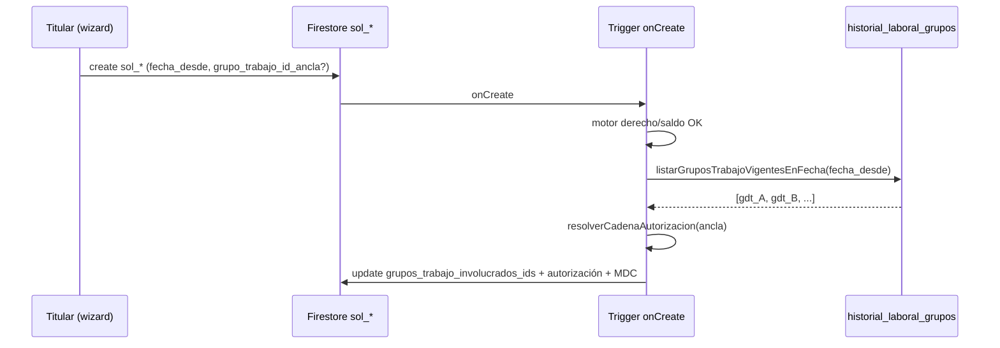

# RFC — Snapshot `grupos_trabajo_involucrados_ids` en `sol_*`

**Estado:** **implementado** (2026-05-23) — snapshot en triggers LAO + Patrón B; piloto manual § evidencia  
**Fecha:** 2026-05-23  
**Ámbito:** coordinación transversal multigrupo — persistencia en alta + visibilidad futura (bandejas / consultas).

**Relación:** [`MODULO_DATOS_LABORALES_V2.md`](./MODULO_DATOS_LABORALES_V2.md) (HLg SSoT) · [`SOLICITUD_ARTICULO_AUTORIZACION_CAMPOS_V2.md`](./SOLICITUD_ARTICULO_AUTORIZACION_CAMPOS_V2.md) · [`RFC_TICKETERA_LAO_WIZARD_V2.md`](./RFC_TICKETERA_LAO_WIZARD_V2.md) · [`OLEADA_C2_HOJA_RUTA_GSO_EQUIPO.md`](./OLEADA_C2_HOJA_RUTA_GSO_EQUIPO.md) · código `functions/modules/shared/solicitudGrupoTrabajoAncla.js`.

---

## 1. Problema que resuelve

Un agente puede pertenecer a **varios grupos de trabajo** vigentes (`historial_laboral_grupos` / `hlg_*`). La solicitud debe registrar:

| Necesidad | Campo / mecanismo |
|-----------|-------------------|
| **Descuento de saldo y cadena de autorización** | `grupo_trabajo_id_ancla` — grupo elegido por el titular (o único vigente). |
| **Contexto laboral al momento del alta** | `grupos_trabajo_involucrados_ids[]` — **snapshot inmutable** de todos los `gdt_*` vigentes en `fecha_desde`. |
| **Evitar orfandad administrativa** | Otros jefes no “aprueban” por pertenencia al grupo B, pero deben poder **consultar** solicitudes que les afectan operativamente (fases futuras: `array-contains`, toma de conocimiento). |

**No** se duplica la membresía en `personas` ni se reemplaza HLg: el `sol_*` solo guarda la **foto** de la configuración laboral en el instante del alta.

---

## 2. Decisiones arquitectónicas (cerradas)

| # | Decisión | Notas |
|---|----------|-------|
| D1 | **HLg (`hlg_*`) = SSoT** de pertenencia | Runtime: `listarGruposTrabajoVigentesEnFecha(db, persona_id, fechaYmd)`. |
| D2 | **`grupos_trabajo_involucrados_ids`** = `string[]` de `gdt_*` | Thin snapshot; sin objetos anidados (Firestore `array-contains` + índices). |
| D3 | **Inmutable tras alta** | Si cambia HLg después, la solicitud conserva el snapshot histórico. |
| D4 | **Misma coherencia temporal que autorización** | Rellenar en el **mismo bloque transaccional** que `resolverCadenaAutorizacion` (misma `fecha_desde` del documento). |
| D5 | **`grupo_trabajo_id_ancla` ⊆ snapshot** | El ancla elegido debe estar incluido en el array (validación trigger). |
| D6 | **Grilla equipo (GSO)** | Hoy: visibilidad por **persona** en `vis_*` + membresía HLg al listar equipo (`listarVistaGrillaMesPorGrupo`). El snapshot acelera **consultas sobre `sol_*`**, no sustituye MDC. |
| D7 | **Fuera de este RFC** | Etiqueta UI “imputada en Grupo A”, toma de conocimiento formal, bandeja jefe por pertenencia cruzada. |
| D8 | **Visibilidad grilla = inmediata tras alta OK** | Tras motor + autorización, estado `cfg_esa_en_revision_jefe` y MDC `PROYECTAR_PENDIENTE` (no esperar aprobación RRHH). Copy de producto alineado (§2.1). |

### 2.1 Copy wizard (validado 2026-05-23)

**Texto acordado (N ≥ 1, con `[lista]` = nombres de grupos vigentes):**

> Tenés asignados: **[lista]**. Elegí sobre cuál pedís la licencia (afectará el descuento de saldo y el flujo de autorización). Apenas confirmes, tu ausencia aparecerá como **«Pendiente»** en la grilla operativa de todos tus grupos de trabajo.

**Por qué no “cuando esté aprobada”:** al confirmar, el trigger pasa a `cfg_esa_en_revision_jefe` y dispara `PROYECTAR_PENDIENTE` → `asi_*` con `tiene_tramite_pendiente: true` y fan-out a `vis_*` del titular. Los jefes de otros grupos ven esa proyección en la **vista equipo** (`listarVistaGrillaMesPorGrupo`) si el agente es integrante HLg de ese grupo — sin duplicar escrituras por cada `gdt_*`.

**Matiz técnico (transparencia):** el cliente crea en `cfg_esa_borrador`; la proyección ocurre **después** de que el trigger `onDocumentCreated` valide motor + autorización (segundos, asíncrono). Si el motor rechaza o falla MDC, no hay celda pendiente.

**UI grilla hoy (Oleada C):** la celda muestra el **código de grilla** del artículo; el estado pendiente se distingue por borde ámbar discontinuo y tooltip *«En revisión (jefe)»* (`grillaMesCellUtils.js`). Mejora opcional: prefijo visible «Pend.» además del código (checklist §4.4 U4).

### 2.2 Mecanismo MDC (no confundir con fan-out por grupo)

| Creencia errónea | Realidad en código |
|------------------|-------------------|
| MDC escribe una `vis_*` por cada `gdt_*` del snapshot | **Una** `vis_<año>_<mes>_per_<ULID>` por titular; evento con `estado_solicitud_id` en revisión. |
| Hace falta `grupos_trabajo_involucrados_ids` para que B vea la grilla | **No** para GSO actual: B lista integrantes HLg y lee el `vis_*` del titular. El snapshot sirve para **consultas `sol_*`** y auditoría. |
| Trigger `onWrite` en cada cambio | Alta LAO/Patrón B: **`onDocumentCreated`**; MDC en transición a revisión jefe (y consolidación al aprobar). |

---

## 3. Contrato de campo

| Campo | Tipo | Obligatorio | Quién escribe | Cuándo |
|-------|------|-------------|---------------|--------|
| `grupo_trabajo_id_ancla` | `gdt_*` | Sí (si N>1 HLg; recomendado siempre) | Cliente (wizard) | Create `sol_*` |
| `grupos_trabajo_involucrados_ids` | `gdt_*[]` | Sí (post-trigger) | **Trigger onCreate** | Tras motor OK, junto autorización |

**Reglas:**

- Array sin duplicados; cada elemento prefijo `gdt_`.
- Si un solo grupo vigente: array de un elemento; ancla puede omitirse en cliente y resolverse en trigger (patrón actual `resolverGrupoTrabajoIdAnclaParaSolicitud`).
- Si N>1: cliente **debe** enviar `grupo_trabajo_id_ancla`; trigger valida que ∈ `grupos_trabajo_involucrados_ids`.

**Consulta futura (ejemplo):**

```text
solicitudes_articulo
  .where("grupos_trabajo_involucrados_ids", "array-contains", gdt_B)
  .where("estado_solicitud_id", "in", [...])
```

> Firestore: un solo `array-contains` por query; planificar índice compuesto con `estado_solicitud_id` / fechas si aplica.

---

## 4. Checklist de implementación (arranque sprint)

### 4.1 Backend — trigger onCreate (`sol_*`)

- [x] **T1** — En `solicitudArticuloLaoOnCreate.js` y `solicitudArticuloPatronBOnCreate.js`, tras motor OK y antes/después de `resolverCadenaAutorizacion`, llamar `listarGruposTrabajoVigentesEnFecha(db, persona_id, fecha_desde)`.
- [x] **T2** — Construir `grupos_trabajo_involucrados_ids` = lista única de `grupo_de_trabajo_id` vigentes.
- [x] **T3** — Persistir en el **mismo `update`** transaccional que `buildAutorizacionSnapshotFields` (coherencia temporal con cadena de mando).
- [x] **T4** — Validar: si `grupo_trabajo_id_ancla` presente → debe pertenecer al array; si N>1 y falta ancla → `GRUPO_ANCLA_REQUERIDO` (ya existe en LAO).
- [x] **T5** — Evento `eventos_ticket` / metadata: opcional incluir `grupos_trabajo_involucrados_ids` en log de alta (auditoría).

**Archivos esperados:**

- `functions/triggers/solicitudArticuloLaoOnCreate.js`
- `functions/triggers/solicitudArticuloPatronBOnCreate.js`
- `functions/modules/shared/solicitudGrupoTrabajoAncla.js` (helper exportable `buildGruposTrabajoInvolucradosSnapshot`)
- `functions/modules/shared/solicitudAutorizacionJerarquicaCore.js` (si el merge de campos se centraliza ahí)

### 4.2 Firestore Rules

- [x] **R1** — Cliente **no** puede escribir `grupos_trabajo_involucrados_ids` en create (`hasOnly` sin el campo; agente `update: false`).
- [x] **R2** — `grupo_trabajo_id_ancla` opcional en LAO create; snapshot excluido del shape cliente.

### 4.3 Índices

- [ ] **I1** — Añadir índice compuesto en `firebase-v2/firestore.indexes.json` si se define query bandeja por `array-contains` + estado (documentar query exacta en tarea de bandeja).

### 4.4 Frontend — Wizard LAO (paso grupo / 1.5)

**Estado código (2026-05-23):** selector grupo + `useLaoWizardGrupoAncla` — verificar commit/deploy.

- [x] **U1** — Copy validado (§2.1); implementar en `LaoGrupoAnclaPaso.jsx` con lista de grupos.
- [ ] **U2** — Si N>1: bloquear avance sin `grupo_trabajo_id_ancla` (ya implementado).
- [ ] **U3** — **No** enviar `grupos_trabajo_involucrados_ids` desde cliente (trigger es fuente del snapshot).
- [ ] **U4** — Grilla: reforzar etiqueta pendiente (tooltip ya dice «En revisión (jefe)»; opcional prefijo «Pend.» en celda).
- [ ] **U5** — Verificar post-alta: `PROYECTAR_PENDIENTE` en logs/MDC y celda ámbar en grilla equipo del grupo no ancla (piloto multigrupo).

**Archivos:** `web/src/features/lao/LaoGrupoAnclaPaso.jsx`, `useLaoWizardGrupoAncla.js`, `LaoWizardTicketera.jsx`.

### 4.5 Patrón B / wizard 64-A

- [ ] **P1** — Mismo copy/selector si `resolverContextoLaboral` devuelve N>1 (reutilizar componente o patrón LAO).

### 4.6 Documentación y pruebas

- [ ] **D1** — Actualizar [`SOLICITUD_ARTICULO_AUTORIZACION_CAMPOS_V2.md`](./SOLICITUD_ARTICULO_AUTORIZACION_CAMPOS_V2.md) → fila implementada.
- [ ] **D2** — Caso piloto multigrupo (ej. DNI 28914247): crear `sol_*`, verificar array en Firestore + autorización + MDC `PROYECTAR_PENDIENTE`.
- [ ] **D3** — Regresión: agente con un solo HLg → array de longitud 1, ancla auto.

---

## 5. Fuera de alcance (backlog explícito)

| Ítem | Notas |
|------|-------|
| Bandeja jefe “licencias de mi grupo por pertenencia” | Query `array-contains`; no es bandeja de aprobación jerárquica. |
| Toma de conocimiento a jefes de grupos del snapshot | [`RFC_TICKETERA_AUTORIZACION_TOMA_CONOCIMIENTO_V2.md`](./RFC_TICKETERA_AUTORIZACION_TOMA_CONOCIMIENTO_V2.md). |
| Etiqueta grilla “Licencia imputada en Grupo A” | Enriquecer `vis_*` o tooltip GSO con `grupo_trabajo_id_ancla`. |
| Reproceso solicitudes antiguas sin snapshot | Callable/admin one-shot opcional. |

---

## 6. Diagrama de flujo (alta)



---

## 7. Criterios de aceptación (Definition of Done)

1. Toda `sol_*` nueva (LAO + Patrón B) creada con motor OK incluye `grupos_trabajo_involucrados_ids` no vacío.
2. El array coincide con HLg vigente a `fecha_desde` del documento (verificación manual en piloto).
3. `grupo_trabajo_id_ancla` ∈ array cuando el cliente envió ancla.
4. Rules impiden que el cliente falsifique el snapshot.
5. Wizard muestra copy acordado y exige ancla si N>1.

---

## 8. Historial

| Fecha | Evento |
|-------|--------|
| 2026-05-23 | Diseño aprobado en sesión producto/técnica; documento creado como plano de sprint. |
| 2026-05-23 | Copy corregido (visibilidad pendiente inmediata post-alta); validación arquitectura MDC/vis (§2.1–2.2). |
| 2026-05-23 | **Etapa de diseño cerrada** — contrato MDC+vis+HLg+vista equipo; checkpoint §9 para código. |

---

## 9. Checkpoint de inicio (implementación)

| Ítem | Estado al cerrar diseño | Notas |
|------|-------------------------|-------|
| **Wizard** — `LaoGrupoAnclaPaso` cableado | ✅ Código | `LaoWizardTicketera.jsx` pasos 1–2 |
| **Wizard** — copy validado §2.1 | ✅ Código | `LaoGrupoAnclaPaso.jsx` |
| **Wizard** — `grupo_trabajo_id_ancla` en payload | ✅ Código | `useLaoWizardSubmit` → `crearSolicitudArticuloLaoBorrador` |
| **Trigger** — `emitirEventoYMdcLaoAltaOk` tras motor OK | ✅ Código | `solicitudArticuloLaoOnCreate.js` |
| **Trigger** — `grupos_trabajo_involucrados_ids[]` | ✅ Código | T1–T5 §4.1 LAO + Patrón B |
| **Rules** — snapshot solo backend | ✅ | `hasOnly` create sin el campo; `update: false` agente |
| **Grilla** — borde ámbar / tooltip revisión jefe | ✅ Comportamiento actual | `grillaMesCellUtils.js` |
| **Grilla** — prefijo «Pend.» en celda (U4) | 📋 Backlog refinamiento | Solo si jefatura pide más énfasis |

**Comando de retomar:** *«Implementá el RFC grupos involucrados»* (snapshot backend + rules + piloto multigrupo D2).
