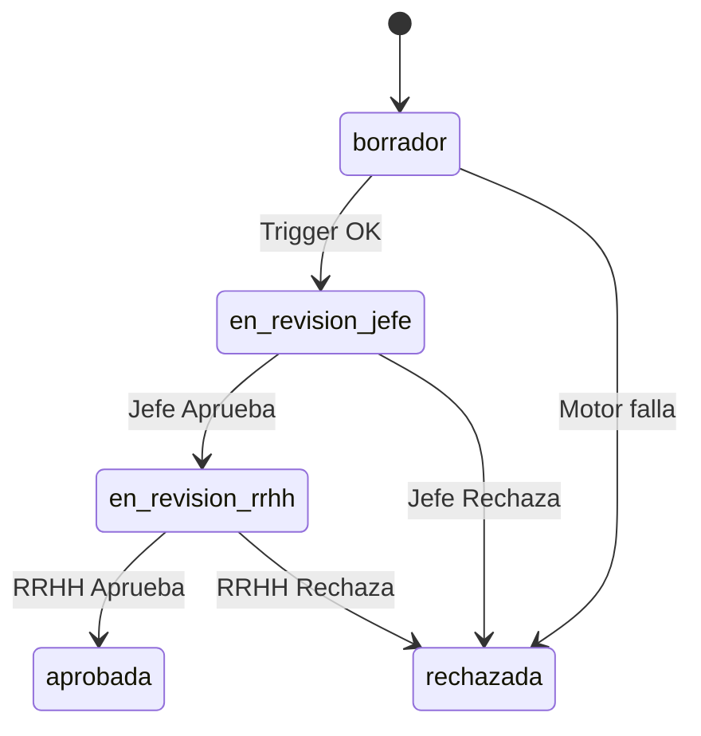
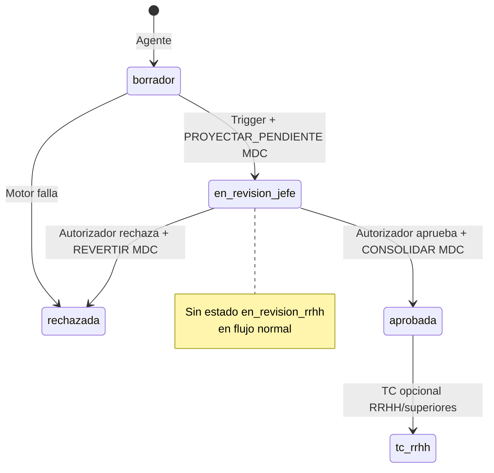
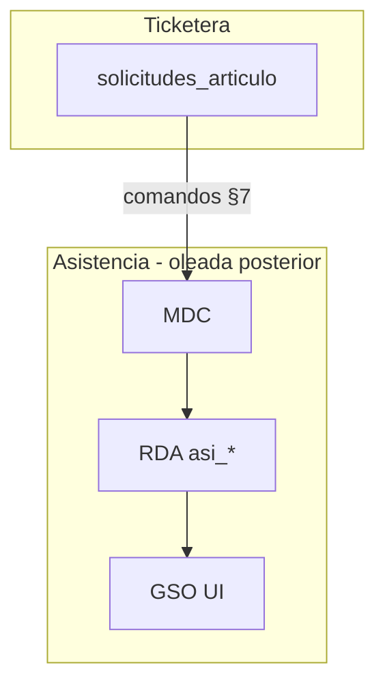

# RFC — Ticketera: autorización jerárquica, toma de conocimiento y contrato MDC/RDA

**Estado:** **aprobado en taller de producto** · documento de contrato · **2026-05-19**  
**Ámbito:** solicitudes Patrón B (piloto 64-A / 64-B); principios transversales ticketera / asistencia.  
**Implementación:** por oleadas (§10) — **no** implica despliegue inmediato de colección `asi_*` ni GSO completa.

**Origen:** [`HANDOFF_TICKETERA_PAUSA_2026-05-19_FASE2-4.md`](./HANDOFF_TICKETERA_PAUSA_2026-05-19_FASE2-4.md) §4.

**Relacionados:**

| Documento | Rol |
|-----------|-----|
| [`ARQUITECTURA_MAESTRA_SIGAL_V2_MODULO_OPERATIVO_ASISTENCIA.md`](./ARQUITECTURA_MAESTRA_SIGAL_V2_MODULO_OPERATIVO_ASISTENCIA.md) | RDA, MDC, GSO |
| [`RFC_TICKETERA_FASE3_BANDEJA_JEFE_MVP_V2.md`](./RFC_TICKETERA_FASE3_BANDEJA_JEFE_MVP_V2.md) | AS-IS bandeja jefe (MVP desplegado) |
| [`RFC_TICKETERA_FASE4_BANDEJA_RRHH_MVP_V2.md`](./RFC_TICKETERA_FASE4_BANDEJA_RRHH_MVP_V2.md) | AS-IS bandeja RRHH (MVP desplegado) |
| [`MODULO_DATOS_LABORALES_V2.md`](./MODULO_DATOS_LABORALES_V2.md) | `hlg_*.nivel_jerarquico` (1–99) |
| [`DICCIONARIO_CFG_ARTICULOS_V2.md`](./DICCIONARIO_CFG_ARTICULOS_V2.md) | `sol_*`, `cfg_tev_art_*` |
| [`PLAN_UNIFICACION_EVENTOS_RRHH_2026-05-06.md`](./PLAN_UNIFICACION_EVENTOS_RRHH_2026-05-06.md) | `eventos_ticket` |

**Documento futuro (implementación física asistencia):** `RFC_MODULO_ASISTENCIA_RDA_GSO_V2.md` (propuesto).

---

## 1. Objetivo

1. Fijar el **modelo de autorización** de solicitudes de artículo: quién aprueba, en qué orden, y qué hace RRHH.
2. Separar **autorización jerárquica** (cierre sustantivo) de **toma de conocimiento** (acuse).
3. Contratar **cuándo y con qué payload** la ticketera ordena trabajo al **MDC**, aunque la persistencia RDA (`asi_*`) y la UI GSO se implementen en oleada posterior.
4. Documentar brecha **AS-IS** (MVP mayo 2026) vs **TO-BE** acordado en taller.

**Fuera de alcance de este RFC (oleada Asistencia):** crear colección Firestore RDA, `recalcularVeredicto` completo, fichadas, UI GSO sombra/sólida, materialización `vistas_grilla_mes_agente` (`vis_*`).

---

## 2. Decisiones cerradas del taller (taxativas)

| # | Tema | Decisión |
|---|------|----------|
| 1 | Rol RRHH | **Opción B:** RRHH **no** cierra sustantivamente en flujo normal. **Toma de conocimiento** (acuse). **Cierre** (`cfg_esa_aprobada`) = autorizador jerárquico en bandeja jefe. |
| 2 | Quién autoriza | En el `grupo_trabajo_id` ancla: integrantes con `nivel_jerarquico` **estrictamente menor** que el titular. Entre ellos, los de **mejor rango** (menor número 1–99). **Un solo paso** de autorización. |
| 3 | Empate mismo nivel | **OR:** cualquiera de los empatados puede aprobar/rechazar; todos ven bandeja; el primero cierra. |
| 4 | Sin superior en burbuja | Escalar por `grupos_de_trabajo.parent_group_id` hasta encontrar autorizador (`MAX_DEPTH = 10`). |
| 5 | Solicitud huérfana | Sin padre útil → **RRHH sustituta** con **cierre sustantivo** (excepción a opción B). |
| 6 | Descuento saldo Patrón B | **Al solicitar** (trigger onCreate), sin cambio. |
| 7 | MDC → RDA | **Al solicitarse** (`en_revision_jefe`): proyección **PENDIENTE** (sombra GSO). Al **aprobar** jefe: **CONSOLIDAR**. |
| 8 | RRHH en bandeja jefe | **Sin bypass** por rol RRHH. Solo HLg si ∈ autorizadores elegibles. |
| 9 | TC superiores | **Opcional** por artículo (`toma_conocimiento_limitada`, `niveles_burbujeo`). `niveles_burbujeo = 0` → apagador (nadie recibe acuse). |
| 10 | Grupo ancla | Payload alta incluye **`grupo_trabajo_id_ancla`**; escalamiento solo desde ese árbol. |
| 11 | Sin HLg en fecha | **Rechazo duro** en listado/preview (antes de borrador). |
| 12 | `nivel_jerarquico` null | Excluir del cálculo; si todos null → escalar padre. |
| 13 | Revalidación al aprobar | Transacción aborta si el jefe ya no ∈ autorizadores elegibles. |
| 14 | Cancelación agente | Solo `borrador` o `en_revision_jefe`; reverso saldo + MDC `REVERTIR_PROYECCION`. |
| 15 | MDC falla post-aprobación | `cfg_esa_aprobada` **commit** primero; MDC en cola + reintentos/DLQ (`mdc_consolidacion_pendiente`). |
| 16 | Versión artículo | Snapshot **`version_id_aplicada`** en onCreate (inmutable para el trámite). |
| 17 | Bandeja RRHH UI | Filtro por **todos** los `estado_solicitud_id` (visibilidad). Botón TC formal solo tras `cfg_esa_aprobada` (salvo huérfana). |

---

## 3. Vocabulario de actos

| Acto | Definición | ¿Rechaza? | ¿Afecta saldo? | Actor típico |
|------|------------|-----------|----------------|--------------|
| **Autorización jerárquica** | Validación sustantiva del superior en la cadena resuelta | Sí | Sí (reverso si rechaza tras descuento onCreate) | Jefe(s) en `autorizadores_elegibles` |
| **Cierre RRHH sustituto** | Misma semántica que autorización, cuando no hay superior en organigrama | Sí | Sí | RRHH (`autorizacion_rrhh_sustituta: true`) |
| **Toma de conocimiento** | Registro de que RRHH/superior **vio** el trámite ya favorable | No (solo observación) | No | RRHH / superiores (config) |
| **Proyección MDC pendiente** | Intención en RDA/GSO sin licencia cerrada | N/A | No (saldo ya descontado) | Sistema (MDC) |

**Dos familias de “toma de conocimiento” (no mezclar):**

| Familia | Módulo | Mecanismo |
|---------|--------|-----------|
| Datos personales | [`MODULO_DATOS_PERSONALES_V2.md`](./MODULO_DATOS_PERSONALES_V2.md) §1.3 | `eventos_ticket` + bandeja RRHH ficha |
| Superiores post-licencia | Config artículo §6 PF | Burbujeo `gdt_*` padre + `niveles_burbujeo` |

Este RFC cubre **solicitudes de artículo** y el contrato MDC; no unifica la bandeja de ficha personal.

---

## 4. Estado actual (AS-IS) — MVP mayo 2026

### 4.1 Máquina de estados en código

Estados en [`functions/modules/shared/solicitudesArticuloEstados.js`](../../functions/modules/shared/solicitudesArticuloEstados.js):

| `estado_solicitud_id` | Uso AS-IS |
|------------------------|-----------|
| `cfg_esa_borrador` | Alta cliente |
| `cfg_esa_en_revision_jefe` | Post trigger Patrón B OK |
| `cfg_esa_en_revision_rrhh` | Jefe aprueba en bandeja |
| `cfg_esa_aprobada` | RRHH aprueba en bandeja |
| `cfg_esa_rechazada` | Jefe o RRHH rechaza |



### 4.2 Jerarquía AS-IS

[`solicitudBandejaJefeCore.js`](../../functions/modules/shared/solicitudBandejaJefeCore.js): cualquier integrante del mismo `gdt` con `nivel_jefe < nivel_titular`; **bypass RRHH** ve todas las pendientes.

### 4.3 Gaps AS-IS

- No lee `pasos_aprobacion` ni config TC/burbujeo en runtime.
- No emite `eventos_ticket` en transiciones.
- No invoca MDC / no escribe RDA.
- RRHH cierra en `cfg_esa_aprobada` (doble aprobación vs TO-BE).

---

## 5. Modelo objetivo (TO-BE)

### 5.1 Flujo principal (Opción B)



| Etapa | `estado_solicitud_id` | UI bandeja jefe | UI bandeja RRHH |
|-------|------------------------|-----------------|-----------------|
| Envío | `cfg_esa_en_revision_jefe` | Aprobar / Rechazar | Ver (filtro); sin TC formal aún |
| Cierre | `cfg_esa_aprobada` | — | **Registrar toma de conocimiento** (no “Aprobar definitivo”) |
| Huérfana | `cfg_esa_en_revision_jefe` → resuelve RRHH | — | Aprobar / Rechazar sustantivo |

### 5.2 Algoritmo — resolver autorizadores elegibles

**Entrada:** `titular_persona_id`, `grupo_trabajo_id_ancla`, `fecha_desde` (YMD, zona `America/Argentina/Buenos_Aires`).

```
1. Cargar HLg vigentes (activo !== false) de titular y de todos los integrantes del gdt en fecha_desde.
2. nivel_titular = nivel del titular en gdt ancla (si null → tratar como sin nivel en burbuja).
3. candidatos = { persona_id | nivel < nivel_titular y nivel no null }
4. Si candidatos vacío → ESCALAR: gdt_padre = parent_group_id, depth++, repetir desde 2 (MAX_DEPTH=10).
5. Si depth > MAX_DEPTH o sin padre → autorizacion_rrhh_sustituta = true; bandeja RRHH sustituta.
6. nivel_auth = MIN(nivel) sobre candidatos
7. autorizadores_elegibles = { persona_id | nivel == nivel_auth }
8. revisor puede gestionar ⟺ revisor ∈ autorizadores_elegibles (sin bypass CFG_RRHH en bandeja jefe).
```

**Listado bandeja jefe:** solicitud visible si `revisor ∈ autorizadores_elegibles` **o** solicitud marcada `autorizacion_rrhh_sustituta` y revisor es RRHH sustituto (callable dedicado).

**Resolver decisión:** dentro de transacción, revalidar que `revisor ∈ autorizadores_elegibles`; si no → `PERMISOS_JERARQUICOS_CAMBIADOS`.

### 5.3 Proyección RDA y GSO (contrato visual)

Al **`PROYECTAR_PENDIENTE`** (ver §7):

| Capa | Comportamiento |
|------|----------------|
| RDA `aportes_normativos[sol_id]` | `estado_instancia: PENDIENTE` (FK `cfg_*` a definir en RFC Asistencia) |
| RDA `estado_consolidado` | **No** pasa a licencia; día laborable o veredicto previo |
| Flag | `tiene_tramite_pendiente: true` |
| GSO | Celda **sombra** (rayado / ⏳); tooltip con `codigo_grilla` + “en revisión por jefatura” |

Al **`CONSOLIDAR_APROBADO`:** `estado_instancia: APROBADO`; `recalcularVeredicto`; GSO celda **sólida** con `codigo_grilla`.

Al **`REVERTIR_PROYECCION`:** eliminar aporte del mapa; quitar flag pendiente.

---

## 6. Integración SIGAL — RDA, MDC y GSO

La ticketera **alimenta** la grilla operativa; **no es** la grilla.

| Pieza | Documento | Rol |
|-------|-----------|-----|
| **RDA** | Arquitectura maestra §3 | `asi_<personaId>_<YYYYMMDD>` — verdad del día |
| **MDC** | Arquitectura maestra §4 | Motor backend idempotente |
| **GSO** | Arquitectura maestra §5 | UI `/portal/grilla` (futuro; hoy borrador laboral) |
| **Capa Vista** | [`MODULO_ARTICULOS_V2_SCHEMA_PRODUCT_FIRST.md`](./MODULO_ARTICULOS_V2_SCHEMA_PRODUCT_FIRST.md) §2.5 | `vis_*` — lectura mensual performante |



**Principio:** UI consumidor pasivo ([`ARQUITECTURA_MAESTRA_SIGAL_V2_MODULO_OPERATIVO_ASISTENCIA.md`](./ARQUITECTURA_MAESTRA_SIGAL_V2_MODULO_OPERATIVO_ASISTENCIA.md) §1). La ticketera no calcula francos ni veredictos.

---

## 7. Contrato Ticketera → MDC

### 7.1 Transporte

- Invocación **asíncrona** (Cloud Tasks o Pub/Sub).
- Idempotencia: clave `(sol_id, comando, comando_version)`.
- Callables de bandeja **no esperan** resultado MDC (decisión S2).
- Emisor stub permitido en **Oleada B** (log + no-op o cola sin consumidor).

### 7.2 Comandos

| Disparador | Comando | Payload mínimo (referencias, B6) | Efecto contractual en RDA |
|------------|---------|----------------------------------|---------------------------|
| Trigger → `en_revision_jefe` | `PROYECTAR_PENDIENTE` | `persona_id`, `sol_id`, `articulo_id`, `version_id_aplicada`, `fecha_desde`, `fecha_hasta`, `codigo_grilla`, `grupo_trabajo_id_ancla` | Aporte `PENDIENTE`; `tiene_tramite_pendiente: true` |
| Autorizador → `cfg_esa_aprobada` | `CONSOLIDAR_APROBADO` | ids anteriores + `estado_solicitud_id`, `grupo_autorizacion_id` | Aporte `APROBADO`; `recalcularVeredicto` |
| Rechazo jefe / cancelación C3 | `REVERTIR_PROYECCION` | `sol_id`, `persona_id`, `fecha_desde`, `fecha_hasta` | Delete aporte; limpiar pendiente |
| RRHH sustituta aprueba | `CONSOLIDAR_APROBADO` | + `autorizacion_rrhh_sustituta: true` | Igual consolidación |
| Fallo MDC tras aprobación | `REINTENTAR_CONSOLIDACION` | `sol_id` | Worker reintenta; `mdc_consolidacion_pendiente` en `sol_*` |

### 7.3 Ejemplo payload (JSON orientativo)

```json
{
  "comando": "PROYECTAR_PENDIENTE",
  "comando_version": 1,
  "sol_id": "sol_01KS0896610NA49M9G6VABMMEK",
  "persona_id": "per_01KR3HD24AMJ6YX3N7B3GPAZJ4",
  "articulo_id": "art_01KRNK10V10CH7W5M2W6V558GS",
  "version_id_aplicada": "ver_…",
  "fecha_desde": "2026-05-19",
  "fecha_hasta": "2026-05-19",
  "codigo_grilla": "64-A",
  "grupo_trabajo_id_ancla": "gdt_…"
}
```

---

## 8. Registros y campos `sol_*`

### 8.1 Campos nuevos o ampliados (TO-BE)

| Campo | Tipo | Obligatorio | Notas |
|-------|------|-------------|-------|
| `grupo_trabajo_id_ancla` | `gdt_*` | Sí (alta) | Grupo sobre el que se pide la licencia |
| `grupo_autorizacion_id` | `gdt_*` | Sí (post-resolución) | Donde se resolvió el autorizador |
| `escalamiento_jerarquico_ids[]` | `gdt_*[]` | No | Cadena de ascenso |
| `autorizacion_rrhh_sustituta` | boolean | No | Huérfana |
| `version_id_aplicada` | `ver_*` | Sí (onCreate) | Inmutable |
| `mdc_consolidacion_pendiente` | boolean | No | S2 |
| `autorizadores_elegibles_ids[]` | `per_*[]` | No | Opcional; preferir `evt_*` |

### 8.2 Saldo Patrón B

Sin cambio: descuento en trigger onCreate; reverso en rechazo vía [`solicitudPatronBReversoSaldo.js`](../../functions/modules/shared/solicitudPatronBReversoSaldo.js).

### 8.3 Check-in previo al alta (H5)

En `listarArticulosIngresoAgente` / `previsualizarSolicitudPatronB`: si titular sin HLg vigente en `fecha_desde` → error `ELEG_SIN_HLG` (o equivalente); **no** crear `sol_*` en borrador.

---

## 9. Eventos (`eventos_ticket`)

**AS-IS:** no emitidos por ticketera.

**TO-BE:** `schema_version: eventos_v2_1`, `modulo_origen: articulos`, `payload.ui` obligatorio ([`PLAN_UNIFICACION_EVENTOS_RRHH_2026-05-06.md`](./PLAN_UNIFICACION_EVENTOS_RRHH_2026-05-06.md)).

| `codigo_interno` (propuesto) | Cuándo |
|------------------------------|--------|
| `ART_SOLICITUD_CREADA` | → `en_revision_jefe` |
| `ART_SOLICITUD_ESTADO_CAMBIADO` | Aprobar / rechazar / cancelar |
| `ART_TOMA_CONOCIMIENTO_REGISTRADA` | TC superior o RRHH post-cierre |
| `ART_AUTORIZACION_JERARQUICA` | Opcional si se desea evento dedicado además de cambio estado |

`payload.contexto`: solo referencias (`sol_id`, `estado_anterior_id`, `estado_nuevo_id`, `gdt_id`, `actor_persona_id`).

---

## 10. Oleadas de implementación

| Oleada | Entregable | Incluye | No incluye |
|--------|------------|---------|------------|
| **A** | Motor autorización + bandejas TO-BE | Algoritmo §5.2; quitar `en_revision_rrhh` en flujo normal; RRHH TC; revalidación F3; huérfana; sin bypass RRHH en jefe; `grupo_trabajo_id_ancla` en alta; snapshot versión | MDC real, GSO |
| **B** | Emisor MDC | Cola Tasks/Pub/Sub; stub consumidor; flags `mdc_consolidacion_pendiente`; handlers en trigger y resolver | Persistencia `asi_*` |
| **C** | Asistencia RDA + GSO | Colección RDA, MDC worker, celdas sombra/sólido, `vis_*` | Cambios de negocio en §2 |

**Callables impactados (Oleada A):**

- `listarSolicitudesBandejaJefe` / `resolverDecisionJefeSolicitud`
- `listarSolicitudesBandejaRrhh` / `resolverDecisionRrhhSolicitud` (TC, no cierre)
- Nuevo o ampliado: cancelación agente (C3)
- `listarArticulosIngresoAgente` / preview (H5)

**UI (Oleada A):**

- Bandeja jefe: Aprobar / Rechazar → estados TO-BE.
- Bandeja RRHH: filtros multi-estado; “Registrar toma de conocimiento” si `aprobada`; Aprobar/Rechazar solo si `autorizacion_rrhh_sustituta`.
- Alta: selector `grupo_trabajo_id_ancla` si múltiples HLg.

---

## 11. Catálogo de casos borde (referencia pruebas)

Leyenda: **C** cerrado en taller · **A** abierto · **M** MVP actual.

### Jerarquía y grupo

| ID | Situación | Comportamiento |
|----|-----------|----------------|
| H1 | Dos+ jefes mismo nivel superior | C — OR, todos ven bandeja |
| H2 | Titular tope de burbuja | C — escalar padre; huérfana → RRHH sustituta |
| H3 | Mismo nivel titular/jefe | C — no autoriza en burbuja → padre |
| H4 | `nivel_jerarquico` null | C — excluir; todos null → padre |
| H5 | Sin HLg en `fecha_desde` | C — rechazo en check-in |
| H7 | Varias burbujas titular | C — `grupo_trabajo_id_ancla` explícito |
| H8 | Autorizador en gdt padre | C — válido |

### Tiempo real y concurrencia

| ID | Situación | Comportamiento |
|----|-----------|----------------|
| F2/F3 | HLg cambia antes de clic | C — revalidación transaccional |
| C1/C2 | Dos jefes aprueban | C — primero gana |
| C3 | Cancelación agente | C — solo borrador / en_revision_jefe + reverso |

### MDC / saldo / RRHH

| ID | Situación | Comportamiento |
|----|-----------|----------------|
| S1 | Rechazo tras descuento | C — reverso bolsa + REVERTIR MDC |
| S2 | MDC falla tras aprobar | C — aprobada + cola |
| R3 | Huérfana | C — RRHH cierre sustantivo |
| R4 | RRHH ve estados | C — visibilidad; TC post-aprobada |
| G1 | Varios pendientes mismo día | C — sombras en GSO (oleada C) |

### Pendientes menores (A)

F1 retroactividad, F4 multi-día, G3 turno nocturno, G4 pluriempleo, P1 delegación jefe, X1–X3 superposición/DDJJ — documentar en RFCs de slice o asistencia.

---

## 12. Matriz de pruebas (referencia)

Extender:

- [`TICKETERA_SLICE_64A_MATRIZ_PRUEBAS_FASE3_JEFE.md`](./TICKETERA_SLICE_64A_MATRIZ_PRUEBAS_FASE3_JEFE.md)
- [`TICKETERA_SLICE_64A_MATRIZ_PRUEBAS_FASE4_RRHH.md`](./TICKETERA_SLICE_64A_MATRIZ_PRUEBAS_FASE4_RRHH.md)

Casos nuevos obligatorios: **H1–H8**, **C3**, **R3**, **E1–E4** (eventos), **R1** (GSO tras MDC oleada C).

Piloto histórico: `sol_01KS0896610NA49M9G6VABMMEK` (revalidar estados tras migración TO-BE).

---

## 13. Brecha configuración vs runtime

| Config (versión artículo) | En configurador | En runtime solicitudes |
|---------------------------|-----------------|------------------------|
| `circuito_ingreso_ids` | Sí | Sí |
| `pasos_aprobacion[]` | Contrato PF | No |
| `toma_conocimiento_limitada` / `niveles_burbujeo` | Parcial | No (TC oleada posterior) |
| Workflow SLA | Catálogo | No |

Opción C (workflow 100% configurable) queda en roadmap [`PLAN_TICKETERA_V2.md`](./PLAN_TICKETERA_V2.md) Fase 6+.

---

## 14. Pendientes para RFC Asistencia

- Nombre de colección Firestore RDA (`asistencia_diaria` vs id `asi_*`).
- Catálogo `cfg_*` para `estado_instancia` en aporte normativo.
- Tokens GSO (CSS/aria) sombra vs sólido.
- Contrato lectura grupal `vis_*` por `gdt` + mes.
- Infra: Tasks vs Pub/Sub, DLQ, alertas `mdc_consolidacion_pendiente`.

---

## 15. Changelog

| Fecha | Cambio |
|-------|--------|
| 2026-05-19 | RFC creado tras taller producto; decisiones §2; contrato MDC §7; integración SIGAL §6. |
| 2026-05-19 | Handoff + plan implementación; ver [`HANDOFF_SESION_2026-05-19_AUTORIZACION_TICKETERA.md`](./HANDOFF_SESION_2026-05-19_AUTORIZACION_TICKETERA.md). |
