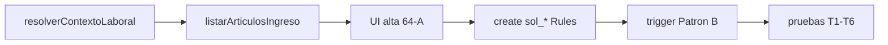

# RFC — Ticketera slice MVP: solicitud 64-A (Patrón B)

**Oleada:** 0 — cierre documental (sin implementación en este entregable).  
**Fecha:** 2026-05-18  
**Estado:** Oleada 1 backend **implementada** (2026-05-18); **D4** actualizado 2026-05-19 (roles HLC). Aprobación operativa §13 pendiente RRHH.  
**Rama de referencia:** `feature/ticketera-puente-campos-config`  
**Firebase:** `portal-hospital-v2`

**Relación:** [`RFC_SALDOS_PATRONES_ABC_V2.md`](./RFC_SALDOS_PATRONES_ABC_V2.md) §10 · [`HANDOFF_SESION_2026-05-14.md`](./HANDOFF_SESION_2026-05-14.md) · [`ARTICULOS_BASICOS_OPERATIVOS_V2.md`](./ARTICULOS_BASICOS_OPERATIVOS_V2.md) · [`BACKLOG_MODULOS_PARALELOS_ARTICULOS_V2.md`](./BACKLOG_MODULOS_PARALELOS_ARTICULOS_V2.md) · [`ARQUITECTURA_MAESTRA_SIGAL_V2_MODULO_OPERATIVO_ASISTENCIA.md`](./ARQUITECTURA_MAESTRA_SIGAL_V2_MODULO_OPERATIVO_ASISTENCIA.md)

---

## 1. Objetivo del slice

Permitir que un **agente elegible** cree una **solicitud de 64-A** (asuntos particulares con goce), con:

1. Validación de **elegibilidad laboral** (HLC) y **circuito de ingreso** (rol).
2. Validación de **reglas de artículo** (cupo ciclo, frecuencia mensual, tope por evento).
3. **Descuento de saldo Patrón B** al **iniciar trámite** (`onDocumentCreated`), coherente con RFC saldos §10.
4. Transición de estado mínima post-motor (rechazada o en revisión jefe).

**No** es el plan maestro ticketera (~23 pasos). Es el **primer vertical** para probar T1/T2 y consumo en `sal_{A}_per_*`.

---

## 2. Alcance explícito

### 2.1 Incluido (Oleada 1, tras aprobar este RFC)

| # | Entregable |
|---|------------|
| I1 | Callable `resolverContextoLaboralSolicitud` (persona + `fecha_desde` → HLC vigentes + snapshot ids) |
| I2 | Callable `listarArticulosIngresoAgente` (versiones publicadas + elegibilidad + `circuito_ingreso_ids`) |
| I3 | UI móvil mínima: alta solicitud **64-A** (fechas, enviar) |
| I4 | Cliente `crearSolicitudArticuloEstandarBorrador` + ampliación Rules si hace falta `fecha_hasta` |
| I5 | Trigger `onDocumentCreated` Patrón B (espejo conceptual de LAO, sin motor FIFO LAO) |
| I6 | Matriz de prueba T1–T4 + registro `sol_*` en handoff |

### 2.2 Fuera de alcance (fases posteriores)

| Tema | Motivo | Fase sugerida |
|------|--------|----------------|
| **MDC → RDA** (grilla asistencia) | Arquitectura maestra §3–4 sin código | Slice 3+ |
| **Días hábiles / feriados** (`cfg_cal_*`, contrato laborables) | 64-A usa **días corridos** (`cfg_rcd_corridos`) | Cuando artículo exija hábiles |
| **64-B, 68-B, LAO** | Otros patrones / UI existente LAO | Slice 2 |
| **Bandeja jefe / RRHH completa** | Solo estado terminal mínimo en slice 1 | Slice 2 |
| **SLA, burbujeo, toma conocimiento** | Config existe; runtime no | Ticketera plena |
| **Incompatibilidades / superposición** | Matriz escenarios 4–5 | Ticketera plena |
| **Alta delegada por jefe** | [`CUESTIONES_TICKET_SOLICITUD_POR_DELEGACION_JEFE_V2.md`](./CUESTIONES_TICKET_SOLICITUD_POR_DELEGACION_JEFE_V2.md) | Post-MVP |
| **Adjuntos digitales** | `requiere_adjunto_digital` | Post-MVP |
| **Reverso FIFO al rechazar** | Caso borde 3 — RFC saldos | Oleada 1.1 o 2 |
| **Panel «Mis saldos»** | D3 registro maestro | Paralelo no bloqueante |

---

## 3. Artículo y datos de referencia

| Campo | Valor |
|-------|--------|
| `articulo_id` | `art_01KRNK10V10CH7W5M2W6V558GS` |
| `version_id` (piloto) | `ver_01KRNKNBXNBFC9HZN7CZJGPRDH` |
| Código | `64-A` — ASUNTOS PARTICULARES |
| Patrón saldo | **B** — `cfg_rcc_anual` + `cfg_os_interno` |
| Cómputo | `cfg_rcd_corridos` (días corridos) |
| Cupo ciclo | 6 días (`cupo_dias_por_ciclo`) |
| Frecuencia | 1 solicitud / mes calendario (`tope_frecuencia_mensual`) |
| Evento | 1 día por solicitud, mín. 1 (`tope_dias_por_evento`, `dias_minimos_por_evento`) |
| Elegibilidad | `escalafon_ids` = [`CFG_ESC_02_ADMINISTRACION`]; `agrupamiento_ids` = `[]` |
| Circuito ingreso | **`CFG_USUARIO`** (verificar en Firestore al implementar) |
| Piloto T1 | `per_01KQN9WXFXF69Z9DCT5YNJ3TFZ` — bolsa `sal_2026_per_*` con consumo previo check-in |

---

## 4. Decisiones cerradas (Oleada 0)

Resuelven las tres preguntas abiertas del handoff 2026-05-14 § «Pendiente de diseño».

### D1 — Fecha de corte para elegibilidad laboral

**Decisión:** evaluar contra la **`fecha_desde`** de la solicitud (zona `America/Argentina/Buenos_Aires`), **no** contra “hoy” del servidor.

**Regla:** una fila `hlc_*` es **vigente en `fecha_desde`** si:

- `persona_id` coincide;
- no tiene `deshabilitado_en`;
- cumple `isHlcOperativo` (misma semántica que check-in — ver `hlcOperativo.js`);
- `fecha_desde` (civil BA) ∈ \[`vigente_desde` / `fecha_inicio`, `vigente_hasta` / `fecha_fin`\] (fin inclusive; `null` fin = abierto).

**Pluriempleo:** la elegibilidad del artículo se cumple si **existe al menos una** HLC vigente en esa fecha que pase todos los filtros del bloque (lógica **OR** entre cargos paralelos).

**Motivo:** coherencia con T4 (cambio 9282 → 2695) y con cómputo `anio_ciclo_consumo` desde `fecha_desde` (RFC saldos §10.2).

### D2 — `grupo_trabajo_ids` en elegibilidad

**Decisión MVP:** comparar `grupo_trabajo_ids` de la versión solo con **`grupo_de_trabajo_id` de la HLC** vigente que se está evaluando. **No** consultar membresía `hlg_*` en el slice 1.

**Si `grupo_trabajo_ids` está vacío:** sin restricción en ese eje (igual que escalafón/agrupamiento).

**Motivo:** 64-A no filtra por grupo en versión publicada; evita depender de HLG/jerarquía antes de tener bandeja jefe. Cuando un artículo exija grupo vía HLG, ampliar en RFC de slice 2 con callable compartido.

### D4 — Circuito de ingreso (acordado con RRHH, actualizado 2026-05-19)

**Decisión:** la **HLC vigente** evaluada debe tener **`rol_id`** ∈ `circuito_ingreso_ids` de la versión publicada (64-A piloto: `CFG_USUARIO`, `CFG_RRHH`, `CFG_MEDICO`, `CFG_VISUALIZADOR` — configuración en Firestore).

**Sesión agente (callable):** exige **`cargo_activo`** y **`roles_hlc_vigentes`** no vacío en el JWT (ver [`RFC_ACCESO_ROLES_HLC_MENUS_V2.md`](./RFC_ACCESO_ROLES_HLC_MENUS_V2.md)). **No** se usa `portal_role` para circuito.

En el **trigger** (sin token Auth) se valida solo `rol_id` ∈ circuito + reglas de saldo/elegibilidad.

### D3 — Mensajes de rechazo

**Decisión:** respuesta estructurada con **código estable** + **mensaje legible** (no solo texto genérico).

| Código | Cuándo | Mensaje orientativo (ES) |
|--------|--------|---------------------------|
| `ELEG_SIN_HLC` | Ninguna HLC vigente en `fecha_desde` | No tenés un cargo vigente para la fecha elegida. |
| `ELEG_ESCALAFON` | Ninguna HLC pasa `escalafon_ids` | Este artículo no aplica a tu escalafón vigente. |
| `ELEG_AGRUPAMIENTO` | Falla `agrupamiento_ids` | Tu agrupamiento no está habilitado para este artículo. |
| `ELEG_CARGO` | Falla `cargo_funcional_ids` | Tu cargo no está habilitado para este artículo. |
| `ELEG_VINCULO` | Falla `tipo_vinculo_ids` | Tu tipo de vínculo no está habilitado. |
| `ELEG_ANTIGUEDAD` | `antiguedad_minima_meses` | No alcanzás la antigüedad mínima requerida. |
| `ELEG_PERSONA` | `persona_ids` whitelist | Este artículo no está disponible para tu legajo. |
| `CIRCUITO_ROL` | `hlc.rol_id` ∉ `circuito_ingreso_ids` | Tu perfil no puede iniciar solicitudes de este artículo. |
| `SALDO_CICLO` | Sin bolsa o `disponible` insuficiente | No hay saldo disponible en el ciclo. |
| `SALDO_MES` | Supera `tope_frecuencia_mensual` | Ya usaste la solicitud permitida este mes. |
| `SALDO_EVENTO` | Días pedidos ≠ tope (64-A: 1) | Este artículo permite un solo día por solicitud. |
| `FECHA_RANGO` | `fecha_hasta` inválida o año distinto | Revisá las fechas del pedido. |

El listado en UI de artículos **no muestra** artículos que ya fallan elegibilidad o circuito (fail-fast en `listarArticulosIngresoAgente`). La **entrada de menú** y accesos directos (Inicio) usan el mismo callable a fecha Argentina (`articuloIngresoId` en `MODULOS_PORTAL`); la ruta de alta redirige a Inicio si el artículo no está en el listado. El alta valida de nuevo en servidor (nunca confiar solo en cliente).

---

## 5. Contrato laboral (resolver)

### 5.1 Callable `resolverContextoLaboralSolicitud`

**Entrada:** `{ persona_id, fecha_desde }` (ISO `YYYY-MM-DD`).  
**Salida:**

```json
{
  "persona_id": "per_…",
  "fecha_desde": "2026-05-20",
  "hlc_vigentes": [
    {
      "hlc_id": "hlc_…",
      "escalafon_id": "CFG_ESC_02_ADMINISTRACION",
      "agrupamiento_id": "…",
      "cargo_funcional_id": "…",
      "tipo_vinculo_id": "…",
      "grupo_de_trabajo_id": "gdt_…",
      "efector_designacion_id": "…",
      "efector_cumplimiento_id": "…"
    }
  ],
  "antiguedad_meses": 120,
  "elegibilidad_base_ok": true
}
```

- `hlc_vigentes`: todas las HLC operativas en la fecha (puede ser `[]`).
- `antiguedad_meses`: desde `antiguedadCalculator` (dinámico; **no** check-in almacenado).
- Solo invocable por titular o RRHH según Rules/claims (detallar en Oleada 1).

### 5.2 Callable `listarArticulosIngresoAgente`

**Entrada:** `{ persona_id, fecha_desde }` + roles desde token.  
**Proceso:**

1. Versiones con `estado_version_id` = publicada y vigencia que cubra `fecha_desde`.
2. `resolvePatronSaldo` ≠ inválido (informar patrón en DTO si útil para UI futura).
3. Filtrar por `bloque_elegibilidad_filtros` usando §4 D1–D2 y §6.
4. Filtrar por intersección `circuito_ingreso_ids` ∩ roles del token (**OR**).
5. Para MVP slice, opcional: **whitelist** solo `art_01KRNK10…` hasta validar T1 (flag de entorno o parámetro `articulo_ids`).

**Salida:** lista `{ articulo_id, version_id, codigo_grilla, nombre, patron_saldo }`.

---

## 6. Semántica de filtros (`bloque_elegibilidad_filtros`)

Referencia: handoff 14/05 y [`MODULO_CONFIGURACION_ARTICULOS_V2.md`](./MODULO_CONFIGURACION_ARTICULOS_V2.md) §1.

| Campo versión | `[]` vacío | Lista poblada |
|---------------|------------|---------------|
| `escalafon_ids` | Todos | `escalafon_id` de alguna HLC vigente ∈ lista |
| `agrupamiento_ids` | Todos (tras escalafón) | `agrupamiento_id` ∈ lista |
| `cargo_funcional_ids` | Todos | `cargo_funcional_id` ∈ lista |
| `tipo_vinculo_ids` | Todos | `tipo_vinculo_id` ∈ lista |
| `grupo_trabajo_ids` | Todos | `grupo_de_trabajo_id` de HLC ∈ lista (MVP: sin HLG) |
| `persona_ids` | Todos | `persona_id` ∈ lista |
| `genero_ids` | Todos | según persona (si aplica) |
| `antiguedad_minima_meses` | — | `antiguedad_meses` ≥ umbral |

---

## 7. Contrato solicitud (`solicitudes_articulo`)

### 7.1 Documento mínimo (create cliente)

Extiende el shape LAO vigente en Rules:

| Campo | Obligatorio | Notas |
|-------|-------------|--------|
| `solicitud_id` / doc id | sí | `sol_<ULID>` |
| `articulo_id` | sí | `art_…` |
| `version_aplicada` | sí | `ver_…` publicada |
| `titular_persona_id` | sí | = token en MVP agente |
| `actor_alta_persona_id` | sí | = token en MVP agente |
| `fecha_desde` | sí | ISO date |
| `fecha_hasta` | sí (64-A) | Mismo día que `fecha_desde` para 1 día/evento |
| `anio_ciclo_consumo` | sí | `year(fecha_desde)` en BA |
| `dias_solicitados` | sí | Entero; 64-A = **1** |
| `estado_solicitud_id` | sí | `cfg_esa_borrador` |
| `schema_version` | sí | `2` (slice estándar; LAO puede quedar en `1`) |
| `patron_saldo` | recomendado | `"B"` snapshot |
| `hlc_id_elegibilidad` | recomendado | HLC que satisfizo filtros (auditoría) |
| `creado_en` / `actualizado_en` | sí | serverTimestamp |

**Ampliación Rules:** actualizar `solicitudArticuloCreateShape()` para incluir `fecha_hasta`, `anio_ciclo_consumo`, `dias_solicitados`, `patron_saldo`, `hlc_id_elegibilidad` y validar `estado_solicitud_id == cfg_esa_borrador`.

### 7.2 Estados post-trigger (MVP)

| Resultado motor | `estado_solicitud_id` |
|-----------------|------------------------|
| OK | `cfg_esa_en_revision_jefe` |
| Falla elegibilidad / saldo / reglas | `cfg_esa_rechazada` |

Campos de auditoría sugeridos: `motor_validado_en`, `motor_codigos[]`, `motor_mensaje`, `motor_descuento_aplicado` (bool).

**Aprobación RRHH / idempotencia:** conforme RFC saldos §10.1 — la aprobación **no** vuelve a descontar (Oleada 2 ticketera).

---

## 8. Motor de saldo Patrón B (trigger)

### 8.1 Disparador

- `onDocumentCreated` en `solicitudes_articulo/{solId}`.
- Solo si `estado_solicitud_id === cfg_esa_borrador` y `patron_saldo === "B"` (o derivado por `resolvePatronSaldo` en servidor).
- **No** procesar documentos LAO (delegar al trigger existente `solicitudArticuloLaoOnCreate`).

### 8.2 Validaciones (orden sugerido)

1. Versión publicada y coherente con `articulo_id`.
2. Re-ejecutar elegibilidad + circuito (mismas reglas que listado).
3. `anio_ciclo_consumo === year(fecha_desde)` BA.
4. `dias_solicitados` vs `tope_dias_por_evento` / mínimos.
5. Doc saldo `sal_{anio_ciclo_consumo}_per_{persona}` existe; bolsa `bol_{articulo_id}_{anio}` en `cfg_esb_activo` (si existe catálogo; si no, omitir estado bolsa en MVP con warning doc).
6. `disponible >= dias_solicitados`.
7. Contar solicitudes del titular + artículo en mes calendario de `fecha_desde` con estados que consumen cupo mensual (definir lista: al menos `cfg_esa_en_revision_jefe` y aprobados futuros; excluir `cfg_esa_rechazada`).
8. Transacción: incrementar `consumido`, decrementar `disponible`; escribir trazabilidad `_debito_origen: [{ bolsa_id, anio_origen, dias }]` para reverso futuro.

### 8.3 Referencia código existente

| Pieza | Ruta |
|-------|------|
| Trigger LAO (patrón) | `functions/triggers/solicitudArticuloLaoOnCreate.js` |
| Bolsas / ids | `shared/utils/laoSaldosBolsa.js` (`saldoAnualDocId`, `buildBolsaKey`) |
| Patrón | `web/src/features/checkinSaldos/resolvePatronSaldo.js` (sincronizar a Functions si hace falta) |
| Estados | `functions/modules/shared/solicitudesArticuloEstados.js` |

---

## 9. UI mínima (Oleada 1)

| Pantalla | Ruta propuesta | Comportamiento |
|----------|----------------|----------------|
| Nueva solicitud 64-A | `/portal/solicitudes/nueva` o `/portal/solicitudes/asuntos-particulares` | Mobile-first; selector fecha (un día); botón Enviar |
| Listado propio | `/portal/solicitudes/mis-solicitudes` (opcional slice 1.1) | Lectura `solicitudes_articulo` propias |

**Copy:** no usar “ticket” en UI; “solicitud” (alineado configurador 14/05).

**Precondiciones mostradas al usuario:**

- Check-in con bolsa ciclo recomendado (warning, no bloqueo duro si saldo se crea en trigger — preferible fallar con `SALDO_CICLO`).
- HLC operativo (mensaje si `ELEG_SIN_HLC`).

---

## 10. Matriz de prueba (aceptación Oleada 1)

| # | Caso | Precondición | Acción | Esperado |
|---|------|--------------|--------|----------|
| T1 | Agente 2695 | HLC `CFG_ESC_02`, rol `CFG_USUARIO`, bolsa 2026 con disponible ≥ 1 | Crear solicitud 1 día | `cfg_esa_en_revision_jefe`; `consumido` +1 en bolsa |
| T2 | Agente 9282 | HLC `CFG_ESC_01` | Intentar listar / crear 64-A | Artículo no listado o `cfg_esa_rechazada` + `ELEG_ESCALAFON` |
| T3 | Usuario solo RRHH | Sin `CFG_USUARIO` | Listar artículos | 64-A no disponible (`CIRCUITO_ROL`) |
| T4 | Cambio escalafón | Dos HLC históricas; vigente 2695 en `fecha_desde` | Solicitud en fecha posterior al cambio | OK si HLC 2695 vigente ese día |
| T5 | Sin saldo | Bolsa ausente o disponible 0 | Enviar | `cfg_esa_rechazada` + `SALDO_CICLO` |
| T6 | Segunda en mismo mes | Tras T1 aprobada/en revisión | Segunda solicitud mismo mes | `SALDO_MES` si `tope_frecuencia_mensual` = 1 |

Registrar `sol_*` y captura de bolsa en [`HANDOFF_SESION_2026-05-18_ARTICULOS_BASICOS_Y_CONTINUIDAD.md`](./HANDOFF_SESION_2026-05-18_ARTICULOS_BASICOS_Y_CONTINUIDAD.md).

---

## 11. Seguridad y acceso

- **Create** `solicitudes_articulo`: titular = actor = `persona_id` token (MVP); Rules sin update cliente.
- **Lectura** cfg_articulos/versiones: ya permitida autenticado; motor en servidor Admin SDK.
- **Saldos:** agente **no** lee `saldos_articulo_agente` (RFC §4); validación solo en trigger/Callable.
- **RRHH** retroactivo / ajuste: fuera de slice 1 ([`RFC_SALDOS_PATRONES_ABC_V2.md`](./RFC_SALDOS_PATRONES_ABC_V2.md) §10.4).

---

## 12. Riesgos y mitigaciones

| Riesgo | Mitigación |
|--------|------------|
| Duplicar lógica LAO en trigger B | Trigger separado; helpers compartidos en `shared/` |
| Rules desactualizadas vs payload | Actualizar `solicitudArticuloCreateShape` en mismo PR que cliente |
| Pluriempleo mal resuelto | OR sobre HLC vigentes; guardar `hlc_id_elegibilidad` |
| Confundir aprobación con descuento | Documentar en UI “El saldo se reserva al enviar” |
| Salto a MDC antes de tiempo | Checklist §2.2; rechazar scope creep en PR |

---

## 13. Criterios de aprobación de este RFC (Oleada 0)

- [x] RRHH confirma D1–D3 y parámetros 64-A (tabla §3).
- [x] Dev confirma división trigger LAO vs Patrón B.
- [x] Verificado en Firestore: circuito estándar (`CFG_USUARIO`, `CFG_RRHH`, `CFG_MEDICO`, `CFG_VISUALIZADOR`) en 64-A/B/68-B/LAO 2022–2026.
- [x] Piloto T1 identificado (`per_01KQN9WXFXF69Z9DCT5YNJ3TFZ`).
- [x] Acordado que MDC/RDA/feriados quedan fuera del primer PR.

**Oleada 1:** implementada 2026-05-18 — **pausa** documentada en [`HANDOFF_SESION_2026-05-18_TICKETERA_64A_PAUSA.md`](./HANDOFF_SESION_2026-05-18_TICKETERA_64A_PAUSA.md).

---

## 14. Orden de implementación (Oleada 1 — referencia)



1. Shared/helpers elegibilidad + tests unitarios.  
2. Callables.  
3. Rules + servicio cliente.  
4. Trigger + deploy Functions.  
5. UI + prueba manual piloto.  

---

## Historial

| Fecha | Cambio |
|-------|--------|
| 2026-05-18 | Oleada 0 — RFC inicial slice 64-A MVP |
