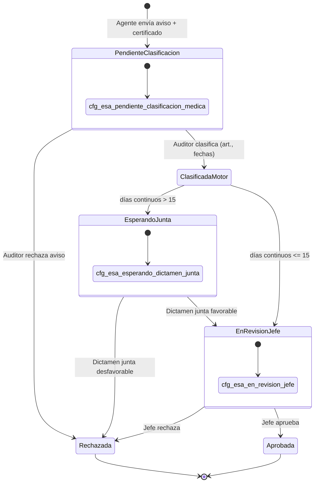

# RFC — Ticketera slice médico: Caja Negra (ingreso agente + bandeja auditor)

**Estado:** **Aprobado para diseño** (workshop RRHH + arquitectura — pausa P4 código)  
**Épica:** Licencias médicas Decreto 1919 — **Fase 5 ticketera** + **Paquete P4 motor**  
**Rama:** `feat/1919-p4-licencias-medicas`  
**Relacionados:**

| Documento | Rol |
|-----------|-----|
| [`CONCEPTO_TICKETERA_BANDEJA_DINAMICA_V2.md`](./CONCEPTO_TICKETERA_BANDEJA_DINAMICA_V2.md) §4.3 | Visión producto original |
| [`PLAN_TICKETERA_V2.md`](./PLAN_TICKETERA_V2.md) Fase 5 | Roadmap bandeja médico |
| [`RFC_P4_LICENCIAS_MEDICAS_ART_11_14_V2.md`](./RFC_P4_LICENCIAS_MEDICAS_ART_11_14_V2.md) | Motor normativo (S_MED, junta, tramos) — **Modo B** |
| [`PLAN_P4_LICENCIAS_MEDICAS_ART_11_14_V2.md`](./PLAN_P4_LICENCIAS_MEDICAS_ART_11_14_V2.md) | Plan de paquete |
| Código **`licenciaMedicaTramosCore.js`** (P4.1) | Matemática 35/70 — **reutilizable sin cambios** |

---

## 0. Premisa RRHH (narrativa operativa)

**El agente no es experto en leyes laborales; es un paciente o un familiar que necesita avisar.**

No se le pide elegir entre Art. 14, 16 o 23 en el primer pantallazo. Solo:

1. **Aviso de enfermedad** — ¿es para **vos** o para un **familiar**?
2. **Certificado médico** (adjunto obligatorio).
3. **Datos mínimos de contacto / fecha de inicio del reposo** (sin tramos de sueldo ni topes).

**El Médico Auditor** del hospital traduce certificado → norma (artículo, fechas, causal si aplica). **Ahí** corre el motor de RRHH (tramos 100 % / 60 % / sin goce para corta anual). **La Junta** interviene si el episodio supera 15 días continuos. **El jefe** toma conocimiento organizativo. **RRHH** cierra el paquete para liquidación (SARH).

---

## 1. Dos modos de producto (coexistencia)

| Modo | Usuario | Cuándo | Motor S_MED |
|------|---------|--------|-------------|
| **A — Caja Negra (canónico)** | Agente → Auditor → … | Producción licencias médicas | Al **clasificar** en bandeja auditor |
| **B — Artículo conocido (piloto / técnico)** | Agente elige `art_*` en ticketera | Pruebas P4.1, RRHH avanzado, regresión motor | En **previsualizar** Patrón B (implementado hoy) |

**Decisión de pausa:** no extender Modo B como flujo principal de agentes. El Modo B permanece como herramienta de laboratorio hasta que Modo A esté operativo.

---

## 2. Entidad de datos: ¿`solicitudes_articulo` o colección aparte?

### 2.1 Decisión recomendada

**Usar la misma colección `solicitudes_articulo`** con un **perfil de ingreso médico genérico**, sin crear `avisos_medicos` separada.

**Motivos:**

- Una sola trazabilidad para bandejas (jefe, RRHH, grilla MDC, historial agente).
- Mismos `evt_*` y convención `sol_*`.
- El motor y las rules ya pivotan en `solicitudes_articulo`.

### 2.2 Perfil documento — fase aviso (antes de clasificar)

Campos lógicos (contrato Zod/Rules en implementación futura):

| Campo | Fase aviso | Fase post-clasificación |
|-------|------------|-------------------------|
| `schema_version` | Nuevo literal p. ej. `SOL_MED_AVISO_V1` | `SOL_PATRON_B_V1` / `SOL_PATRON_C_V1` según artículo |
| `ingreso_medico` | `{ modo: "caja_negra", tipo_ingreso_id, adjuntos[] }` | Conservado como historial |
| `articulo_id` | **`null`** (ausente) | `art_*` obligatorio |
| `version_id_aplicada` | **`null`** | `ver_*` obligatorio |
| `fecha_desde` / `fecha_hasta` | Opcional o **estimada** (solo aviso) | Definitivas (auditor) |
| `dias_solicitados` | **Ausente** o estimación no vinculante | Entero motor |
| `estado_solicitud_id` | `cfg_esa_pendiente_clasificacion_medica` | Según §4 |
| `patron_saldo` | `MEDICO_AVISO` o ausente hasta clasificar | `B` / `C` según versión |
| `licencia_medica` | Ausente | Snapshot §6 de RFC P4 |

**No** usar `cfg_esa_borrador` + trigger onCreate Patrón B para el aviso: el borrador actual **exige** `articulo_id` y dispara motor de saldo ciclo. El aviso es un **create con shape distinto** y **sin** `onSolicitudArticuloPatronBOnCreate` hasta clasificación.

### 2.3 Catálogo — tipo de ingreso agente

Nueva colección o filas en catálogo existente:

| ID propuesto | UI agente |
|--------------|-----------|
| `cfg_tig_enfermedad_propia` | Es para mí (enfermedad propia) |
| `cfg_tig_atencion_familiar` | Atención de familiar enfermo |

RRHH parametriza textos y si familiar exige DDJJ vigente (gate en create).

### 2.4 Alternativa descartada (referencia)

`avisos_medicos/{id}` + promoción a `sol_*` al clasificar: duplica estados, complica MDC y consultas de acumulador anual. Solo reconsiderar si Rules no pueden modelar `articulo_id` nullable de forma segura.

---

## 3. Ciclo de vida y transiciones de estado

### 3.1 Estados nuevos en `cfg_estado_solicitud_articulo`

| ID | `codigo_interno` | Titulo UI | Actor principal |
|----|------------------|-----------|-----------------|
| `cfg_esa_pendiente_clasificacion_medica` | `PENDIENTE_CLASIFICACION_MEDICA` | Pendiente de clasificación médica | Agente (alta) → Auditor |
| `cfg_esa_esperando_dictamen_junta` | `ESPERANDO_DICTAMEN_JUNTA` | Esperando dictamen de junta | Medicina / RRHH provincial |
| *(existentes)* | `EN_REVISION_JEFE`, `APROBADA`, `RECHAZADA` | Sin cambio de significado | Jefe / sistema |

**Política “a determinar”:** en `PENDIENTE_CLASIFICACION_MEDICA` **no hay timeout automático** ([`HANDOFF_SESION_2026-05-13_TICKETERA.md`](./HANDOFF_SESION_2026-05-13_TICKETERA.md)).

### 3.2 Diagrama (Modo A — Caja Negra)



### 3.3 Matriz de transiciones (quién puede)

| Desde | Hacia | Rol | Acción |
|-------|-------|-----|--------|
| — | `PENDIENTE_CLASIFICACION` | Agente | Crear aviso |
| `PENDIENTE_CLASIFICACION` | `RECHAZADA` | `AUDITOR_MEDICO` / RRHH | Rechazo con motivo |
| `PENDIENTE_CLASIFICACION` | `ESPERANDO_JUNTA` o `EN_REVISION_JEFE` | `AUDITOR_MEDICO` | **Clasificar y aprobar médicamente** (callable §5) |
| `ESPERANDO_JUNTA` | `RECHAZADA` | Medicina / RRHH | Dictamen desfavorable |
| `ESPERANDO_JUNTA` | `EN_REVISION_JEFE` | Medicina / RRHH | Dictamen favorable |
| `EN_REVISION_JEFE` | `APROBADA` / `RECHAZADA` | Jefe | Igual que ticketera actual |
| `APROBADA` | — | — | Inmutable tramos / MDC |

**Nota Art. 11:** el jefe **no** valida mérito médico; solo recibe el trámite después de medicina (y junta si aplica).

---

## 4. Responsabilidades por actor (sin jerga técnica)

| Paso | Quién | Qué hace | Qué **no** hace |
|------|-------|----------|-----------------|
| 1 Aviso | Agente | Motivo propio/familiar + certificado | Elegir artículo del decreto; ver % sueldo |
| 2 Clasificación | Médico auditor | Artículo, fechas, causal/patología | Aprobar cobertura de guardia |
| 3 Motor | Sistema | Tramos 35/70 (corta), gates larga | Liquidar en SARH |
| 4 Junta | Reconocimientos médicos | Dictamen >15 días | Gestionar turnos |
| 5 Jefe | Jefe de unidad | Toma de conocimiento | Cuestionar certificado |
| 6 Cierre | RRHH | Check-in, export haberes | Reclasificar médicamente |

---

## 5. Contrato bandeja — Clasificar y aprobar (auditor)

Callable propuesto: **`clasificarSolicitudMedicaAuditor`** (nombre tentativo).

### 5.1 Autorización

- Rol: `AUDITOR_MEDICO` en `roles_hlc_vigentes` **o** claim equivalente + política RRHH.
- Documento en `cfg_esa_pendiente_clasificacion_medica`.
- Titular = persona del aviso (no delegación salvo RFC delegación jefe).

### 5.2 Request

```json
{
  "solicitud_id": "sol_01K…",
  "articulo_id": "art_01K…",
  "version_id_aplicada": "ver_01K…",
  "fecha_desde": "2026-06-10",
  "fecha_hasta": "2026-06-12",
  "dias_solicitados": 3,
  "causal_larga_duracion_id": null,
  "patologia_catalogo_id": "cfg_pat_…",
  "grupo_trabajo_id_ancla": "gdt_01K…",
  "observacion_auditor": "Reposo 72hs según certificado efector X",
  "dictamen_favorable": true
}
```

| Campo | Reglas |
|-------|--------|
| `articulo_id` + `version_id_aplicada` | Versión publicada; `es_licencia_medica === true` |
| `fecha_desde` / `fecha_hasta` | YMD; `dias_solicitados` coherente con cómputo versión (servidor recalcula y puede corregir) |
| `causal_larga_duracion_id` | Obligatorio si `modo_licencia_medica_id === cfg_mlm_larga_episodio` |
| `patologia_catalogo_id` | Opcional V2; catálogo Art. 19 futuro |
| `dictamen_favorable` | `false` → transición a `RECHAZADA` sin motor consumo |

### 5.3 Procesamiento servidor (orden fijo)

1. Validar transición y permisos.
2. Cargar versión; resolver patrón B/C.
3. Ejecutar **motor alta** (`runPatronBAltaMotorV2` / C) con solicitud **ya completa**.
4. Si corta anual → **`calcularTramosLicenciaMedicaCorta`** + `sumarConsumoCortaAnualAprobado` → persistir `licencia_medica` (mismo shape RFC P4 §6).
5. Si `dias_solicitados > 15` (continuos) → `estado_solicitud_id = cfg_esa_esperando_dictamen_junta`; si no → `cfg_esa_en_revision_jefe`.
6. Escribir `auditor_medico_clasificacion`: `{ persona_id, en, observacion, articulo_id, version_id }`.
7. **No** ejecutar descuento de bolsa ciclo clásica si la ficha médica corta lo prohíbe (alineado P5/P4).

### 5.4 Response (éxito)

```json
{
  "ok": true,
  "solicitud_id": "sol_01K…",
  "estado_solicitud_id": "cfg_esa_en_revision_jefe",
  "fecha_desde": "2026-06-10",
  "fecha_hasta": "2026-06-12",
  "dias_solicitados": 3,
  "licencia_medica": {
    "schema_version": 1,
    "modo_licencia_medica_id": "cfg_mlm_corta_anual",
    "anio_calendario": 2026,
    "dias_acumulados_previos": 34,
    "tramos_haberes": { "100": 1, "60": 2, "0": 0 },
    "dias_solicitud_total": 3,
    "requiere_junta_medica": false
  },
  "mensaje_ui": "Clasificación registrada. 1 día al 100% y 2 al 60%. Enviado al jefe para toma de conocimiento.",
  "motor_snapshot": { }
}
```

La UI del auditor muestra **`mensaje_ui`** y tramos **antes** de confirmar (preview interno); el agente **no** vio esto en el aviso.

### 5.5 Callable agente — Crear aviso

**`crearAvisoMedicoCajaNegra`** (tentativo):

```json
{
  "tipo_ingreso_id": "cfg_tig_enfermedad_propia",
  "fecha_inicio_reposo_estimada": "2026-06-10",
  "adjunto_storage_path": "…",
  "grupo_trabajo_id_ancla": "gdt_01K…",
  "comentario_agente": "Certificado adjunto"
}
```

Response: `solicitud_id`, estado `PENDIENTE_CLASIFICACION`, mensaje *"Tu aviso fue recibido. Medicina laboral lo revisará."*

---

## 6. Reutilización del motor P4.1 (sin reescribir matemática)

| Componente | Uso en Caja Negra |
|------------|-------------------|
| `licenciaMedicaTramosCore.js` | Igual |
| `sumarConsumoCortaAnualAprobado` | En clasificación (y al aprobar definitivo si se difiere consumo) |
| `previsualizarSolicitudPatronB` + `licencia_medica_preview` | **Solo Modo B**; retirar del wizard agente Modo A |

**Acumulador anual:** cuenta solicitudes **`APROBADAS`** con `licencia_medica.modo === cfg_mlm_corta_anual`. Definir en implementación si el consumo se reserva al **clasificar médicamente** o al **aprobar jefe** (recomendación: **aprobar jefe** para no bloquear tramos en avisos rechazados; preview del auditor usa histórico solo aprobado).

---

## 7. UI / menú

| Entrada menú | Ruta tentativa | Rol |
|--------------|----------------|-----|
| Aviso de enfermedad | `/portal/solicitudes/aviso-medico` | Agente |
| Bandeja clasificación médica | `/portal/medico/solicitudes` o `/portal/auditor-medico/…` | `AUDITOR_MEDICO`, RRHH |
| Dictamen junta | Subvista filtro `ESPERANDO_JUNTA` | Medicina / RRHH |

Alineado a [`CONCEPTO_TICKETERA_BANDEJA_DINAMICA_V2.md`](./CONCEPTO_TICKETERA_BANDEJA_DINAMICA_V2.md) §6.

---

## 8. Reglas Firestore (sketch)

- **Create aviso:** solo titular; shape `SOL_MED_AVISO_V1`; estado único `PENDIENTE_CLASIFICACION`; sin `articulo_id`.
- **Update aviso:** agente solo adjuntos/comentario mientras pendiente; **no** puede fijar artículo.
- **Clasificación:** solo vía Callable (Admin SDK) o rol auditor con campos whitelist.
- **Post-aprobación:** inmutabilidad `licencia_medica.tramos_haberes` (RFC P4).

---

## 9. Plan de implementación (post-documentación)

| Orden | Entrega | Dependencia |
|-------|---------|-------------|
| 1 | Seed estados + `cfg_tig_*` + actualizar SEED catálogos | Este RFC |
| 2 | Create aviso + Rules | — |
| 3 | Callable clasificar + enganche P4.1 | Motor existente |
| 4 | UI agente + bandeja auditor | — |
| 5 | Junta (P4.2) + MDC | Estados |
| 6 | Matriz UAT caja negra | — |

**Congelar** ampliación de preview agente Modo B salvo pruebas internas.

---

## 10. Addendum al RFC P4

El archivo [`RFC_P4_LICENCIAS_MEDICAS_ART_11_14_V2.md`](./RFC_P4_LICENCIAS_MEDICAS_ART_11_14_V2.md) describe el **motor normativo** y el flujo **cuando el artículo ya es conocido** (Modo B). **Este RFC es el source of truth del flujo agente en producción (Modo A).** Ante conflicto de UX, prevalece **Caja Negra**.

---

## 11. Changelog

| Fecha | Cambio |
|-------|--------|
| 2026-06-26 | RFC creado; unificación Caja Negra vs P4.1; entidad `solicitudes_articulo`; contrato auditor |
