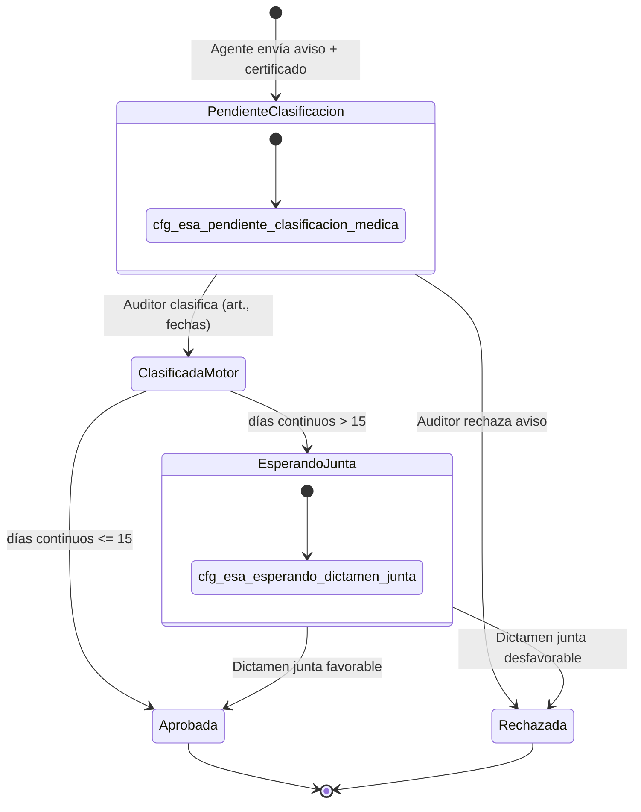

# RFC — Ticketera slice médico: Caja Negra (ingreso agente + bandeja auditor)

**Estado:** **Aprobado para diseño** (workshop RRHH + arquitectura — pausa P4 código)  
**Épica:** Licencias médicas Decreto 1919 — **Fase 5 ticketera** + **Paquete P4 motor**  
**Rama:** `feat/1919-p4-licencias-medicas`  
**Relacionados:**

| Documento | Rol |
|-----------|-----|
| [`CONCEPTO_TICKETERA_BANDEJA_DINAMICA_V2.md`](./CONCEPTO_TICKETERA_BANDEJA_DINAMICA_V2.md) §4.3 | Visión producto original |
| [`PLAN_TICKETERA_V2.md`](./PLAN_TICKETERA_V2.md) Fase 5 | Roadmap bandeja médico |
| [`RFC_P4_LICENCIAS_MEDICAS_ART_11_14_V2.md`](./RFC_P4_LICENCIAS_MEDICAS_ART_11_14_V2.md) | Motor normativo (S_MED, junta, tramos) — **Modo B** |
| [`PLAN_P4_LICENCIAS_MEDICAS_ART_11_14_V2.md`](./PLAN_P4_LICENCIAS_MEDICAS_ART_11_14_V2.md) | Plan de paquete |
| Código **`licenciaMedicaTramosCore.js`** (P4.1) | Matemática 35/70 — **reutilizable sin cambios** |

---

## 0. Premisa RRHH (narrativa operativa)

**El agente no es experto en leyes laborales; es un paciente o un familiar que necesita avisar.**

No se le pide elegir entre Art. 14, 16 o 23 en el primer pantallazo. Solo:

1. **Aviso de enfermedad** — ¿es para **vos** o para un **familiar**?
2. **Certificado médico** (adjunto obligatorio).
3. **Datos mínimos de contacto / fecha de inicio del reposo** (sin tramos de sueldo ni topes).

**El Médico Auditor** (o la **Junta Médica** si supera 15 días) es la **única autoridad** que otorga o rechaza el reposo. **El jefe y RRHH no pueden vetar** una licencia médica: solo **visualizan** el trámite y registran **toma de conocimiento** (cobertura / liquidación). El motor de tramos (35/70) corre al pasar a **`APROBADA`**, estado que solo la medicina puede fijar.

### 0.1 Decisión workshop — competencia y acumulador (cerrada)

| Tema | Decisión |
|------|----------|
| **Quién aprueba la licencia** | Solo **Médico Auditor** (≤15 días continuos) o **Junta** (dictamen favorable si >15). |
| **Jefe / RRHH** | **Toma de conocimiento** (lectura + “marcar visto”); **sin** transición a `RECHAZADA` ni modificación de fechas/tramos. |
| **Acumulador anual (Fase S_MED)** | Solo solicitudes en **`cfg_esa_aprobada`**. Como `APROBADA` es exclusivamente decisión médica, el histórico para 35/70 es **seguro y no incluye** avisos pendientes ni rechazos del auditor. |
| **Cuándo persistir tramos** | Al entrar en **`APROBADA`** (mismo momento que el consumo para el acumulador). En clasificación con destino Junta, los tramos se **calculan en preview** para el auditor; persistencia definitiva al **aprobar** (Junta o auditor según tramo). |

---

## 1. Dos modos de producto (coexistencia)

| Modo | Usuario | Cuándo | Motor S_MED |
|------|---------|--------|-------------|
| **A — Caja Negra (canónico)** | Agente → Auditor → (Junta) → TC jefe/RRHH | Producción licencias médicas | Al pasar a **`APROBADA`** (solo medicina) |
| **B — Artículo conocido (piloto / técnico)** | Agente elige `art_*` en ticketera | Pruebas P4.1, RRHH avanzado, regresión motor | En **previsualizar** Patrón B (implementado hoy) |

**Decisión de pausa:** no extender Modo B como flujo principal de agentes. El Modo B permanece como herramienta de laboratorio hasta que Modo A esté operativo.

---

## 2. Entidad de datos: ¿`solicitudes_articulo` o colección aparte?

### 2.1 Decisión recomendada

**Usar la misma colección `solicitudes_articulo`** con un **perfil de ingreso médico genérico**, sin crear `avisos_medicos` separada.

**Motivos:**

- Una sola trazabilidad para bandejas (jefe, RRHH, grilla MDC, historial agente).
- Mismos `evt_*` y convención `sol_*`.
- El motor y las rules ya pivotan en `solicitudes_articulo`.

### 2.2 Perfil documento — fase aviso (antes de clasificar)

Campos lógicos (contrato Zod/Rules en implementación futura):

| Campo | Fase aviso | Fase post-clasificación |
|-------|------------|-------------------------|
| `schema_version` | Nuevo literal p. ej. `SOL_MED_AVISO_V1` | `SOL_PATRON_B_V1` / `SOL_PATRON_C_V1` según artículo |
| `ingreso_medico` | `{ modo: "caja_negra", tipo_ingreso_id, adjuntos[] }` | Conservado como historial |
| `articulo_id` | **`null`** (ausente) | `art_*` obligatorio |
| `version_id_aplicada` | **`null`** | `ver_*` obligatorio |
| `fecha_desde` / `fecha_hasta` | Opcional o **estimada** (solo aviso) | Definitivas (auditor) |
| `dias_solicitados` | **Ausente** o estimación no vinculante | Entero motor |
| `estado_solicitud_id` | `cfg_esa_pendiente_clasificacion_medica` | Según §4 |
| `patron_saldo` | `MEDICO_AVISO` o ausente hasta clasificar | `B` / `C` según versión |
| `licencia_medica` | Ausente | Snapshot §6 de RFC P4 |

**No** usar `cfg_esa_borrador` + trigger onCreate Patrón B para el aviso: el borrador actual **exige** `articulo_id` y dispara motor de saldo ciclo. El aviso es un **create con shape distinto** y **sin** `onSolicitudArticuloPatronBOnCreate` hasta clasificación.

### 2.3 Catálogo — tipo de ingreso agente

Nueva colección o filas en catálogo existente:

| ID propuesto | UI agente |
|--------------|-----------|
| `cfg_tig_enfermedad_propia` | Es para mí (enfermedad propia) |
| `cfg_tig_atencion_familiar` | Atención de familiar enfermo |

RRHH parametriza textos y si familiar exige DDJJ vigente (gate en create).

### 2.4 Alternativa descartada (referencia)

`avisos_medicos/{id}` + promoción a `sol_*` al clasificar: duplica estados, complica MDC y consultas de acumulador anual. Solo reconsiderar si Rules no pueden modelar `articulo_id` nullable de forma segura.

---

## 3. Ciclo de vida y transiciones de estado

### 3.1 Estados nuevos en `cfg_estado_solicitud_articulo`

| ID | `codigo_interno` | Titulo UI | Actor principal |
|----|------------------|-----------|-----------------|
| `cfg_esa_pendiente_clasificacion_medica` | `PENDIENTE_CLASIFICACION_MEDICA` | Pendiente de clasificación médica | Agente (alta) → Auditor |
| `cfg_esa_esperando_dictamen_junta` | `ESPERANDO_DICTAMEN_JUNTA` | Esperando dictamen de junta | Junta / medicina provincial |
| `cfg_esa_aprobada` | `APROBADA` | Licencia médica otorgada | **Solo** auditor (≤15 d) o junta (favorable) |
| `cfg_esa_rechazada` | `RECHAZADA` | No otorgada | **Solo** auditor o junta (desfavorable) |

**No aplica en slice médico:** `cfg_esa_en_revision_jefe` (circuito licencias ordinarias / Patrón B no médico).

**Política “a determinar”:** en `PENDIENTE_CLASIFICACION_MEDICA` **no hay timeout automático** ([`HANDOFF_SESION_2026-05-13_TICKETERA.md`](./HANDOFF_SESION_2026-05-13_TICKETERA.md)).

### 3.2 Diagrama (Modo A — Caja Negra, corregido)



`ClasificadaMotor` es paso lógico del callable; el estado Firestore resultante es **`cfg_esa_esperando_dictamen_junta`** o **`cfg_esa_aprobada`**. Jefe y RRHH solo **toman conocimiento** con el documento ya en `APROBADA` (sin `cfg_esa_en_revision_jefe` en este slice).

### 3.3 Matriz de transiciones (quién puede)

| Desde | Hacia | Rol | Acción |
|-------|-------|-----|--------|
| — | `PENDIENTE_CLASIFICACION` | Agente | Crear aviso |
| `PENDIENTE_CLASIFICACION` | `RECHAZADA` | `AUDITOR_MEDICO` | Rechazo médico con motivo |
| `PENDIENTE_CLASIFICACION` | `APROBADA` | `AUDITOR_MEDICO` | Clasificar + otorgar si **días continuos ≤ 15** (callable §5) |
| `PENDIENTE_CLASIFICACION` | `ESPERANDO_JUNTA` | `AUDITOR_MEDICO` | Clasificar si **días continuos > 15** (sin `APROBADA` aún) |
| `ESPERANDO_JUNTA` | `RECHAZADA` | Junta / medicina habilitada | Dictamen desfavorable |
| `ESPERANDO_JUNTA` | `APROBADA` | Junta / medicina habilitada | Dictamen favorable → **S_MED** + tramos |
| `APROBADA` | *(sin cambio de estado)* | Jefe | **Toma de conocimiento** (solo lectura + acuse) |
| `APROBADA` | *(sin cambio de estado)* | RRHH | **Toma de conocimiento** + check-in / SARH |

**No permitido:** Jefe o RRHH transicionan licencia médica a `RECHAZADA` o editan `fecha_desde` / `fecha_hasta` / `licencia_medica.tramos_haberes`.

---

## 4. Responsabilidades por actor (sin jerga técnica)

| Paso | Quién | Qué hace | Qué **no** hace |
|------|-------|----------|-----------------|
| 1 Aviso | Agente | Motivo propio/familiar + certificado | Elegir artículo del decreto; ver % sueldo |
| 2 Clasificación / otorgamiento | Médico auditor | Artículo, fechas, causal; **otorga** si ≤15 días | Rechazar reposo por criterio organizativo |
| 3 Junta (si >15 d) | Reconocimientos médicos | Dictamen → `APROBADA` o `RECHAZADA` | Gestionar turnos del servicio |
| 4 Motor | Sistema | Al **`APROBADA`**: tramos 35/70 y consumo acumulador | Liquidar en SARH |
| 5 Jefe | Jefe de unidad | Ve solicitud **ya aprobada**; **toma de conocimiento** | Aprobar, rechazar o modificar licencia |
| 6 RRHH | Recursos Humanos | Ve estados y tramos; **toma de conocimiento**; check-in / export | Vetar reposo médico |

---

## 5. Contrato bandeja — Clasificar y aprobar (auditor)

Callable propuesto: **`clasificarSolicitudMedicaAuditor`** (nombre tentativo).

### 5.1 Autorización

- Rol: `AUDITOR_MEDICO` en `roles_hlc_vigentes` **o** claim equivalente + política RRHH.
- Documento en `cfg_esa_pendiente_clasificacion_medica`.
- Titular = persona del aviso (no delegación salvo RFC delegación jefe).

### 5.2 Request

```json
{
  "solicitud_id": "sol_01K…",
  "articulo_id": "art_01K…",
  "version_id_aplicada": "ver_01K…",
  "fecha_desde": "2026-06-10",
  "fecha_hasta": "2026-06-12",
  "dias_solicitados": 3,
  "causal_larga_duracion_id": null,
  "patologia_catalogo_id": "cfg_pat_…",
  "grupo_trabajo_id_ancla": "gdt_01K…",
  "observacion_auditor": "Reposo 72hs según certificado efector X",
  "dictamen_favorable": true
}
```

| Campo | Reglas |
|-------|--------|
| `articulo_id` + `version_id_aplicada` | Versión publicada; `es_licencia_medica === true` |
| `fecha_desde` / `fecha_hasta` | YMD; `dias_solicitados` coherente con cómputo versión (servidor recalcula y puede corregir) |
| `causal_larga_duracion_id` | Obligatorio si `modo_licencia_medica_id === cfg_mlm_larga_episodio` |
| `patologia_catalogo_id` | Opcional V2; catálogo Art. 19 futuro |
| `dictamen_favorable` | `false` → transición a `RECHAZADA` sin motor consumo |

### 5.3 Procesamiento servidor (orden fijo)

1. Validar transición y permisos (`AUDITOR_MEDICO`).
2. Cargar versión; resolver patrón B/C; ejecutar **motor de elegibilidad** (superposición, fechas, gates larga, etc.) **sin** contar aún en acumulador anual.
3. Calcular **preview** de tramos (`calcularTramosLicenciaMedicaCorta` + `sumarConsumoCortaAnualAprobado` solo sobre **`APROBADA`** previas) para mostrar al auditor antes de confirmar.
4. Si `dictamen_favorable === false` → `cfg_esa_rechazada`; fin (sin `licencia_medica` definitiva).
5. **Destino tras clasificación favorable:** si `dias_solicitados > 15` (continuos) → `estado_solicitud_id = cfg_esa_esperando_dictamen_junta`; si no → **`estado_solicitud_id = cfg_esa_aprobada`** (en este acto `aplicarLicenciaMedicaAprobada` / `sumarConsumoCortaAnualAprobado`).
6. En **`cfg_esa_esperando_dictamen_junta`:** persistir clasificación (`articulo_id`, fechas, `auditor_medico_clasificacion`); **sin** consumo acumulador hasta dictamen favorable.
7. Callable **`registrarDictamenJuntaMedica`:** favorable → `cfg_esa_aprobada` + `aplicarLicenciaMedicaAprobada`; desfavorable → `cfg_esa_rechazada`.
8. **No** usar `cfg_esa_en_revision_jefe` en este slice. **No** descuento de bolsa ciclo clásica si la ficha corta lo prohíbe (P5/P4).

### 5.4 Response (éxito — otorgamiento directo ≤15 días)

```json
{
  "ok": true,
  "solicitud_id": "sol_01K…",
  "estado_solicitud_id": "cfg_esa_aprobada",
  "fecha_desde": "2026-06-10",
  "fecha_hasta": "2026-06-12",
  "dias_solicitados": 3,
  "licencia_medica": {
    "schema_version": 1,
    "modo_licencia_medica_id": "cfg_mlm_corta_anual",
    "anio_calendario": 2026,
    "dias_acumulados_previos": 34,
    "tramos_haberes": { "100": 1, "60": 2, "0": 0 },
    "dias_solicitud_total": 3,
    "requiere_junta_medica": false
  },
  "mensaje_ui": "Clasificación registrada. Licencia médica aprobada; el jefe y RRHH recibirán el aviso para toma de conocimiento.",
  "motor_snapshot": { }
}
```

Si el destino es **Junta**, `estado_solicitud_id` = `cfg_esa_esperando_dictamen_junta` y `licencia_medica` puede ir solo en bloque `preview_pendiente_junta` (no cuenta para acumulador hasta `APROBADA`).

La UI del auditor muestra **preview** de tramos antes de confirmar; el agente **no** vio esto en el aviso.

### 5.5 Callable agente — Crear aviso

**`crearAvisoMedicoCajaNegra`** (tentativo):

```json
{
  "tipo_ingreso_id": "cfg_tig_enfermedad_propia",
  "fecha_inicio_reposo_estimada": "2026-06-10",
  "adjunto_storage_path": "…",
  "grupo_trabajo_id_ancla": "gdt_01K…",
  "comentario_agente": "Certificado adjunto"
}
```

Response: `solicitud_id`, estado `PENDIENTE_CLASIFICACION`, mensaje *"Tu aviso fue recibido. Medicina laboral lo revisará."*

---

## 6. Reutilización del motor P4.1 (sin reescribir matemática)

| Componente | Uso en Caja Negra |
|------------|-------------------|
| `licenciaMedicaTramosCore.js` | Cálculo de tramos (preview y al `APROBADA`) |
| `sumarConsumoCortaAnualAprobado` | **Solo** solicitudes `cfg_esa_aprobada` (histórico para preview del auditor) |
| `previsualizarSolicitudPatronB` + `licencia_medica_preview` | **Solo Modo B** (piloto) |

**Acumulador anual (cerrado):** el consumo de la bolsa 35/70 se materializa **únicamente** cuando el documento entra en **`cfg_esa_aprobada`**, lo cual en Caja Negra solo ocurre por **auditor** (≤15 días) o **junta favorable**. El jefe **no** interviene en esa transición. Las consultas históricas de `sumarConsumoCortaAnualAprobado` permanecen filtradas por `APROBADA`.

**Función orquestadora propuesta:** `aplicarLicenciaMedicaAprobada(db, solId)` — motor patrón + S_MED + persistencia tramos + fan-out MDC (cuando corresponda).

---

## 6.1 Toma de conocimiento — Jefe y RRHH

Reutilizar el patrón de [`RFC_TICKETERA_AUTORIZACION_TOMA_CONOCIMIENTO_V2.md`](./RFC_TICKETERA_AUTORIZACION_TOMA_CONOCIMIENTO_V2.md):

| Actor | Bandeja | Filtro | Acción UI |
|-------|---------|--------|-----------|
| Jefe | Solicitudes del equipo | `estado_solicitud_id === APROBADA` + `es_licencia_medica` + subordinados | Ver tramos, fechas, certificado; **“Tomar conocimiento”** |
| RRHH | Bandeja institucional | Ídem + visibilidad global | Ídem + check-in |

Campos sugeridos: `jefe_toma_conocimiento_en`, `jefe_toma_conocimiento_persona_id`, `rrhh_toma_conocimiento_*` (ya usados en oleada autorización para otras licencias). **Prohibido** `resolverDecisionJefeSolicitud` con rechazo sobre slice médico Caja Negra.

---

## 7. UI / menú

| Entrada menú | Ruta tentativa | Rol |
|--------------|----------------|-----|
| Aviso de enfermedad | `/portal/solicitudes/aviso-medico` | Agente |
| Bandeja clasificación médica | `/portal/medico/solicitudes` o `/portal/auditor-medico/…` | `AUDITOR_MEDICO` |
| Dictamen junta | Subvista filtro `ESPERANDO_JUNTA` | Junta / medicina habilitada |
| Toma de conocimiento jefe | `/portal/jefe/solicitudes` (filtro médico aprobado) | Jefe con subordinados |
| Toma de conocimiento RRHH | `/portal/rrhh/solicitudes-articulo` | RRHH |

Alineado a [`CONCEPTO_TICKETERA_BANDEJA_DINAMICA_V2.md`](./CONCEPTO_TICKETERA_BANDEJA_DINAMICA_V2.md) §6.

---

## 8. Reglas Firestore (sketch)

- **Create aviso:** solo titular; shape `SOL_MED_AVISO_V1`; estado único `PENDIENTE_CLASIFICACION`; sin `articulo_id`.
- **Update aviso:** agente solo adjuntos/comentario mientras pendiente; **no** puede fijar artículo.
- **Clasificación:** solo vía Callable (Admin SDK) o rol auditor con campos whitelist.
- **Post-aprobación:** inmutabilidad `licencia_medica.tramos_haberes` (RFC P4).

---

## 9. Plan de implementación (post-documentación)

| Orden | Entrega | Dependencia |
|-------|---------|-------------|
| 1 | Seed estados + `cfg_tig_*` + actualizar SEED catálogos | Este RFC |
| 2 | Create aviso + Rules | — |
| 3 | Callable clasificar + enganche P4.1 | Motor existente |
| 4 | UI agente + bandeja auditor | — |
| 5 | Junta (P4.2) + MDC | Estados |
| 6 | Matriz UAT caja negra | — |

**Congelar** ampliación de preview agente Modo B salvo pruebas internas.

---

## 10. Addendum al RFC P4

El archivo [`RFC_P4_LICENCIAS_MEDICAS_ART_11_14_V2.md`](./RFC_P4_LICENCIAS_MEDICAS_ART_11_14_V2.md) describe el **motor normativo** y el flujo **cuando el artículo ya es conocido** (Modo B). **Este RFC es el source of truth del flujo agente en producción (Modo A).** Ante conflicto de UX, prevalece **Caja Negra**.

---

## 11. Changelog

| Fecha | Cambio |
|-------|--------|
| 2026-06-26 | RFC creado; unificación Caja Negra vs P4.1; entidad `solicitudes_articulo`; contrato auditor |
| 2026-06-26 | Workshop: `APROBADA` solo medicina/junta; acumulador en `APROBADA`; jefe/RRHH toma de conocimiento sin veto |
| 2026-06-26 | Diagrama §3.2 `ClasificadaMotor`; seeds + Zod `SOL_MED_AVISO_V1` (fase 1–2 código) |
