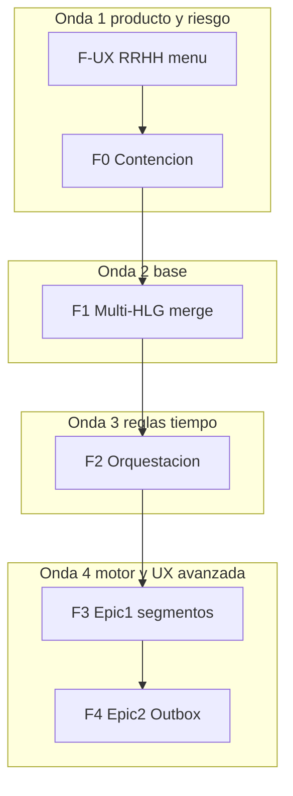

# Roadmap de implementación sucesiva — Portal Hospital V2 (asistencia / grilla / turnos)

**Fecha:** 2026-05-29  
**Estado:** plan maestro — etapas con objetivos, entregables y DoD  
**Índice:** [Resumen](#resumen-ejecutivo) · [F-UX](#etapa-f-ux--grilla-operativa-rrhh-primero) · [F0](#etapa-f0--contención-p0) · [F1](#etapa-f1--base-multi-hlg--freeze) · [F2](#etapa-f2--orquestación-hlg) · [F3](#etapa-f3--epic-1-turnos-compuestos) · [F4](#etapa-f4--epic-2-outbox) · [Calendario](#calendario-sugerido-de-sprints)

---

## Principios arquitectónicos (cerrados)

| Principio | Implicación |
|-----------|-------------|
| **Motor de turnos = física del tiempo** | `segmentos[]`, ISO, cobertura por `segmento_id`. Sin cálculo de pesos monetarios en worker. |
| **Etiquetas anexas** | `clasificacion_dia_calendario_id`, `tipo_compensacion_id` → liquidación en RRHH. |
| **Freeze en `vis_*`** | `estado_periodo_liquidacion_id` por mes; histórico protegido. |
| **Epic 1 → Epic 2** | Día/segmento atómico antes de Outbox offline. |
| **SoT scoped** | `capa_teorica_por_grupo[gdt]` + `vis_*` por burbuja; sin `capa_teorica` raíz. |

**Referencias:** [`MANUAL_CAPAS_ORQUESTACION_BORRADOR.md`](MANUAL_CAPAS_ORQUESTACION_BORRADOR.md), [`PLAN_CURSOR_ANALISIS_HLG_GRILLA.plan.md`](PLAN_CURSOR_ANALISIS_HLG_GRILLA.plan.md), [`ANALISIS_COHERENCIA_ORQUESTACION_VS_CODIGO.md`](ANALISIS_COHERENCIA_ORQUESTACION_VS_CODIGO.md).

---

## Resumen ejecutivo

| Etapa | Objetivo en una línea | Avance al cerrar |
|-------|----------------------|------------------|
| **F-UX** | Grilla GSO bajo menú RRHH; jefe después con capas acotadas | UX-1…4 OK → UX-5…7 |
| **F0** | Purge HLg, gate anclas, listado bulk, toasts GSO | 100% P0-A/B/C |
| **F1** | Merge Multi-HLG + cierre período manual RRHH | master + freeze usable |
| **F2** | Manual §15–22 en código (M+M+1, día 5, purge UX, rango) | ~90% reglas orquestación |
| **F3** | Segmentos, cobertura día, fichadas esperadas | T-08 probado |
| **F4** | Outbox + `enviarAccionesAsistencia` | RFC + batch estable |

**Regla de avance:** no declarar cerrada la etapa **N** sin cumplir el **checklist DoD** de esa etapa (al final de cada sección).

---

## Etapa F-UX — Grilla operativa RRHH primero

### Objetivo

Que **Recursos Humanos** sea el dueño de la **grilla operativa** (calendario MDC + vista sector): menú, permisos y validación funcional **antes** de exponer la misma herramienta a jefes con vistas acotadas.

### Alcance

- Navegación, rutas, permisos de callable (ya existen flags `esRrhh` en varios flujos).
- Reutilizar `GrillaMesLicenciasPanel`, `useGrillaMesVista`, callables `obtenerVistaGrillaMesAgente` / `listarVistaGrillaMesPorGrupo`.
- Documentar matriz rol × capa (manual §7).

### Fuera de alcance (en F-UX.1)

- Fichadas reales y auditoría completa (F3/F4 + módulo futuro).
- Vista jefe acotada (F-UX.2).
- Cambios de motor purge/gate (F0).

### Entregables detallados

#### F-UX.1 — RRHH (prioridad inmediata)

| ID | Entregable | Tareas | DoD |
|----|------------|--------|-----|
| UX-1 | Menú y ruta RRHH | Cambiar `grupo` del módulo `grilla` a `rrhh` en `web/src/constants/modulosEstado.js`; ruta `App.jsx` `/portal/rrhh/grilla-operativa`; redirect legacy `/portal/grilla` → RRHH o 404 para no-jefe | RRHH ve ítem en menú RRHH; jefe no ve grilla en nav jefe |
| UX-2 | Experiencia RRHH por defecto | Modo **Sector** preseleccionado; selector de `gdt` desde catálogo RRHH; titular opcional para pruebas con `persona_id` | Piloto RRHH carga un sector sin pasos ocultos |
| UX-3 | Permisos | Verificar callables: listado sector sin gate jefe (deuda conocida — documentar o restringir en misma etapa si RRHH exige); `assertEscrituraLaboral` donde aplique | Matriz permisos escrita en manual |
| UX-4 | Checklist aceptación RRHH | Sesión guiada: mes actual, cierre manual (cuando F1), lazy/toast (cuando F0), licencia en trámite vs mes cerrado | Acta “RRHH aprueba GSO v1” |

**Archivos clave:** `modulosEstado.js`, `App.jsx`, `GrillaMesLicenciasPanel.jsx`, `useGrillaMesVista.js`, `GrillaMesSelector.jsx`.

**Avance esperado:** 0% → **100%** F-UX.1.

#### F-UX.2 — Jefe (después de aprobación RRHH)

| ID | Entregable | Tareas | DoD |
|----|------------|--------|-----|
| UX-5 | Entrada menú jefe | Ítem `grupo: jefe"` → `/portal/jefe/grilla-operativa`; componente con prop `rolVista="jefe"` | Jefe accede sin ver menú RRHH |
| UX-6 | Capas en API/UI | Respuestas GSO filtran: sin array `fichadas_reales`; sí `fichadas_esperadas`, badge `auditoria_rrhh` (contrato a definir en F3) | Jefe no puede abrir reloj crudo vía API |
| UX-7 | Ayuda contextual | `helpContent` + línea en manual RRHH “qué ve el jefe” | Texto aprobado por RRHH |

**Matriz capas (recordatorio):**

| Dato | RRHH | Jefe |
|------|------|------|
| Teórico, licencias, overrides | Sí | Sí |
| Fichadas esperadas | Sí | Sí |
| Fichadas reales + herramienta auditoría | Sí | No |
| Resultado auditoría (veredicto) | Origen | Solo lectura |

**Dependencias:** F-UX.1 aprobado; recomendable F0 (observabilidad) antes de muchos jefes en prod.

---

## Etapa F0 — Contención P0

### Objetivo

Mitigar **tres riesgos críticos** antes de escalar uso: fantasmas teóricos post-HLg, colapso Firestore (N+1), UI silenciosa ante fallo de materialización.

### Alcance

Backend functions + frontend GSO; **no** incluye job día 5 ni `materializarRango` completo (F2).

### Fuera de alcance

- Cierre período callable (F1).
- Segmentos compuestos completos (F3).

### Entregables detallados

| ID | Riesgo | Trabajo | Archivos | DoD |
|----|--------|---------|----------|-----|
| **O-P0-4** | P0-A Fuga datos | Helper `purgeCapaTeoricaGdtRango({ personaId, gdt, desdeYmd, hastaYmd, motivo })`; integrar en `rrhhDeshabilitarHlg` y eliminar HLg; **no** tocar `eventos[]`/overrides | Nuevo módulo + `catalogosLaborales.js` | Piloto: cerrar HLg mid-mes → sin `rda_*` en días posteriores en ese `gdt` |
| | | UX: modal doble confirmación con `purge_desde`, alcance, §19.6 plan si aplica | Web RRHH HLg | RRHH confirma dos veces |
| **O-P0-1** | P0-B Gate | `evaluarGrillaTurnoEntorno`: si `depende_rda`, validar solo `fecha_desde` y `fecha_hasta` (capa teórica ancla); no bucle 365 días | `grillaTurnoEntornoGate.js` | Test: LAO 1 año ≤2 reads asi (mock) |
| **O-P0-7** | P0-B Listado | Refactor `listarVistaGrillaMesPorGrupo`: 1× `materializarGrupoMes` (o prechequeo batch) + N× `leerVista` sin lazy por fila | `grillaMesAgenteCore.js` | Sector 60 personas < timeout 60s; métrica reads ↓ |
| **O-P0-5** | P0-C UI | Propagar `materializado_lazy`, `materializacion_error?`, `truncado`; toasts en `useGrillaMesVista` / fila sector | `GrillaMesLicenciasPanel.jsx` | Usuario ve “falló materialización” vs “sin turno” |

### Checklist cierre F0

- [ ] Purge probado en staging con HLg real.
- [ ] Gate anclas en tests (`validarEntornoOperativo.test.js` ampliado).
- [ ] Listado sector sin 60× `materializarTurnoMesBatch` secuencial.
- [ ] Toast/badge en al menos un flujo de error lazy.
- [ ] Deploy functions + hosting documentado.

**Avance esperado:** 0% → **100%**.

**Paralelo permitido:** F-UX.1, review PR Multi-HLG (sin mezclar features en mismo deploy si evitable).

---

## Etapa F1 — Base Multi-HLG + freeze

### Objetivo

Integrar en **`master`** la épica scoped (Opción A) y entregar **cierre de período manual** operable por RRHH desde GSO.

### Alcance

- Merge git + QA Paso 4 crítico ([`PLAN_GRILLA_MULTI_HLG_V2.md`](PLAN_GRILLA_MULTI_HLG_V2.md)).
- Callable `cerrarPeriodoLiquidacion` + reapertura auditada (RFC).
- Gates: overrides; MDC en trámite post-cierre (regla repaso).

### Fuera de alcance

- Auto-cierre día 5 Scheduler (F2/P2).
- Purge HLg (debe venir de F0; si F1 antes que F0, riesgo aceptado documentado).

### Entregables detallados

| ID | Entregable | Tareas | DoD |
|----|------------|--------|-----|
| 1.1 | PR Multi-HLG | Review, resolver comentarios, merge `master`; tag si aplica | CI verde; biblia al día |
| 1.2 | QA Paso 4 | Ítems 2–3, 6, 8–9 matriz §4.2; pilotos MOSTO/CHAPARRO mayo-jun | Evidencia en doc sesión |
| 1.3 | `cerrarPeriodoLiquidacion` | Callable RRHH; set `CFG_EPL_LIQUIDADO_CERRADO`; campos auditoría | RRHH cierra mayo desde GSO |
| 1.4 | UI cierre | Botón + estado badge en grilla / detalle mes | Mensaje claro en español |
| 1.5 | Gates MDC trámite | `assertPeriodoNoCerrado` con excepción solicitud abierta pre-cierre | Licencia en trámite mayo completa workflow tras cierre |
| 1.6 | Strip legacy | Verificar 0 `capa_teorica` raíz en entorno objetivo | Script verificación PASS |

**Avance esperado:** épica scoped **100%** en master; freeze manual **100%**.

**Dependencias:** F0 recomendado antes de prod masiva; F-UX.1 para que RRHH use GSO al cerrar.

---

## Etapa F2 — Orquestación HLg

**Estado al pausar (2026-06-01):** rama `feat/epic-multi-hlg-fase1-execution` @ `e349412`. Hecho: 2.1 metadata (código+deploy parcial), 2.2 purge (F0), 2.3 `materializarRango` + wire HLg. **Siguiente:** 2.4 job día 5. Detalle: [`HANDOFF_SESION_2026-06-01_PAUSA_F2.md`](./HANDOFF_SESION_2026-06-01_PAUSA_F2.md).

### Objetivo

Código alineado al **manual de capas** y §15–22 del plan: ventana M+M+1, purge en UX HLg, materialización informada, día 5 (mat), rangos parciales.

### Entregables detallados

| ID | Entregable | Tareas | DoD |
|----|------------|--------|-----|
| 2.1 | Trazabilidad materializar | Motivo en metadata; toasts/callables unificados (extiende O-P0-5) | ✅ metadata `vis_*` en prod (laboral/GSO); ⏳ toasts UI |
| 2.2 | Purge productivo | Si no en F0: cerrar F0; wire definitivo alta/cierre/eliminar HLg | ✅ F0 + metadata purge |
| 2.3 | `materializarRango` | API interna; feriado 1 día; HLg mid-mes; respeta período cerrado | ✅ API + HLg; ⏳ feriado masivo |
| 2.4 | Job día 5 **materialización** | Scheduler + callable idempotente M+1 (§17.2.1); logs; **distinto** de cierre liquidación | ⏸️ **Retomar aquí** |
| 2.5 | Plan usuario nuevo | Banner en turnos mensuales + flujo paralelo MVP §19.6 | Caso CHAPARRO documentado |
| 2.6 | Piloto resolverFijo | GSO capa 2; rematerializar post-régimen UI | D2/D11 PASS en piloto |
| 2.7 | Rematerializar post-régimen/feriado | Wire `RegimenesHorariosPage` / calendario → callables existentes | RRHH un clic tras cambio |

**Avance esperado:** reglas documentadas **~90%** en código (auto-cierre liquidación = opcional P2).

**Dependencias:** F0, F1 (freeze + gates).

---

## Etapa F3 — Epic 1 turnos compuestos

### Objetivo

Motor **solo tiempo**; `segmentos[]` SoT en `asi_*`; proyección `vis_*`; cobertura y **expectativas de fichada** para motores externos.

### Entregables (tickets)

| Ticket | Entregable | DoD |
|--------|------------|-----|
| T-02 | Zod + contrato segmentos | Schemas en repo; tests contrato |
| T-03 | Worker segmentos + ISO | Medianoche, multi-segmento, Plan > HLG estable |
| T-04 | Cobertura + `materializarDiaAfectado` | Reasignar segmento; freeze respetado |
| T-08 | `fichadas_esperadas` + extras | Cálculo según EXPECTATIVAS doc |
| T-05/06 | UI plan / grilla | Editor segmentos; sin legacy monolítico |

### Checklist cierre F3

- [ ] Piloto nocturno/compuesto en un `gdt`.
- [ ] F-UX.2 puede mostrar `fichadas_esperadas` en celda (UI).
- [ ] Release notes + tag épica turnos compuestos.

**Dependencias:** F1 scoped estable; F2 recomendado para HLg coherente.

---

## Etapa F4 — Epic 2 Outbox

### Objetivo

Edición offline en grilla con **envío batch** append-only; acciones granulares sobre contrato F3.

### Entregables detallados

| ID | Entregable | DoD |
|----|------------|-----|
| 4.1 | `RFC_CACHE_LOCAL_ASISTENCIA_V2.md` | Idempotencia `temp_id`; tipos acción |
| 4.2 | `enviarAccionesAsistencia` | Valida freeze; `arrayUnion`; no `set` full doc |
| 4.3 | Outbox UI | Cola pendientes; Enviar; ASI-CONC / ASI-PER |
| 4.4 | Integración | Sin rematerializar mes entero por cada cambio local |

**Dependencias:** **F3 cerrada** (obligatorio).

---

## Calendario sugerido de sprints

| Sprint | Etapas | Hito visible |
|--------|--------|--------------|
| S1 | F-UX.1 + inicio F0 (O-P0-1, O-P0-5) | RRHH entra por menú propio; gate anclas |
| S2 | F0 completo + F-UX.4 | Purge + listado bulk; RRHH aprueba GSO |
| S3 | F1 (PR + freeze) | master Multi-HLG; cerrar mes manual |
| S4 | F2 (2.3–2.4–2.7) | Rango + día 5 mat; wire régimen |
| S5 | F3 núcleo (T-03, T-04) | Segmentos + cobertura |
| S6 | F3 cierre (T-08, UI) + F-UX.2 | Fichadas esperadas; jefe acotado |
| S7+ | F4 | Outbox |

*Ajustar duración según capacidad del equipo; el orden **F3 antes de F4** no es negociable.*

---

## Matriz riesgos ↔ etapa

| Riesgo | Etapa |
|--------|--------|
| Fantasmas teóricos | F0, F2 |
| Timeouts listado / gate | F0 |
| UI ciega | F0, F-UX con RRHH |
| Mes pagado editable | F1 |
| Outbox inconsistente | F4 tras F3 |
| Jefe ve reloj crudo | F-UX.2 |

---

## Documentos vivos

| Uso | Archivo |
|-----|---------|
| Tareas del día | [`PENDIENTES_PROXIMA_SESION.md`](PENDIENTES_PROXIMA_SESION.md) |
| Reglas negocio | [`MANUAL_CAPAS_ORQUESTACION_BORRADOR.md`](MANUAL_CAPAS_ORQUESTACION_BORRADOR.md) |
| Gaps código | [`ANALISIS_COHERENCIA_ORQUESTACION_VS_CODIGO.md`](ANALISIS_COHERENCIA_ORQUESTACION_VS_CODIGO.md) |

**Veredicto:** diseño cerrado en abstracto; ejecución en **etapas con DoD**, sin saltar F3 antes de F4 ni prod sin F0.
